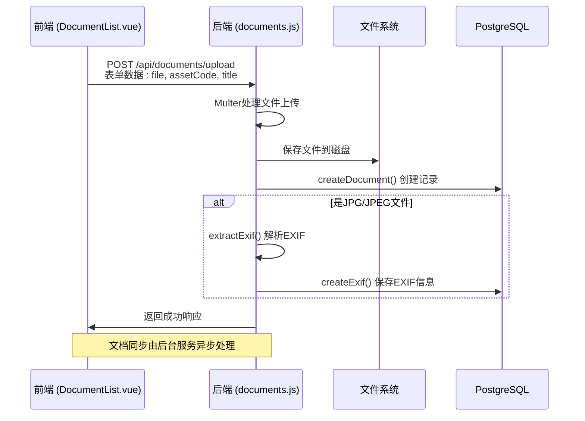
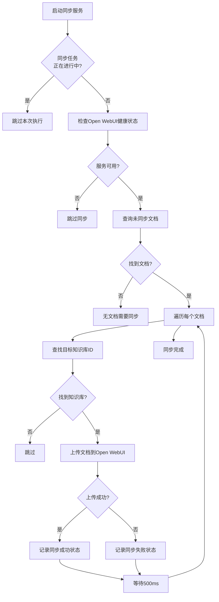
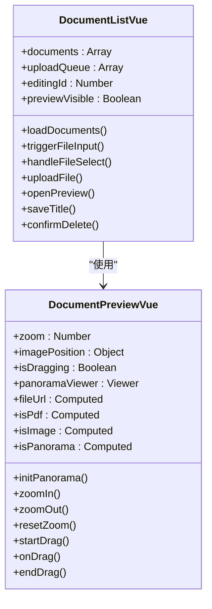

# 文档管理

<cite>
**本文档引用的文件**   
- [document.js](file://server/models/document.js)
- [documents.js](file://server/routes/documents.js)
- [document-sync-service.js](file://server/services/document-sync-service.js)
- [DocumentList.vue](file://src/components/DocumentList.vue)
- [DocumentPreview.vue](file://src/components/DocumentPreview.vue)
- [document-exif.js](file://server/models/document-exif.js)
- [openwebui-service.js](file://server/services/openwebui-service.js)
- [auth.js](file://server/config/auth.js)
- [create_documents_table.sql](file://server/db/create_documents_table.sql)
- [create_document_exif_table.sql](file://server/db/create_document_exif_table.sql)
- [openwebui-config.js](file://server/config/openwebui-config.js)
</cite>

## 目录
1. [核心数据模型与存储策略](#核心数据模型与存储策略)
2. [文档上传与元数据更新API](#文档上传与元数据更新api)
3. [文档同步服务机制](#文档同步服务机制)
4. [前端交互与状态管理](#前端交互与状态管理)
5. [权限校验与安全控制](#权限校验与安全控制)
6. [运维建议与优化策略](#运维建议与优化策略)

## 核心数据模型与存储策略

文档管理功能的核心数据模型由 `document.js` 模型和 `documents` 数据库表构成，实现了对文档元数据的持久化存储，并支持与资产、空间或规格的关联。

`documents` 表定义了文档的核心字段，包括 `id`（主键）、`title`（文档标题）、`file_name`（原始文件名）、`file_path`（服务器存储路径）、`file_size`（文件大小）、`file_type`（文件扩展名）和 `mime_type`（MIME类型）。这些字段共同构成了文档的元数据基础。

文档的关联关系通过 `asset_code`、`space_code` 和 `spec_code` 三个字段实现，系统通过数据库约束 `chk_single_relation` 确保一个文档只能关联到资产、空间或规格中的一个对象，从而维护了数据的一致性。这种设计避免了使用外键约束，提供了更大的灵活性。

对于图像文件，系统通过 `document_exif` 表存储其EXIF元数据。该表与 `documents` 表通过 `document_id` 字段建立一对一的外键关系（`ON DELETE CASCADE`），确保当主文档被删除时，其EXIF信息也会被级联删除。`document-exif.js` 模型提供了 `createExif`、`getExifByDocumentId` 等方法，用于操作EXIF数据，并通过 `formatExifGroups` 方法将原始数据格式化为“文件”、“照相机”和“GPS”三个逻辑分组，便于前端展示。

**Section sources**
- [document.js](file://server/models/document.js#L1-L167)
- [create_documents_table.sql](file://server/db/create_documents_table.sql#L1-L49)
- [create_document_exif_table.sql](file://server/db/create_document_exif_table.sql#L1-L48)
- [document-exif.js](file://server/models/document-exif.js#L1-L169)

## 文档上传与元数据更新API

文档的API接口在 `documents.js` 路由文件中定义，通过Express框架和Multer中间件处理文件上传、下载和元数据操作。

文件上传功能由 `/upload` 接口实现。该接口使用Multer中间件进行文件处理，其核心配置包括：
- **存储策略**：使用 `diskStorage` 将文件存储在服务器磁盘上，路径由 `appConfig.upload.docsDir` 配置项决定。
- **文件命名**：采用 `时间戳_随机字符串.扩展名` 的唯一命名策略，有效避免了文件名冲突。
- **文件过滤**：通过 `fileFilter` 函数限制上传文件类型，仅允许PDF、JPG、PNG、SVG和MP4等格式。
- **大小限制**：通过 `limits` 选项将单个文件大小限制为200MB。

上传流程中，系统会自动修复中文文件名的编码问题，并创建文档记录。对于JPG/JPEG文件，系统会调用 `extractExif` 函数解析其EXIF信息并存入数据库。值得注意的是，文档的AI知识库同步操作被设计为异步进行，以避免阻塞上传响应。

文档的元数据更新主要通过 `/api/documents/:id` 的 `PUT` 请求实现，目前仅支持更新文档标题。下载和预览功能分别由 `/download` 和 `/preview` 接口提供。`/preview` 接口的关键在于设置 `Content-Disposition: inline` 响应头，这使得浏览器可以在新标签页中直接预览文件内容，而非强制下载。

**Diagram sources **
- [documents.js](file://server/routes/documents.js#L1-L451)

**Section sources**
- [documents.js](file://server/routes/documents.js#L1-L451)

## 文档同步服务机制

文档同步服务是连接文档管理系统与AI知识库的核心桥梁，由 `document-sync-service.js` 服务实现。该服务在应用启动时自动运行，定期将新创建或更新的文档同步到Open WebUI知识库中。

同步流程是一个批处理过程，其核心步骤如下：
1.  **查询未同步文档**：服务通过 `getUnsyncedDocuments` 函数查询 `documents` 表中尚未在 `kb_documents` 表中建立同步记录的文档。
2.  **确定目标知识库**：`findKnowledgeBaseId` 函数根据文档的 `asset_code` 或 `space_code` 查找关联的模型文件，进而确定其对应的知识库ID。如果无法找到，则使用当前激活的默认模型。
3.  **执行同步**：`syncDocument` 函数负责将单个文档上传到Open WebUI。它首先检查文件格式是否被支持，然后调用 `openwebui-service.js` 中的 `uploadDocument` 方法。
4.  **状态管理**：同步成功后，系统会在 `kb_documents` 表中记录 `sync_status` 为 `synced`；若失败，则记录为 `failed` 并保存错误信息，防止无限重试。

`openwebui-service.js` 服务封装了与Open WebUI API的交互。`uploadDocument` 方法采用两步上传策略：首先将文件上传至Open WebUI的文件系统，获取 `fileId`；然后轮询检查文件处理状态，待内容解析完成后，再将文件添加到指定的知识库中。这种设计确保了文档内容能被正确索引。

**Diagram sources **
- [document-sync-service.js](file://server/services/document-sync-service.js#L1-L250)
- [openwebui-service.js](file://server/services/openwebui-service.js#L1-L359)

**Section sources**
- [document-sync-service.js](file://server/services/document-sync-service.js#L1-L250)
- [openwebui-service.js](file://server/services/openwebui-service.js#L1-L359)

## 前端交互与状态管理

前端的文档管理功能主要由 `DocumentList.vue` 和 `DocumentPreview.vue` 两个组件构成，提供了完整的用户交互体验。

`DocumentList.vue` 组件负责文档的列表展示和基本操作。它通过 `props` 接收 `assetCode`、`spaceCode` 等关联参数，并在 `watch` 监听器中根据这些参数的变化自动调用 `loadDocuments` 方法从后端API获取数据。组件实现了文件上传队列，使用 `uploadQueue` 数组和 `uploadXhrMap` Map对象来管理多个文件的上传状态（上传中、成功、失败），并支持取消上传操作。用户可以通过双击文档标题来编辑其名称，该操作通过 `saveTitle` 方法向后端发送 `PUT` 请求。

`DocumentPreview.vue` 组件提供了一个模态框式的文档预览功能。它根据文档的 `file_type` 动态渲染不同的视图：
- **PDF**：使用 `<iframe>` 内嵌浏览器PDF阅读器进行预览。
- **全景图**：当图像的长宽比接近2:1时，被识别为全景图，使用 `Photo Sphere Viewer` 库进行360°交互式预览，并提供滚转、缩放等自定义控制按钮。
- **普通图片**：支持鼠标滚轮缩放和拖拽平移。
- **视频**：使用原生 `<video>` 元素进行播放。

**Diagram sources **
- [DocumentList.vue](file://src/components/DocumentList.vue#L1-L800)
- [DocumentPreview.vue](file://src/components/DocumentPreview.vue#L1-L721)

**Section sources**
- [DocumentList.vue](file://src/components/DocumentList.vue#L1-L800)
- [DocumentPreview.vue](file://src/components/DocumentPreview.vue#L1-L721)

## 权限校验与安全控制

系统的权限校验贯穿于文档管理的各个环节，确保了数据的安全性。

在后端，`auth.js` 配置文件定义了详细的权限体系，包括 `DOCUMENT_READ`、`DOCUMENT_CREATE`、`DOCUMENT_UPDATE` 和 `DOCUMENT_DELETE`。`middleware/auth.js` 中的 `authenticate` 和 `authorize` 中间件被应用于所有文档API路由。`authenticate` 负责验证JWT令牌的有效性，而 `authorize(PERMISSIONS.DOCUMENT_CREATE)` 等装饰器则确保调用者拥有执行特定操作的权限。

在前端，`DocumentList.vue` 组件通过 `authStore.hasPermission()` 方法动态控制UI元素的显示。例如，只有拥有 `document:create` 权限的用户才能看到上传按钮，拥有 `document:delete` 权限的用户才能看到删除按钮。这种前后端结合的权限控制机制，既保证了API层面的安全，也提供了良好的用户体验。

**Section sources**
- [auth.js](file://server/config/auth.js#L1-L142)
- [middleware/auth.js](file://server/middleware/auth.js#L1-L120)
- [DocumentList.vue](file://src/components/DocumentList.vue#L1-L800)

## 运维建议与优化策略

### 大文件上传优化
为应对大文件上传，系统已实施多项优化：
- **前端**：实现了上传队列和进度条，提升用户体验。
- **后端**：通过Multer的 `limits` 选项设置200MB的大小限制，防止服务器资源耗尽。
- **建议**：对于超大文件，可考虑实现分片上传（Chunked Upload）机制，将大文件分割成小块分别上传，再在服务端合并，以提高上传成功率和容错能力。

### 同步失败排查
当文档同步失败时，应按以下步骤排查：
1.  **检查日志**：查看后端日志中 `document-sync-service.js` 的输出，确认是网络问题、Open WebUI服务不可用，还是文件格式不支持。
2.  **验证配置**：确认 `.env` 文件中的 `OPENWEBUI_URL` 和 `OPENWEBUI_API_KEY` 配置正确。
3.  **检查知识库**：通过Open WebUI管理界面，确认目标知识库存在且状态正常。
4.  **查看状态标记**：查询 `kb_documents` 表中 `sync_status` 为 `failed` 的记录，其 `sync_error` 字段会记录具体的错误原因。

**Section sources**
- [documents.js](file://server/routes/documents.js#L1-L451)
- [document-sync-service.js](file://server/services/document-sync-service.js#L1-L250)