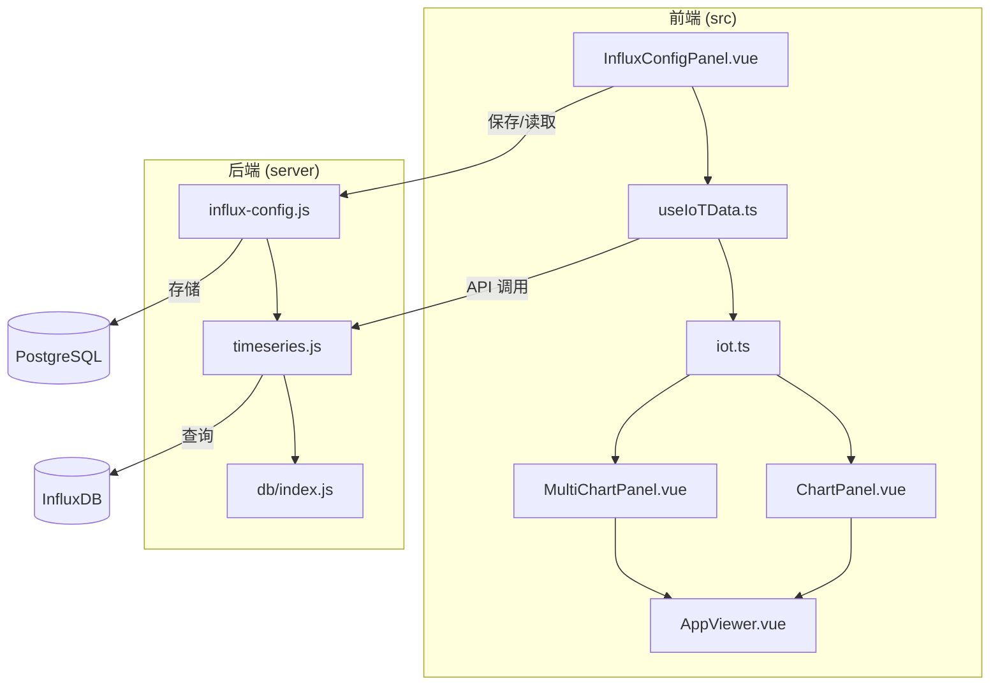
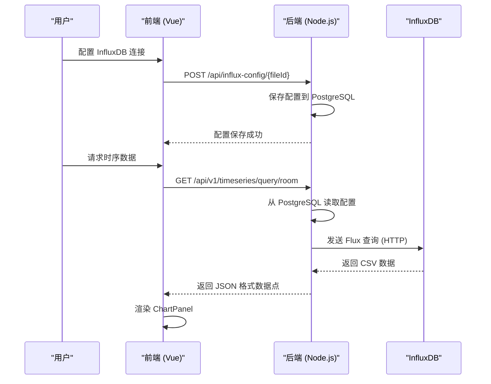
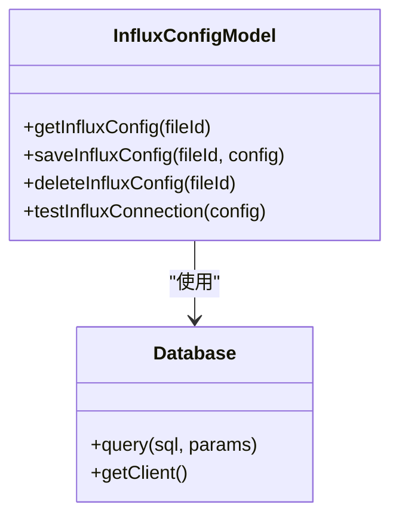
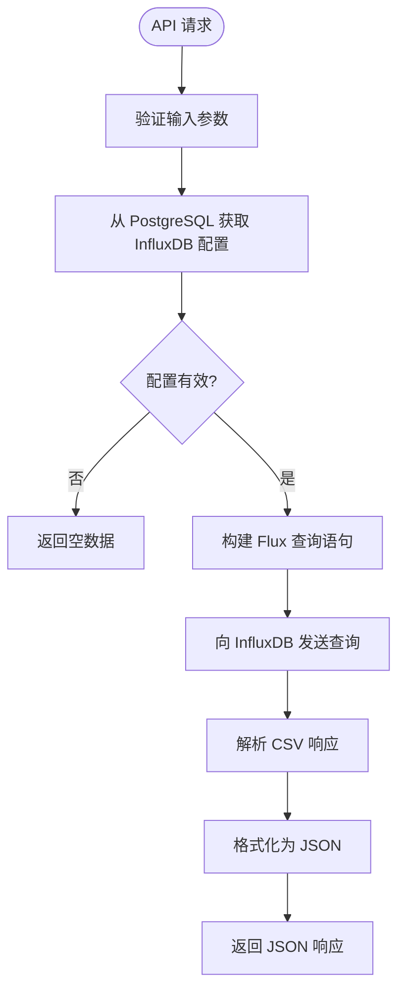
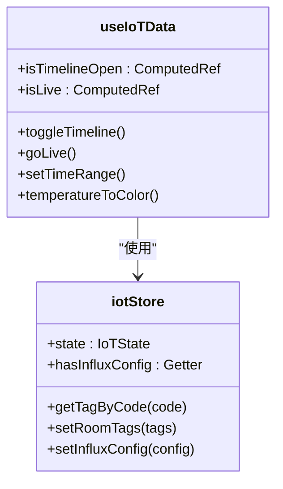
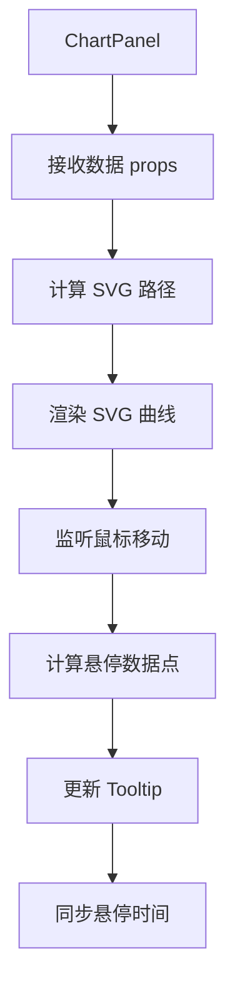
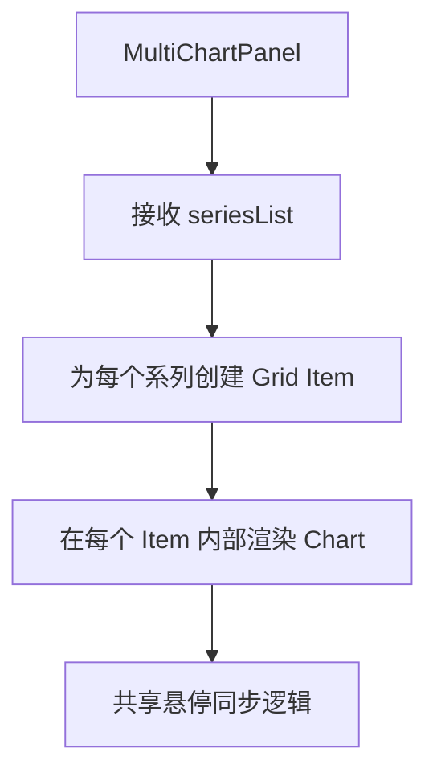
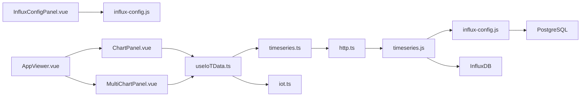

# 时序数据监控

<cite>
**本文档引用的文件**  
- [influx-config.js](file://server/models/influx-config.js)
- [timeseries.js](file://server/routes/timeseries.js)
- [useIoTData.ts](file://src/composables/useIoTData.ts)
- [ChartPanel.vue](file://src/components/ChartPanel.vue)
- [MultiChartPanel.vue](file://src/components/MultiChartPanel.vue)
- [iot.ts](file://src/stores/iot.ts)
- [timeseries.ts](file://src/services/api/timeseries.ts)
- [InfluxConfigPanel.vue](file://src/components/InfluxConfigPanel.vue)
- [http.ts](file://src/services/http.ts)
- [AppViewer.vue](file://src/AppViewer.vue)
</cite>

## 目录
1. [简介](#简介)
2. [项目结构](#项目结构)
3. [核心组件](#核心组件)
4. [架构概述](#架构概述)
5. [详细组件分析](#详细组件分析)
6. [依赖分析](#依赖分析)
7. [性能考虑](#性能考虑)
8. [故障排除指南](#故障排除指南)
9. [结论](#结论)

## 简介
本文档详细说明了 TwinSight 平台中时序数据监控模块的架构与实现。该模块实现了从 InfluxDB 配置管理、数据查询到前端可视化展示的完整流程，支持实时与历史数据的图表渲染，并可将数据叠加显示在 3D 查看器中。文档涵盖了后端 API 路由、数据库模型、前端组合式函数和 UI 组件的协同工作原理。

## 项目结构
时序数据监控功能分布在后端服务器和前端应用两个主要部分。后端负责与 InfluxDB 的安全通信和数据代理，前端则负责用户交互、数据获取和可视化。

**Diagram sources**
- [influx-config.js](file://server/models/influx-config.js)
- [timeseries.js](file://server/routes/timeseries.js)
- [useIoTData.ts](file://src/composables/useIoTData.ts)
- [ChartPanel.vue](file://src/components/ChartPanel.vue)
- [MultiChartPanel.vue](file://src/components/MultiChartPanel.vue)
- [InfluxConfigPanel.vue](file://src/components/InfluxConfigPanel.vue)
- [AppViewer.vue](file://src/AppViewer.vue)

**Section sources**
- [influx-config.js](file://server/models/influx-config.js)
- [timeseries.js](file://server/routes/timeseries.js)
- [useIoTData.ts](file://src/composables/useIoTData.ts)
- [ChartPanel.vue](file://src/components/ChartPanel.vue)
- [MultiChartPanel.vue](file://src/components/MultiChartPanel.vue)

## 核心组件
本模块的核心组件包括后端的 `influx-config.js` 模型和 `timeseries.js` 路由，以及前端的 `useIoTData.ts` 组合式函数和 `ChartPanel.vue`、`MultiChartPanel.vue` 可视化组件。这些组件协同工作，实现了从配置存储、数据查询到图表渲染的完整链路。

**Section sources**
- [influx-config.js](file://server/models/influx-config.js)
- [timeseries.js](file://server/routes/timeseries.js)
- [useIoTData.ts](file://src/composables/useIoTData.ts)
- [ChartPanel.vue](file://src/components/ChartPanel.vue)
- [MultiChartPanel.vue](file://src/components/MultiChartPanel.vue)

## 架构概述
时序数据监控模块采用前后端分离的架构。前端通过 RESTful API 与后端通信，后端作为代理，使用存储在 PostgreSQL 数据库中的配置信息，通过 `@influxdata/influxdb-client` 库（实际通过 HTTP 请求实现）与 InfluxDB 进行交互。这种设计将敏感的数据库连接信息与客户端隔离，提高了安全性。

**Diagram sources**
- [influx-config.js](file://server/models/influx-config.js)
- [timeseries.js](file://server/routes/timeseries.js)
- [useIoTData.ts](file://src/composables/useIoTData.ts)
- [ChartPanel.vue](file://src/components/ChartPanel.vue)

## 详细组件分析

### InfluxDB 配置模型分析
`influx-config.js` 模型定义了与 InfluxDB 配置相关的数据访问操作，包括获取、保存、删除和测试连接。配置信息存储在 PostgreSQL 的 `influx_configs` 表中，与 `model_files` 表通过 `file_id` 关联。

**Diagram sources**
- [influx-config.js](file://server/models/influx-config.js)

**Section sources**
- [influx-config.js](file://server/models/influx-config.js)

### 时序数据路由与服务分析
`timeseries.js` 路由文件是后端 API 的核心，它提供了多个端点来处理时序数据的查询和写入。它依赖于 `influx-config.js` 获取数据库配置，并使用原生 `fetch` API 构建对 InfluxDB 的 HTTP 请求。

#### API 端点与查询参数
该模块支持以下 API 端点，每个端点都接受特定的查询参数：

| API 端点 | HTTP 方法 | 查询参数 | 描述 | 响应格式 |
| :--- | :--- | :--- | :--- | :--- |
| `/api/v1/timeseries/query/average` | GET | `startMs`, `endMs`, `windowMs`, `fileId` | 查询指定时间范围内所有房间的平均温度 | `{ success: boolean, data: { timestamp: number, value: number }[] }` |
| `/api/v1/timeseries/query/room` | GET | `roomCode`, `startMs`, `endMs`, `windowMs`, `fileId` | 查询指定房间在时间范围内的温度数据，可选择是否降采样 | `{ success: boolean, data: { timestamp: number, value: number }[] }` |
| `/api/v1/timeseries/query/latest` | POST | `roomCodes[]`, `lookbackMs`, `fileId` | 批量查询多个房间的最新温度值 | `{ success: boolean, data: { [roomCode: string]: number } }` |
| `/api/v1/timeseries/status` | GET | `fileId` | 检查当前模型的 InfluxDB 配置状态 | `{ success: boolean, data: { configured: boolean, enabled: boolean, url?: string, org?: string, bucket?: string } }` |

**Diagram sources**
- [timeseries.js](file://server/routes/timeseries.js)

**Section sources**
- [timeseries.js](file://server/routes/timeseries.js)

### 前端数据获取逻辑分析
`useIoTData.ts` 是一个 Vue 组合式函数，它封装了与 IoT 数据相关的所有状态和业务逻辑。它通过 `iot.ts` 中的 Pinia Store 管理全局状态，并提供了一套简洁的 API 供组件调用。

**Diagram sources**
- [useIoTData.ts](file://src/composables/useIoTData.ts)
- [iot.ts](file://src/stores/iot.ts)

**Section sources**
- [useIoTData.ts](file://src/composables/useIoTData.ts)
- [iot.ts](file://src/stores/iot.ts)

### 图表渲染组件分析
`ChartPanel.vue` 和 `MultiChartPanel.vue` 是用于渲染时序数据的核心 UI 组件。它们使用 SVG 绘制折线图，并集成了交互式功能，如悬停提示和阈值告警。

#### ChartPanel.vue
该组件用于显示单个数据系列（如平均温度或单个房间的温度）。

**Diagram sources**
- [ChartPanel.vue](file://src/components/ChartPanel.vue)

#### MultiChartPanel.vue
该组件用于并排显示多个房间的温度数据，便于比较。

**Diagram sources**
- [MultiChartPanel.vue](file://src/components/MultiChartPanel.vue)

**Section sources**
- [ChartPanel.vue](file://src/components/ChartPanel.vue)
- [MultiChartPanel.vue](file://src/components/MultiChartPanel.vue)

## 依赖分析
该模块的依赖关系清晰，形成了一个从用户界面到数据源的完整链条。

**Diagram sources**
- [InfluxConfigPanel.vue](file://src/components/InfluxConfigPanel.vue)
- [useIoTData.ts](file://src/composables/useIoTData.ts)
- [timeseries.ts](file://src/services/api/timeseries.ts)
- [http.ts](file://src/services/http.ts)
- [timeseries.js](file://server/routes/timeseries.js)
- [influx-config.js](file://server/models/influx-config.js)
- [ChartPanel.vue](file://src/components/ChartPanel.vue)
- [MultiChartPanel.vue](file://src/components/MultiChartPanel.vue)
- [AppViewer.vue](file://src/AppViewer.vue)

**Section sources**
- [InfluxConfigPanel.vue](file://src/components/InfluxConfigPanel.vue)
- [useIoTData.ts](file://src/composables/useIoTData.ts)
- [timeseries.ts](file://src/services/api/timeseries.ts)
- [http.ts](file://src/services/http.ts)
- [timeseries.js](file://server/routes/timeseries.js)
- [influx-config.js](file://server/models/influx-config.js)
- [ChartPanel.vue](file://src/components/ChartPanel.vue)
- [MultiChartPanel.vue](file://src/components/MultiChartPanel.vue)
- [AppViewer.vue](file://src/AppViewer.vue)

## 性能考虑
为了优化时序数据监控模块的性能，系统实现了以下策略：

1.  **降采样查询**：`/query/room` 和 `/query/average` 端点支持 `windowMs` 参数，允许客户端请求降采样后的数据，显著减少数据传输量和前端渲染压力。
2.  **连接池管理**：虽然当前实现使用原生 `fetch`，但后端的数据库连接（通过 `db/index.js`）应使用连接池来管理与 PostgreSQL 的连接，避免频繁创建和销毁连接。
3.  **API Key 认证**：数据写入端点 (`/streams/:spaceCode`) 使用基于 HMAC 的 API Key 进行认证，避免了每次请求都进行复杂的用户会话验证，提高了写入性能。
4.  **前端状态管理**：使用 Pinia Store (`iot.ts`) 集中管理数据状态，避免了组件间的数据重复获取和传递。

## 故障排除指南
以下是针对常见问题的诊断步骤：

### 连接失败
1.  **检查 InfluxDB 配置**：在 `InfluxConfigPanel.vue` 中确认 URL、端口、组织、存储桶等信息是否正确。
2.  **测试连接**：使用面板中的“测试连接”按钮，查看具体的错误信息。
3.  **验证网络连通性**：确保后端服务器能够通过配置的 URL 和端口访问 InfluxDB 服务。
4.  **检查认证信息**：确认 Token 或用户名/密码正确，并且具有足够的权限。
5.  **检查 InfluxDB 服务状态**：直接访问 InfluxDB 的 `/health` 端点，确认服务正在运行。

### 查询超时
1.  **检查时间范围**：查询的时间范围 (`startMs` 到 `endMs`) 是否过长？尝试缩小范围。
2.  **检查数据量**：目标时间范围内是否存在海量数据点？考虑使用 `windowMs` 参数进行降采样。
3.  **优化 Flux 查询**：审查 `timeseries.js` 中生成的 Flux 查询语句，确保 `filter` 条件足够精确。
4.  **增加超时时间**：如果查询本身复杂且必要，可以考虑在后端增加 `fetch` 请求的超时时间。
5.  **检查 InfluxDB 性能**：监控 InfluxDB 服务器的资源使用情况（CPU、内存、磁盘 I/O），排查服务器端性能瓶颈。

**Section sources**
- [influx-config.js](file://server/models/influx-config.js)
- [timeseries.js](file://server/routes/timeseries.js)
- [InfluxConfigPanel.vue](file://src/components/InfluxConfigPanel.vue)

## 结论
TwinSight 的时序数据监控模块构建了一个安全、高效且用户友好的数据监控系统。通过后端代理模式，它成功地将敏感的数据库连接信息与前端隔离。模块提供了灵活的 API 来支持各种查询场景，并通过直观的图表组件实现了数据的可视化。未来可以进一步优化，例如引入真正的 `@influxdata/influxdb-client` 客户端库以获得更丰富的功能，或在前端实现更高级的数据分析和告警功能。