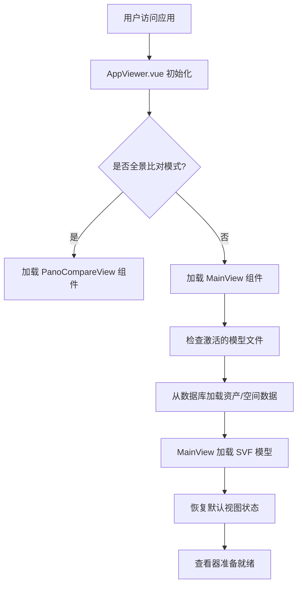
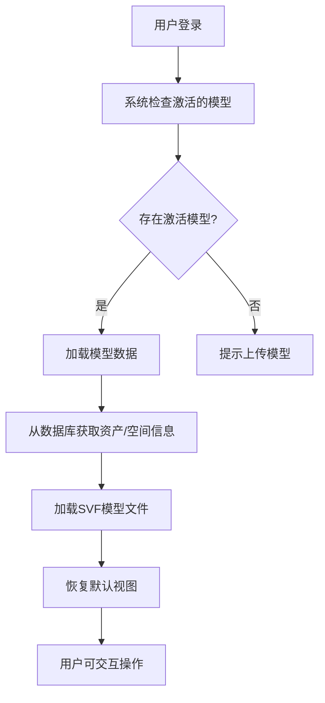
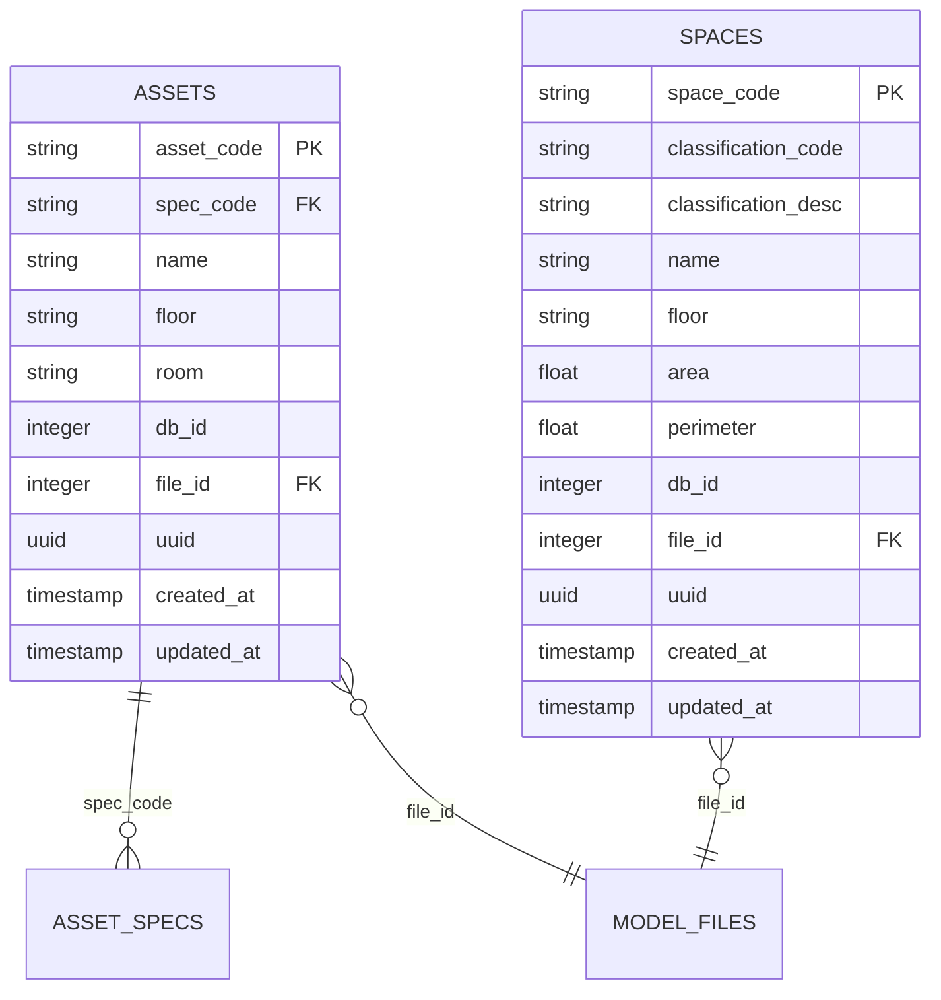
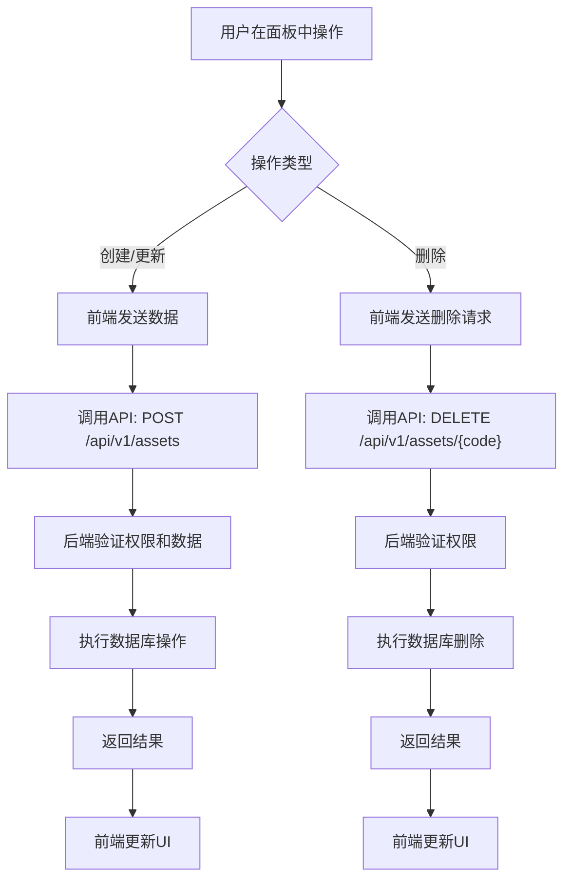
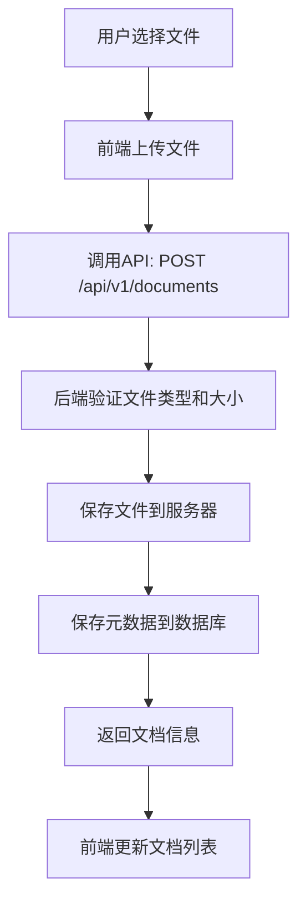
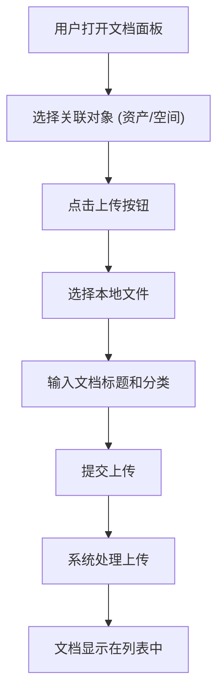
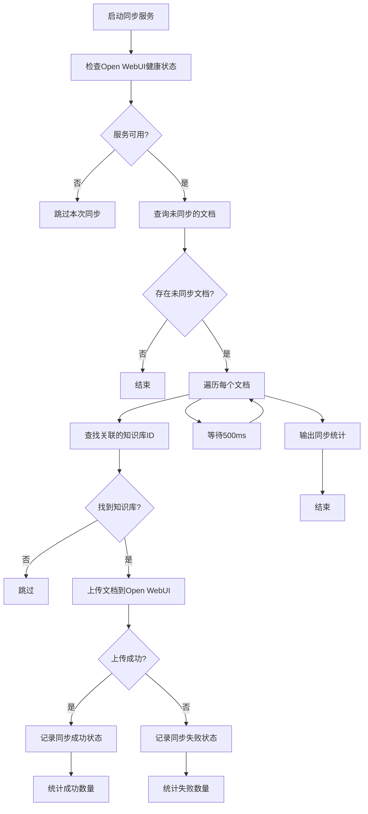
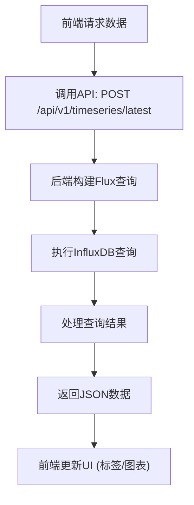
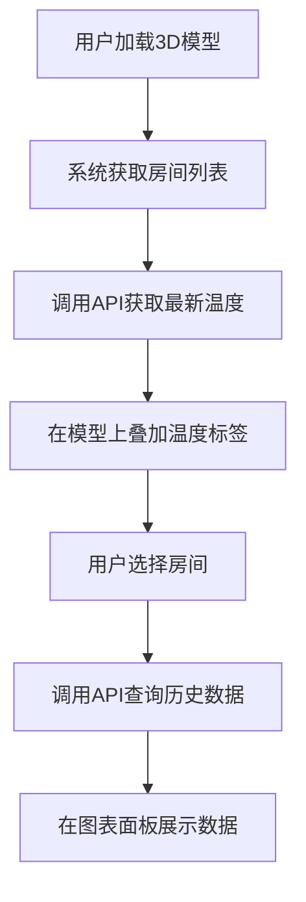

# 核心功能模块

<cite>
**本文档引用的文件**
- [index.js](file://server/index.js)
- [AppViewer.vue](file://src/AppViewer.vue)
- [document.js](file://server/models/document.js)
- [document-sync-service.js](file://server/services/document-sync-service.js)
- [assets.js](file://server/routes/v1/assets.js)
- [spaces.js](file://server/routes/v1/spaces.js)
- [documents.js](file://server/routes/v1/documents.js)
- [timeseries.js](file://server/routes/v1/timeseries.js)
- [asset.js](file://server/models/asset.js)
- [space.js](file://server/models/space.js)
- [main.js](file://src/main.js)
</cite>

## 目录
1. [3D模型查看器（Viewer）](#3d模型查看器viewer)
2. [资产（Asset）与空间（Space）管理](#资产asset与空间space管理)
3. [文档管理](#文档管理)
4. [时序数据（Timeseries）模块](#时序数据timeseries模块)

## 3D模型查看器（Viewer）

TwinSight的3D模型查看器是系统的核心交互界面，基于Autodesk Forge Viewer技术构建，用于可视化和操作建筑信息模型（BIM）。查看器集成在`AppViewer.vue`组件中，通过`MainView`子组件加载和渲染SVF格式的3D模型。

### 模型加载（SVF）

系统通过静态文件服务提供对SVF模型文件的访问。后端在`server/index.js`中配置了`/models`路径的静态文件服务，并设置了必要的CORS和MIME类型头，确保Forge Viewer的Web Worker能够正确加载二进制模型文件。



**用户操作流程图**


**API调用示例**
```bash
# 获取当前激活的模型文件
GET /api/files
响应: { "success": true, "data": [ { "id": 1, "title": "主楼", "extracted_path": "/models/1", "is_active": true } ] }

# 获取与模型关联的资产列表
GET /api/files/1/assets
响应: { "success": true, "data": [ { "db_id": 123, "asset_code": "A-001", "name": "空调机组" } ] }
```

**Diagram sources**
- [AppViewer.vue](file://src/AppViewer.vue#L1-L800)

**Section sources**
- [AppViewer.vue](file://src/AppViewer.vue#L1-L800)
- [index.js](file://server/index.js#L69-L88)

### 交互控制与信息叠加

查看器提供了丰富的交互功能，包括旋转、缩放、平移、构件隔离和属性查看。用户可以通过左侧的`AssetPanel`或`LeftPanel`选择资产或空间，右侧的`RightPanel`会显示其详细属性。`MainView`组件负责处理模型加载、事件监听和视图状态管理。

信息叠加通过将数据库中的资产和空间数据与模型中的`dbId`进行映射来实现。当模型加载完成后，系统会将从数据库获取的资产和空间列表与模型中的构件进行匹配，从而实现数据与模型的联动。

## 资产（Asset）与空间（Space）管理

资产与空间是系统中的核心数据实体，分别代表建筑内的设备和区域。其数据模型和CRUD操作通过RESTful API进行管理。

### 数据模型

资产（Asset）和空间（Space）在数据库中分别对应`assets`和`spaces`表。每个实体都包含编码（Code）、名称、楼层、分类等基本信息，并通过`file_id`字段与上传的3D模型文件关联。



**Diagram sources**
- [asset.js](file://server/models/asset.js)
- [space.js](file://server/models/space.js)

### CRUD操作

资产和空间的CRUD操作通过`/api/v1/assets`和`/api/v1/spaces`端点提供。所有操作都受JWT身份验证和基于权限的授权保护。

**用户操作流程图**


**API调用示例**

**创建资产**
```bash
POST /api/v1/assets
Authorization: Bearer <your_token>
Content-Type: application/json

{
  "assetCode": "A-002",
  "name": "新风机",
  "specCode": "AHU-2024",
  "floor": "2F",
  "fileId": 1
}

响应: 
{
  "success": true,
  "data": {
    "asset_code": "A-002",
    "name": "新风机",
    "spec_code": "AHU-2024",
    "floor": "2F",
    "file_id": 1,
    ...
  }
}
```

**批量导入资产**
```bash
POST /api/v1/assets/batch
Authorization: Bearer <your_token>
Content-Type: application/json

{
  "assets": [
    { "assetCode": "A-003", "name": "水泵", "floor": "B1" },
    { "assetCode": "A-004", "name": "配电箱", "floor": "1F" }
  ]
}

响应: 
{
  "success": true,
  "data": {
    "total": 2,
    "inserted": 2,
    "updated": 0
  }
}
```

**获取特定文件的资产列表**
```bash
GET /api/v1/assets?fileId=1
Authorization: Bearer <your_token>

响应: 
{
  "success": true,
  "data": [
    { "asset_code": "A-001", "name": "空调机组", "floor": "3F" },
    { "asset_code": "A-002", "name": "新风机", "floor": "2F" }
  ]
}
```

**Section sources**
- [assets.js](file://server/routes/v1/assets.js#L1-L254)
- [spaces.js](file://server/routes/v1/spaces.js#L1-L221)
- [asset.js](file://server/models/asset.js#L1-L257)
- [space.js](file://server/models/space.js#L1-L224)

## 文档管理

文档管理功能允许用户上传、分类和管理与资产或空间关联的文档（如PDF、Word、Excel等），并能将文档元数据同步至Open WebUI知识库。

### 上传与分类

文档上传通过`/api/v1/documents`端点处理。后端使用`multer`中间件将文件保存到服务器的`/documents`目录，并将元数据（标题、描述、分类、关联的资产/空间ID）存入数据库的`documents`表。



**用户操作流程图**


**API调用示例**

**上传文档**
```bash
POST /api/v1/documents
Authorization: Bearer <your_token>
Content-Type: multipart/form-data

Form Data:
  file: <file_content>
  title: "设备手册"
  category: "Manual"
  assetId: 5

响应: 
{
  "success": true,
  "data": {
    "id": 10,
    "title": "设备手册",
    "file_path": "/documents/1709123456-123456789.pdf",
    "category": "Manual",
    "asset_id": 5,
    "space_id": null
  }
}
```

**获取资产关联的文档**
```bash
GET /api/v1/documents/asset/A-001
Authorization: Bearer <your_token>

响应: 
{
  "success": true,
  "data": [
    { "id": 10, "title": "设备手册", "file_path": "/documents/..." },
    { "id": 15, "title": "维护记录", "file_path": "/documents/..." }
  ]
}
```

### `document-sync-service`同步至Open WebUI

`document-sync-service.js`是一个后台服务，负责将系统中的文档自动同步到Open WebUI的知识库中。该服务每5分钟运行一次，查找未同步的文档，并根据文档关联的资产或空间，找到对应的知识库进行上传。

**同步逻辑流程**


**同步逻辑**
1.  **查找未同步文档**：查询`documents`表中未在`kb_documents`表中记录的文档。
2.  **确定知识库**：根据文档关联的`asset_code`或`space_code`，查找其对应的`file_id`，再通过`file_id`找到`knowledge_bases`表中的`openwebui_kb_id`。
3.  **上传文档**：调用`openwebui-service.js`的`uploadDocument`方法，将文档上传到Open WebUI。
4.  **记录状态**：无论成功或失败，都在`kb_documents`表中记录同步状态，防止重复尝试。

**API调用示例**

**手动触发同步（内部调用）**
```javascript
// 在服务内部调用
import { triggerSync } from './document-sync-service.js';
await triggerSync();
```

**Section sources**
- [documents.js](file://server/routes/v1/documents.js#L1-L326)
- [document.js](file://server/models/document.js#L1-L167)
- [document-sync-service.js](file://server/services/document-sync-service.js#L1-L250)

## 时序数据（Timeseries）模块

时序数据模块负责连接InfluxDB数据库，执行实时查询和历史数据展示，为用户提供设备运行状态的可视化分析。

### 连接InfluxDB

系统通过`@influxdata/influxdb-client`库与InfluxDB进行交互。连接配置（URL、Token、Org、Bucket）在`server/config/index.js`中定义，并在`timeseries.js`路由中初始化`InfluxDB`客户端。

### 实时查询与历史数据展示

系统提供了多种API来查询时序数据，包括获取最新值、查询时间范围内的数据以及获取统计数据。这些数据被用于在3D模型上叠加温度标签和生成图表。



**用户操作流程图**


**API调用示例**

**获取多个房间的最新温度**
```bash
POST /api/v1/timeseries/latest
Authorization: Bearer <your_token>
Content-Type: application/json

{
  "roomCodes": ["R-101", "R-102"]
}

响应: 
{
  "success": true,
  "data": [
    { "roomCode": "R-101", "value": 23.5, "timestamp": 1709123456000 },
    { "roomCode": "R-102", "value": 24.1, "timestamp": 1709123455000 }
  ]
}
```

**查询历史数据**
```bash
GET /api/v1/timeseries/query?roomCode=R-101&start=1709120000000&end=1709123600000&aggregateWindow=5m
Authorization: Bearer <your_token>

响应: 
{
  "success": true,
  "data": [
    { "timestamp": 1709120300000, "value": 22.8 },
    { "timestamp": 1709120600000, "value": 23.0 },
    ...
  ]
}
```

**获取统计数据**
```bash
GET /api/v1/timeseries/statistics?roomCode=R-101&start=1709120000000&end=1709123600000
Authorization: Bearer <your_token>

响应: 
{
  "success": true,
  "data": {
    "min": 22.5,
    "max": 24.8,
    "avg": 23.6,
    "count": 12
  }
}
```

**Section sources**
- [timeseries.js](file://server/routes/v1/timeseries.js#L1-L353)