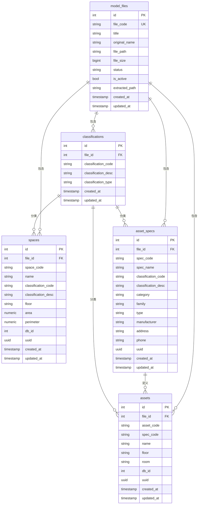
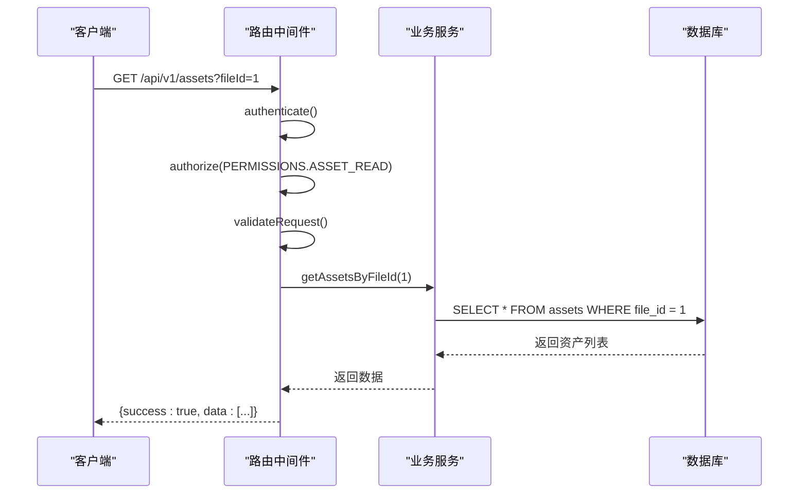
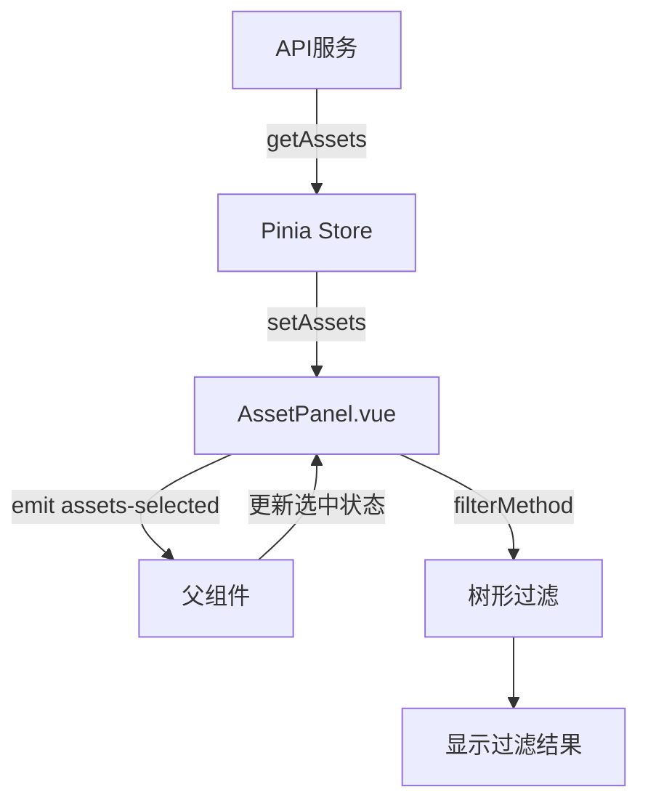

# 资产与空间管理

<cite>
**本文档引用的文件**  
- [asset.js](file://server/models/asset.js)
- [space.js](file://server/models/space.js)
- [assets.js](file://server/routes/v1/assets.js)
- [spaces.js](file://server/routes/v1/spaces.js)
- [assets.ts](file://src/stores/assets.ts)
- [spaces.ts](file://src/stores/spaces.ts)
- [AssetPanel.vue](file://src/components/AssetPanel.vue)
- [asset.ts](file://src/types/asset.ts)
- [space.ts](file://src/types/space.ts)
- [asset-spec.js](file://server/models/asset-spec.js)
- [add-file-id.sql](file://server/db/migrations/add-file-id.sql)
- [init-all.sql](file://server/db/init-all.sql)
</cite>

## 目录
1. [简介](#简介)
2. [模型定义与关系映射](#模型定义与关系映射)
3. [CRUD接口设计](#crud接口设计)
4. [前端数据同步机制](#前端数据同步机制)
5. [资产编码与位置关联](#资产编码与位置关联)
6. [批量操作实现](#批量操作实现)
7. [典型使用场景](#典型使用场景)
8. [数据一致性问题与解决方案](#数据一致性问题与解决方案)

## 简介
本文档深入阐述资产（Asset）与空间（Space）管理模块的实现。详细说明`asset.js`和`space.js`模型中的字段定义、关系映射及业务约束。解释`assets.js`和`spaces.js`路由中CRUD接口的设计，包括分页查询、模糊搜索与树形结构构建。描述前端`AssetPanel.vue`如何通过Pinia store（`assets.ts`）与API服务实现数据同步。提供资产编码（MC编码）生成规则、位置关联逻辑及批量操作的实现细节。

## 模型定义与关系映射

资产与空间模块的核心数据模型包括资产（Asset）、空间（Space）、资产规格（AssetSpec）和分类体系（Classification）。这些模型通过文件ID（file_id）进行关联，确保数据按文件隔离。

资产模型（`asset.js`）包含资产编码（asset_code）、规格编码（spec_code）、名称（name）、楼层（floor）、房间（room）和数据库ID（db_id）等字段。资产通过`spec_code`关联到资产规格，并通过`file_id`与模型文件关联，实现多文件数据隔离。

空间模型（`space.js`）包含空间编码（space_code）、名称（name）、分类编码（classification_code）、分类描述（classification_desc）、楼层（floor）、面积（area）、周长（perimeter）和数据库ID（db_id）等字段。空间同样通过`file_id`与模型文件关联。

资产规格模型（`asset-spec.js`）存储资产的元数据，如制造商、地址、电话等，并通过`file_id`与模型文件关联。分类体系通过`classification_code`在资产、空间和规格之间建立统一的分类标准。

**图源**  
- [init-all.sql](file://server/db/init-all.sql#L41-L134)
- [add-file-id.sql](file://server/db/migrations/add-file-id.sql#L5-L11)

**本节来源**  
- [asset.js](file://server/models/asset.js#L13-L25)
- [space.js](file://server/models/space.js#L13-L28)
- [asset-spec.js](file://server/models/asset-spec.js#L13-L30)

## CRUD接口设计

资产与空间模块的CRUD接口通过Express路由（`assets.js`和`spaces.js`）实现，遵循RESTful规范，并集成身份验证与权限控制。

### 查询接口
- **GET /api/v1/assets**: 支持通过`fileId`和`specCode`参数进行筛选，返回资产列表。
- **GET /api/v1/assets/{code}**: 根据资产编码获取单个资产详情。
- **GET /api/v1/spaces**: 支持通过`fileId`和`floor`参数进行筛选，返回空间列表。
- **GET /api/v1/spaces/floors**: 获取所有楼层列表，用于构建楼层选择器。

### 创建与更新接口
- **POST /api/v1/assets**: 创建新资产，需提供资产编码、名称等信息。
- **PUT /api/v1/assets/{code}**: 更新指定编码的资产信息，仅允许更新`name`、`floor`、`room`等字段。
- **POST /api/v1/spaces**: 创建新空间。
- **PUT /api/v1/spaces/{code}**: 更新指定编码的空间信息。

### 批量操作接口
- **POST /api/v1/assets/batch**: 批量导入资产，支持通过事务确保数据一致性。
- **POST /api/v1/spaces/batch**: 批量导入空间，先删除旧数据再插入新数据，确保数据同步。

所有接口均使用`express-validator`进行参数验证，并通过`authenticate`和`authorize`中间件进行身份验证和权限检查。

**图源**  
- [assets.js](file://server/routes/v1/assets.js#L33-L57)
- [spaces.js](file://server/routes/v1/spaces.js#L21-L47)

**本节来源**  
- [assets.js](file://server/routes/v1/assets.js#L1-L254)
- [spaces.js](file://server/routes/v1/spaces.js#L1-L221)

## 前端数据同步机制

前端通过Pinia状态管理（`assets.ts`和`spaces.ts`）与API服务（`assets.ts`和`spaces.ts`）实现数据同步。

### Pinia Store
`useAssetsStore`定义了资产状态，包括资产列表（list）、规格列表（specs）、选中ID列表（selectedIds）和加载状态（loading）。通过getters提供便捷的数据访问方法，如`getByCode`和`selectedAssets`。

### API服务
API服务（`assets.ts`）封装了HTTP请求，提供`getAssets`、`createAsset`、`updateAsset`等方法。这些方法返回Promise，便于在组件中使用async/await。

### 组件集成
`AssetPanel.vue`组件通过props接收资产数据和选中状态，通过emits向父组件传递事件。组件内部使用`computed`属性构建树形数据结构，并通过`watch`监听搜索文本和选中状态的变化。

**图源**  
- [assets.ts](file://src/services/api/assets.ts#L13-L16)
- [assets.ts](file://src/stores/assets.ts#L39-L173)
- [AssetPanel.vue](file://src/components/AssetPanel.vue#L101-L151)

**本节来源**  
- [assets.ts](file://src/stores/assets.ts#L1-L174)
- [assets.ts](file://src/services/api/assets.ts#L1-L108)
- [AssetPanel.vue](file://src/components/AssetPanel.vue#L1-L420)

## 资产编码与位置关联

资产编码（MC编码）是资产的唯一标识，通常由系统自动生成或从外部系统导入。在`asset.js`模型中，`asset_code`字段被定义为NOT NULL，并与`file_id`组合形成唯一约束，确保在同一个文件内资产编码的唯一性。

位置关联通过`floor`和`room`字段实现。这些字段存储在`assets`表中，允许用户为每个资产指定其所在的楼层和房间。在前端`AssetPanel.vue`中，这些信息被用于构建树形结构，用户可以通过楼层和房间对资产进行分组和筛选。

## 批量操作实现

批量操作通过`batchUpsertAssetsWithFile`和`batchUpsertSpacesWithFile`方法实现。这些方法使用数据库事务确保数据一致性：先开启事务，然后逐条插入或更新数据，最后提交事务。如果在过程中发生错误，则回滚事务，避免数据不一致。

在`assets.js`路由中，`POST /api/v1/assets/batch`接口调用`batchUpsertAssetsWithFile`方法，支持批量导入资产。类似地，`spaces.js`路由中的`POST /api/v1/spaces/batch`接口支持批量导入空间。

## 典型使用场景

### 创建带位置信息的资产
1. 客户端发送POST请求到`/api/v1/assets`，携带资产编码、名称、楼层、房间等信息。
2. 服务器验证参数，调用`upsertAsset`方法插入或更新资产。
3. 数据库返回新创建的资产对象，服务器将其返回给客户端。
4. 前端通过`getAssets`获取更新后的资产列表，并在`AssetPanel.vue`中展示。

### 在前端面板中展示层级结构
1. `AssetPanel.vue`组件从Pinia store获取资产列表。
2. 使用`computed`属性构建三级树形结构：分类编码 → 资产规格 → 资产。
3. 将树形数据传递给`el-tree-v2`组件进行渲染。
4. 用户可以通过搜索框进行模糊搜索，或通过勾选节点选择资产。

## 数据一致性问题与解决方案

### 问题1：批量导入时部分数据失败
**描述**：在批量导入大量资产时，如果中途发生错误，可能导致部分数据被插入，部分数据未被插入，造成数据不一致。

**解决方案**：使用数据库事务。在`batchUpsertAssetsWithFile`方法中，先开启事务，然后逐条处理数据，最后提交事务。如果发生错误，则回滚事务，确保要么全部成功，要么全部失败。

### 问题2：文件删除后关联数据未清理
**描述**：当删除一个模型文件时，其关联的资产、空间等数据可能未被清理，造成数据冗余。

**解决方案**：在数据库层面添加外键约束和级联删除。在`add-file-id.sql`迁移脚本中，为`assets`、`spaces`等表的`file_id`字段添加`REFERENCES model_files(id) ON DELETE CASCADE`约束，确保删除文件时自动清理关联数据。

### 问题3：并发更新导致数据覆盖
**描述**：多个用户同时更新同一资产时，可能导致后保存的数据覆盖先保存的数据。

**解决方案**：在更新操作中使用`updated_at`字段和条件更新。在`updateAsset`方法中，更新时同时更新`updated_at`字段，并在业务逻辑中比较`updated_at`时间戳，提示用户数据已被他人修改。

**本节来源**  
- [asset.js](file://server/models/asset.js#L163-L203)
- [space.js](file://server/models/space.js#L130-L171)
- [add-file-id.sql](file://server/db/migrations/add-file-id.sql#L5-L11)