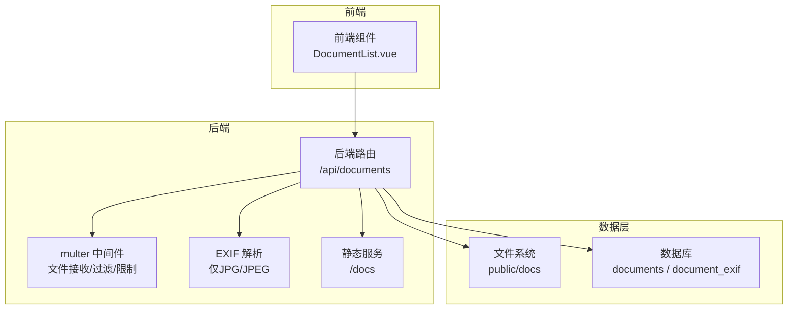
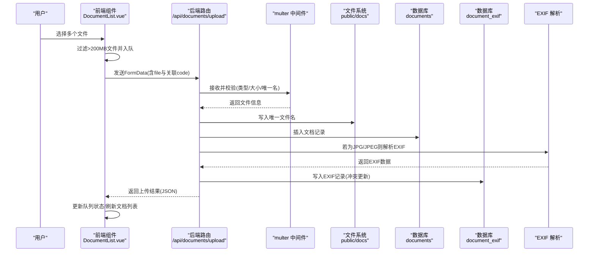
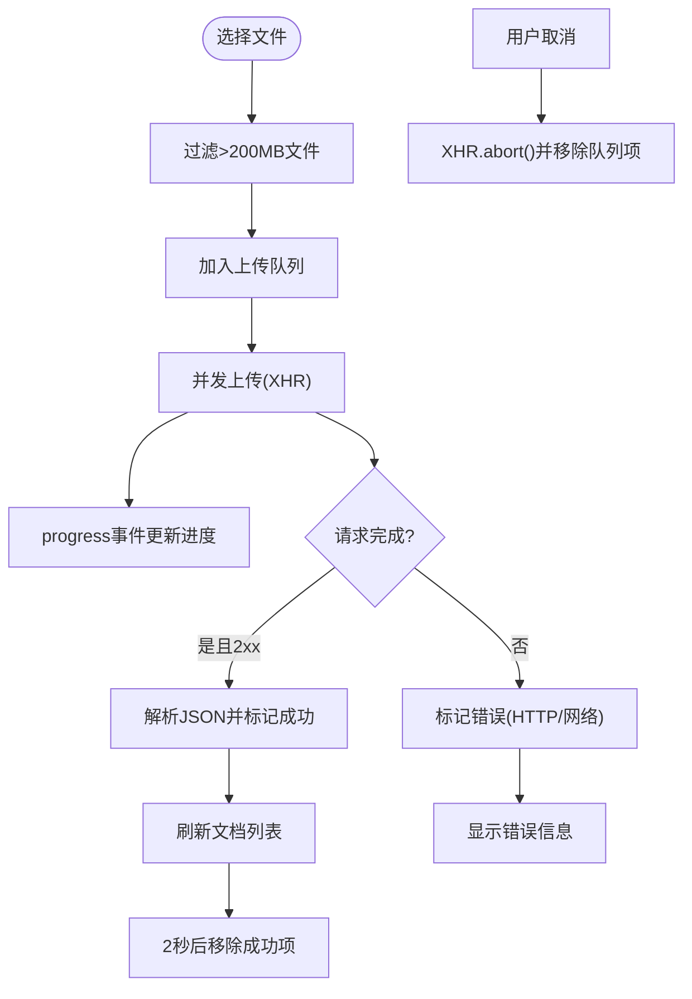
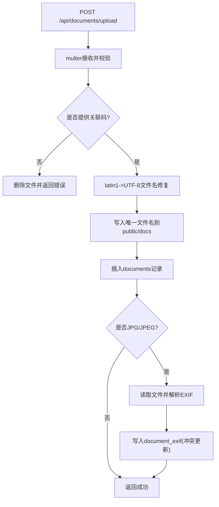
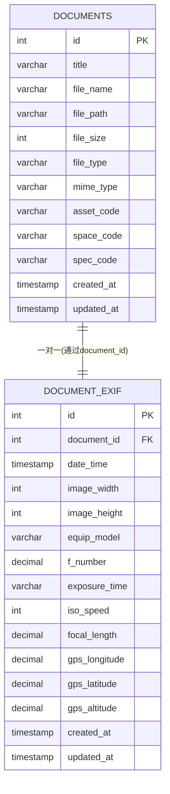
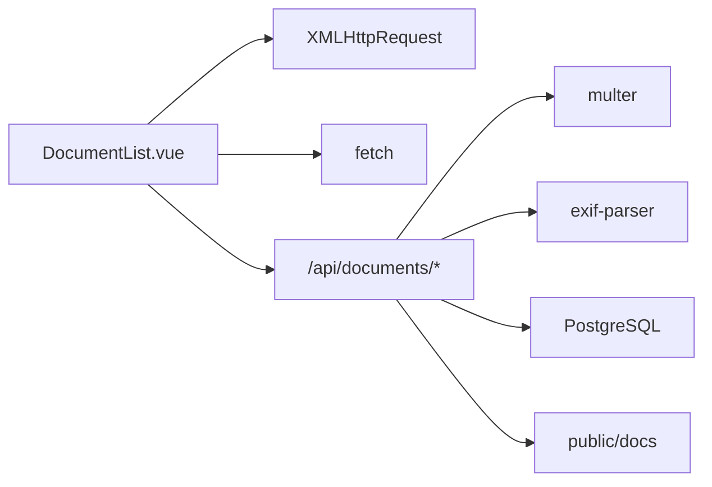
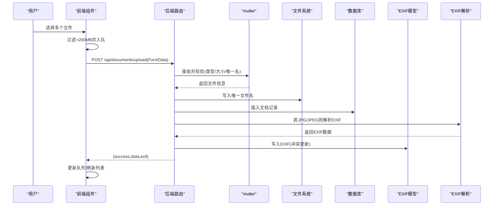

# 文档上传

<cite>
**本文引用的文件**
- [DocumentList.vue](file://src/components/DocumentList.vue)
- [documents.js](file://server/routes/documents.js)
- [document-exif.js](file://server/models/document-exif.js)
- [document.js](file://server/models/document.js)
- [create_documents_table.sql](file://server/db/create_documents_table.sql)
- [create_document_exif_table.sql](file://server/db/create_document_exif_table.sql)
- [index.js](file://server/index.js)
- [DOCUMENT_UPLOAD_PATH_FIX.md](file://DOCUMENT_UPLOAD_PATH_FIX.md)
</cite>

## 目录
1. [简介](#简介)
2. [项目结构](#项目结构)
3. [核心组件](#核心组件)
4. [架构总览](#架构总览)
5. [详细组件分析](#详细组件分析)
6. [依赖关系分析](#依赖关系分析)
7. [性能考量](#性能考量)
8. [故障排查指南](#故障排查指南)
9. [结论](#结论)
10. [附录](#附录)

## 简介
本文件深入解析文档上传功能的实现机制，涵盖前端组件如何通过 FormData 和 XMLHttpRequest 实现多文件上传、进度跟踪与错误处理，以及前端上传队列的管理逻辑；同时详解后端路由中 multer 中间件的配置（存储路径、文件名生成策略、类型过滤与大小限制），中文文件名编码修复方案（latin1 到 UTF-8 的转换），上传失败时的文件清理机制，文档与资产/空间/规格的关联方式，以及仅针对 JPG/JPEG 的 EXIF 信息提取流程与在模型中的存储方式。最后提供完整的上传流程时序图与错误处理最佳实践。

## 项目结构
文档上传涉及前后端协作：
- 前端：DocumentList.vue 负责触发文件选择、多文件入队、进度展示、取消上传、调用后端接口。
- 后端：Express 路由 documents.js 使用 multer 进行文件接收与校验，完成文件落盘、元数据入库、EXIF 提取与清理。
- 数据模型：document.js 与 document-exif.js 分别负责文档与 EXIF 的数据库操作。
- 数据库：documents 与 document_exif 两张表定义了文档与 EXIF 的结构及约束。
- 服务器：index.js 提供静态资源服务与路由挂载。

图表来源
- [DocumentList.vue](file://src/components/DocumentList.vue#L298-L436)
- [documents.js](file://server/routes/documents.js#L146-L215)
- [index.js](file://server/index.js#L33-L36)

章节来源
- [DocumentList.vue](file://src/components/DocumentList.vue#L1-L120)
- [documents.js](file://server/routes/documents.js#L1-L120)
- [index.js](file://server/index.js#L26-L40)

## 核心组件
- 前端上传组件：负责文件选择、多文件入队、进度监听、错误状态与取消上传。
- 后端上传路由：负责 multer 配置、文件名校验、类型过滤、大小限制、中文文件名编码修复、EXIF 提取与清理。
- 数据模型：文档与 EXIF 的增删改查与分组格式化。
- 数据库表：documents 与 document_exif 的结构与约束。

章节来源
- [DocumentList.vue](file://src/components/DocumentList.vue#L298-L436)
- [documents.js](file://server/routes/documents.js#L146-L215)
- [document.js](file://server/models/document.js#L55-L78)
- [document-exif.js](file://server/models/document-exif.js#L12-L69)

## 架构总览
下图展示了从前端到后端再到数据库与文件系统的整体流程。

图表来源
- [DocumentList.vue](file://src/components/DocumentList.vue#L314-L436)
- [documents.js](file://server/routes/documents.js#L146-L215)
- [document.js](file://server/models/document.js#L55-L78)
- [document-exif.js](file://server/models/document-exif.js#L12-L69)

## 详细组件分析

### 前端组件：DocumentList.vue
- 文件选择与多文件入队
  - 通过 input[type=file] 的 multiple 属性支持多文件选择。
  - handleFileSelect 将文件数组映射为上传队列项，设置初始状态与进度，并通过 nextTick 确保进度条立即渲染。
  - processFiles 对文件进行 200MB 限制过滤，提示超限文件名，然后批量入队并开始并发上传。
- 上传实现
  - uploadFile 使用 FormData 附加 file 字段与可选的 assetCode/spaceCode/specCode。
  - 使用 XMLHttpRequest 监听 progress、load、error、abort 事件，分别更新队列项的进度、状态与错误信息。
  - 成功时解析响应 JSON，标记成功并刷新文档列表；失败时记录错误消息。
  - uploadXhrMap 保存每个上传项对应的 XHR，以便 cancelUpload 调用 abort 取消。
- 队列管理
  - uploadQueue 作为响应式数组，实时驱动 UI 展示进度与状态。
  - 成功项在 2 秒后自动从队列移除，避免堆积。
  - 支持取消上传，移除对应队列项并释放 XHR。

图表来源
- [DocumentList.vue](file://src/components/DocumentList.vue#L314-L436)

章节来源
- [DocumentList.vue](file://src/components/DocumentList.vue#L298-L436)

### 后端路由：documents.js
- multer 配置
  - 存储路径：public/docs，自动创建目录。
  - 文件名策略：时间戳+随机字符串+原扩展名，确保唯一性与可读性。
  - 类型过滤：仅允许 PDF、JPG/JPEG、PNG、SVG、MP4。
  - 大小限制：200MB。
- 上传处理
  - 必须提供 assetCode、spaceCode、specCode 三者之一，否则删除已接收文件并返回错误。
  - 中文文件名编码修复：将 multer 以 latin1 存储的 originalname 转换为 UTF-8。
  - 创建文档记录，写入文件名、路径、大小、类型、MIME、关联码等。
  - 仅对 JPG/JPEG 提取 EXIF，包含拍摄时间、图像尺寸、相机参数、GPS 坐标与海拔。
  - 成功返回 { success, data, exif }；失败删除文件并返回错误。
- 下载、删除、列表、详情、EXIF 查询等路由均在该文件中实现。

图表来源
- [documents.js](file://server/routes/documents.js#L146-L215)
- [documents.js](file://server/routes/documents.js#L164-L174)
- [documents.js](file://server/routes/documents.js#L187-L203)

章节来源
- [documents.js](file://server/routes/documents.js#L146-L215)

### 数据模型与数据库
- 文档模型（document.js）
  - 提供创建、查询、更新标题、删除与统计等方法。
- EXIF 模型（document-exif.js）
  - 提供创建、查询、按文档ID删除、带 EXIF 的文档列表查询与分组格式化。
- 数据库表结构
  - documents：支持与资产、空间、规格三者之一关联，使用 CHECK 约束确保三者互斥。
  - document_exif：与 documents 的一对一关系，ON DELETE CASCADE 自动清理。

图表来源
- [create_documents_table.sql](file://server/db/create_documents_table.sql#L1-L30)
- [create_document_exif_table.sql](file://server/db/create_document_exif_table.sql#L1-L29)

章节来源
- [document.js](file://server/models/document.js#L55-L78)
- [document-exif.js](file://server/models/document-exif.js#L12-L69)
- [create_documents_table.sql](file://server/db/create_documents_table.sql#L1-L30)
- [create_document_exif_table.sql](file://server/db/create_document_exif_table.sql#L1-L29)

### 静态资源与路径修复
- 服务器通过 express.static 挂载 /docs，指向 public/docs，使上传后的文件可通过 /docs/{filename} 访问。
- 路径修复文档明确了存储目录变更、文件名格式与静态访问 URL 的约定。

章节来源
- [index.js](file://server/index.js#L33-L36)
- [DOCUMENT_UPLOAD_PATH_FIX.md](file://DOCUMENT_UPLOAD_PATH_FIX.md#L1-L21)

## 依赖关系分析
- 前端依赖
  - XMLHttpRequest 用于上传与进度监听。
  - fetch 用于文档列表、标题更新、删除与下载。
- 后端依赖
  - multer：文件接收、过滤与大小限制。
  - exif-parser：JPG/JPEG EXIF 解析。
  - PostgreSQL：通过自定义 db 模块访问。
- 路由组织
  - /api/documents 汇聚上传、列表、详情、EXIF、删除、下载等接口。

图表来源
- [DocumentList.vue](file://src/components/DocumentList.vue#L298-L436)
- [documents.js](file://server/routes/documents.js#L146-L215)

章节来源
- [DocumentList.vue](file://src/components/DocumentList.vue#L298-L436)
- [documents.js](file://server/routes/documents.js#L146-L215)

## 性能考量
- 并发上传：前端对多个文件并发发起 XHR，提升吞吐量；建议根据网络与服务器能力调整并发数。
- 进度更新：基于 lengthComputable 的事件驱动，避免轮询，降低 CPU 占用。
- 文件大小：200MB 限制防止大文件占用过多带宽与磁盘；建议前端在选择阶段也做预检。
- 数据库写入：EXIF 写入采用 ON CONFLICT DO UPDATE，减少重复写入成本。
- 静态服务：/docs 静态资源直接由 Express 提供，避免额外代理层。

## 故障排查指南
- 前端常见问题
  - 无法触发文件选择：确认 input 未被禁用且点击事件有效。
  - 上传进度不更新：检查 lengthComputable 条件与事件绑定。
  - 取消无效：确认 uploadXhrMap 是否正确保存 XHR 并在 abort 时移除。
  - 成功但未刷新：检查 loadDocuments 是否被调用与响应 JSON 结构。
- 后端常见问题
  - 文件类型被拒绝：确认 MIME 与扩展名匹配，或调整 fileFilter。
  - 超出大小限制：确认客户端与服务端 limits 均为 200MB。
  - 中文文件名乱码：确认 latin1->UTF-8 转换逻辑生效。
  - EXIF 为空：仅 JPG/JPEG 会提取 EXIF，其他格式不会。
  - 删除文件失败：检查文件权限与路径拼接。
- 最佳实践
  - 前端：统一错误提示与状态反馈；对超限文件单独提示；对网络错误与 HTTP 错误区分处理。
  - 后端：捕获异常并删除临时文件；对关键路径增加日志；对 EXIF 解析失败进行降级处理。

章节来源
- [DocumentList.vue](file://src/components/DocumentList.vue#L364-L436)
- [documents.js](file://server/routes/documents.js#L146-L215)

## 结论
该文档上传功能通过前端队列与并发 XHR、后端 multer 校验与 EXIF 提取、数据库与文件系统的协同，实现了稳定高效的多文件上传体验。中文文件名编码修复与上传失败清理机制提升了可靠性。建议在生产环境中结合 CDN 与缓存策略进一步优化性能，并完善上传速率限制与配额控制。

## 附录

### 上传流程时序图（完整）

图表来源
- [DocumentList.vue](file://src/components/DocumentList.vue#L314-L436)
- [documents.js](file://server/routes/documents.js#L146-L215)
- [document-exif.js](file://server/models/document-exif.js#L12-L69)

### 错误处理最佳实践清单
- 前端
  - 显示具体错误原因（HTTP 状态码、网络错误、解析失败）。
  - 对超限文件与不支持类型分别提示。
  - 取消上传后及时清理队列项与 XHR。
- 后端
  - 捕获异常并删除已接收文件，避免磁盘碎片。
  - 对 EXIF 解析失败进行降级，不影响主流程。
  - 对关键操作增加日志，便于追踪。