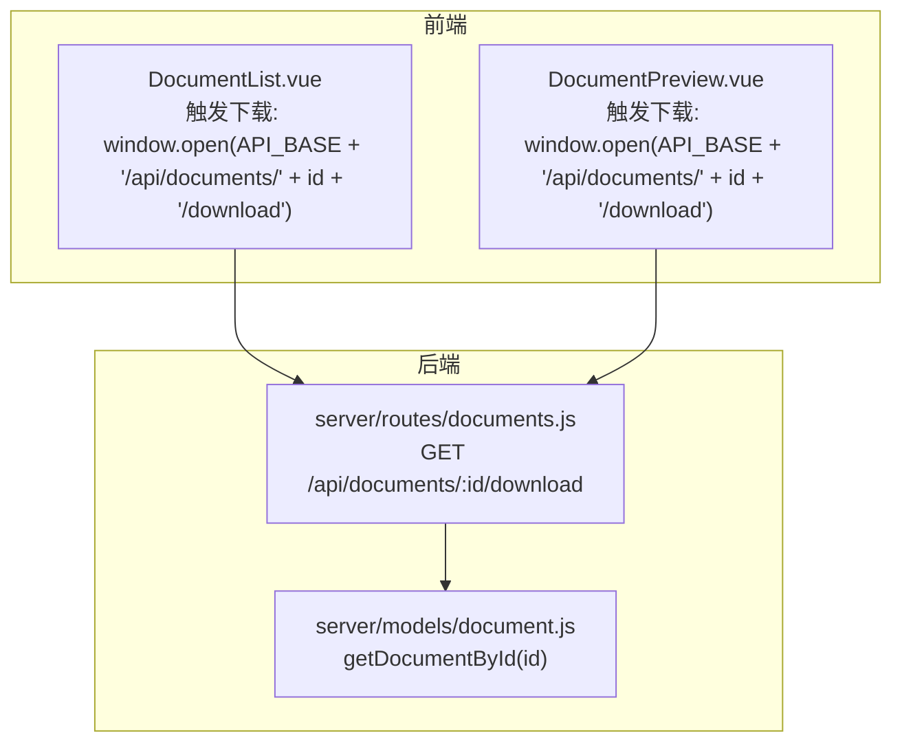
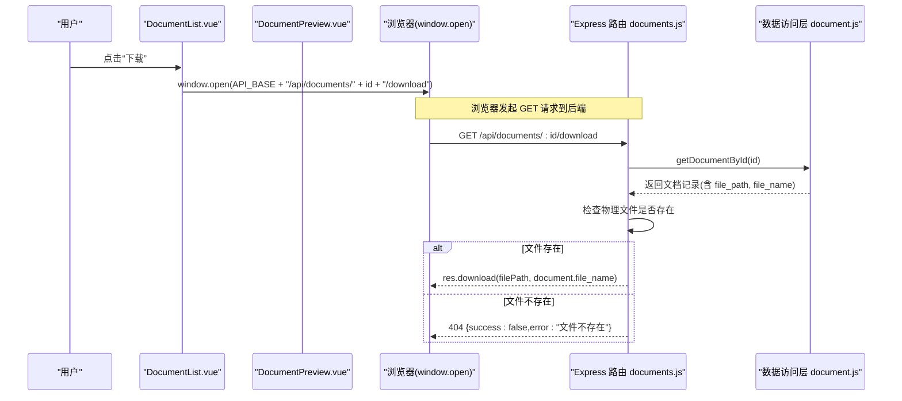
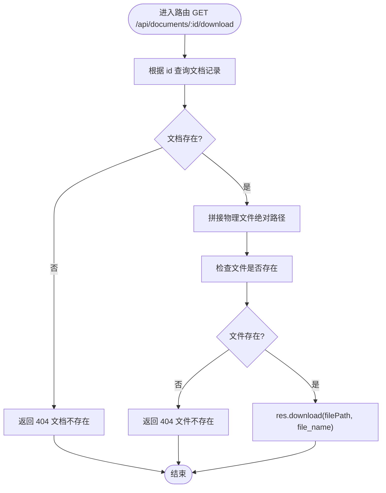
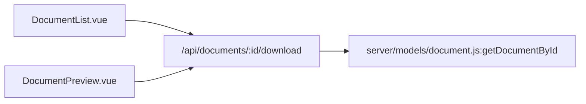

# 文档下载

<cite>
**本文引用的文件**
- [DocumentList.vue](file://src/components/DocumentList.vue)
- [DocumentPreview.vue](file://src/components/DocumentPreview.vue)
- [documents.js](file://server/routes/documents.js)
- [document.js](file://server/models/document.js)
</cite>

## 目录
1. [简介](#简介)
2. [项目结构](#项目结构)
3. [核心组件](#核心组件)
4. [架构总览](#架构总览)
5. [详细组件分析](#详细组件分析)
6. [依赖分析](#依赖分析)
7. [性能考虑](#性能考虑)
8. [故障排查指南](#故障排查指南)
9. [结论](#结论)

## 简介
本文件围绕“文档下载”功能进行深入解析，重点说明前端组件如何通过 window.open 访问后端 /api/documents/:id/download 端点触发下载；后端路由在 GET /api/documents/:id/download 中如何验证文档 ID、检查物理文件可访问性，并最终使用 res.download 发送文件流与正确文件名。文档还强调该流程如何确保数据库记录与物理文件的一致性，并给出 404 文件不存在的错误响应机制。

## 项目结构
- 前端组件位于 src/components，其中 DocumentList.vue 与 DocumentPreview.vue 提供下载入口。
- 后端路由位于 server/routes，documents.js 提供文档相关接口，包括下载端点。
- 数据访问层位于 server/models，document.js 提供文档记录的数据库操作。

图表来源
- [DocumentList.vue](file://src/components/DocumentList.vue#L526-L530)
- [DocumentPreview.vue](file://src/components/DocumentPreview.vue#L358-L363)
- [documents.js](file://server/routes/documents.js#L356-L383)
- [document.js](file://server/models/document.js#L42-L50)

章节来源
- [DocumentList.vue](file://src/components/DocumentList.vue#L526-L530)
- [DocumentPreview.vue](file://src/components/DocumentPreview.vue#L358-L363)
- [documents.js](file://server/routes/documents.js#L356-L383)
- [document.js](file://server/models/document.js#L42-L50)

## 核心组件
- 前端触发下载
  - DocumentList.vue 在点击下载按钮时，调用 window.open 打开后端下载端点。
  - DocumentPreview.vue 在预览界面点击下载按钮时，同样调用 window.open 打开后端下载端点。
- 后端下载路由
  - documents.js 的 GET /api/documents/:id/download 路由负责：
    - 验证文档 ID 是否存在；
    - 检查服务器上物理文件是否存在；
    - 使用 res.download 发送文件流并设置正确的下载文件名。

章节来源
- [DocumentList.vue](file://src/components/DocumentList.vue#L526-L530)
- [DocumentPreview.vue](file://src/components/DocumentPreview.vue#L358-L363)
- [documents.js](file://server/routes/documents.js#L356-L383)

## 架构总览
以下序列图展示了从前端到后端的完整下载流程，以及后端如何与数据库交互并校验物理文件存在性。

图表来源
- [DocumentList.vue](file://src/components/DocumentList.vue#L526-L530)
- [DocumentPreview.vue](file://src/components/DocumentPreview.vue#L358-L363)
- [documents.js](file://server/routes/documents.js#L356-L383)
- [document.js](file://server/models/document.js#L42-L50)

## 详细组件分析

### 前端组件：DocumentList.vue
- 下载入口
  - 在每个文档项的操作区提供下载按钮，点击后通过 window.open 打开后端下载端点。
  - 使用环境变量 API_BASE 拼接完整 URL，确保跨环境兼容。
- 交互行为
  - 点击下载按钮后，浏览器直接发起 GET 请求至 /api/documents/:id/download，无需额外参数。
  - 若后端返回 404，浏览器将收到 JSON 错误响应，但不会自动弹出下载框；前端应提示用户或避免触发下载。

章节来源
- [DocumentList.vue](file://src/components/DocumentList.vue#L526-L530)

### 前端组件：DocumentPreview.vue
- 下载入口
  - 预览界面顶部工具栏提供下载按钮，点击后同样通过 window.open 打开后端下载端点。
  - 使用与 DocumentList.vue 相同的拼接方式，确保一致性。
- 交互行为
  - 与 DocumentList.vue 类似，点击后由浏览器发起 GET 请求至 /api/documents/:id/download。

章节来源
- [DocumentPreview.vue](file://src/components/DocumentPreview.vue#L358-L363)

### 后端路由：GET /api/documents/:id/download
- 路由职责
  - 验证文档 ID 是否存在；
  - 检查服务器上物理文件是否存在；
  - 使用 res.download 发送文件流并设置正确的下载文件名。
- 错误处理
  - 文档不存在：返回 404 JSON 错误；
  - 物理文件不存在：返回 404 JSON 错误；
  - 其他异常：返回 500 JSON 错误。
- 数据一致性保障
  - 通过先查询数据库记录，再检查物理文件，确保数据库记录与物理文件保持一致。
  - 若记录存在但文件缺失，返回 404，避免返回空流或错误文件名导致的下载异常。

图表来源
- [documents.js](file://server/routes/documents.js#L356-L383)

章节来源
- [documents.js](file://server/routes/documents.js#L356-L383)

### 数据访问层：document.js
- getDocumentById(id)
  - 从数据库查询文档记录，返回包含 file_path、file_name 等字段的对象。
  - 该记录随后被下载路由用于构建物理文件路径与设置下载文件名。

章节来源
- [document.js](file://server/models/document.js#L42-L50)

## 依赖分析
- 前端对后端的依赖
  - DocumentList.vue 与 DocumentPreview.vue 依赖后端 /api/documents/:id/download 端点。
  - 两者均通过 window.open 触发下载，确保浏览器直接处理文件下载。
- 后端对数据层的依赖
  - documents.js 的下载路由依赖 document.js 的 getDocumentById(id)，用于获取文档记录。
- 文件系统依赖
  - 下载路由根据数据库中的 file_path 拼接物理文件路径，并通过 fs.access 检查文件存在性，确保与数据库记录一致。

图表来源
- [DocumentList.vue](file://src/components/DocumentList.vue#L526-L530)
- [DocumentPreview.vue](file://src/components/DocumentPreview.vue#L358-L363)
- [documents.js](file://server/routes/documents.js#L356-L383)
- [document.js](file://server/models/document.js#L42-L50)

章节来源
- [DocumentList.vue](file://src/components/DocumentList.vue#L526-L530)
- [DocumentPreview.vue](file://src/components/DocumentPreview.vue#L358-L363)
- [documents.js](file://server/routes/documents.js#L356-L383)
- [document.js](file://server/models/document.js#L42-L50)

## 性能考虑
- 直接流式传输
  - 后端使用 res.download 直接向客户端发送文件流，避免将文件读入内存，降低内存占用。
- 文件存在性检查
  - 在发送前进行 fs.access 检查，避免错误路径导致不必要的 IO 或错误响应。
- 前端直连下载
  - 前端通过 window.open 直接访问后端端点，减少中间层处理，提升下载速度与稳定性。

## 故障排查指南
- 404 文档不存在
  - 现象：后端返回 {success:false,error:"文档不存在"}。
  - 可能原因：前端传入的 id 无效或数据库中无对应记录。
  - 处理建议：确认前端传入的 id 正确，检查数据库中 documents 表是否存在该记录。
- 404 文件不存在
  - 现象：后端返回 {success:false,error:"文件不存在"}。
  - 可能原因：数据库记录存在但物理文件缺失（例如上传后文件被删除）。
  - 处理建议：恢复物理文件或将数据库记录同步删除，确保数据库与文件系统一致。
- 500 服务器内部错误
  - 现象：后端返回 {success:false,error:"..."}。
  - 可能原因：文件系统异常、权限不足、路径拼接错误等。
  - 处理建议：检查服务器文件权限、磁盘空间、日志输出，定位具体异常并修复。

章节来源
- [documents.js](file://server/routes/documents.js#L356-L383)

## 结论
文档下载功能通过前端组件的 window.open 直接访问后端 /api/documents/:id/download 端点实现。后端路由在验证文档 ID 存在性后，进一步检查物理文件可访问性，并使用 res.download 发送文件流与正确文件名。该流程有效确保数据库记录与物理文件的一致性，并通过明确的 404 错误响应帮助前端与用户识别问题。建议在部署环境中保持数据库与文件系统的同步维护，以获得最佳的下载体验与可靠性。