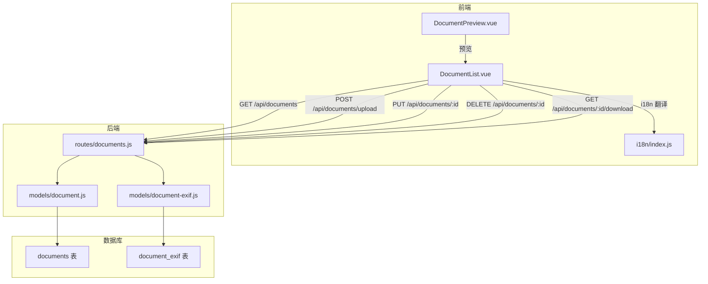
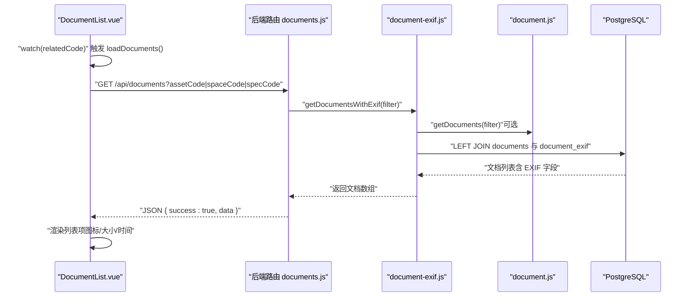
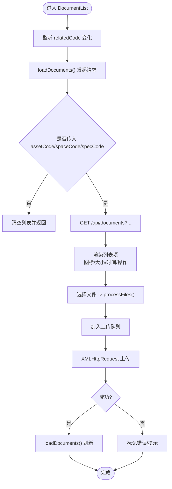
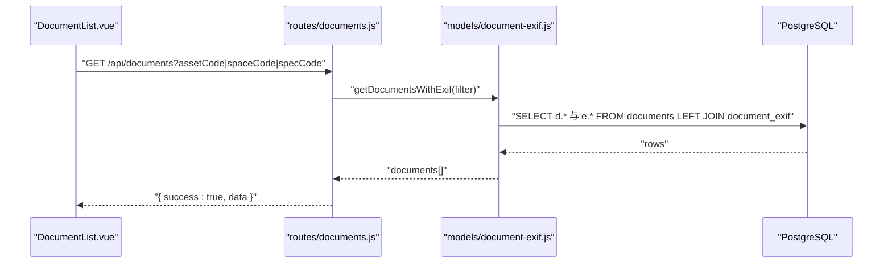
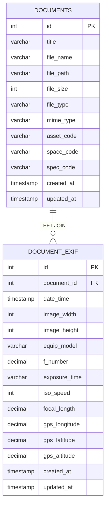
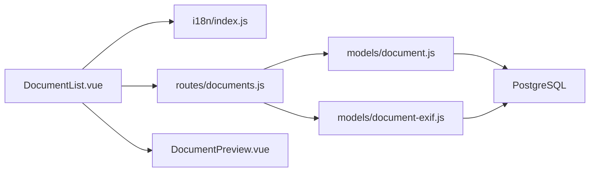

# 文档列表

<cite>
**本文引用的文件**
- [DocumentList.vue](file://src/components/DocumentList.vue)
- [documents.js](file://server/routes/documents.js)
- [document-exif.js](file://server/models/document-exif.js)
- [document.js](file://server/models/document.js)
- [DocumentPreview.vue](file://src/components/DocumentPreview.vue)
- [create_document_exif_table.sql](file://server/db/create_document_exif_table.sql)
- [create_documents_table.sql](file://server/db/create_documents_table.sql)
- [index.js](file://src/i18n/index.js)
</cite>

## 目录
1. [简介](#简介)
2. [项目结构](#项目结构)
3. [核心组件](#核心组件)
4. [架构总览](#架构总览)
5. [组件详细分析](#组件详细分析)
6. [依赖关系分析](#依赖关系分析)
7. [性能考量](#性能考量)
8. [故障排查指南](#故障排查指南)
9. [结论](#结论)

## 简介
本文件围绕前端组件 DocumentList.vue 的文档列表渲染与管理能力进行深入解析，涵盖：
- 通过 loadDocuments 方法从后端 /api/documents 接口按 assetCode/spaceCode/specCode 参数动态加载文档列表；
- 列表项 UI 结构与交互（预览、下载、删除、编辑标题、上传队列）；
- 基于文件类型的 SVG 图标动态生成逻辑（getFileIcon）；
- 文件大小格式化（formatFileSize）与创建时间相对显示（formatDate）；
- 后端 GET /api/documents 路由如何调用 documentExifModel.getDocumentsWithExif 返回包含 EXIF 信息的文档列表；
- 列表数据的实时更新机制（上传、删除后自动刷新）。

## 项目结构
DocumentList.vue 位于前端 src/components 目录，负责文档列表展示与交互；后端路由与模型位于 server/routes 与 server/models。数据库表结构由 server/db 中的 SQL 文件定义。

图表来源
- [DocumentList.vue](file://src/components/DocumentList.vue#L1-L155)
- [documents.js](file://server/routes/documents.js#L217-L237)
- [document.js](file://server/models/document.js#L1-L163)
- [document-exif.js](file://server/models/document-exif.js#L95-L128)
- [create_documents_table.sql](file://server/db/create_documents_table.sql#L1-L49)
- [create_document_exif_table.sql](file://server/db/create_document_exif_table.sql#L1-L48)

章节来源
- [DocumentList.vue](file://src/components/DocumentList.vue#L1-L155)
- [documents.js](file://server/routes/documents.js#L217-L237)

## 核心组件
- DocumentList.vue：负责文档列表的加载、渲染、上传、编辑标题、删除、下载以及预览触发；提供文件类型图标、文件大小格式化、相对时间显示等辅助方法。
- DocumentPreview.vue：负责文档预览（PDF、图片、视频、全景图）与交互控制。
- 后端路由 documents.js：提供文档上传、列表查询、详情、EXIF 查询、标题更新、删除、下载等接口。
- 数据模型 document.js 与 document-exif.js：封装数据库访问与 EXIF 数据聚合查询。
- 数据库表 create_documents_table.sql 与 create_document_exif_table.sql：定义文档与 EXIF 元数据的表结构与索引。

章节来源
- [DocumentList.vue](file://src/components/DocumentList.vue#L157-L553)
- [DocumentPreview.vue](file://src/components/DocumentPreview.vue#L1-L130)
- [documents.js](file://server/routes/documents.js#L146-L383)
- [document.js](file://server/models/document.js#L1-L163)
- [document-exif.js](file://server/models/document-exif.js#L95-L166)
- [create_documents_table.sql](file://server/db/create_documents_table.sql#L1-L49)
- [create_document_exif_table.sql](file://server/db/create_document_exif_table.sql#L1-L48)

## 架构总览
从前端到后端的数据流如下：
- 前端根据 props 中的 assetCode/spaceCode/specCode 动态构造查询参数，调用 GET /api/documents 获取文档列表；
- 后端路由 documents.js 调用 documentExifModel.getDocumentsWithExif，通过 LEFT JOIN 聚合 documents 与 document_exif，返回包含 EXIF 信息的文档数组；
- 前端渲染列表项，支持预览、下载、删除、编辑标题、上传队列与进度反馈；
- 上传成功、删除成功后，前端调用 loadDocuments 刷新列表，实现数据实时更新。

图表来源
- [DocumentList.vue](file://src/components/DocumentList.vue#L261-L283)
- [documents.js](file://server/routes/documents.js#L217-L237)
- [document-exif.js](file://server/models/document-exif.js#L95-L128)
- [document.js](file://server/models/document.js#L12-L35)

## 组件详细分析

### DocumentList.vue：文档列表渲染与管理
- 动态加载与参数传递
  - 通过 props 接收 assetCode/spaceCode/specCode，computed relatedCode 作为联动条件；
  - loadDocuments 构造 URLSearchParams，拼接 assetCode/spaceCode/specCode 参数，调用 GET /api/documents；
  - watch 监听 relatedCode，immediate: true 确保首次进入即加载。
- 列表项 UI 结构
  - 每个文档项包含：文件图标（getFileIcon）、标题（可双击编辑）、元信息（文件大小 + 相对时间）、操作按钮（下载、删除）；
  - 空状态：当 documents.length 为 0 时显示“暂无文档”与支持格式提示。
- 图标生成逻辑（getFileIcon）
  - 首先判断是否为全景图（长宽比接近 2:1），若是则返回紫色全景图图标；
  - 否则根据 file_type 返回对应颜色的线性图标（PDF/图片/SVG/MP4）。
- 文件大小与时间显示
  - formatFileSize：将字节转换为 B/KB/MB/GB；
  - formatDate：按“今天/昨天/N天前/本地日期”规则显示创建时间。
- 上传流程
  - 触发文件选择 -> 过滤超大文件（>200MB）-> 添加到 uploadQueue -> 并行上传（XMLHttpRequest）-> 成功后 loadDocuments 刷新 -> 2秒后移除成功项；
  - 支持取消上传（abort）与错误状态展示。
- 编辑标题与删除
  - 双击标题进入编辑模式，提交 PUT /api/documents/:id 更新标题；
  - 删除时弹窗确认，调用 DELETE /api/documents/:id，成功后刷新列表。
- 下载
  - 点击下载按钮打开 /api/documents/:id/download。
- 预览
  - 点击标题进入 DocumentPreview.vue，支持 PDF、图片、视频、全景图预览与交互。

图表来源
- [DocumentList.vue](file://src/components/DocumentList.vue#L261-L553)

章节来源
- [DocumentList.vue](file://src/components/DocumentList.vue#L157-L553)

### 后端路由 documents.js：GET /api/documents 与 EXIF 聚合
- GET /api/documents
  - 从请求查询参数读取 assetCode/spaceCode/specCode；
  - 调用 documentExifModel.getDocumentsWithExif，内部通过 LEFT JOIN documents 与 document_exif，按 created_at 降序返回；
  - 返回 JSON { success: true, data }。
- EXIF 提取与保存（上传流程）
  - POST /api/documents/upload 使用 multer 限制文件类型与大小；
  - 保存文档记录后，若为 JPG/JPEG，读取 EXIF 并调用 documentExifModel.createExif 保存；
  - 返回包含 EXIF 的结果。
- 其他接口
  - GET /api/documents/:id、GET /api/documents/:id/exif、PUT /api/documents/:id、DELETE /api/documents/:id、GET /api/documents/:id/download。

图表来源
- [documents.js](file://server/routes/documents.js#L217-L237)
- [document-exif.js](file://server/models/document-exif.js#L95-L128)

章节来源
- [documents.js](file://server/routes/documents.js#L217-L237)
- [document-exif.js](file://server/models/document-exif.js#L95-L128)

### 数据模型与数据库表
- document.js
  - 提供 getDocuments、getDocumentById、createDocument、updateDocumentTitle、deleteDocument、getDocumentStats 等方法；
  - getDocuments 依据三选一的关联字段进行查询并按 created_at 降序。
- document-exif.js
  - getDocumentsWithExif：LEFT JOIN documents 与 document_exif，返回包含 EXIF 字段的文档列表；
  - formatExifGroups：将原始 EXIF 数据按文件/照相机/GPS 分组输出，便于前端展示。
- 数据库表
  - documents：存储文档基本信息与关联字段（asset_code/space_code/spec_code），并有唯一性约束确保三者仅一有效；
  - document_exif：存储 EXIF 元数据，与 documents 通过外键级联删除。

图表来源
- [create_documents_table.sql](file://server/db/create_documents_table.sql#L1-L49)
- [create_document_exif_table.sql](file://server/db/create_document_exif_table.sql#L1-L48)

章节来源
- [document.js](file://server/models/document.js#L1-L163)
- [document-exif.js](file://server/models/document-exif.js#L95-L166)
- [create_documents_table.sql](file://server/db/create_documents_table.sql#L1-L49)
- [create_document_exif_table.sql](file://server/db/create_document_exif_table.sql#L1-L48)

### 国际化与文案
- 文档模块的 i18n 文案集中于 src/i18n/index.js 的 document 节点，包括标题、上传、删除、下载、预览、空状态、支持格式、文件过大、上传中、相对时间等。
- DocumentList.vue 通过 $t('document.xxx') 使用这些文案，确保多语言支持。

章节来源
- [index.js](file://src/i18n/index.js#L235-L253)
- [DocumentList.vue](file://src/components/DocumentList.vue#L1-L155)

## 依赖关系分析
- 前端组件依赖
  - DocumentList.vue 依赖 i18n 提供的翻译；
  - 与后端 API 约定严格：GET/POST/PUT/DELETE/下载接口；
  - 与 DocumentPreview.vue 协作实现预览。
- 后端路由依赖
  - documents.js 依赖 document.js 与 document-exif.js；
  - document-exif.js 依赖数据库连接与 SQL 查询；
  - document.js 依赖数据库查询封装。
- 数据库依赖
  - documents 表与 document_exif 表通过外键建立关联；
  - 索引提升查询性能（按关联字段与 created_at）。

图表来源
- [DocumentList.vue](file://src/components/DocumentList.vue#L157-L553)
- [documents.js](file://server/routes/documents.js#L146-L383)
- [document.js](file://server/models/document.js#L1-L163)
- [document-exif.js](file://server/models/document-exif.js#L1-L166)
- [index.js](file://src/i18n/index.js#L1-L577)

章节来源
- [DocumentList.vue](file://src/components/DocumentList.vue#L157-L553)
- [documents.js](file://server/routes/documents.js#L146-L383)
- [document.js](file://server/models/document.js#L1-L163)
- [document-exif.js](file://server/models/document-exif.js#L1-L166)
- [index.js](file://src/i18n/index.js#L1-L577)

## 性能考量
- 前端
  - 列表渲染采用 v-for，建议在大量文档场景下考虑虚拟滚动或分页；
  - 上传进度使用 XMLHttpRequest，避免阻塞主线程；成功后立即刷新列表，减少重复请求。
- 后端
  - getDocumentsWithExif 使用 LEFT JOIN，需确保 documents 与 document_exif 上的索引生效；
  - 上传流程对 JPG/JPEG 提取 EXIF，注意磁盘 IO 与解析耗时，建议异步处理或限流。
- 数据库
  - documents 表的三选一约束与索引有助于快速定位文档；
  - document_exif 表的唯一索引保证每份文档仅一条 EXIF 记录。

[本节为通用指导，无需列出具体文件来源]

## 故障排查指南
- 无法加载文档列表
  - 检查 props 是否正确传入 assetCode/spaceCode/specCode；
  - 确认后端 /api/documents 返回 success:true 且 data 为数组。
- 上传失败
  - 检查文件大小是否超过 200MB；
  - 确认 multipart/form-data 请求包含 assetCode/spaceCode/specCode 三选一；
  - 查看后端错误日志与返回的 error 字段。
- 删除失败
  - 确认文档存在且删除成功；
  - 检查物理文件删除权限与路径。
- 预览异常
  - 确认文件类型受支持（PDF/图片/视频/全景图）；
  - 检查 /api/documents/:id/download 是否可访问。
- EXIF 信息缺失
  - 仅 JPG/JPEG 会提取 EXIF；
  - 若未提取到，检查 EXIF 解析与数据库写入流程。

章节来源
- [DocumentList.vue](file://src/components/DocumentList.vue#L298-L553)
- [documents.js](file://server/routes/documents.js#L146-L383)
- [document-exif.js](file://server/models/document-exif.js#L1-L166)

## 结论
DocumentList.vue 通过清晰的 props 与 watch 机制，结合后端 /api/documents 的 EXIF 聚合查询，实现了按资产/空间/规格维度的文档列表渲染与管理。前端提供完整的上传、编辑、删除、下载与预览能力，并在关键操作后自动刷新列表，确保数据实时性。后端路由与模型职责明确，数据库表结构合理，具备良好的扩展性与性能基础。