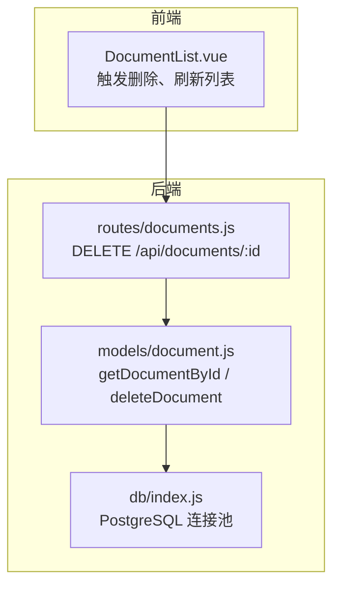
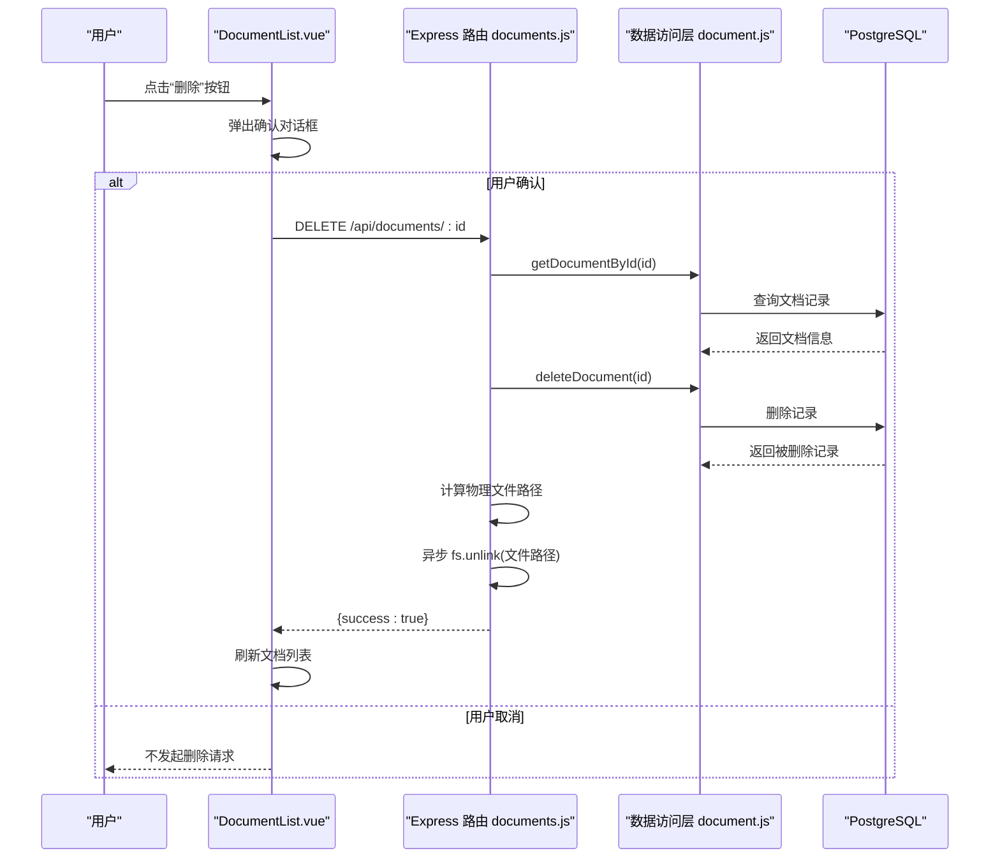
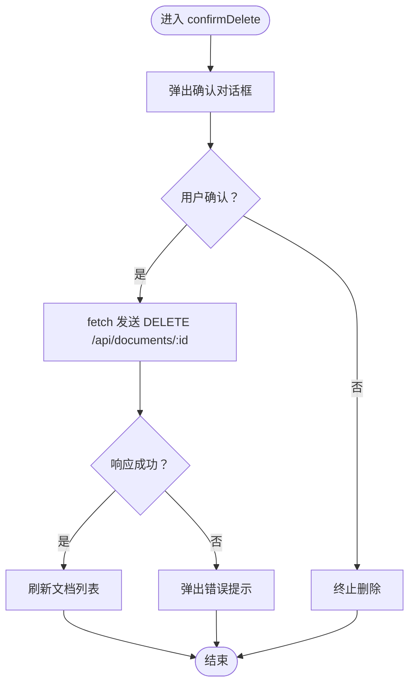
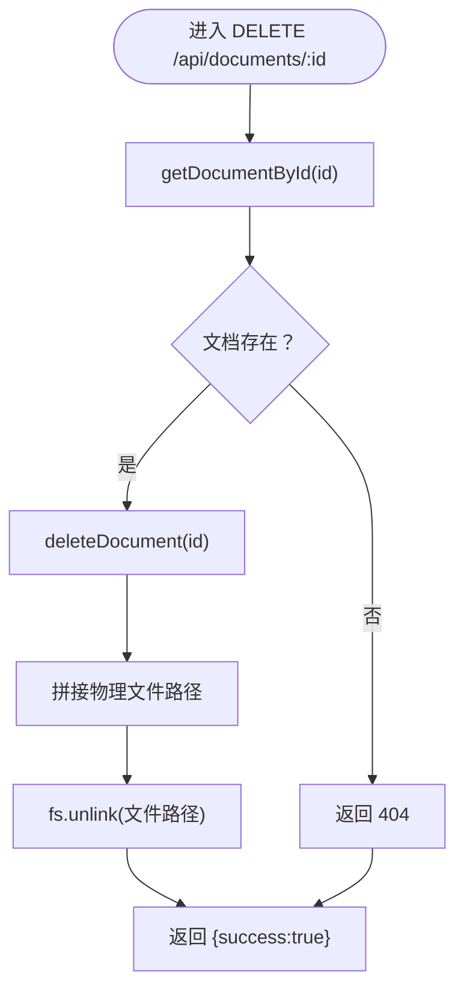
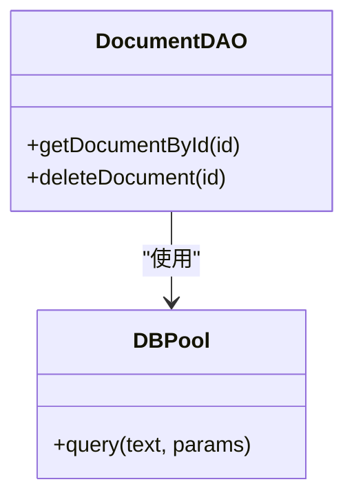
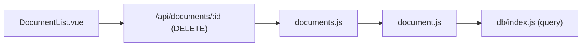

# 文档删除

<cite>
**本文引用的文件**
- [DocumentList.vue](file://src/components/DocumentList.vue)
- [documents.js](file://server/routes/documents.js)
- [document.js](file://server/models/document.js)
- [index.js](file://server/db/index.js)
</cite>

## 目录
1. [简介](#简介)
2. [项目结构](#项目结构)
3. [核心组件](#核心组件)
4. [架构总览](#架构总览)
5. [详细组件分析](#详细组件分析)
6. [依赖分析](#依赖分析)
7. [性能考虑](#性能考虑)
8. [故障排查指南](#故障排查指南)
9. [结论](#结论)

## 简介
本文件围绕“文档删除”功能的完整生命周期进行深入解析，重点覆盖：
- 前端组件 DocumentList.vue 中 confirmDelete 方法如何弹出确认对话框，并在用户确认后向后端 /api/documents/:id 发送 DELETE 请求。
- 后端 documents.js 中 DELETE /api/documents/:id 路由的原子化操作流程：先通过 getDocumentById 获取文档信息以确定物理文件路径，再在数据库中删除记录（deleteDocument），最后异步删除服务器上的物理文件（fs.unlink）。
- 强调该顺序确保了数据一致性；即使文件删除失败，数据库记录也已移除，体现容错设计。
- 描述前端在删除成功后自动刷新列表的用户体验。

## 项目结构
与文档删除相关的代码分布在以下位置：
- 前端组件：src/components/DocumentList.vue
- 后端路由：server/routes/documents.js
- 数据访问层：server/models/document.js
- 数据库连接：server/db/index.js

图表来源
- [DocumentList.vue](file://src/components/DocumentList.vue#L504-L524)
- [documents.js](file://server/routes/documents.js#L322-L353)
- [document.js](file://server/models/document.js#L42-L110)
- [index.js](file://server/db/index.js#L14-L51)

章节来源
- [DocumentList.vue](file://src/components/DocumentList.vue#L504-L524)
- [documents.js](file://server/routes/documents.js#L322-L353)
- [document.js](file://server/models/document.js#L42-L110)
- [index.js](file://server/db/index.js#L14-L51)

## 核心组件
- 前端组件 DocumentList.vue
  - 在文档列表项中提供删除按钮，点击后调用 confirmDelete 方法。
  - confirmDelete 方法负责弹出确认对话框，发起 DELETE 请求，成功后刷新文档列表。
- 后端路由 documents.js
  - 定义 DELETE /api/documents/:id，实现原子化删除：先查文档、再删记录、最后删文件。
- 数据访问层 document.js
  - 提供 getDocumentById 与 deleteDocument 两个关键方法，封装数据库操作。
- 数据库连接 db/index.js
  - 提供 PostgreSQL 连接池与 query 封装，供数据访问层使用。

章节来源
- [DocumentList.vue](file://src/components/DocumentList.vue#L504-L524)
- [documents.js](file://server/routes/documents.js#L322-L353)
- [document.js](file://server/models/document.js#L42-L110)
- [index.js](file://server/db/index.js#L14-L51)

## 架构总览
下图展示从前端到后端的删除流程与数据一致性保障机制。

图表来源
- [DocumentList.vue](file://src/components/DocumentList.vue#L504-L524)
- [documents.js](file://server/routes/documents.js#L322-L353)
- [document.js](file://server/models/document.js#L42-L110)

## 详细组件分析

### 前端：DocumentList.vue 的 confirmDelete 流程
- 触发与确认
  - 文档列表项中的删除按钮绑定 click 事件，调用 confirmDelete(doc)。
  - confirmDelete 内部通过浏览器确认对话框进行二次确认，只有用户确认时才继续。
- 发起删除请求
  - 使用 fetch 向后端发送 DELETE 请求至 /api/documents/:id。
  - 请求成功后，调用 loadDocuments 刷新列表，使用户界面即时反映删除结果。
- 错误处理
  - 若请求异常，控制台输出错误日志，并弹出本地提示，避免界面卡死。

图表来源
- [DocumentList.vue](file://src/components/DocumentList.vue#L504-L524)

章节来源
- [DocumentList.vue](file://src/components/DocumentList.vue#L504-L524)

### 后端：DELETE /api/documents/:id 的原子化流程
- 原子化顺序
  1) 通过 getDocumentById(id) 获取文档信息，从中获得文件路径。
  2) 调用 deleteDocument(id) 从数据库删除记录。
  3) 异步删除服务器上的物理文件（fs.unlink），即使失败也不影响已删除的数据库记录。
- 错误处理与容错
  - 若文档不存在，返回 404。
  - 若删除文件过程中发生异常，记录错误日志并继续返回成功响应，确保数据一致性。
  - 数据库删除发生在文件删除之前，保证即便文件删除失败，也不会出现“记录已删、文件仍存”的不一致状态。

图表来源
- [documents.js](file://server/routes/documents.js#L322-L353)
- [document.js](file://server/models/document.js#L42-L110)

章节来源
- [documents.js](file://server/routes/documents.js#L322-L353)
- [document.js](file://server/models/document.js#L42-L110)

### 数据访问层：document.js 的方法职责
- getDocumentById(id)
  - 依据主键查询单条文档记录，供路由层决定物理文件路径。
- deleteDocument(id)
  - 从 documents 表删除对应记录并返回被删除的记录，作为后续流程的依据。
- 与数据库连接
  - 通过 db/index.js 的 query 封装执行 SQL，具备连接池与日志记录能力。

图表来源
- [document.js](file://server/models/document.js#L42-L110)
- [index.js](file://server/db/index.js#L40-L51)

章节来源
- [document.js](file://server/models/document.js#L42-L110)
- [index.js](file://server/db/index.js#L40-L51)

## 依赖分析
- 前端对后端的依赖
  - DocumentList.vue 依赖后端 /api/documents/:id 的 DELETE 接口，以及 /api/documents?assetCode=... 等接口用于列表刷新。
- 后端内部依赖
  - documents.js 依赖 document.js 的数据访问方法，document.js 依赖 db/index.js 的连接池与 query 封装。
- 外部依赖
  - 后端使用 Node.js fs.promises.unlink 异步删除文件。
  - 后端使用 PostgreSQL 连接池执行 SQL。

图表来源
- [DocumentList.vue](file://src/components/DocumentList.vue#L504-L524)
- [documents.js](file://server/routes/documents.js#L322-L353)
- [document.js](file://server/models/document.js#L42-L110)
- [index.js](file://server/db/index.js#L40-L51)

章节来源
- [DocumentList.vue](file://src/components/DocumentList.vue#L504-L524)
- [documents.js](file://server/routes/documents.js#L322-L353)
- [document.js](file://server/models/document.js#L42-L110)
- [index.js](file://server/db/index.js#L40-L51)

## 性能考虑
- 前端
  - 删除成功后立即刷新列表，避免额外轮询，提升交互响应速度。
- 后端
  - 删除文件采用异步 fs.unlink，避免阻塞主请求线程，提高吞吐。
  - 数据库删除在文件删除之前，减少并发场景下的不一致风险。
- 数据库
  - 使用连接池管理 PostgreSQL 连接，降低频繁连接开销。

## 故障排查指南
- 前端
  - 若删除后列表未刷新：检查 confirmDelete 是否正确调用 loadDocuments，确认 fetch 成功分支。
  - 若弹窗未出现或报错：检查浏览器确认对话框权限与 i18n 文案资源。
- 后端
  - 若返回 404：确认传入的 id 是否有效，或文档是否已被删除。
  - 若文件删除失败：查看后端日志中的 fs.unlink 错误记录；注意即使失败，数据库记录也会被删除。
  - 若数据库删除失败：检查连接池与 SQL 执行日志，定位具体错误原因。

章节来源
- [DocumentList.vue](file://src/components/DocumentList.vue#L504-L524)
- [documents.js](file://server/routes/documents.js#L322-L353)
- [index.js](file://server/db/index.js#L40-L51)

## 结论
文档删除功能通过“先删记录、后删文件”的原子化顺序，确保了数据一致性与容错性。前端在用户确认后发起删除请求并在成功后自动刷新列表，带来顺畅的用户体验。后端在文件删除失败时仍保持数据库记录的完整性，体现了稳健的设计原则。