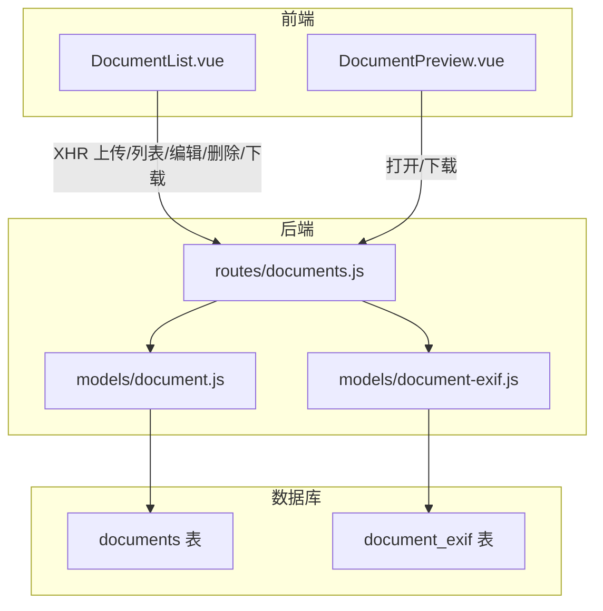
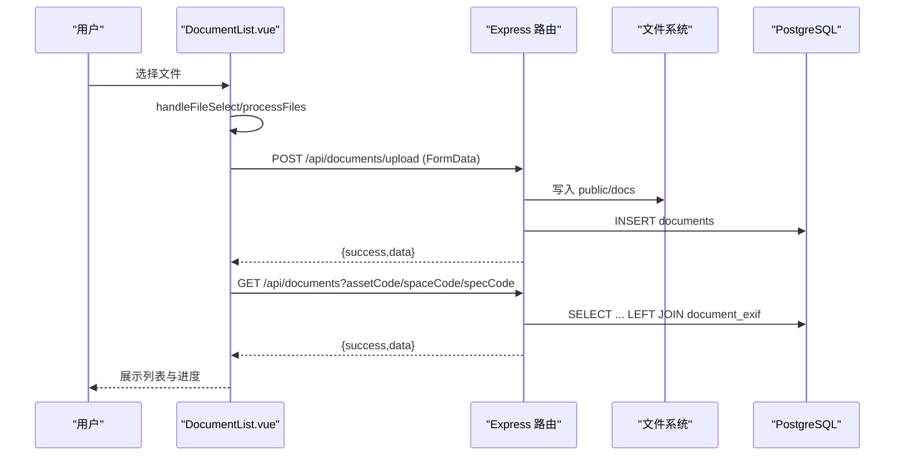
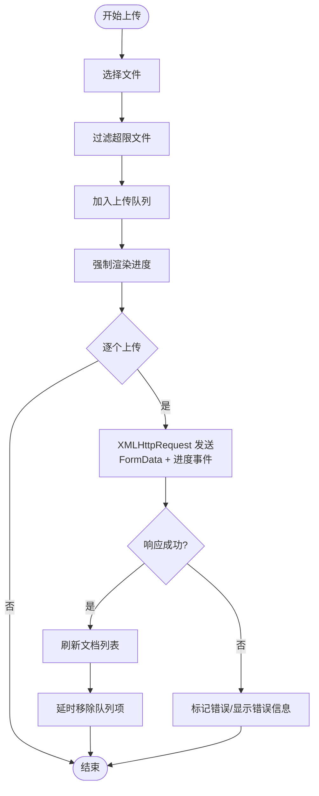
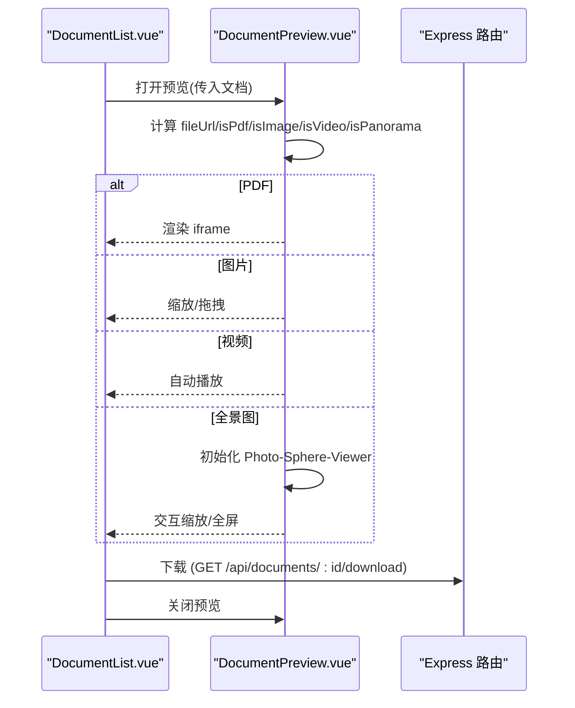
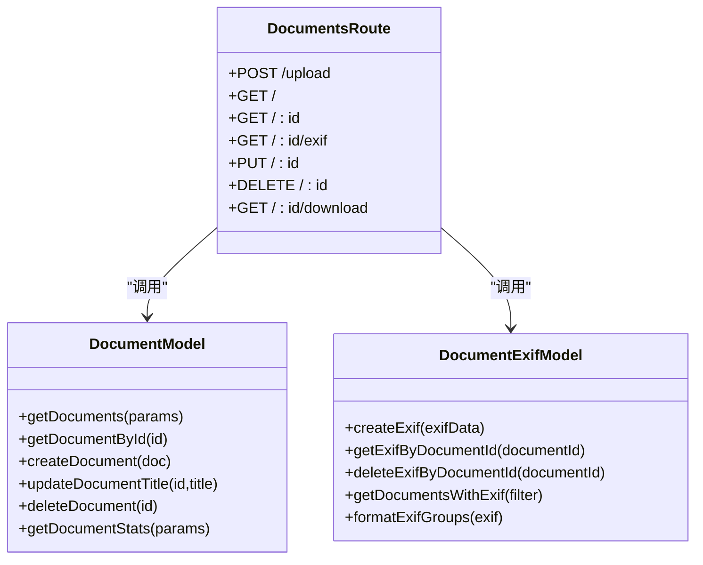
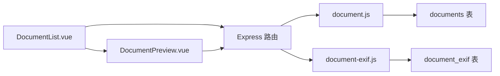

# 文档管理

<cite>
**本文引用的文件**
- [DocumentList.vue](file://src/components/DocumentList.vue)
- [DocumentPreview.vue](file://src/components/DocumentPreview.vue)
- [document.js](file://server/models/document.js)
- [document-exif.js](file://server/models/document-exif.js)
- [documents.js](file://server/routes/documents.js)
- [create_documents_table.sql](file://server/db/create_documents_table.sql)
- [create_document_exif_table.sql](file://server/db/create_document_exif_table.sql)
</cite>

## 目录
1. [简介](#简介)
2. [项目结构](#项目结构)
3. [核心组件](#核心组件)
4. [架构总览](#架构总览)
5. [组件详细分析](#组件详细分析)
6. [依赖关系分析](#依赖关系分析)
7. [性能考量](#性能考量)
8. [故障排查指南](#故障排查指南)
9. [结论](#结论)

## 简介
本文件系统性解析“文档管理”功能的完整生命周期，覆盖上传、列表展示、预览、下载与删除。重点说明前端组件 DocumentList.vue 如何通过 handleFileSelect 与 uploadFile 实现多文件上传与进度跟踪，并基于 FormData 与 XMLHttpRequest 与后端 API 交互；文档列表渲染逻辑（文件图标按类型动态生成、文件大小格式化）；DocumentPreview 组件的预览能力；以及 downloadDocument 与 confirmDelete 的实现细节。最后阐明通过 props（assetCode、spaceCode、specCode）实现文档与资产、空间、规格的关联查询。

## 项目结构
文档管理由前端 Vue 组件与后端 Express 路由/模型共同构成：
- 前端组件
  - DocumentList.vue：负责上传、列表、编辑标题、删除、下载、预览入口
  - DocumentPreview.vue：负责 PDF/图片/视频/全景图的预览与交互
- 后端路由与模型
  - server/routes/documents.js：提供上传、列表、详情、EXIF、更新标题、删除、下载等接口
  - server/models/document.js：封装文档数据访问（查询、创建、更新、删除）
  - server/models/document-exif.js：封装 EXIF 元数据的增删查与分组格式化
- 数据库表
  - documents：存储文档元数据与关联字段
  - document_exif：存储图像 EXIF 元数据（与文档一对一）

图表来源
- [DocumentList.vue](file://src/components/DocumentList.vue#L157-L554)
- [DocumentPreview.vue](file://src/components/DocumentPreview.vue#L1-L120)
- [documents.js](file://server/routes/documents.js#L1-L386)
- [document.js](file://server/models/document.js#L1-L163)
- [document-exif.js](file://server/models/document-exif.js#L1-L169)
- [create_documents_table.sql](file://server/db/create_documents_table.sql#L1-L49)
- [create_document_exif_table.sql](file://server/db/create_document_exif_table.sql#L1-L48)

章节来源
- [DocumentList.vue](file://src/components/DocumentList.vue#L1-L156)
- [DocumentPreview.vue](file://src/components/DocumentPreview.vue#L1-L120)
- [documents.js](file://server/routes/documents.js#L1-L120)

## 核心组件
- DocumentList.vue
  - 上传：handleFileSelect 接收多文件，processFiles 过滤与入队，uploadFile 使用 FormData + XMLHttpRequest 发送，带进度事件与错误处理
  - 列表：watch 监听 relatedCode（assetCode/spaceCode/specCode 三者之一），调用 loadDocuments 通过 API 获取文档列表
  - 预览：openPreview 打开 DocumentPreview，传递当前文档
  - 编辑标题：双击进入编辑模式，saveTitle 调用 PUT /api/documents/:id 更新标题
  - 删除：confirmDelete 调用 DELETE /api/documents/:id，成功后刷新列表
  - 下载：downloadDocument 调用 GET /api/documents/:id/download
  - 渲染：getFileIcon 动态生成图标（PDF/图片/视频/全景图），formatFileSize/formatDate 格式化显示
- DocumentPreview.vue
  - 预览类型：PDF（iframe）、图片（缩放/拖拽）、视频（自动播放）、全景图（Photo-Sphere-Viewer）
  - 交互：缩放、拖拽、键盘控制、全景图缩放/全屏、下载、关闭
  - 生命周期：watch(visible) 初始化/销毁资源，自动播放视频

章节来源
- [DocumentList.vue](file://src/components/DocumentList.vue#L157-L554)
- [DocumentPreview.vue](file://src/components/DocumentPreview.vue#L1-L370)

## 架构总览
从前端到后端的数据流如下：
- 上传：DocumentList.vue -> XMLHttpRequest -> /api/documents/upload -> multer -> 文件落盘 + 写入 documents 表 -> 可选提取 EXIF -> 返回结果
- 列表：DocumentList.vue -> fetch -> /api/documents?assetCode/spaceCode/specCode -> models/document-exif.getDocumentsWithExif -> documents LEFT JOIN document_exif -> 返回带 EXIF 的文档列表
- 预览：DocumentPreview.vue -> 计算 fileUrl -> 根据类型渲染 PDF/图片/视频/全景图
- 下载：DocumentPreview.vue -> window.open(GET /api/documents/:id/download)
- 删除：DocumentList.vue -> DELETE /api/documents/:id -> 删除数据库记录 + 物理文件

图表来源
- [DocumentList.vue](file://src/components/DocumentList.vue#L298-L436)
- [documents.js](file://server/routes/documents.js#L146-L215)
- [document-exif.js](file://server/models/document-exif.js#L95-L128)
- [create_documents_table.sql](file://server/db/create_documents_table.sql#L1-L49)

## 组件详细分析

### DocumentList.vue：上传、列表、预览、下载、删除与格式化
- 上传流程
  - 触发与选择：triggerFileInput -> input[type=file] -> handleFileSelect
  - 多文件处理：processFiles 过滤超限文件，批量入队 uploadQueue，nextTick 强制渲染后逐个 uploadFile
  - 传输细节：uploadFile 使用 FormData，附带 assetCode/spaceCode/specCode 三选一；注册 progress/load/error/abort 事件；成功后刷新列表并延时移除队列项
  - 取消上传：cancelUpload 通过 Map 存储的 XHR abort
- 列表加载
  - relatedCode 计算：任一 props 非空即视为有效关联
  - loadDocuments：拼接查询参数，GET /api/documents?assetCode/spaceCode/specCode，返回带 EXIF 的文档数组
- 预览与交互
  - openPreview/closePreview 控制 DocumentPreview
  - 双击标题进入编辑模式，saveTitle PUT /api/documents/:id 更新标题
  - confirmDelete DELETE /api/documents/:id，成功后刷新
  - downloadDocument GET /api/documents/:id/download
- 渲染与格式化
  - getFileIcon：根据 file_type 与图片宽高比识别全景图，输出对应 SVG 图标
  - formatFileSize：将字节转为 B/KB/MB/GB
  - formatDate：今日/昨日/几天前/本地日期

图表来源
- [DocumentList.vue](file://src/components/DocumentList.vue#L298-L436)

章节来源
- [DocumentList.vue](file://src/components/DocumentList.vue#L157-L554)

### DocumentPreview.vue：预览与交互
- 类型判定：PDF、图片（含全景图）、视频、不支持格式
- 全景图：Photo-Sphere-Viewer 初始化与销毁，支持缩放、全屏、入场动画
- 图片交互：缩放（滚轮/键盘 +/-/0）、拖拽平移、鼠标事件
- 视频：自动播放（受浏览器策略影响），禁用下载控件
- 下载与关闭：统一通过 API 路径与事件发射

图表来源
- [DocumentPreview.vue](file://src/components/DocumentPreview.vue#L1-L370)
- [documents.js](file://server/routes/documents.js#L355-L383)

章节来源
- [DocumentPreview.vue](file://src/components/DocumentPreview.vue#L1-L370)

### 后端 API 与数据模型
- 路由
  - POST /api/documents/upload：单文件上传，校验类型/大小/关联字段，写入 documents，必要时提取 EXIF 并写入 document_exif
  - GET /api/documents：按 assetCode/spaceCode/specCode 查询，返回带 EXIF 的文档列表
  - GET /api/documents/:id：获取文档详情
  - GET /api/documents/:id/exif：获取 EXIF 并分组格式化
  - PUT /api/documents/:id：更新标题
  - DELETE /api/documents/:id：删除记录并删除物理文件
  - GET /api/documents/:id/download：下载文件
- 模型
  - document.js：getDocuments/getDocumentById/createDocument/updateDocumentTitle/deleteDocument/getDocumentStats
  - document-exif.js：createExif/getExifByDocumentId/deleteExifByDocumentId/getDocumentsWithExif/formatExifGroups
- 数据库表
  - documents：包含标题、文件名、路径、大小、类型、MIME、关联字段（三选一）、时间戳
  - document_exif：与 documents 一对一，存储 EXIF 字段（时间、尺寸、相机、GPS）

图表来源
- [documents.js](file://server/routes/documents.js#L1-L386)
- [document.js](file://server/models/document.js#L1-L163)
- [document-exif.js](file://server/models/document-exif.js#L1-L169)

章节来源
- [documents.js](file://server/routes/documents.js#L1-L386)
- [document.js](file://server/models/document.js#L1-L163)
- [document-exif.js](file://server/models/document-exif.js#L1-L169)
- [create_documents_table.sql](file://server/db/create_documents_table.sql#L1-L49)
- [create_document_exif_table.sql](file://server/db/create_document_exif_table.sql#L1-L48)

## 依赖关系分析
- 前端组件耦合
  - DocumentList.vue 依赖 DocumentPreview.vue（作为子组件）
  - 两者均依赖后端 API（通过 fetch/XMLHttpRequest）
- 后端模块耦合
  - routes/documents.js 依赖 models/document.js 与 models/document-exif.js
  - models/document-exif.js 依赖 db 查询封装
- 数据库约束
  - documents 表通过 CHECK 约束确保三选一关联字段
  - document_exif 与 documents 通过外键级联删除

图表来源
- [DocumentList.vue](file://src/components/DocumentList.vue#L1-L156)
- [DocumentPreview.vue](file://src/components/DocumentPreview.vue#L1-L120)
- [documents.js](file://server/routes/documents.js#L1-L120)
- [document.js](file://server/models/document.js#L1-L80)
- [document-exif.js](file://server/models/document-exif.js#L1-L95)
- [create_documents_table.sql](file://server/db/create_documents_table.sql#L1-L49)
- [create_document_exif_table.sql](file://server/db/create_document_exif_table.sql#L1-L48)

章节来源
- [DocumentList.vue](file://src/components/DocumentList.vue#L1-L156)
- [DocumentPreview.vue](file://src/components/DocumentPreview.vue#L1-L120)
- [documents.js](file://server/routes/documents.js#L1-L120)
- [document.js](file://server/models/document.js#L1-L80)
- [document-exif.js](file://server/models/document-exif.js#L1-L95)

## 性能考量
- 上传并发与 UI 响应
  - 使用 nextTick 强制渲染上传队列，确保进度条即时可见
  - 单文件上传采用 XHR，避免大体积文件阻塞主线程
- 列表查询
  - documents 表对关联字段与 created_at 建有索引，提升按资产/空间/规格查询与排序性能
- 预览优化
  - PDF 使用 iframe，图片缩放与拖拽在前端完成，减少后端压力
  - 全景图初始化在可见时进行，卸载时销毁实例，避免内存泄漏
- 文件大小与类型
  - 前端与后端均限制最大 200MB，避免异常占用磁盘与带宽

[本节为通用建议，无需列出具体文件来源]

## 故障排查指南
- 上传失败
  - 检查文件类型是否在允许列表（PDF/JPG/PNG/SVG/MP4）
  - 确认关联字段（assetCode/spaceCode/specCode）至少提供一个
  - 查看后端日志与响应错误信息
- 列表为空
  - 确认 props 中的关联字段与数据库中实际存在的编码一致
  - 检查 documents 表索引是否生效
- 预览异常
  - PDF：确认 fileUrl 是否正确，浏览器是否支持内嵌 PDF
  - 图片/视频：检查文件路径与权限
  - 全景图：确认图片宽高比接近 2:1，且 Photo-Sphere-Viewer 已初始化
- 下载失败
  - 确认文件在 public 目录下存在，文件名编码问题（后端已做 Latin1 -> UTF-8 转换）
- 删除失败
  - 确认物理文件删除成功（若失败，数据库记录仍会被删除）

章节来源
- [documents.js](file://server/routes/documents.js#L146-L215)
- [documents.js](file://server/routes/documents.js#L355-L383)
- [DocumentList.vue](file://src/components/DocumentList.vue#L438-L554)
- [DocumentPreview.vue](file://src/components/DocumentPreview.vue#L288-L370)

## 结论
文档管理功能通过前端组件与后端路由/模型的清晰分工，实现了完整的生命周期闭环：多文件上传（含进度与取消）、列表渲染（图标与格式化）、预览（PDF/图片/视频/全景图）、下载与删除。通过 props 的三选一关联字段，系统能够灵活地将文档与资产、空间、规格绑定，满足工程场景下的文档组织需求。后端采用 EXIF 提取与分组展示，进一步增强图片类文档的信息价值。整体架构具备良好的扩展性与可维护性。