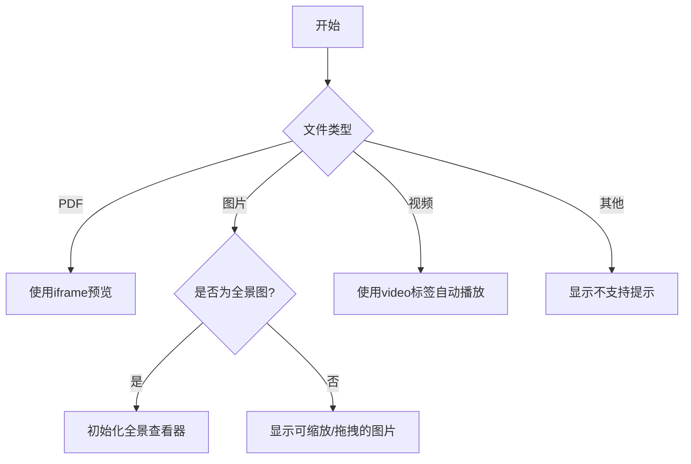
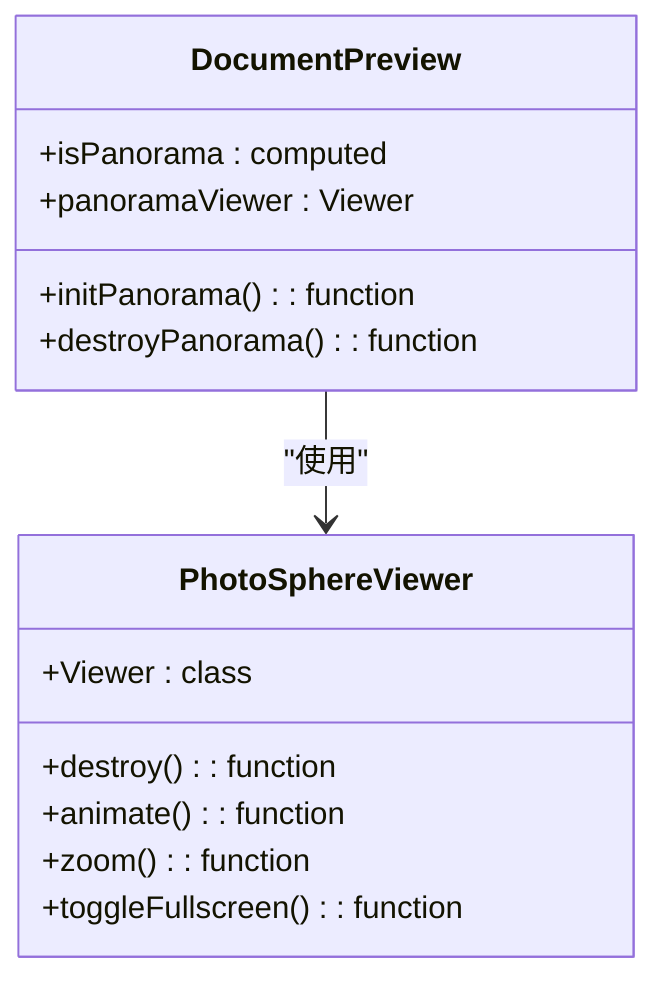
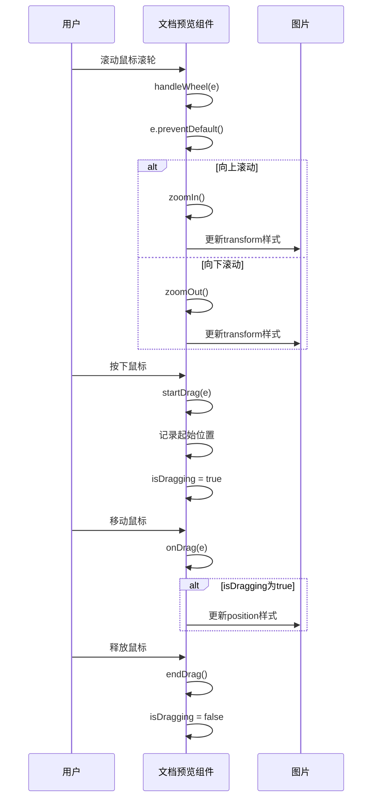

# 文档预览

<cite>
**本文档引用的文件**   
- [DocumentPreview.vue](file://src/components/DocumentPreview.vue)
- [DocumentList.vue](file://src/components/DocumentList.vue)
- [package.json](file://package.json)
</cite>

## 目录
1. [简介](#简介)
2. [核心组件分析](#核心组件分析)
3. [文件类型支持与预览实现](#文件类型支持与预览实现)
4. [全景图识别与初始化](#全景图识别与初始化)
5. [图片交互功能实现](#图片交互功能实现)
6. [用户界面与交互](#用户界面与交互)
7. [资源管理与生命周期](#资源管理与生命周期)

## 简介
本文档深入解析`DocumentPreview.vue`组件的实现，该组件为系统提供了一个功能丰富的文档预览弹窗。它支持多种文件格式的预览，包括PDF、普通图片、视频和360°全景图。组件通过`Teleport`将预览弹窗渲染到`body`标签下，确保其能覆盖整个页面。预览功能根据文件类型动态切换，并为不同类型的文件提供了相应的交互控制，如图片的缩放与拖拽、全景图的自定义控制以及视频的自动播放。此外，组件还实现了键盘快捷键和动画效果，提升了用户体验。

## 核心组件分析

`DocumentPreview.vue`是实现文档预览功能的核心组件。它通过`visible`属性控制弹窗的显示与隐藏，并通过`document`属性接收待预览的文档对象。组件利用Vue 3的`<script setup>`语法，结合`ref`和`computed`等响应式API，管理内部状态和计算属性。其主要职责是根据文档的文件类型，渲染相应的预览内容，并提供一套统一的用户交互界面。

**Section sources**
- [DocumentPreview.vue](file://src/components/DocumentPreview.vue#L1-L676)

## 文件类型支持与预览实现

`DocumentPreview.vue`组件通过计算属性精确判断文件类型，并据此渲染不同的预览内容。

**Diagram sources**
- [DocumentPreview.vue](file://src/components/DocumentPreview.vue#L57-L126)

### PDF预览
对于PDF文件，组件通过`isPdf`计算属性进行判断，并使用`<iframe>`标签直接嵌入PDF文件进行预览。`iframe`的`src`属性由`fileUrl`计算属性提供，该属性拼接了API基础地址和文档的文件路径。

### 图片预览
对于普通图片，组件通过`isImage`计算属性判断，并在`image-wrapper`容器中显示。图片的缩放和位置通过`imageStyle`计算属性动态生成CSS的`transform`样式来实现。

### 视频预览
对于视频文件，组件通过`isVideo`计算属性判断，并使用`<video>`标签进行播放。视频设置为`autoplay`（自动播放）和`controls`（显示控制条），并禁用了下载功能。

**Section sources**
- [DocumentPreview.vue](file://src/components/DocumentPreview.vue#L57-L126)

## 全景图识别与初始化

组件通过`isPanorama`计算属性来智能识别360°全景图。

**Diagram sources**
- [DocumentPreview.vue](file://src/components/DocumentPreview.vue#L173-L285)
- [package.json](file://package.json#L12)

### 全景图识别
`isPanorama`计算属性的逻辑如下：
1.  首先检查文件类型是否为`jpg`、`jpeg`或`png`。
2.  然后获取文档对象中的`image_width`和`image_height`。
3.  计算长宽比（`width / height`）。
4.  如果长宽比在1.9到2.1之间（包含），则判定为全景图。

此逻辑在`DocumentList.vue`中也有复用，用于在列表中显示特殊的全景图图标。

### 全景图初始化
当`visible`属性变为`true`且`isPanorama`为`true`时，`watch`监听器会调用`initPanorama`函数。该函数使用`@photo-sphere-viewer/core`库创建一个全景查看器实例：
-   **容器**: 指向`panoramaRef`，即模板中的`div.panorama-viewer`。
-   **全景图源**: 使用`fileUrl.value`，即文档的文件URL。
-   **配置**: 设置默认缩放级别、视野范围（FOV）、禁用默认导航栏等。
-   **入场动画**: 在全景图加载完成后，通过`animate`方法执行一个缩放和旋转的动画，提升用户体验。

**Section sources**
- [DocumentPreview.vue](file://src/components/DocumentPreview.vue#L173-L256)

## 图片交互功能实现

组件为普通图片预览实现了丰富的交互功能，包括鼠标滚轮缩放、鼠标拖拽平移和重置。

**Diagram sources**
- [DocumentPreview.vue](file://src/components/DocumentPreview.vue#L307-L351)

### 缩放功能
-   **`zoomIn`**: 将当前缩放比例乘以1.25，但不超过最大值4。
-   **`zoomOut`**: 将当前缩放比例除以1.25，但不低于最小值0.25。
-   **`resetZoom`**: 将缩放比例和图片位置重置为初始状态。

### 拖拽平移
-   **`startDrag`**: 记录鼠标按下时的坐标和当前图片位置，设置`isDragging`为`true`。
-   **`onDrag`**: 当`isDragging`为`true`时，根据鼠标移动的距离更新图片的`x`和`y`位置。
-   **`endDrag`**: 将`isDragging`设置为`false`，结束拖拽。

**Section sources**
- [DocumentPreview.vue](file://src/components/DocumentPreview.vue#L307-L351)

## 用户界面与交互

组件提供了直观的用户界面和多种交互方式。

### 预览弹窗动画
预览弹窗的出现和消失都带有动画效果：
-   **淡入**: `.preview-overlay`使用`fadeIn`动画，从`opacity: 0`过渡到`opacity: 1`。
-   **缩放**: `.preview-container`使用`scaleIn`动画，从`transform: scale(0.95)`和`opacity: 0`过渡到`transform: scale(1)`和`opacity: 1`。

### 键盘快捷键
组件通过`handleKeydown`函数监听键盘事件，支持以下快捷键：
-   **ESC**: 关闭预览弹窗。
-   **+ 或 =**: 放大图片。
-   **-**: 缩小图片。
-   **0**: 重置图片的缩放和位置。

### 自定义控制按钮
对于全景图，组件提供了自定义的控制按钮，包括放大、缩小和全屏，这些按钮位于预览区域的右上角，提供了比默认控件更简洁的用户体验。

**Section sources**
- [DocumentPreview.vue](file://src/components/DocumentPreview.vue#L293-L304)
- [DocumentPreview.vue](file://src/components/DocumentPreview.vue#L372-L404)

## 资源管理与生命周期

组件严格管理其生命周期和外部资源，确保应用的稳定性和性能。

### Teleport的使用
组件使用`<Teleport to="body">`将预览弹窗的DOM结构直接插入到页面的`body`标签下。这样做的主要目的是：
1.  **层级控制**: 确保预览弹窗的`z-index`能正确地覆盖页面上的所有其他元素，避免被其他组件遮挡。
2.  **样式隔离**: 避免父组件的`overflow: hidden`等CSS属性影响弹窗的显示。

### 资源清理
组件在卸载时会执行清理操作，防止内存泄漏：
-   **`onUnmounted`**: Vue的生命周期钩子，在组件实例被卸载后调用。
-   **`destroyPanorama`**: 该函数会调用`panoramaViewer.destroy()`方法，安全地销毁`@photo-sphere-viewer/core`创建的全景查看器实例，并将`panoramaViewer`引用置为`null`。

**Section sources**
- [DocumentPreview.vue](file://src/components/DocumentPreview.vue#L287-L290)
- [DocumentPreview.vue](file://src/components/DocumentPreview.vue#L279-L285)