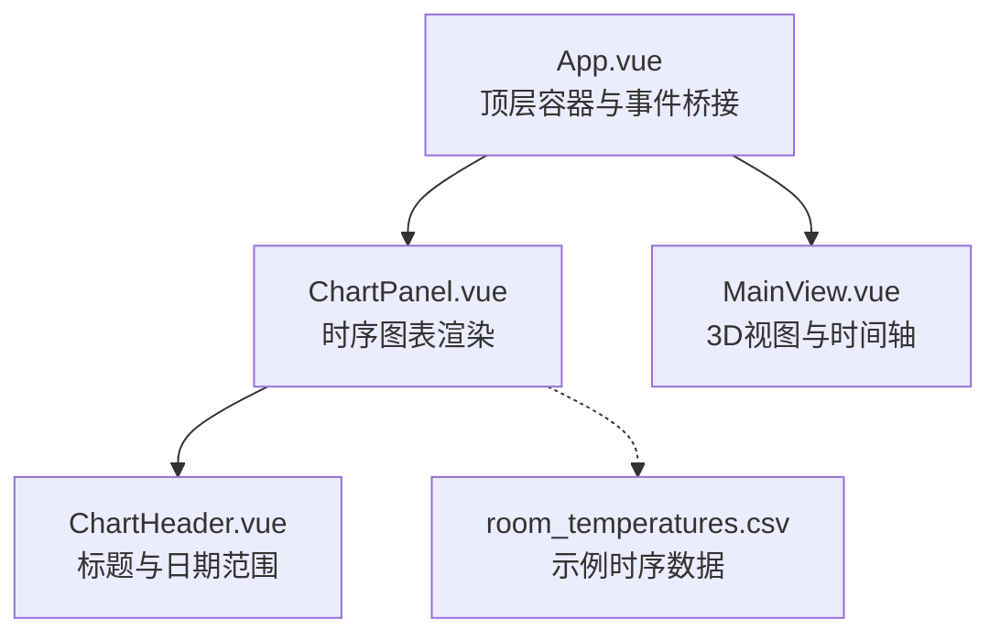
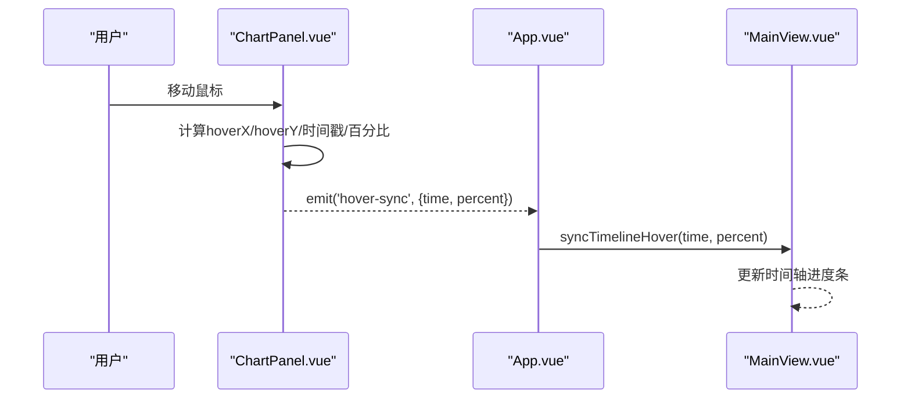
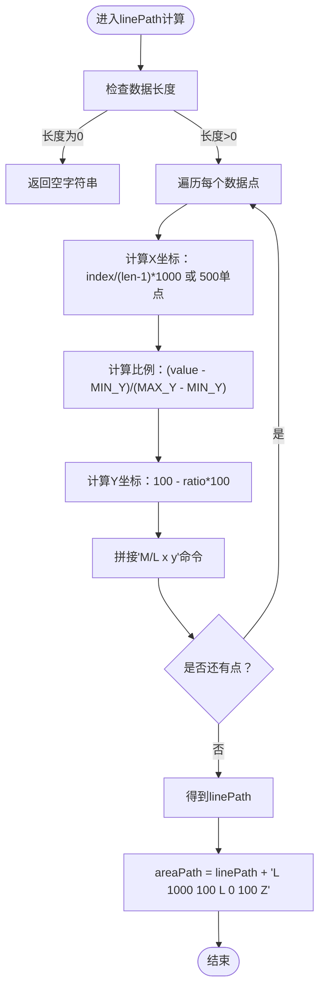
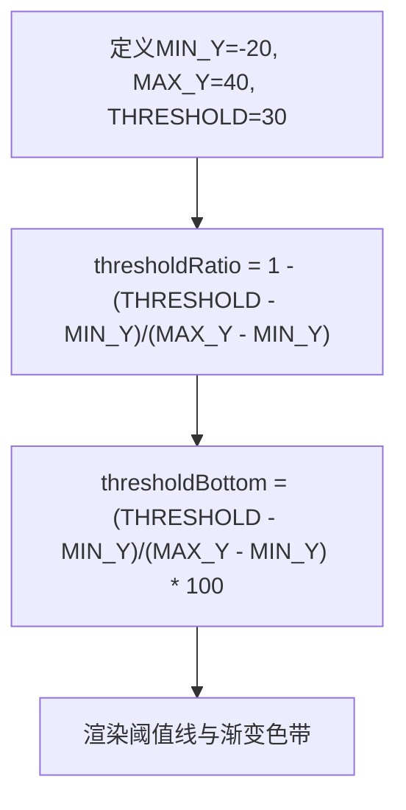
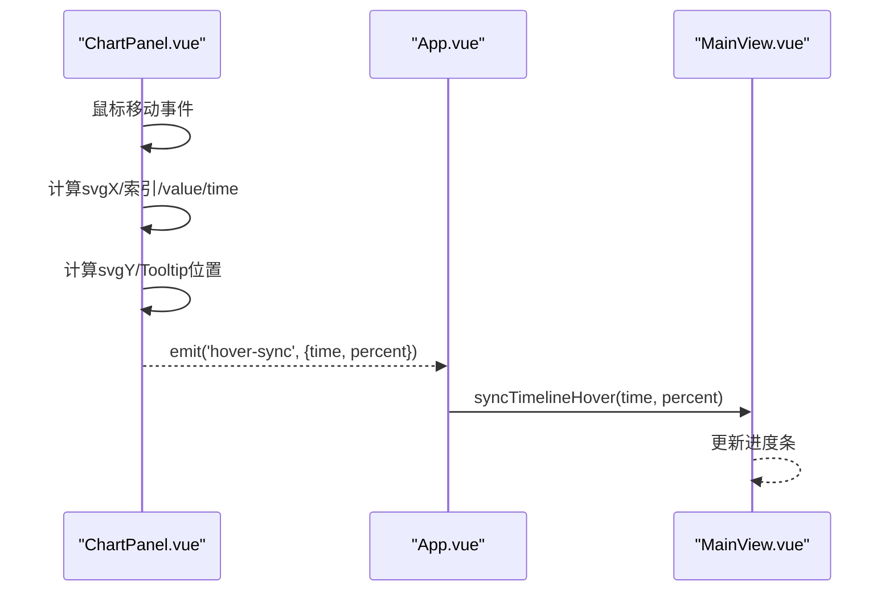
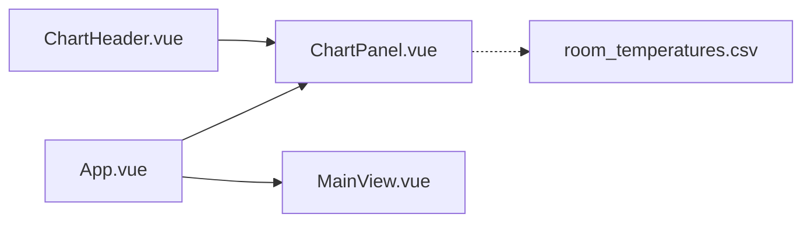

# 图表可视化

<cite>
**本文引用的文件**
- [ChartPanel.vue](file://src/components/ChartPanel.vue)
- [App.vue](file://src/App.vue)
- [MainView.vue](file://src/components/MainView.vue)
- [ChartHeader.vue](file://src/components/ChartHeader.vue)
- [room_temperatures.csv](file://public/data/room_temperatures.csv)
</cite>

## 目录
1. [引言](#引言)
2. [项目结构](#项目结构)
3. [核心组件](#核心组件)
4. [架构总览](#架构总览)
5. [详细组件分析](#详细组件分析)
6. [依赖关系分析](#依赖关系分析)
7. [性能考量](#性能考量)
8. [故障排查指南](#故障排查指南)
9. [结论](#结论)

## 引言
本文件面向“ChartPanel.vue”组件的实现进行系统化解读，聚焦于如何将时序温度数据转换为可交互的SVG折线图与面积图，并解释以下关键点：
- SVG路径（linePath与areaPath）的生成逻辑与坐标映射
- Y轴范围（-20°C 至 40°C）的设计原理与CSS样式实现
- 交互功能（onMouseMove）如何计算鼠标悬停位置对应的数据点，并通过emit('hover-sync')将时间信息同步到3D模型
- thresholdRatio与thresholdBottom计算属性如何实现30°C高温预警线的动态定位

## 项目结构
ChartPanel.vue位于src/components目录，负责渲染底部图表面板；App.vue作为顶层容器，负责接收来自3D视图的时间范围变化并驱动图表数据刷新；MainView.vue提供时间轴与悬停同步能力；ChartHeader.vue提供图表标题与日期范围展示。

图表来源
- [ChartPanel.vue](file://src/components/ChartPanel.vue#L1-L98)
- [App.vue](file://src/App.vue#L63-L82)
- [MainView.vue](file://src/components/MainView.vue#L2430-L2436)
- [ChartHeader.vue](file://src/components/ChartHeader.vue#L1-L46)
- [room_temperatures.csv](file://public/data/room_temperatures.csv#L1-L20)

章节来源
- [ChartPanel.vue](file://src/components/ChartPanel.vue#L1-L98)
- [App.vue](file://src/App.vue#L63-L82)

## 核心组件
- ChartPanel.vue：负责渲染Y轴标签、静态网格线、阈值线、SVG曲线（折线与填充）、悬浮交互与Tooltip、X轴刻度标签与图例。
- App.vue：监听MainView的时间范围变化，拉取房间系列数据并传递给ChartPanel；接收ChartPanel发出的hover-sync事件，调用MainView.syncTimelineHover进行同步。
- MainView.vue：提供syncTimelineHover方法，将传入的时间戳或百分比映射到时间轴进度条。
- ChartHeader.vue：展示图表标题与日期范围文本。

章节来源
- [ChartPanel.vue](file://src/components/ChartPanel.vue#L1-L98)
- [App.vue](file://src/App.vue#L1263-L1267)
- [MainView.vue](file://src/components/MainView.vue#L2430-L2436)
- [ChartHeader.vue](file://src/components/ChartHeader.vue#L1-L46)

## 架构总览
ChartPanel与App之间通过props与emit建立松耦合：App负责数据与时间范围，ChartPanel负责可视化与交互；两者通过hover-sync事件实现双向联动，使3D视图的时间轴与图表悬停位置保持一致。

图表来源
- [ChartPanel.vue](file://src/components/ChartPanel.vue#L190-L216)
- [App.vue](file://src/App.vue#L1263-L1267)
- [MainView.vue](file://src/components/MainView.vue#L2430-L2436)

## 详细组件分析

### SVG路径生成：linePath与areaPath
- linePath计算逻辑
  - X坐标：等间距分布在0到1000单位之间，当数据长度为1时采用固定中心位置，避免NaN。
  - Y坐标：基于温度值在[-20, 40]范围内线性映射到SVG坐标系的垂直方向（100为底部，0为顶部），并保留一位小数。
  - 返回值：由多个“M/L x y”组成的路径字符串，供SVG path使用。
- areaPath计算逻辑
  - 在linePath基础上，闭合路径至右下角与左下角，形成从折线到底部的填充区域。

图表来源
- [ChartPanel.vue](file://src/components/ChartPanel.vue#L135-L151)

章节来源
- [ChartPanel.vue](file://src/components/ChartPanel.vue#L135-L151)

### Y轴范围与阈值线设计
- Y轴范围：MIN_Y=-20，MAX_Y=40，对应SVG坐标系的垂直方向（100为底部，0为顶部）。
- 阈值线：THRESHOLD=30，thresholdRatio与thresholdBottom分别表示阈值在线性坐标系中的偏移比例与百分比位置，用于定位30°C的水平线与渐变色带分界。
- 网格线与Y轴标签：静态网格线与Y轴标签通过内联样式bottom百分比实现，覆盖-20°C到40°C的整数刻度。

图表来源
- [ChartPanel.vue](file://src/components/ChartPanel.vue#L117-L134)
- [ChartPanel.vue](file://src/components/ChartPanel.vue#L35-L69)

章节来源
- [ChartPanel.vue](file://src/components/ChartPanel.vue#L117-L134)
- [ChartPanel.vue](file://src/components/ChartPanel.vue#L35-L69)

### 交互与悬停同步：onMouseMove
- 鼠标事件处理
  - 计算鼠标在图表容器内的相对位置，映射到SVG坐标系的X（0-1000）。
  - 通过百分比与数据长度推导最近的数据索引，读取该点的温度值与时间戳。
  - 计算悬停点在SVG中的Y坐标与Tooltip的像素位置。
  - 发出hover-sync事件，携带时间戳与百分比。
- 3D模型同步
  - App.vue接收事件后调用MainView.syncTimelineHover，将时间戳或百分比映射到时间轴进度条。

图表来源
- [ChartPanel.vue](file://src/components/ChartPanel.vue#L190-L216)
- [App.vue](file://src/App.vue#L1263-L1267)
- [MainView.vue](file://src/components/MainView.vue#L2430-L2436)

章节来源
- [ChartPanel.vue](file://src/components/ChartPanel.vue#L190-L216)
- [App.vue](file://src/App.vue#L1263-L1267)
- [MainView.vue](file://src/components/MainView.vue#L2430-L2436)

### 高温预警标记与图例
- overSegments：遍历相邻两点，若从低于30°C跨越到等于或高于30°C，记录转折点索引，用于在曲线上方绘制红色圆点标记。
- overCount：统计超过阈值的段落数量，用于图例文案。
- 图例：包含“高于30°C计数”与“正常”两部分，颜色区分。

章节来源
- [ChartPanel.vue](file://src/components/ChartPanel.vue#L153-L162)
- [ChartPanel.vue](file://src/components/ChartPanel.vue#L84-L96)

### X轴标签与时间范围
- xLabels：在7个均匀分布的位置抽取时间标签，格式为“时:分”，用于底部时间轴刻度。
- ChartHeader：根据range或数据首尾时间生成日期范围文本。

章节来源
- [ChartPanel.vue](file://src/components/ChartPanel.vue#L178-L188)
- [ChartHeader.vue](file://src/components/ChartHeader.vue#L1-L46)

### 数据来源与示例
- 示例CSV文件包含时间戳列与多个房间温度列，ChartPanel接收的data数组应为[{timestamp, value}, ...]格式，其中value为温度数值。

章节来源
- [room_temperatures.csv](file://public/data/room_temperatures.csv#L1-L20)

## 依赖关系分析
- 组件依赖
  - ChartPanel依赖ChartHeader进行标题与日期范围展示。
  - App作为父组件，向下传递data与range，并监听hover-sync事件。
  - MainView提供syncTimelineHover方法，被App调用以同步时间轴。
- 外部依赖
  - SVG坐标系与渐变色带用于视觉表达温度区间与阈值。
  - CSS样式控制图表容器、Y轴标签、网格线、阈值线、Tooltip与图例。

图表来源
- [ChartPanel.vue](file://src/components/ChartPanel.vue#L1-L98)
- [App.vue](file://src/App.vue#L63-L82)
- [MainView.vue](file://src/components/MainView.vue#L2430-L2436)
- [ChartHeader.vue](file://src/components/ChartHeader.vue#L1-L46)
- [room_temperatures.csv](file://public/data/room_temperatures.csv#L1-L20)

章节来源
- [ChartPanel.vue](file://src/components/ChartPanel.vue#L1-L98)
- [App.vue](file://src/App.vue#L63-L82)
- [MainView.vue](file://src/components/MainView.vue#L2430-L2436)
- [ChartHeader.vue](file://src/components/ChartHeader.vue#L1-L46)
- [room_temperatures.csv](file://public/data/room_temperatures.csv#L1-L20)

## 性能考量
- SVG路径计算复杂度：O(n)，n为数据点数量，适合中等规模时序数据。
- 事件处理：mousemove事件在交互层上绑定，建议在高频交互场景中考虑节流/防抖策略（当前实现未显式节流）。
- 渐变与填充：使用SVG线性渐变，渲染开销较低；阈值标记为少量圆形元素，对性能影响有限。
- 建议优化
  - 对大数据集可考虑采样或滑动窗口，减少渲染节点数量。
  - Tooltip与阈值标记的DOM更新频率较高，可在必要时合并更新。

## 故障排查指南
- 悬停无响应
  - 检查ChartPanel是否正确接收displayData且非空。
  - 确认App.vue是否监听到hover-sync事件并调用MainView.syncTimelineHover。
- 阈值线位置异常
  - 检查MIN_Y、MAX_Y、THRESHOLD是否与业务一致。
  - 确认thresholdRatio与thresholdBottom计算结果符合预期。
- Tooltip位置偏差
  - 检查chartRef尺寸与getBoundingClientRect返回值，确保clientWidth/clientHeight有效。
  - 确认tooltipLeft/tooltipTop计算逻辑与容器定位一致。
- 图例计数不符
  - 检查overSegments算法是否正确识别跨阈值转折点。

章节来源
- [ChartPanel.vue](file://src/components/ChartPanel.vue#L132-L162)
- [ChartPanel.vue](file://src/components/ChartPanel.vue#L190-L226)
- [App.vue](file://src/App.vue#L1263-L1267)
- [MainView.vue](file://src/components/MainView.vue#L2430-L2436)

## 结论
ChartPanel通过清晰的SVG坐标映射与阈值计算，实现了直观的温度时序可视化；结合App与MainView的事件桥接，实现了图表悬停与3D时间轴的联动。Y轴范围与网格线设计兼顾可读性与一致性，交互层提供良好的用户体验。后续可在大数据场景下引入采样与节流策略，进一步提升性能与流畅度。