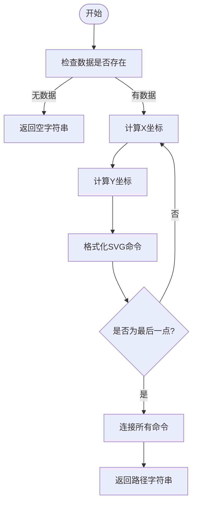
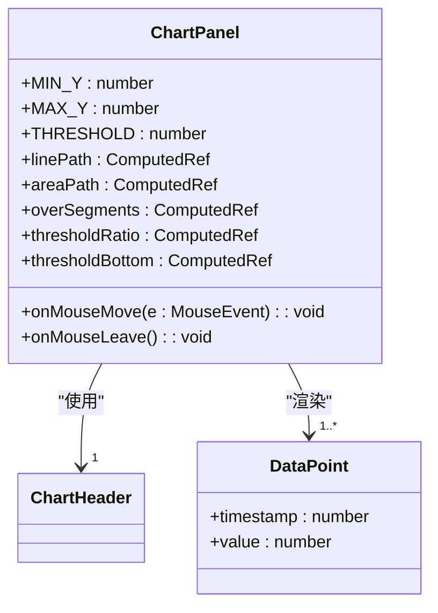
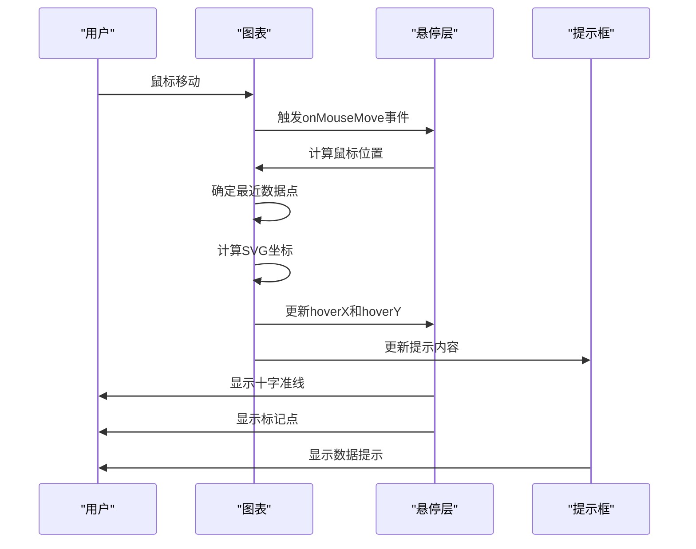
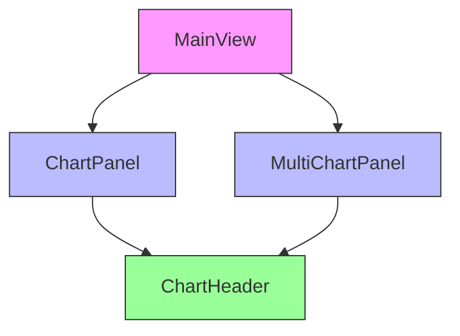
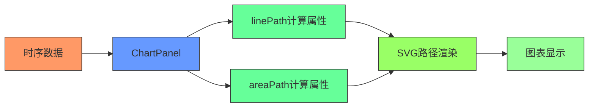

# 图表渲染机制

<cite>
**本文档引用的文件**   
- [ChartPanel.vue](file://src/components/ChartPanel.vue)
- [MainView.vue](file://src/components/MainView.vue)
- [MultiChartPanel.vue](file://src/components/MultiChartPanel.vue)
- [ChartHeader.vue](file://src/components/ChartHeader.vue)
</cite>

## 目录
1. [引言](#引言)
2. [核心坐标转换机制](#核心坐标转换机制)
3. [SVG路径生成逻辑](#svg路径生成逻辑)
4. [边界情况处理](#边界情况处理)
5. [响应式设计实现](#响应式设计实现)
6. [图表组件架构](#图表组件架构)

## 引言
`ChartPanel.vue` 组件实现了基于SVG的温度时序数据可视化功能，通过精确的坐标映射算法将原始数据点转换为SVG图形。该组件采用1000x100的viewBox坐标系，支持-20°C至40°C的温度范围显示，并通过`linePath`和`areaPath`计算属性动态生成SVG路径。系统设计了完整的交互机制，包括悬停提示、阈值标记和坐标轴标签，为用户提供直观的数据分析体验。

**Section sources**
- [ChartPanel.vue](file://src/components/ChartPanel.vue#L1-L425)

## 核心坐标转换机制

### 温度范围设计
组件采用`MIN_Y = -20`和`MAX_Y = 40`作为温度坐标系的边界值，形成60°C的完整温度范围。这种设计考虑了建筑环境中的典型温度波动，既包含冬季低温场景，也覆盖夏季高温情况，确保了数据可视化的完整性和实用性。

### Y轴坐标转换
Y轴坐标转换采用线性归一化公式，将实际温度值映射到SVG坐标系的垂直位置：
```
ratio = (value - MIN_Y) / (MAX_Y - MIN_Y)
y = 100 - (ratio * 100)
```
该公式首先将温度值归一化到[0,1]区间，然后转换为SVG坐标系中的像素位置。由于SVG坐标系原点位于左上角，需要通过`100 -`操作实现坐标翻转，使高温值显示在图表上方，低温值显示在下方。

### X轴时间分布
X轴坐标根据数据点在序列中的位置进行均匀分布：
```
x = (index / (length - 1)) * 1000
```
此公式确保所有数据点在1000单位的水平空间内均匀分布，无论数据点数量多少。对于单个数据点的特殊情况，系统将其固定在水平中心位置(x=500)，保证视觉平衡。

**Section sources**
- [ChartPanel.vue](file://src/components/ChartPanel.vue#L118-L145)

## SVG路径生成逻辑

### 路径命令解析
SVG路径使用`M`(MoveTo)和`L`(LineTo)命令构建折线图：
- `M x y`：将画笔移动到指定坐标，作为路径起点
- `L x y`：从当前位置绘制直线到指定坐标

路径字符串由多个命令组合而成，形成连续的折线。每个数据点对应一个命令，首点使用`M`命令，后续点使用`L`命令。

### linePath计算属性
`linePath`计算属性遍历所有数据点，生成SVG路径字符串：


**Diagram sources**
- [ChartPanel.vue](file://src/components/ChartPanel.vue#L135-L146)

### areaPath计算属性
`areaPath`基于`linePath`生成填充区域，通过闭合路径实现：
```
${linePath} L 1000 100 L 0 100 Z
```
该公式在折线路径末尾添加三个命令：
- `L 1000 100`：从最后一个数据点连接到右下角
- `L 0 100`：从右下角连接到左下角
- `Z`：闭合路径，回到起点



**Diagram sources**
- [ChartPanel.vue](file://src/components/ChartPanel.vue#L148-L151)

## 边界情况处理

### 单点居中显示
当数据集仅包含单个数据点时，系统采用特殊处理策略：
```
const x = len > 1 ? (index / (len - 1)) * 1000 : 500;
```
此条件判断确保单点被放置在SVG画布的水平中心位置(500)，避免因公式分母为零导致的计算错误，同时保持视觉上的平衡和美观。

### NaN值防护
系统包含完善的数值安全检查机制：
```
const safeX = isNaN(x) ? 0 : x;
const safeY = isNaN(y) ? 50 : y;
```
当坐标计算结果为NaN时，系统提供默认值替代，防止SVG渲染异常。X坐标默认为0(左侧边缘)，Y坐标默认为50(垂直中心)，确保图表在异常情况下仍能正常显示。

### 空数据处理
对于空数据集，计算属性返回空字符串：
```
if (!displayData.value.length) return '';
```
此设计避免了无效的SVG路径生成，同时保持组件的稳定运行。UI层通过条件渲染机制，在无数据时显示适当的提示信息。

**Section sources**
- [ChartPanel.vue](file://src/components/ChartPanel.vue#L136-L145)

## 响应式设计实现

### non-scaling-stroke属性
`vector-effect="non-scaling-stroke"`属性在多个SVG元素中被使用：
```mermaid
erDiagram
SVG_ELEMENT ||--o{ STROKE_PROPERTY : "具有"
STROKE_PROPERTY }|--o{ NON_SCALING_STROKE : "应用"
class SVG_ELEMENT {
path
line
circle
}
class STROKE_PROPERTY {
stroke-width
stroke-dasharray
}
class NON_SCALING_STROKE {
vector-effect: "non-scaling-stroke"
}
```

该属性确保描边宽度在SVG缩放时保持恒定，不随坐标系变换而改变。这对于响应式设计至关重要，保证了在不同屏幕尺寸和缩放级别下，线条和标记的视觉一致性。

### 交互元素实现
悬停交互系统包含十字准线和标记点：


**Diagram sources**
- [ChartPanel.vue](file://src/components/ChartPanel.vue#L64-L68)
- [ChartPanel.vue](file://src/components/ChartPanel.vue#L191-L215)

## 图表组件架构

### 组件依赖关系


主视图组件`MainView.vue`包含图表面板和多图表面板，两者均依赖`ChartHeader.vue`提供统一的头部UI。这种架构实现了组件复用和样式统一。

### 数据流分析


原始温度数据通过props传递到`ChartPanel`，经由计算属性处理后生成SVG路径指令，最终在SVG元素中渲染为可视化图表。

**Section sources**
- [ChartPanel.vue](file://src/components/ChartPanel.vue#L107-L111)
- [MainView.vue](file://src/components/MainView.vue#L496-L506)
- [MultiChartPanel.vue](file://src/components/MultiChartPanel.vue#L111-L118)