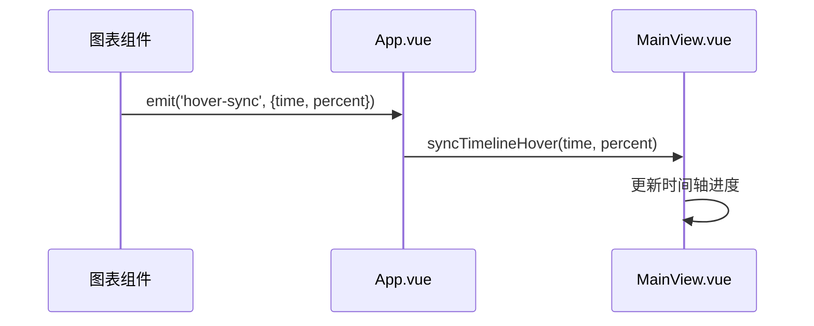

# 用户交互与悬停同步

<cite>
**本文档引用的文件**   
- [ChartPanel.vue](file://src/components/ChartPanel.vue)
- [MultiChartPanel.vue](file://src/components/MultiChartPanel.vue)
- [App.vue](file://src/App.vue)
- [MainView.vue](file://src/components/MainView.vue)
</cite>

## 目录
1. [用户交互与悬停同步](#用户交互与悬停同步)
2. [onMouseMove事件处理机制](#onmousemove事件处理机制)
3. [数据点索引计算与精度考量](#数据点索引计算与精度考量)
4. [状态更新与提示框定位](#状态更新与提示框定位)
5. [跨组件通信与事件驱动架构](#跨组件通信与事件驱动架构)

## onMouseMove事件处理机制

图表的用户交互功能通过`onMouseMove`事件处理函数实现。当用户在图表上移动鼠标时，该函数首先通过`getBoundingClientRect`获取图表容器的几何位置信息，然后计算鼠标相对于容器左边缘的偏移量`mouseX`。接着，将此偏移量转换为SVG坐标系中的`svgX`值，范围为0到1000。通过`Math.max(0, Math.min(1, svgX / 1000))`确保`percent`值在0到1之间，从而安全地映射到数据序列。

**Section sources**
- [ChartPanel.vue](file://src/components/ChartPanel.vue#L191-L215)
- [MultiChartPanel.vue](file://src/components/MultiChartPanel.vue#L148-L167)

## 数据点索引计算与精度考量

在确定了鼠标位置的百分比后，系统通过`Math.round(percent * (displayData.value.length - 1))`计算最接近的数据点索引。此方法确保即使鼠标未精确对准某个数据点，也能找到最近的点进行交互。使用`Math.round`而非`Math.floor`或`Math.ceil`可以提高精度，使用户交互更加平滑和准确。该索引用于从数据序列中获取对应的数据点，包括其值和时间戳。

**Section sources**
- [ChartPanel.vue](file://src/components/ChartPanel.vue#L197-L198)
- [MultiChartPanel.vue](file://src/components/MultiChartPanel.vue#L156-L157)

## 状态更新与提示框定位

获取数据点后，系统更新`hoverValue`和`hoverTime`状态，分别显示当前数据点的数值和时间。同时，计算`hoverX`和`hoverY`以在SVG中绘制悬停指示器。为了实现智能提示框定位，`tooltipLeft`和`tooltipTop`计算属性根据鼠标位置和提示框尺寸动态调整其位置，避免溢出容器边界。例如，当鼠标靠近容器右侧时，提示框会向左偏移以保持可见。

**Section sources**
- [ChartPanel.vue](file://src/components/ChartPanel.vue#L207-L212)
- [ChartPanel.vue](file://src/components/ChartPanel.vue#L219-L225)

## 跨组件通信与事件驱动架构

`onMouseMove`事件处理函数通过`emit('hover-sync')`触发一个自定义事件，携带当前数据点的时间戳和百分比信息。此事件在`App.vue`中被监听，并调用`MainView`组件的`syncTimelineHover`方法，实现3D模型视图的时间同步。这种事件驱动的架构有效地解耦了图表组件和3D视图组件，使得它们可以独立开发和维护，同时保持良好的交互性。`syncTimelineHover`方法接收时间戳和百分比，更新时间轴的进度条，从而在3D视图中显示对应时间的状态。

**Diagram sources**
- [ChartPanel.vue](file://src/components/ChartPanel.vue#L214)
- [App.vue](file://src/App.vue#L1263-L1265)
- [MainView.vue](file://src/components/MainView.vue#L2434)

**Section sources**
- [ChartPanel.vue](file://src/components/ChartPanel.vue#L214)
- [App.vue](file://src/App.vue#L1263-L1267)
- [MainView.vue](file://src/components/MainView.vue#L2434)