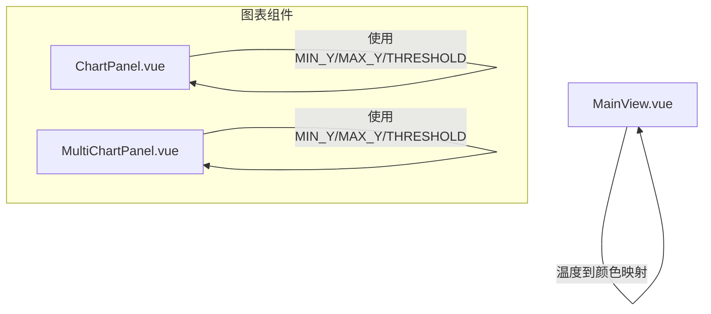
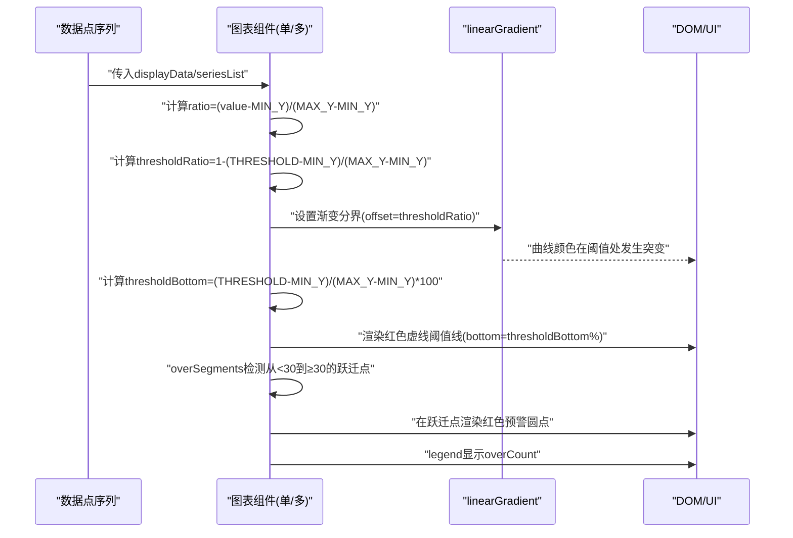
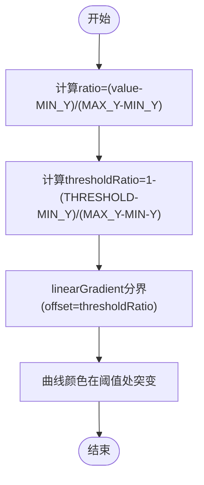
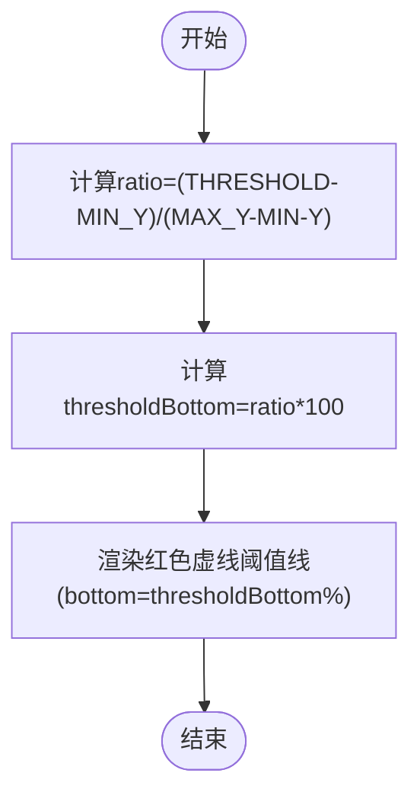
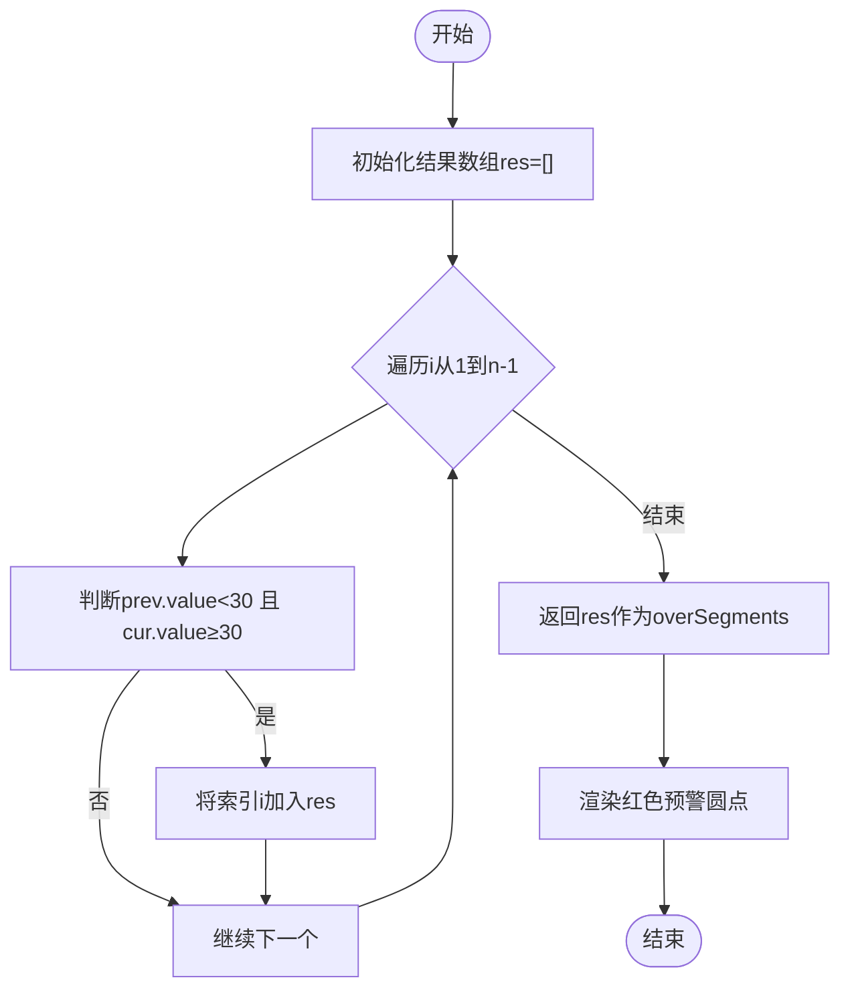
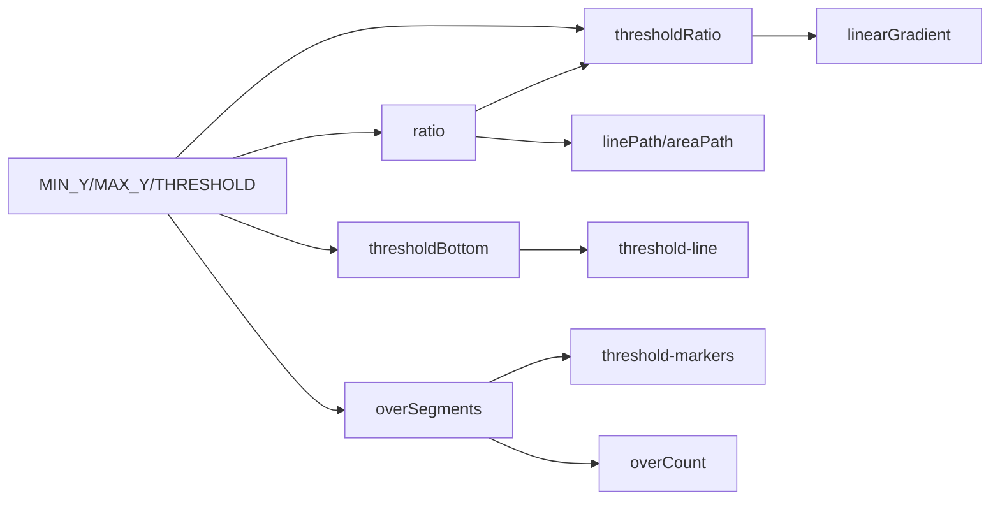

# 阈值与预警可视化

<cite>
**本文引用的文件**
- [ChartPanel.vue](file://src/components/ChartPanel.vue)
- [MultiChartPanel.vue](file://src/components/MultiChartPanel.vue)
- [MainView.vue](file://src/components/MainView.vue)
</cite>

## 目录
1. [引言](#引言)
2. [项目结构](#项目结构)
3. [核心组件](#核心组件)
4. [架构总览](#架构总览)
5. [详细组件分析](#详细组件分析)
6. [依赖关系分析](#依赖关系分析)
7. [性能考量](#性能考量)
8. [故障排查指南](#故障排查指南)
9. [结论](#结论)

## 引言
本文件系统性地文档化30°C高温预警的可视化实现，围绕以下主题展开：
- THRESHOLD常量与thresholdRatio计算属性的数学原理与作用
- thresholdRatio在线性渐变linearGradient中的应用，实现曲线在阈值处的颜色突变
- thresholdBottom计算属性如何将30°C映射为CSS bottom百分比，用于绘制红色虚线阈值线
- overSegments计算属性的算法逻辑，检测温度从低于30°C到高于等于30°C的跃迁点，并在这些位置渲染红色预警标记圆点
- legend区域中“预警计数（overCount）”的来源与UI展示

## 项目结构
本次文档聚焦于与温度曲线、阈值线、渐变色及预警标记相关的组件：
- 单曲线图表组件：ChartPanel.vue
- 多曲线图表组件：MultiChartPanel.vue
- 主视图中包含温度到颜色映射的热力图逻辑（与阈值无关，但同属温度可视化范畴）

**图表来源**
- [ChartPanel.vue](file://src/components/ChartPanel.vue#L117-L134)
- [MultiChartPanel.vue](file://src/components/MultiChartPanel.vue#L95-L101)
- [MainView.vue](file://src/components/MainView.vue#L1398-L1410)

**章节来源**
- [ChartPanel.vue](file://src/components/ChartPanel.vue#L117-L134)
- [MultiChartPanel.vue](file://src/components/MultiChartPanel.vue#L95-L101)

## 核心组件
- 单曲线图表组件（ChartPanel.vue）
  - 定义温度范围MIN_Y=-20、MAX_Y=40、阈值THRESHOLD=30
  - 计算thresholdRatio与thresholdBottom，驱动阈值线位置与渐变色分界
  - 计算overSegments并渲染红色预警圆点
  - 在legend中展示“预警计数（overCount）”
- 多曲线图表组件（MultiChartPanel.vue）
  - 同样定义MIN_Y、MAX_Y、THRESHOLD
  - 使用getOverSegments计算每个子图的预警点
  - 在legend中以“(数量)”形式展示该系列的预警计数

**章节来源**
- [ChartPanel.vue](file://src/components/ChartPanel.vue#L117-L165)
- [MultiChartPanel.vue](file://src/components/MultiChartPanel.vue#L95-L146)

## 架构总览
下图展示了阈值与预警可视化在组件内的数据流与渲染路径。

**图表来源**
- [ChartPanel.vue](file://src/components/ChartPanel.vue#L131-L165)
- [MultiChartPanel.vue](file://src/components/MultiChartPanel.vue#L99-L146)

## 详细组件分析

### 数学原理与常量定义
- 常量定义
  - MIN_Y：温度范围下界
  - MAX_Y：温度范围上界
  - THRESHOLD：30°C阈值
- 关键计算
  - ratio = (value - MIN_Y) / (MAX_Y - MIN_Y)：将数值归一化到[0,1]
  - thresholdRatio = 1 - (THRESHOLD - MIN_Y) / (MAX_Y - MIN_Y)：将阈值映射到SVG渐变的offset
  - thresholdBottom = (THRESHOLD - MIN_Y) / (MAX_Y - MIN_Y) × 100：将阈值映射到CSS bottom百分比

上述公式与注释中的表达式一致，其中“1 - (30 - (-20)) / (40 - (-20))”体现了将阈值30°C映射到渐变offset的数学过程，而“(30 - (-20)) / (40 - (-20)) × 100”则给出阈值线在容器中的百分比位置。

**章节来源**
- [ChartPanel.vue](file://src/components/ChartPanel.vue#L117-L134)
- [MultiChartPanel.vue](file://src/components/MultiChartPanel.vue#L95-L101)

### thresholdRatio与linearGradient颜色突变
- thresholdRatio的作用
  - 将阈值30°C映射到渐变offset，使渐变在阈值处发生颜色切换
- 渐变配置
  - 在单曲线组件中，strokeGradBottom的两个stop分别位于thresholdRatio±0.01，形成一个极窄的过渡带，从而在阈值处产生明显的颜色突变
  - 多曲线组件为每个子图动态生成id为“strokeGrad-索引”的渐变，同样基于thresholdRatio进行分界
- 效果
  - 当曲线值低于30°C时，曲线呈现一种颜色；当曲线值达到或超过30°C时，曲线颜色变为另一种颜色，实现阈值处的视觉突变

**图表来源**
- [ChartPanel.vue](file://src/components/ChartPanel.vue#L131-L134)
- [MultiChartPanel.vue](file://src/components/MultiChartPanel.vue#L30-L33)

**章节来源**
- [ChartPanel.vue](file://src/components/ChartPanel.vue#L36-L49)
- [MultiChartPanel.vue](file://src/components/MultiChartPanel.vue#L24-L36)

### thresholdBottom与红色虚线阈值线
- thresholdBottom的计算
  - 将阈值30°C按比例映射到容器高度的百分比
- 阈值线渲染
  - 在组件中通过绝对定位元素threshold-line，使用bottom=thresholdBottom%绘制一条红色虚线
  - Y轴刻度与阈值线对齐，便于用户直观识别30°C位置

**图表来源**
- [ChartPanel.vue](file://src/components/ChartPanel.vue#L132-L133)
- [MultiChartPanel.vue](file://src/components/MultiChartPanel.vue#L19-L21)

**章节来源**
- [ChartPanel.vue](file://src/components/ChartPanel.vue#L30-L33)
- [MultiChartPanel.vue](file://src/components/MultiChartPanel.vue#L18-L21)

### overSegments算法与预警标记
- 算法逻辑
  - 遍历数据点序列，检测相邻两点之间是否存在“前值<30°C 且 当前值≥30°C”的跃迁
  - 将跃迁点的索引收集为overSegments
- 渲染策略
  - 在每个跃迁点绘制红色圆点，半径较小，带白色描边，突出显示预警位置
  - 圆点的y坐标由当前点value映射到[0,100]区间，保证与曲线纵坐标一致
- 多曲线场景
  - 每个子图独立计算自己的getOverSegments，并在legend中展示该系列的预警计数

**图表来源**
- [ChartPanel.vue](file://src/components/ChartPanel.vue#L153-L162)
- [MultiChartPanel.vue](file://src/components/MultiChartPanel.vue#L137-L146)

**章节来源**
- [ChartPanel.vue](file://src/components/ChartPanel.vue#L50-L62)
- [MultiChartPanel.vue](file://src/components/MultiChartPanel.vue#L38-L49)

### legend区域“预警计数（overCount）”来源与展示
- 来源
  - 单曲线组件：overCount = overSegments.length
  - 多曲线组件：legend中直接展示getOverSegments(s.points).length
- 展示
  - 使用红色文字与警示图标，配合“normal”对比，清晰传达“高于阈值”的统计信息

**章节来源**
- [ChartPanel.vue](file://src/components/ChartPanel.vue#L92-L95)
- [MultiChartPanel.vue](file://src/components/MultiChartPanel.vue#L76-L80)

## 依赖关系分析
- 组件内依赖
  - 单曲线组件：依赖displayData、MIN_Y、MAX_Y、THRESHOLD计算ratio、thresholdRatio、thresholdBottom、overSegments、overCount
  - 多曲线组件：依赖seriesList、MIN_Y、MAX_Y、THRESHOLD计算ratio、thresholdRatio、thresholdBottom、getOverSegments
- 外部依赖
  - Vue计算属性与响应式系统
  - SVG路径与linearGradient
  - DOM事件处理（鼠标悬停）

**图表来源**
- [ChartPanel.vue](file://src/components/ChartPanel.vue#L117-L165)
- [MultiChartPanel.vue](file://src/components/MultiChartPanel.vue#L95-L146)

**章节来源**
- [ChartPanel.vue](file://src/components/ChartPanel.vue#L117-L165)
- [MultiChartPanel.vue](file://src/components/MultiChartPanel.vue#L95-L146)

## 性能考量
- 计算复杂度
  - overSegments遍历一次序列，时间复杂度O(n)，空间复杂度O(k)，k为跃迁点数量
  - ratio与映射计算为O(n)，整体开销与数据点数量线性相关
- 渲染优化
  - 使用向量化渲染（vector-effect="non-scaling-stroke"）减少缩放带来的重绘成本
  - 渐变分界采用极窄过渡带，避免大范围重绘
- 交互优化
  - 鼠标悬停仅更新tooltip与hover圆点，不触发全量重算

[本节提供一般性建议，无需特定文件引用]

## 故障排查指南
- 阈值线未正确显示
  - 检查MIN_Y、MAX_Y是否与数据范围一致
  - 确认thresholdBottom计算结果是否为合理百分比
- 渐变颜色未在阈值处突变
  - 检查thresholdRatio是否被正确传入linearGradient的offset
  - 确认渐变stop的offset范围是否覆盖thresholdRatio
- 预警圆点未出现
  - 检查overSegments是否为空
  - 确认圆点的y坐标映射公式与linePath一致
- legend计数异常
  - 确认overCount或getOverSegments(s.points).length是否随数据变化更新
  - 检查legend文本拼接是否正确

**章节来源**
- [ChartPanel.vue](file://src/components/ChartPanel.vue#L131-L165)
- [MultiChartPanel.vue](file://src/components/MultiChartPanel.vue#L99-L146)

## 结论
本实现通过明确的数学映射（ratio、thresholdRatio、thresholdBottom）与简洁的算法（overSegments），将30°C阈值在可视化中以渐变色突变、红色虚线阈值线与红色预警圆点的形式直观呈现，并在legend中提供“预警计数”。该方案具备良好的可读性与可维护性，适合在温度监控等场景中复用与扩展。