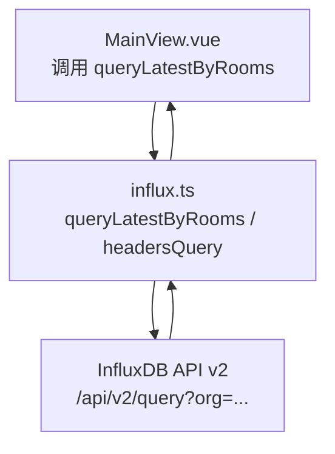
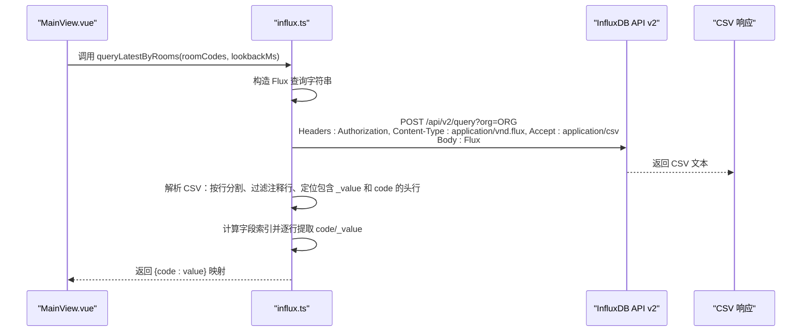
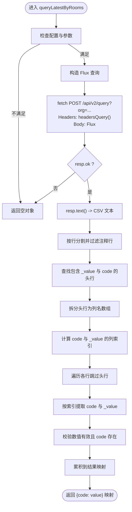
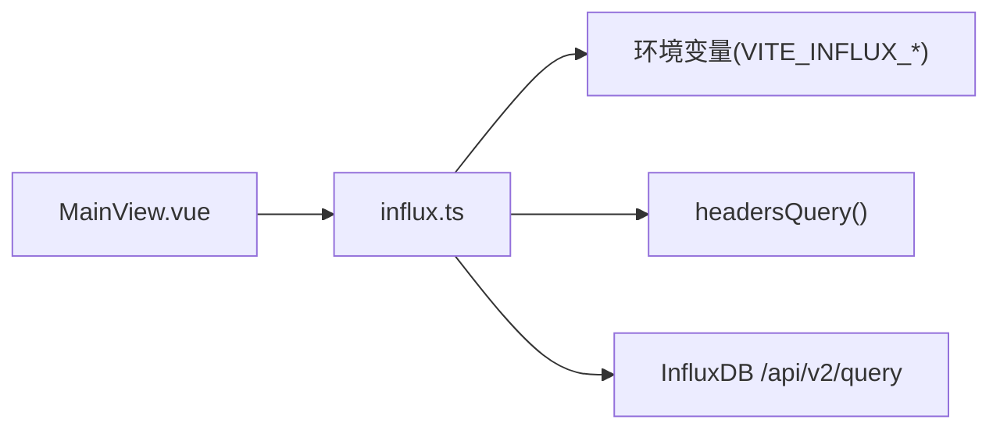

# HTTP请求与响应处理

<cite>
**本文引用的文件**
- [influx.ts](file://src/services/influx.ts)
- [MainView.vue](file://src/components/MainView.vue)
- [timeseries.js](file://server/routes/timeseries.js)
</cite>

## 目录
1. [简介](#简介)
2. [项目结构](#项目结构)
3. [核心组件](#核心组件)
4. [架构总览](#架构总览)
5. [详细组件分析](#详细组件分析)
6. [依赖分析](#依赖分析)
7. [性能考虑](#性能考虑)
8. [故障排查指南](#故障排查指南)
9. [结论](#结论)

## 简介
本文件围绕前端服务模块中的 queryLatestByRooms 函数，系统阐述其发起 HTTP POST 请求的完整流程，包括：
- 请求 URL 组成（含组织参数 org）
- 请求头通过 headersQuery() 生成
- Flux 查询体作为请求正文发送
- 对 InfluxDB 返回的 CSV 响应进行解析：按行分割、过滤注释行、定位包含 _value 和 code 的数据头行，并据此确定关键字段索引位置
- 错误处理机制：当响应状态码非 200 时返回空对象，保证调用方稳定

此外，文档提供实际 CSV 响应片段示例，帮助理解从原始文本到结构化数据的转换过程。

## 项目结构
本主题涉及的关键文件与职责如下：
- src/services/influx.ts：封装 InfluxDB 访问，包含 queryLatestByRooms、headersQuery、isInfluxConfigured 等
- src/components/MainView.vue：前端组件，调用 queryLatestByRooms 并消费返回的房间最新温度映射
- server/routes/timeseries.js：后端路由，演示 InfluxDB 写入时同样使用 org 参数与 CSV/Flux 响应约定（用于对比理解）

**图表来源**
- [influx.ts](file://src/services/influx.ts#L104-L133)
- [MainView.vue](file://src/components/MainView.vue#L2507-L2511)

**章节来源**
- [influx.ts](file://src/services/influx.ts#L104-L133)
- [MainView.vue](file://src/components/MainView.vue#L2507-L2511)

## 核心组件
- queryLatestByRooms：面向“按房间查询最新值”的场景，构造 Flux 查询并解析 CSV 响应，返回房间代码到数值的映射
- headersQuery：统一生成查询请求所需的认证与媒体类型头
- isInfluxConfigured：前置校验，避免在未配置时发起请求

**章节来源**
- [influx.ts](file://src/services/influx.ts#L104-L133)
- [influx.ts](file://src/services/influx.ts#L15-L20)
- [influx.ts](file://src/services/influx.ts#L8-L14)

## 架构总览
下图展示 queryLatestByRooms 的端到端调用链路与数据流。

**图表来源**
- [influx.ts](file://src/services/influx.ts#L104-L133)
- [MainView.vue](file://src/components/MainView.vue#L2507-L2511)

## 详细组件分析

### queryLatestByRooms：HTTP POST 请求与响应解析
- 请求 URL 组成
  - 基础路径：/api/v2/query
  - 组织参数：通过查询参数 org=encodeURIComponent(org) 注入
  - 示例路径：/api/v2/query?org=ORG_ENCODED
- 请求头生成
  - 通过 headersQuery() 返回包含：
    - Authorization：Basic 或 Token 方案
    - Content-Type：application/vnd.flux（Flux 查询体）
    - Accept：application/csv（期望 CSV 响应）
- 请求正文
  - Flux 查询字符串，按房间集合构造正则匹配，分组并取最后一条记录
- 响应解析
  - 文本化响应后按行分割，并过滤掉以 # 开头的注释行
  - 在剩余行中查找包含 _value 与 code 的头行
  - 以逗号拆分头行得到列名数组，计算 code 与 _value 的列索引
  - 遍历其余行，按索引提取 code 与 _value，将数值解析为浮点数，构建 {code: value} 映射
- 错误处理
  - 若响应非 200，直接返回空对象，避免上层异常传播

**图表来源**
- [influx.ts](file://src/services/influx.ts#L104-L133)

**章节来源**
- [influx.ts](file://src/services/influx.ts#L104-L133)

### 请求头生成：headersQuery
- 作用：为查询类请求统一设置认证与媒体类型
- 关键点：
  - Authorization：根据 useBasic 选择 Basic 或 Token
  - Content-Type：application/vnd.flux（Flux 查询体）
  - Accept：application/csv（CSV 响应）

**章节来源**
- [influx.ts](file://src/services/influx.ts#L15-L20)

### 调用方：MainView.vue
- 调用时机与频率：组件挂载后延迟触发一次查询；随后以固定间隔轮询刷新
- 调用方式：Promise.then/catch 包裹，失败时降级为空对象，保证 UI 稳定
- 数据用途：将返回的 {code: value} 映射回房间标签的当前温度显示

**章节来源**
- [MainView.vue](file://src/components/MainView.vue#L2507-L2511)
- [MainView.vue](file://src/components/MainView.vue#L2565-L2571)

### 实际 CSV 响应片段示例（示意）
以下为典型 CSV 响应片段，展示注释行、头行与数据行的典型结构。注意：字段顺序可能因查询而异，但解析逻辑会通过列名定位字段索引。

- 注释行示例（以 # 开头，会被过滤）：
  - #datatype,string,long,dateTime:RFC3339,double
  - #group,false,false,false,false
  - #default,_result,,,,,,,,,,,
- 头行示例（包含 _value 与 code）：
  - table,_,_,time,code,_value
- 数据行示例：
  - 0,,0,2024-01-01T12:00:00Z,ROOM-A,25.6
  - 0,,0,2024-01-01T12:00:00Z,ROOM-B,24.8

解析要点：
- 过滤注释行后，定位包含 _value 与 code 的头行
- 以逗号拆分头行，得到列名数组
- 计算 code 与 _value 的列索引
- 遍历各行，按索引提取 code 与 _value，解析数值并填充映射

**章节来源**
- [influx.ts](file://src/services/influx.ts#L118-L132)

### 与写入流程的对比参考（server/routes/timeseries.js）
- 写入时同样使用 org 参数与特定 Content-Type（text/plain; charset=utf-8）
- 查询时使用 application/vnd.flux 与 application/csv
- 二者均通过 Authorization 头进行鉴权

**章节来源**
- [timeseries.js](file://server/routes/timeseries.js#L80-L90)
- [influx.ts](file://src/services/influx.ts#L15-L20)

## 依赖分析
- 组件耦合
  - MainView.vue 仅依赖 influx.ts 导出的查询函数与配置检测
  - influx.ts 依赖运行时环境变量（VITE_INFLUX_*）与 headersQuery
- 外部依赖
  - InfluxDB API v2：/api/v2/query（POST）、/api/v2/write（POST）
  - fetch：浏览器内置网络请求接口
- 潜在循环依赖
  - 无直接循环依赖；查询与写入分别位于前端服务模块与后端路由模块

**图表来源**
- [influx.ts](file://src/services/influx.ts#L1-L20)
- [MainView.vue](file://src/components/MainView.vue#L2507-L2511)

**章节来源**
- [influx.ts](file://src/services/influx.ts#L1-L20)
- [MainView.vue](file://src/components/MainView.vue#L2507-L2511)

## 性能考虑
- 请求频率控制：MainView.vue 中存在定时轮询，建议结合业务需求调整周期，避免频繁查询导致带宽与服务器压力
- 查询范围优化：queryLatestByRooms 使用 lookbackMs 控制时间窗口，合理设置可减少数据量
- 响应解析复杂度：按行扫描与列索引计算为线性复杂度，适合中小规模房间集合；大规模并发时建议前端侧做去重与缓存策略

[本节为通用建议，无需具体文件分析]

## 故障排查指南
- 现象：返回空对象
  - 可能原因：响应非 200、未配置 InfluxDB、房间集合为空、CSV 头行缺失关键字段
  - 排查步骤：
    - 确认 isInfluxConfigured 返回 true
    - 检查 roomCodes 是否非空
    - 查看响应状态码与错误日志
    - 确认 CSV 响应中存在包含 _value 与 code 的头行
- 现象：数值解析异常
  - 可能原因：_value 列非数值、行字段数量不足
  - 排查步骤：
    - 确保 _value 列解析为浮点数
    - 确保行字段数量大于等于最大索引
- 现象：认证失败
  - 可能原因：Authorization 头配置错误
  - 排查步骤：
    - 检查 useBasic 与 token/basicUser/basicPass 配置
    - 确认 Basic 或 Token 的格式正确

**章节来源**
- [influx.ts](file://src/services/influx.ts#L8-L14)
- [influx.ts](file://src/services/influx.ts#L15-L20)
- [influx.ts](file://src/services/influx.ts#L117-L132)
- [MainView.vue](file://src/components/MainView.vue#L2507-L2511)

## 结论
queryLatestByRooms 通过标准化的 HTTP POST 请求与严格的 CSV 解析逻辑，实现了对多房间最新温度值的高效查询。其错误处理策略在异常情况下返回空对象，保障了前端 UI 的稳定性。结合合理的请求频率与查询范围设置，可在保证体验的同时降低系统负载。