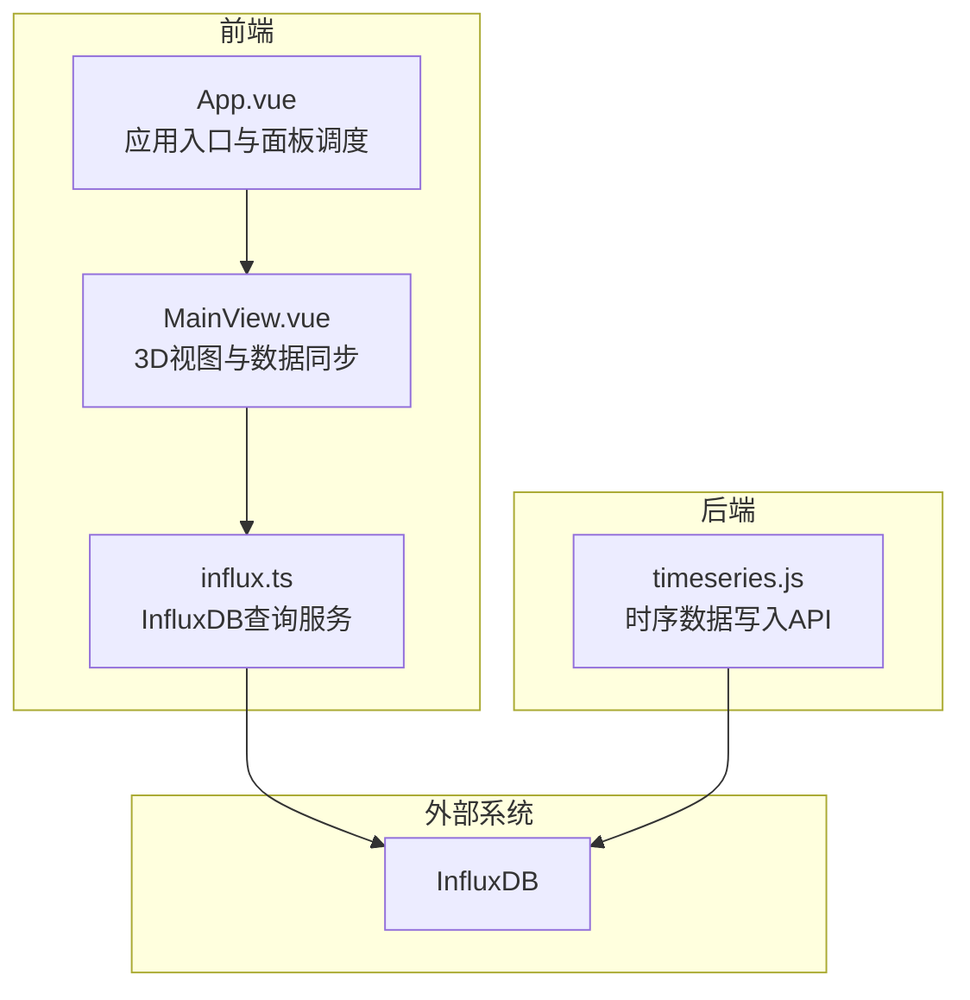
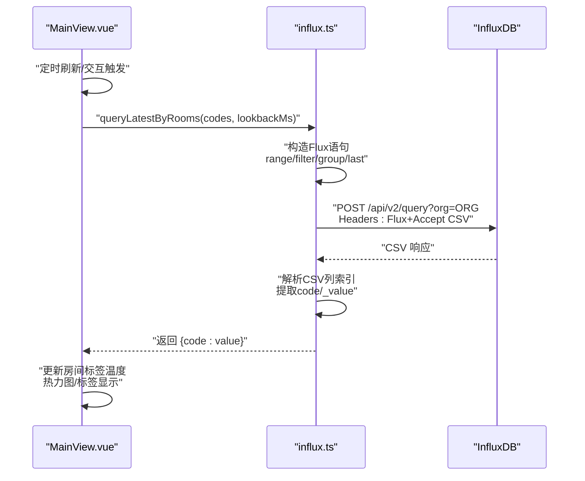
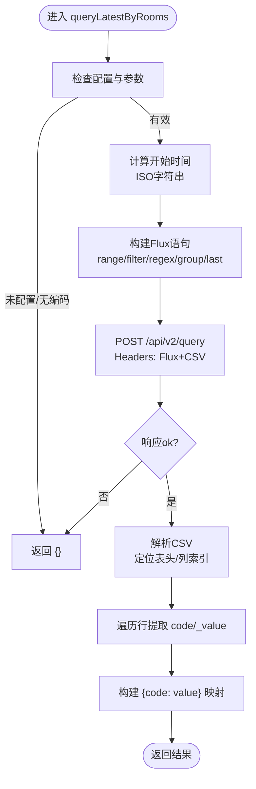
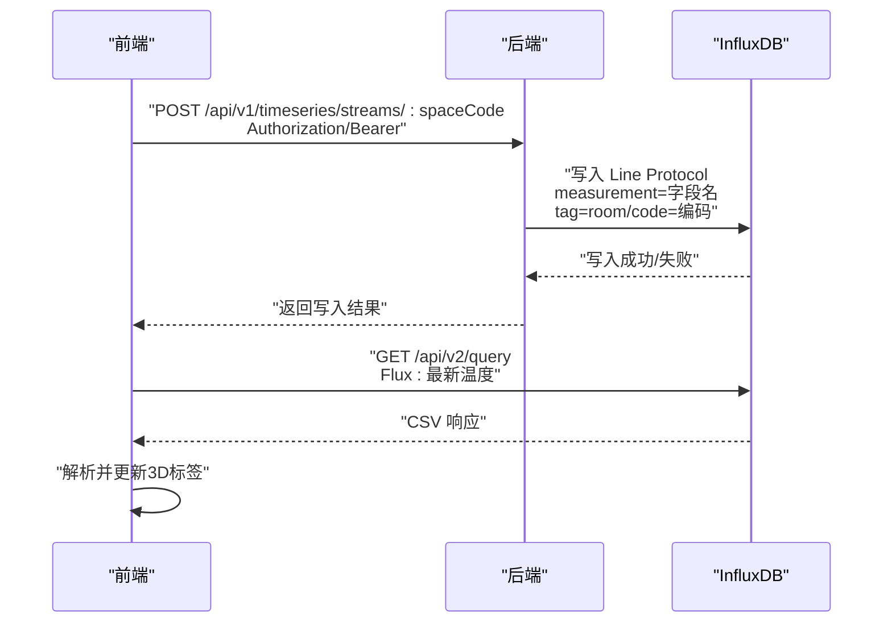
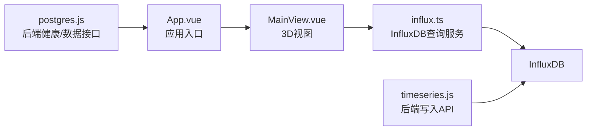

# InfluxDB数据查询机制

<cite>
**本文引用的文件**
- [influx.ts](file://src/services/influx.ts)
- [.env](file://.env)
- [server/.env](file://server/.env)
- [timeseries.js](file://server/routes/timeseries.js)
- [App.vue](file://src/App.vue)
- [MainView.vue](file://src/components/MainView.vue)
- [postgres.js](file://src/services/postgres.js)
</cite>

## 目录
1. [简介](#简介)
2. [项目结构](#项目结构)
3. [核心组件](#核心组件)
4. [架构总览](#架构总览)
5. [详细组件分析](#详细组件分析)
6. [依赖关系分析](#依赖关系分析)
7. [性能考量](#性能考量)
8. [故障排查指南](#故障排查指南)
9. [结论](#结论)

## 简介
本文件围绕前端服务模块中的 InfluxDB 查询函数 queryLatestByRooms 展开，系统性解析其在 Flux 查询构建、HTTP POST 请求、CSV 响应解析与结果聚合方面的实现细节，并阐述该函数在数据同步与 3D 模型温度可视化中的关键作用。文档同时给出代码级来源标注与可视化图示，帮助读者快速理解从房间编码到实时温度值的完整链路。

## 项目结构
本项目采用前后端分离的组织方式：
- 前端位于 src/ 目录，包含 Vue 应用与服务层（如 src/services/influx.ts）
- 后端位于 server/ 目录，提供 API 与 InfluxDB 写入能力（如 server/routes/timeseries.js）
- 环境变量分别在根目录 .env 与 server/.env 中配置

图表来源
- [App.vue](file://src/App.vue#L146-L200)
- [MainView.vue](file://src/components/MainView.vue#L193-L200)
- [influx.ts](file://src/services/influx.ts#L1-L20)
- [timeseries.js](file://server/routes/timeseries.js#L1-L20)

章节来源
- [App.vue](file://src/App.vue#L146-L200)
- [MainView.vue](file://src/components/MainView.vue#L193-L200)
- [influx.ts](file://src/services/influx.ts#L1-L20)
- [timeseries.js](file://server/routes/timeseries.js#L1-L20)

## 核心组件
- InfluxDB 查询服务：封装 InfluxDB 查询与写入的通用逻辑，暴露 queryLatestByRooms、queryRoomSeries、queryAverageSeries 等方法
- 3D 视图组件：负责房间标签温度展示、自动刷新与热力图渲染
- 后端写入 API：接收外部时序数据并写入 InfluxDB

章节来源
- [influx.ts](file://src/services/influx.ts#L105-L136)
- [MainView.vue](file://src/components/MainView.vue#L2430-L2580)
- [timeseries.js](file://server/routes/timeseries.js#L106-L206)

## 架构总览
queryLatestByRooms 的工作流可概括为：
- 输入：房间编码数组、回溯窗口（毫秒）
- 构建 Flux 查询：设置时间范围、过滤测量值、字段筛选、标签正则匹配、按标签分组并取最后值
- 发起 HTTP POST 请求：携带 Flux 语句与 CSV 响应期望
- 解析 CSV：提取 code 与 _value 列，构建 { code: number } 映射
- 返回：Record<string, number> 结果，供 3D 视图更新温度标签

图表来源
- [MainView.vue](file://src/components/MainView.vue#L2480-L2540)
- [influx.ts](file://src/services/influx.ts#L105-L136)

章节来源
- [MainView.vue](file://src/components/MainView.vue#L2480-L2540)
- [influx.ts](file://src/services/influx.ts#L105-L136)

## 详细组件分析

### queryLatestByRooms 函数解析
- 入口与前置校验
  - 若未配置 InfluxDB 或输入为空，直接返回空对象
- 时间范围设定
  - 以当前时间为截止，向前推移 max(lookbackMs, 5min)
  - 使用 ISO 字符串作为 Flux range 的 start
- Flux 查询构建
  - from(bucket)：指定桶
  - range(start)：限定查询时间范围
  - filter：过滤测量值 room_temp 或 temperature，字段为 value
  - 正则匹配：r["code"] =~ /regex/，其中 regex 由房间编码转义后拼接
  - group(columns: ["code"])：按 code 标签分组
  - last()：取每组最后一条记录
- HTTP POST 请求
  - 目标：/api/v2/query?org=ORG
  - Headers：Authorization（Token 或 Basic），Content-Type: application/vnd.flux，Accept: application/csv
- CSV 响应解析
  - 过滤掉以 # 开头的元数据行
  - 定位包含 _value 与 code 的表头行，解析列索引
  - 遍历数据行，提取 code 与 _value，构建 { code: number } 映射
- 返回值
  - 返回 Record<string, number>，键为房间编码，值为温度

图表来源
- [influx.ts](file://src/services/influx.ts#L105-L136)

章节来源
- [influx.ts](file://src/services/influx.ts#L105-L136)

### InfluxDB 写入与数据来源
- 后端写入 API
  - 接收 JSON 时序数据，按 measurement=字段名、tag=room/code=编码 的规则写入
  - 使用 Token 或 Basic 认证，Line Protocol 写入
- 前端查询与 3D 视图联动
  - MainView.vue 在挂载与定时刷新时调用 queryLatestByRooms
  - 将返回的温度映射应用到房间标签，支持热力图与标签显示

图表来源
- [timeseries.js](file://server/routes/timeseries.js#L106-L206)
- [MainView.vue](file://src/components/MainView.vue#L2480-L2540)

章节来源
- [timeseries.js](file://server/routes/timeseries.js#L106-L206)
- [MainView.vue](file://src/components/MainView.vue#L2480-L2540)

### 环境变量与认证
- 前端查询使用的 InfluxDB 连接信息
  - VITE_INFLUX_URL、VITE_INFLUX_ORG、VITE_INFLUX_BUCKET、VITE_INFLUX_TOKEN
  - VITE_INFLUX_BASIC、VITE_INFLUX_USER、VITE_INFLUX_PASSWORD 控制 Basic 认证
- 后端写入使用的 InfluxDB 连接信息
  - INFLUX_URL、INFLUX_ORG、INFLUX_BUCKET、INFLUX_TOKEN
  - API_KEY_SECRET 用于生成/校验 Stream API Key

章节来源
- [.env](file://.env#L1-L6)
- [server/.env](file://server/.env#L11-L19)
- [timeseries.js](file://server/routes/timeseries.js#L1-L20)

## 依赖关系分析
- MainView.vue 依赖 influx.ts 的 queryLatestByRooms 实现数据同步
- App.vue 通过 MainView.vue 的事件与方法与 3D 视图交互
- postgres.js 提供后端健康检查与数据导入接口，辅助前端在无 InfluxDB 时回退到模型数据

图表来源
- [postgres.js](file://src/services/postgres.js#L1-L20)
- [App.vue](file://src/App.vue#L146-L200)
- [MainView.vue](file://src/components/MainView.vue#L193-L200)
- [influx.ts](file://src/services/influx.ts#L1-L20)
- [timeseries.js](file://server/routes/timeseries.js#L106-L206)

章节来源
- [postgres.js](file://src/services/postgres.js#L1-L20)
- [App.vue](file://src/App.vue#L146-L200)
- [MainView.vue](file://src/components/MainView.vue#L193-L200)
- [influx.ts](file://src/services/influx.ts#L1-L20)
- [timeseries.js](file://server/routes/timeseries.js#L106-L206)

## 性能考量
- 查询粒度与时间范围
  - 通过 lookbackMs 控制查询窗口，避免过大范围导致响应缓慢
  - 与 5 分钟下限保证最小回溯窗口，兼顾实时性
- CSV 解析效率
  - 仅解析包含 _value 与 code 的表头行，减少无关列处理
  - 使用列索引定位，避免逐列扫描
- 自动刷新策略
  - 每分钟刷新一次，平衡实时性与网络负载
  - 仅在配置可用时执行刷新，避免无效请求

章节来源
- [influx.ts](file://src/services/influx.ts#L105-L136)
- [MainView.vue](file://src/components/MainView.vue#L2480-L2540)

## 故障排查指南
- InfluxDB 未配置
  - 现象：queryLatestByRooms 直接返回 {}
  - 处理：确认 .env 与 server/.env 中的 InfluxDB 连接参数
- 认证失败
  - 现象：POST /api/v2/query 返回 401/403
  - 处理：核对 Token 或 Basic 用户密码；检查 VITE_INFLUX_BASIC 与 VITE_INFLUX_TOKEN
- CSV 解析异常
  - 现象：返回空映射或 NaN 值
  - 处理：确认 CSV 表头包含 _value 与 code；检查列顺序与分隔符
- 后端写入失败
  - 现象：/api/v1/timeseries/streams 返回错误
  - 处理：检查 API Key 生成与校验逻辑；确认 INFLUX_TOKEN 配置

章节来源
- [influx.ts](file://src/services/influx.ts#L1-L20)
- [timeseries.js](file://server/routes/timeseries.js#L106-L206)
- [.env](file://.env#L1-L6)
- [server/.env](file://server/.env#L11-L19)

## 结论
queryLatestByRooms 通过精准的 Flux 查询与高效的 CSV 解析，为 3D 模型提供了实时温度数据源。其与 MainView.vue 的自动刷新机制协同，实现了房间标签温度的动态更新与热力图渲染。结合后端写入 API，前端可稳定地从 InfluxDB 获取最新温度数据，支撑可视化与数据分析需求。