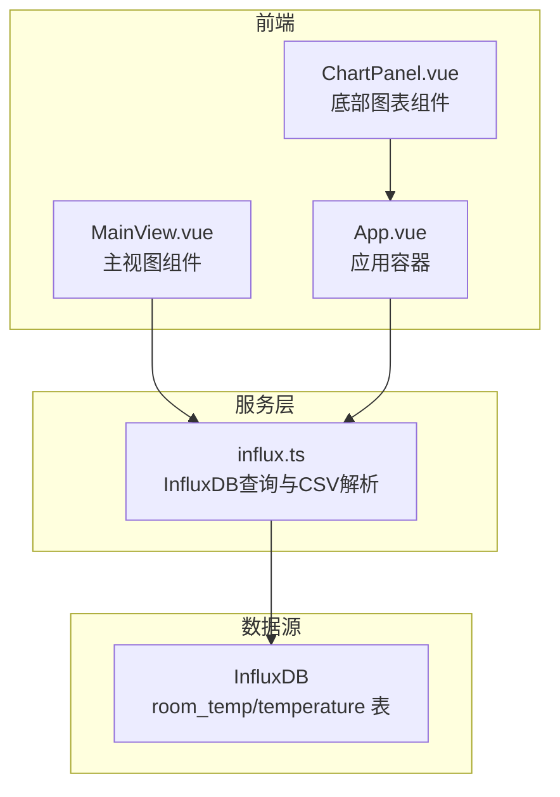
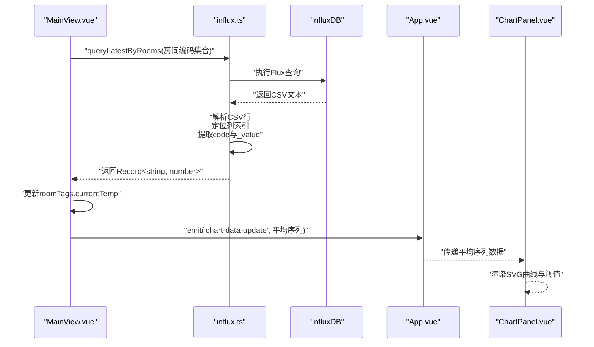
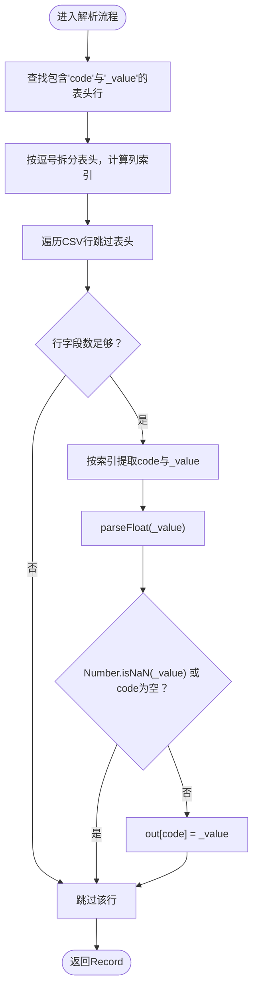
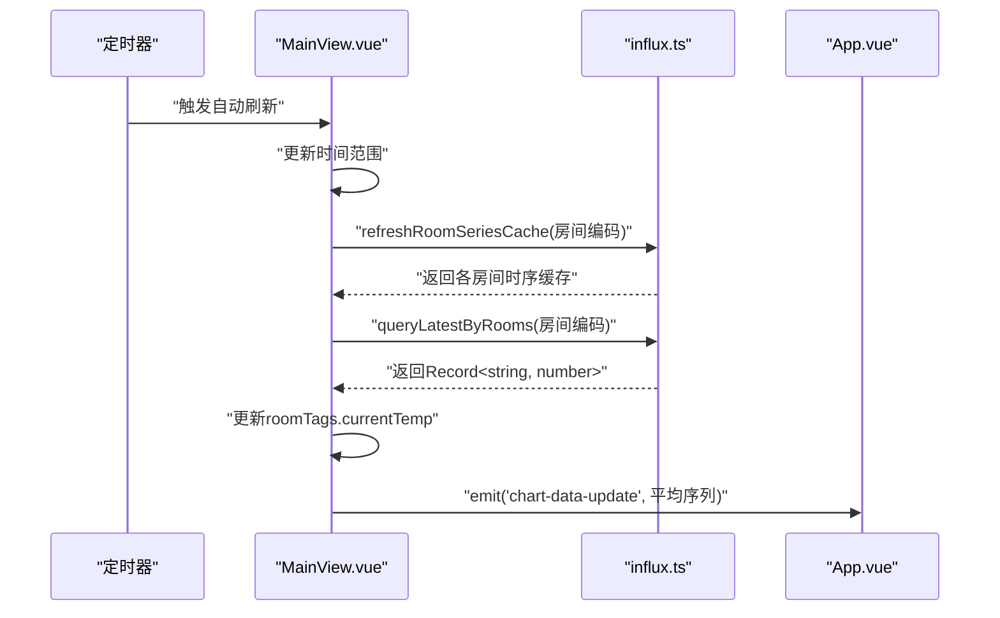
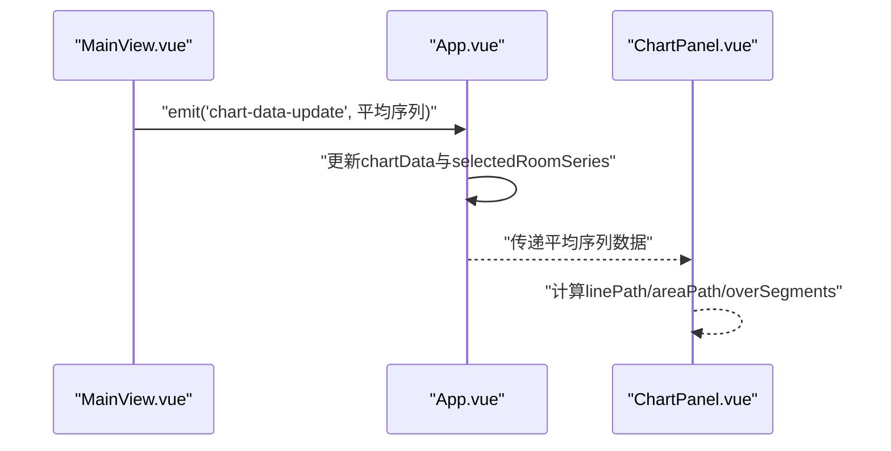

# 数据转换与结果返回

<cite>
**本文引用的文件**
- [influx.ts](file://src/services/influx.ts)
- [MainView.vue](file://src/components/MainView.vue)
- [App.vue](file://src/App.vue)
- [ChartPanel.vue](file://src/components/ChartPanel.vue)
</cite>

## 目录
1. [简介](#简介)
2. [项目结构](#项目结构)
3. [核心组件](#核心组件)
4. [架构总览](#架构总览)
5. [详细组件分析](#详细组件分析)
6. [依赖分析](#依赖分析)
7. [性能考虑](#性能考虑)
8. [故障排查指南](#故障排查指南)
9. [结论](#结论)

## 简介
本节聚焦于“从解析后的CSV行数据到最终Record<string, number>对象”的转换过程，系统阐述：
- 循环遍历非头部数据行的逻辑
- 通过预计算的列索引安全提取房间编码与温度值
- parseFloat与Number.isNaN的使用及必要性
- 结果对象out的构建方式：以房间编码为键、最新温度值为值
- 此函数返回的数据如何被ChartPanel或MainView组件用于动态更新可视化界面

## 项目结构
本项目采用前后端分离的前端单页应用，核心数据流如下：
- 前端通过服务模块查询InfluxDB，得到CSV文本
- 服务模块解析CSV，将每条记录转换为键值映射
- 主视图组件接收映射，驱动3D模型热力图与标签实时更新
- 底部图表组件接收平均序列数据，进行可视化展示

图表来源
- [influx.ts](file://src/services/influx.ts#L105-L136)
- [MainView.vue](file://src/components/MainView.vue#L2480-L2579)
- [App.vue](file://src/App.vue#L509-L534)
- [ChartPanel.vue](file://src/components/ChartPanel.vue#L1-L200)

章节来源
- [influx.ts](file://src/services/influx.ts#L105-L136)
- [MainView.vue](file://src/components/MainView.vue#L2480-L2579)
- [App.vue](file://src/App.vue#L509-L534)
- [ChartPanel.vue](file://src/components/ChartPanel.vue#L1-L200)

## 核心组件
- 服务模块：提供查询接口，解析CSV并返回Record<string, number>
- 主视图组件：周期性拉取最新温度映射，更新3D模型标签与热力图
- 应用容器：响应图表数据更新事件，联动底部图表组件
- 底部图表组件：消费平均序列Point[]，渲染曲线与阈值

章节来源
- [influx.ts](file://src/services/influx.ts#L105-L136)
- [MainView.vue](file://src/components/MainView.vue#L2480-L2579)
- [App.vue](file://src/App.vue#L509-L534)
- [ChartPanel.vue](file://src/components/ChartPanel.vue#L1-L200)

## 架构总览
下图展示了从InfluxDB到前端可视化的端到端流程，重点标注了CSV解析与映射构建的关键步骤。

图表来源
- [influx.ts](file://src/services/influx.ts#L105-L136)
- [MainView.vue](file://src/components/MainView.vue#L2480-L2579)
- [App.vue](file://src/App.vue#L509-L534)
- [ChartPanel.vue](file://src/components/ChartPanel.vue#L1-L200)

## 详细组件分析

### 服务层CSV解析与映射构建
- 查询入口：queryLatestByRooms(roomCodes, lookbackMs)
- CSV解析策略：
  - 定位包含“code”和“value”的表头行
  - 预计算列索引idxCode与idxValue
  - 遍历非表头行，按索引提取字段
  - 使用parseFloat解析数值，用Number.isNaN过滤无效值
  - 构建结果对象out：以房间编码为键、最新温度值为值
- 返回类型：Record<string, number>，便于前端直接按房间码索引访问

图表来源
- [influx.ts](file://src/services/influx.ts#L105-L136)

章节来源
- [influx.ts](file://src/services/influx.ts#L105-L136)

### 主视图组件：周期刷新与热力图更新
- 自动刷新机制：每分钟轮询一次，更新时间范围、刷新图表数据与房间时序缓存
- 最新温度映射：调用queryLatestByRooms获取最新温度映射，逐个房间更新标签currentTemp
- 热力图应用：当启用热力图时，依据标签温度计算颜色并应用到3D模型构件
- 图表联动：通过emit('chart-data-update', chartData.value)通知App.vue刷新底部图表

图表来源
- [MainView.vue](file://src/components/MainView.vue#L2480-L2579)
- [influx.ts](file://src/services/influx.ts#L105-L136)
- [App.vue](file://src/App.vue#L509-L534)

章节来源
- [MainView.vue](file://src/components/MainView.vue#L2480-L2579)
- [influx.ts](file://src/services/influx.ts#L105-L136)
- [App.vue](file://src/App.vue#L509-L534)

### 应用容器与底部图表：数据绑定与渲染
- 应用容器监听chart-data-update事件，更新底部图表数据，并并发拉取选中房间的时序数据
- 底部图表组件接收平均序列Point[]，计算路径、阈值标记与悬浮提示，实现温度曲线可视化

图表来源
- [App.vue](file://src/App.vue#L509-L534)
- [ChartPanel.vue](file://src/components/ChartPanel.vue#L1-L200)

章节来源
- [App.vue](file://src/App.vue#L509-L534)
- [ChartPanel.vue](file://src/components/ChartPanel.vue#L1-L200)

## 依赖分析
- 组件耦合
  - MainView.vue依赖influx.ts提供的查询接口
  - App.vue依赖MainView.vue的事件输出，负责联动底部图表
  - ChartPanel.vue消费App.vue传递的平均序列数据
- 数据流向
  - InfluxDB ← influx.ts ← MainView.vue ← App.vue ← ChartPanel.vue
- 关键依赖点
  - queryLatestByRooms返回的Record<string, number>作为房间级温度映射，直接驱动3D模型标签与热力图
  - 平均序列Point[]驱动底部图表渲染

图表来源
- [influx.ts](file://src/services/influx.ts#L105-L136)
- [MainView.vue](file://src/components/MainView.vue#L2480-L2579)
- [App.vue](file://src/App.vue#L509-L534)
- [ChartPanel.vue](file://src/components/ChartPanel.vue#L1-L200)

章节来源
- [influx.ts](file://src/services/influx.ts#L105-L136)
- [MainView.vue](file://src/components/MainView.vue#L2480-L2579)
- [App.vue](file://src/App.vue#L509-L534)
- [ChartPanel.vue](file://src/components/ChartPanel.vue#L1-L200)

## 性能考虑
- 列索引预计算：仅在解析表头时计算一次，后续行遍历O(n)，避免重复字符串匹配
- 浮点解析与校验：一次parseFloat与一次Number.isNaN检查，过滤无效值，减少后续渲染开销
- 缓存策略：MainView.vue维护roomSeriesCache，避免重复请求相同时间窗口数据
- 批量查询：App.vue对选中房间并发查询，缩短等待时间

## 故障排查指南
- CSV解析失败
  - 现象：返回空映射或部分房间缺失
  - 排查：确认表头包含“code”和“value”，检查列索引计算逻辑
- 数值异常
  - 现象：Number.isNaN判定导致某些行被过滤
  - 排查：检查CSV中对应列是否为有效数值字符串
- 3D模型热力图无变化
  - 现象：标签温度未更新或颜色不变
  - 排查：确认MainView.vue已收到映射并更新roomTags；检查热力图开关状态
- 底部图表不刷新
  - 现象：曲线未随时间范围变化而更新
  - 排查：确认App.vue已接收chart-data-update事件并传递给ChartPanel.vue

章节来源
- [influx.ts](file://src/services/influx.ts#L105-L136)
- [MainView.vue](file://src/components/MainView.vue#L2480-L2579)
- [App.vue](file://src/App.vue#L509-L534)
- [ChartPanel.vue](file://src/components/ChartPanel.vue#L1-L200)

## 结论
本文系统梳理了从InfluxDB返回的CSV到前端最终使用的Record<string, number>映射的转换全过程。通过预计算列索引、严格的数据类型校验与缓存策略，实现了高效、稳定的房间级温度映射构建。该映射直接驱动3D模型的实时标签与热力图，同时通过事件机制与应用容器协同，保证底部图表的同步更新，形成完整的前端可视化闭环。