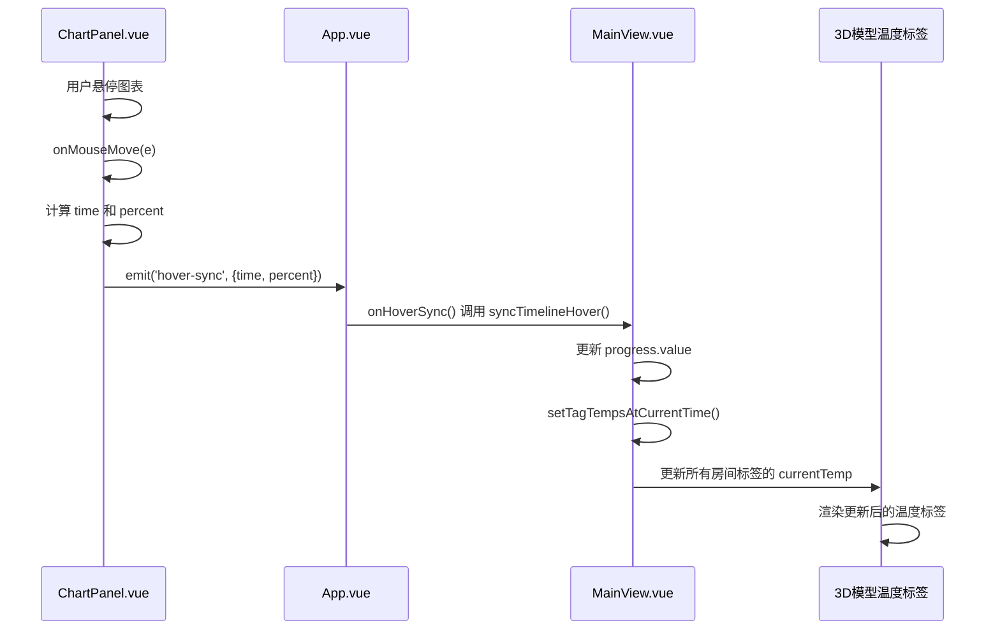

# 图表交互事件触发

<cite>
**本文档引用文件**   
- [ChartPanel.vue](file://src/components/ChartPanel.vue)
- [App.vue](file://src/App.vue)
- [MainView.vue](file://src/components/MainView.vue)
</cite>

## 目录
1. [事件触发机制](#事件触发机制)
2. [事件数据结构](#事件数据结构)
3. [事件声明与发射](#事件声明与发射)
4. [跨组件状态联动](#跨组件状态联动)

## 事件触发机制

`ChartPanel.vue` 组件中的 `onMouseMove` 函数是用户悬停图表时触发 `hover-sync` 事件的核心机制。该函数通过监听图表主体区域的 `mousemove` 事件来捕获用户的鼠标交互。

当用户将鼠标悬停在图表上时，`onMouseMove` 函数首先获取鼠标相对于图表容器的坐标。然后，它将这些坐标映射到图表的 SVG 坐标系中，计算出一个介于 0 和 1 之间的 `percent` 值，该值代表了鼠标在时间轴上的相对位置。接着，函数利用这个 `percent` 值，通过 `Math.round(percent * (displayData.value.length - 1))` 计算出最接近鼠标位置的数据点索引。这个索引被用来从 `displayData` 数据数组中获取对应的数据点对象。

**Section sources**
- [ChartPanel.vue](file://src/components/ChartPanel.vue#L190-L215)

## 事件数据结构

`hover-sync` 事件携带一个包含两个关键属性的数据对象：`time` 和 `percent`。

*   **`time`**: 该属性的值为 `point.timestamp`，即通过 `onMouseMove` 函数计算出的索引所对应的数据点的时间戳。它精确地表示了用户悬停时所选中数据点的具体时间。
*   **`percent`**: 该属性的值为 `anchorPercent`，其计算方式为 `index / (displayData.value.length - 1)`。这个值代表了所选数据点在整个时间序列中的相对位置，是一个从 0（序列开始）到 1（序列结束）的归一化数值。

**Section sources**
- [ChartPanel.vue](file://src/components/ChartPanel.vue#L203-L214)

## 事件声明与发射

`hover-sync` 事件的声明和发射遵循 Vue 3 的组合式 API 规范。

*   **事件声明**: 在 `ChartPanel.vue` 组件的 `<script setup>` 部分，通过 `defineEmits(['hover-sync'])` 语句显式声明了组件可以向外发射 `hover-sync` 事件。这是一种类型安全的事件声明方式，它定义了组件对外的事件接口。
*   **事件发射**: 在 `onMouseMove` 函数的末尾，通过调用 `emit('hover-sync', { time: point.timestamp, percent: anchorPercent })` 来触发该事件。`emit` 函数是 `defineEmits` 返回的，它接收事件名称和要传递的数据作为参数，将数据对象发送给父组件。

**Section sources**
- [ChartPanel.vue](file://src/components/ChartPanel.vue#L113)
- [ChartPanel.vue](file://src/components/ChartPanel.vue#L214)

## 跨组件状态联动

`hover-sync` 事件是实现跨组件状态联动的起点，它驱动了 3D 模型侧温度标签的更新。

当 `ChartPanel.vue` 发射 `hover-sync` 事件后，其父组件 `App.vue` 通过 `@hover-sync="onHoverSync"` 监听该事件。`App.vue` 中的 `onHoverSync` 函数接收到事件数据后，会调用 `MainView.vue` 组件实例的 `syncTimelineHover` 方法，并将 `time` 和 `percent` 作为参数传递。

`MainView.vue` 组件中的 `syncTimelineHover` 函数接收到参数后，会更新其内部的 `progress` 响应式变量。`progress` 变量的变化会触发 `setTagTempsAtCurrentTime` 函数的执行，该函数根据当前的 `progress` 值，从缓存的时序数据中查找并更新所有房间标签的温度值，从而实现了 3D 模型上温度标签的实时同步。

**Diagram sources**
- [ChartPanel.vue](file://src/components/ChartPanel.vue#L190-L215)
- [App.vue](file://src/App.vue#L1263-L1267)
- [MainView.vue](file://src/components/MainView.vue#L2434)

**Section sources**
- [App.vue](file://src/App.vue#L70-L71)
- [App.vue](file://src/App.vue#L1263-L1267)
- [MainView.vue](file://src/components/MainView.vue#L2434)