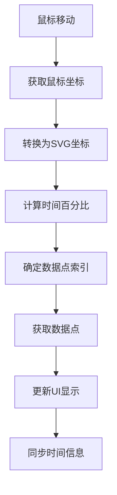
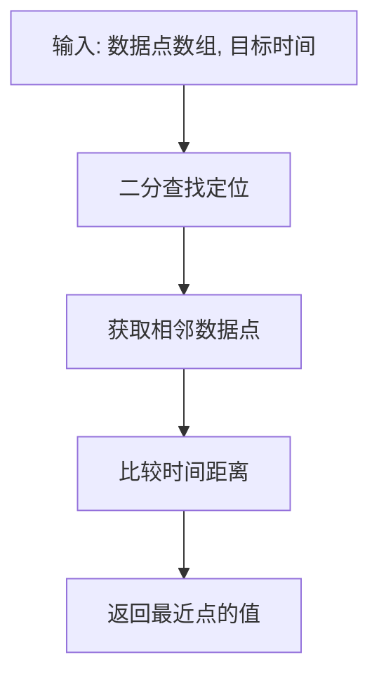
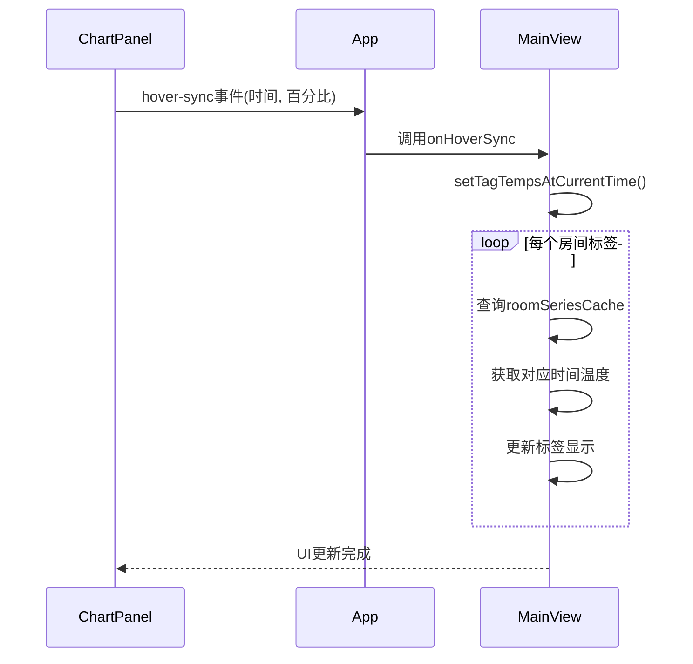

# 基于时间的数据插值

<cite>
**本文档引用的文件**
- [ChartPanel.vue](file://src/components/ChartPanel.vue)
- [MainView.vue](file://src/components/MainView.vue)
- [influx.ts](file://src/services/influx.ts)
</cite>

## 目录
1. [引言](#引言)
2. [数据插值机制概述](#数据插值机制概述)
3. [onMouseMove事件处理流程](#onmousemove事件处理流程)
4. [valueAtTime辅助函数分析](#valueattime辅助函数分析)
5. [数据同步与3D模型标签更新](#数据同步与3d模型标签更新)
6. [插值算法的重要性](#插值算法的重要性)
7. [结论](#结论)

## 引言
本文件旨在详细解释在`ChartPanel.vue`组件中，当用户在图表上进行鼠标移动操作时，系统如何通过`onMouseMove`事件处理函数结合`valueAtTime`辅助函数和`queryLatestByRooms`查询结果，实现基于时间轴的数据插值或精确查找。该机制确保了3D模型中的房间标签能够响应任意时间点的选择，提供平滑、连续的数据可视化体验。

## 数据插值机制概述
系统通过查询InfluxDB获取各房间的时序温度数据，并在用户交互时利用这些数据点进行插值计算。核心功能包括：
- 从数据库获取房间温度历史数据
- 在用户选择特定时间点时进行数据插值
- 将插值结果同步到3D模型的标签显示
- 确保数据展示的连续性和准确性

此机制的关键在于能够在离散的时序数据点之间进行合理的值估算，从而实现无缝的用户体验。

**Section sources**
- [influx.ts](file://src/services/influx.ts#L104-L133)

## onMouseMove事件处理流程
当用户在图表区域移动鼠标时，`ChartPanel.vue`中的`onMouseMove`事件处理器被触发，执行以下步骤：

1. 计算鼠标位置相对于图表容器的坐标
2. 将像素坐标转换为SVG坐标系中的位置
3. 根据SVG X坐标计算对应的时间百分比
4. 通过百分比确定最接近的数据点索引
5. 获取该索引对应的数据点信息
6. 更新悬停指示器的位置和显示值
7. 通过`hover-sync`事件将时间信息同步到父组件

该处理流程实现了用户交互与数据展示的实时联动，为后续的数据插值提供了基础。

**Diagram sources**
- [ChartPanel.vue](file://src/components/ChartPanel.vue#L191-L215)

**Section sources**
- [ChartPanel.vue](file://src/components/ChartPanel.vue#L191-L215)

## valueAtTime辅助函数分析
`valueAtTime`函数是实现时间轴数据插值的核心辅助函数，位于`MainView.vue`中。该函数采用二分查找算法快速定位最接近目标时间的数据点：

1. 接收时序数据数组和目标时间戳作为参数
2. 使用二分查找确定目标时间在数据数组中的插入位置
3. 比较前后两个相邻数据点与目标时间的距离
4. 返回距离更近的数据点的温度值

这种实现方式既保证了查找效率（O(log n)时间复杂度），又提供了合理的插值结果。对于时间序列数据而言，最近邻查找是一种简单而有效的插值策略，特别适用于温度等物理量的变化通常较为平缓的场景。

**Diagram sources**
- [MainView.vue](file://src/components/MainView.vue#L402-L410)

**Section sources**
- [MainView.vue](file://src/components/MainView.vue#L402-L410)

## 数据同步与3D模型标签更新
系统通过事件机制实现图表与3D模型之间的数据同步：

1. `ChartPanel.vue`通过`hover-sync`事件发出时间同步信号
2. `App.vue`接收并处理该事件，调用`onHoverSync`函数
3. `MainView.vue`中的`setTagTempsAtCurrentTime`函数被调用
4. 遍历所有房间标签，根据当前时间从缓存数据中获取温度值
5. 更新每个标签的显示温度
6. 触发UI重渲染

这一系列操作确保了用户在图表上选择任意时间点时，3D模型中的所有房间标签都能立即更新为对应时间的温度值，实现了跨组件的数据一致性。

**Diagram sources**
- [ChartPanel.vue](file://src/components/ChartPanel.vue#L214)
- [App.vue](file://src/App.vue#L69)
- [MainView.vue](file://src/components/MainView.vue#L412)

**Section sources**
- [ChartPanel.vue](file://src/components/ChartPanel.vue#L214)
- [App.vue](file://src/App.vue#L69)
- [MainView.vue](file://src/components/MainView.vue#L412)

## 插值算法的重要性
基于时间的数据插值机制对于实现高质量的可视化体验至关重要，主要体现在以下几个方面：

1. **用户体验连续性**：即使原始数据是离散采集的，插值算法也能提供平滑的过渡效果，避免数据跳变带来的视觉不适。

2. **任意时间点查询**：用户可以选择时间轴上的任意点，而不仅限于已有数据点，大大增强了交互灵活性。

3. **性能优化**：通过预加载和缓存时序数据，避免了频繁的数据库查询，提高了响应速度。

4. **数据完整性**：即使某些时间点的数据缺失，插值算法也能提供合理的估算值，保持展示的完整性。

5. **多维度同步**：支持多个房间标签同时更新，确保空间维度上的数据一致性。

该机制特别适用于建筑环境监控等需要实时、连续数据展示的应用场景。

## 结论
通过对`ChartPanel.vue`中`onMouseMove`事件处理的分析，我们可以看到系统如何巧妙地结合前端交互与后端数据查询，实现基于时间轴的数据插值。通过`valueAtTime`辅助函数和`queryLatestByRooms`查询结果的协同工作，系统能够为用户提供平滑、连续的数据同步体验。这种设计不仅提高了应用的可用性，也为未来的功能扩展（如更复杂的插值算法、预测性分析等）奠定了基础。