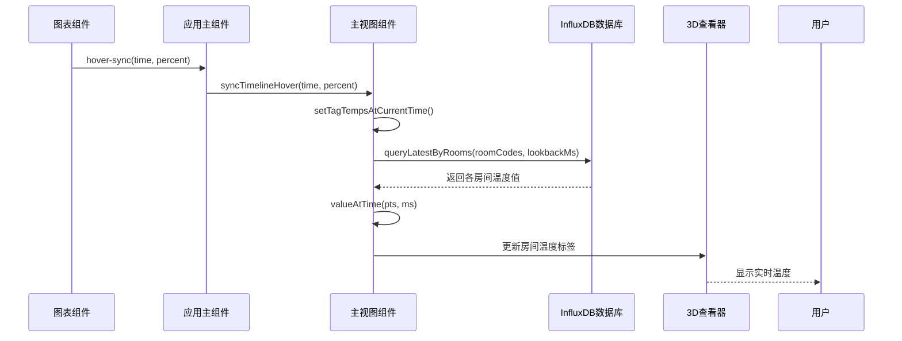

# 数据同步

<cite>
**本文档引用的文件**
- [ChartPanel.vue](file://src/components/ChartPanel.vue)
- [influx.ts](file://src/services/influx.ts)
- [MainView.vue](file://src/components/MainView.vue)
- [App.vue](file://src/App.vue)
</cite>

## 目录
1. [引言](#引言)
2. [数据同步机制概述](#数据同步机制概述)
3. [图表与3D模型的交互流程](#图表与3d模型的交互流程)
4. [关键函数分析](#关键函数分析)
5. [时间同步与插值逻辑](#时间同步与插值逻辑)
6. [用户体验与联动分析](#用户体验与联动分析)
7. [结论](#结论)

## 引言

本系统通过将时间序列数据与3D建筑模型相结合，实现了时空数据的联动可视化。用户在图表上选择特定时间点时，系统会自动更新3D模型中各房间的温度标签，从而实现数据的同步展示。这种双向同步机制增强了用户对建筑环境状态的理解，支持更直观的分析与决策。

**Section sources**
- [MainView.vue](file://src/components/MainView.vue#L401-L454)
- [ChartPanel.vue](file://src/components/ChartPanel.vue#L213)

## 数据同步机制概述

系统通过`ChartPanel.vue`组件中的鼠标悬停事件触发时间同步。当用户在图表上移动光标时，组件会计算当前光标对应的时间戳和进度百分比，并通过`hover-sync`事件向外发射。该事件被`App.vue`捕获后，调用`MainView.vue`中的`syncTimelineHover`方法，进而触发`setTagTempsAtCurrentTime`函数，更新3D模型上的温度标签。

整个流程涉及多个组件的协作：`ChartPanel`负责采集用户交互，`App`作为中间协调者，`MainView`则负责与3D Viewer和时序数据库交互，完成最终的视觉更新。

**Section sources**
- [App.vue](file://src/App.vue#L1262-L1267)
- [MainView.vue](file://src/components/MainView.vue#L411-L454)

## 图表与3D模型的交互流程

**Diagram sources**
- [ChartPanel.vue](file://src/components/ChartPanel.vue#L213)
- [App.vue](file://src/App.vue#L1262-L1267)
- [MainView.vue](file://src/components/MainView.vue#L411-L454)
- [influx.ts](file://src/services/influx.ts#L105-L134)

## 关键函数分析

### setTagTempsAtCurrentTime 函数

该函数是实现数据同步的核心。它根据当前播放进度（`progress`）计算出对应的百分比，然后遍历所有房间标签，从缓存的时序数据中查找对应时间点的温度值，并更新标签显示。若检测到低温（低于0°C），还会触发警告提示并暂停播放。

此函数通过`watch`监听`progress`和`currentTemp`的变化，确保在时间轴拖动或播放时自动更新标签。

**Section sources**
- [MainView.vue](file://src/components/MainView.vue#L411-L454)

### valueAtTime 辅助函数

该函数用于在时间序列数据中查找指定时间点的温度值。它采用二分查找算法快速定位最接近目标时间的数据点，并返回其温度值。若目标时间点前后均有数据，则选择时间差更小的那个点。

该函数不进行插值计算，而是直接返回最接近的采样值，保证了数据的原始性和查询效率。

**Section sources**
- [MainView.vue](file://src/components/MainView.vue#L401-L409)

## 时间同步与插值逻辑

系统通过`onMouseMove`事件在`ChartPanel.vue`中实时计算光标位置对应的时间戳和百分比。该信息通过事件传递至`MainView.vue`，用于驱动3D模型的更新。

尽管`valueAtTime`函数本身不执行插值，但由于InfluxDB查询返回的是经过`aggregateWindow`聚合的平滑数据，因此最终显示的温度值已具备一定的平滑特性。系统优先使用缓存的时序数据（`roomSeriesCache`），避免频繁查询数据库，提升响应速度。

**Section sources**
- [ChartPanel.vue](file://src/components/ChartPanel.vue#L191-L214)
- [MainView.vue](file://src/components/MainView.vue#L401-L409)

## 用户体验与联动分析

该双向同步机制显著提升了用户体验。用户无需切换界面即可在3D模型上直观看到任意时间点的温度分布，实现了“所见即所得”的分析模式。通过将抽象的时间序列数据与具体的物理空间关联，用户能够快速识别异常区域，支持更高效的运维决策。

此外，系统在检测到低温时自动暂停播放并弹出警告，体现了主动式监控的设计理念，有助于及时发现潜在问题。

**Section sources**
- [MainView.vue](file://src/components/MainView.vue#L439-L447)

## 结论

`ChartPanel.vue`与3D模型之间的数据同步机制通过事件驱动的方式实现了高效、实时的联动展示。`setTagTempsAtCurrentTime`函数结合`valueAtTime`辅助函数，从InfluxDB查询结果中提取指定时间点的温度值，并更新3D模型上的标签。这种设计不仅提升了数据可视化的效果，也为用户提供了强大的时空分析能力。