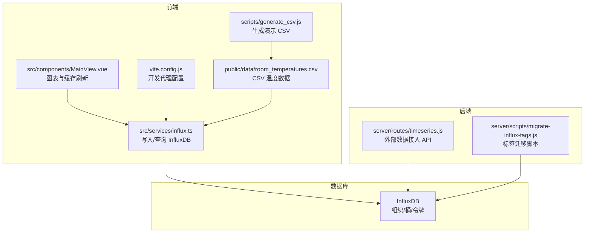
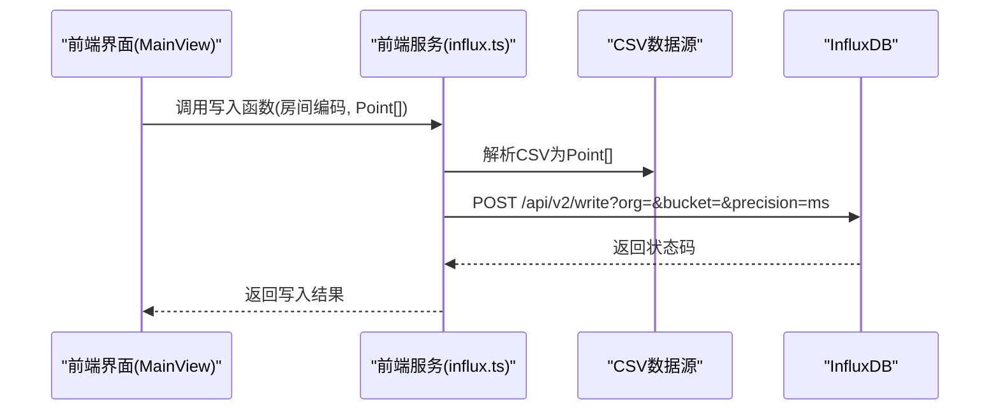
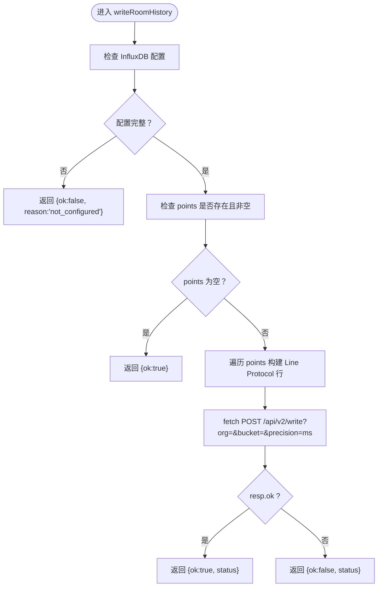
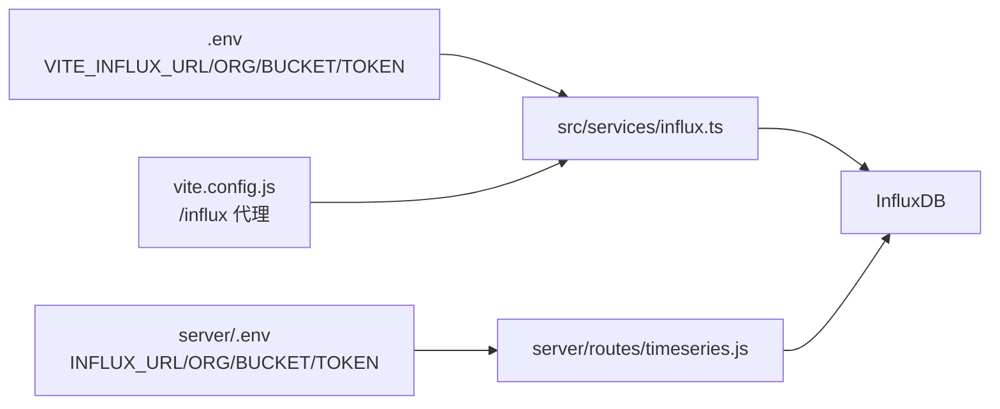

# InfluxDB数据摄取流程

<cite>
**本文引用的文件**
- [src/services/influx.ts](file://src/services/influx.ts)
- [.env](file://.env)
- [vite.config.js](file://vite.config.js)
- [public/data/room_temperatures.csv](file://public/data/room_temperatures.csv)
- [scripts/generate_csv.js](file://scripts/generate_csv.js)
- [server/routes/timeseries.js](file://server/routes/timeseries.js)
- [server/scripts/migrate-influx-tags.js](file://server/scripts/migrate-influx-tags.js)
- [src/components/MainView.vue](file://src/components/MainView.vue)
- [TIMESERIES_INGESTION.md](file://TIMESERIES_INGESTION.md)
</cite>

## 目录
1. [引言](#引言)
2. [项目结构](#项目结构)
3. [核心组件](#核心组件)
4. [架构总览](#架构总览)
5. [详细组件分析](#详细组件分析)
6. [依赖关系分析](#依赖关系分析)
7. [性能考虑](#性能考虑)
8. [故障排查指南](#故障排查指南)
9. [结论](#结论)
10. [附录](#附录)

## 引言
本文件聚焦于前端服务模块中对 InfluxDB 的数据摄取与查询能力，特别是针对 CSV 温度数据的解析与写入流程。我们将深入解析 writeRoomHistory 函数的实现细节，包括 CSV 数据解析、Line Protocol 构造、时间戳处理、标签转义策略、批量写入请求的构造与认证头设置，并说明 Point 类型在数据流中的作用。同时，我们还将梳理 InfluxDB 配置要求、环境变量设置、配置校验逻辑，以及与后端 API 的协同工作方式。

## 项目结构
本项目采用前后端分离的结构，前端通过 Vite 运行，InfluxDB 作为时序数据库，CSV 数据作为演示数据源。前端服务模块负责将 CSV 数据解析为 Point 数组并通过 HTTP 请求写入 InfluxDB；后端路由提供外部系统推送时序数据的能力，并与 InfluxDB 进行交互。

图表来源
- [src/services/influx.ts](file://src/services/influx.ts#L1-L136)
- [public/data/room_temperatures.csv](file://public/data/room_temperatures.csv#L1-L30)
- [scripts/generate_csv.js](file://scripts/generate_csv.js#L1-L72)
- [src/components/MainView.vue](file://src/components/MainView.vue#L355-L380)
- [vite.config.js](file://vite.config.js#L1-L20)
- [server/routes/timeseries.js](file://server/routes/timeseries.js#L71-L104)
- [server/scripts/migrate-influx-tags.js](file://server/scripts/migrate-influx-tags.js#L1-L134)

章节来源
- [src/services/influx.ts](file://src/services/influx.ts#L1-L136)
- [.env](file://.env#L1-L6)
- [vite.config.js](file://vite.config.js#L1-L20)
- [public/data/room_temperatures.csv](file://public/data/room_temperatures.csv#L1-L30)
- [scripts/generate_csv.js](file://scripts/generate_csv.js#L1-L72)
- [server/routes/timeseries.js](file://server/routes/timeseries.js#L71-L104)
- [server/scripts/migrate-influx-tags.js](file://server/scripts/migrate-influx-tags.js#L1-L134)
- [src/components/MainView.vue](file://src/components/MainView.vue#L355-L380)

## 核心组件
- InfluxDB 写入与查询服务：封装了写入、查询平均序列、按房间查询序列、按房间查询最新值等能力，统一管理认证头、组织与桶信息。
- CSV 数据源：提供房间温度的历史数据，包含时间戳列与多个房间列。
- 生成脚本：根据模板生成指定天数、间隔与房间数量的 CSV 文件，便于本地演示。
- 前端组件：负责拉取与缓存房间序列数据，驱动图表渲染与实时刷新。
- 后端 API：接收外部系统推送的 JSON 数据，转换为 Line Protocol 并写入 InfluxDB。

章节来源
- [src/services/influx.ts](file://src/services/influx.ts#L1-L136)
- [public/data/room_temperatures.csv](file://public/data/room_temperatures.csv#L1-L30)
- [scripts/generate_csv.js](file://scripts/generate_csv.js#L1-L72)
- [src/components/MainView.vue](file://src/components/MainView.vue#L355-L380)
- [server/routes/timeseries.js](file://server/routes/timeseries.js#L71-L104)

## 架构总览
前端通过 Vite 开发服务器访问 InfluxDB 的 API。在开发环境下，可通过代理将 /influx 前缀重写到 InfluxDB 实例，简化跨域与路径配置。CSV 数据经前端解析后，按 Line Protocol 格式批量写入 InfluxDB；后端提供外部系统推送接口，同样将 JSON 数据转换为 Line Protocol 写入 InfluxDB。

图表来源
- [src/services/influx.ts](file://src/services/influx.ts#L26-L37)
- [public/data/room_temperatures.csv](file://public/data/room_temperatures.csv#L1-L30)
- [src/components/MainView.vue](file://src/components/MainView.vue#L355-L380)

## 详细组件分析

### writeRoomHistory 函数实现与数据流
- 输入参数
  - roomCode: 房间编码字符串
  - points: Point[]，其中 Point = { timestamp: number; value: number }
- 配置校验
  - isInfluxConfigured(): 校验 URL、组织、桶与令牌或 Basic 认证信息是否完整
- 数据解析与构造
  - 若 points 为空，直接返回成功
  - 对每个 Point，构造一行 Line Protocol 文本，格式为：measurement,tag=value field=value timestamp
  - measurement 固定为 room_temp，tag 为 room=escTag(roomCode)，field 为 value，timestamp 为毫秒级
  - escTag(roomCode) 将房间编码中的逗号、等号、空格替换为下划线，避免标签冲突
- 请求构造
  - 目标 URL: /api/v2/write?org=...&bucket=...&precision=ms
  - 方法: POST
  - Content-Type: text/plain; charset=utf-8
  - Authorization: Token 或 Basic
  - Body: 多行 Line Protocol 文本，以换行符拼接
- 返回值
  - { ok: boolean; status?: number; reason?: string }

图表来源
- [src/services/influx.ts](file://src/services/influx.ts#L9-L13)
- [src/services/influx.ts](file://src/services/influx.ts#L22-L24)
- [src/services/influx.ts](file://src/services/influx.ts#L26-L37)

章节来源
- [src/services/influx.ts](file://src/services/influx.ts#L9-L13)
- [src/services/influx.ts](file://src/services/influx.ts#L22-L24)
- [src/services/influx.ts](file://src/services/influx.ts#L26-L37)

### 时间戳处理与 Line Protocol 格式
- 时间戳来源
  - CSV 中的时间戳列采用 ISO 8601 字符串
  - 前端解析为毫秒时间戳
- Line Protocol 构造
  - measurement: room_temp
  - tag: room=escTag(roomCode)
  - field: value=数值
  - timestamp: 毫秒时间戳
- 写入精度
  - precision=ms，确保与前端时间戳一致

章节来源
- [public/data/room_temperatures.csv](file://public/data/room_temperatures.csv#L1-L30)
- [src/services/influx.ts](file://src/services/influx.ts#L26-L37)

### 房间编码转义（escTag）
- 目的：避免标签中包含特殊字符导致 Line Protocol 解析错误
- 规则：将逗号、等号、空格替换为下划线
- 应用场景：写入与查询时均对 roomCode 进行转义，保证一致性

章节来源
- [src/services/influx.ts](file://src/services/influx.ts#L22-L24)
- [server/scripts/migrate-influx-tags.js](file://server/scripts/migrate-influx-tags.js#L163-L164)

### Point 类型与数据模型
- Point 定义：{ timestamp: number; value: number }
- 用途：作为写入与查询的统一数据载体
- 写入侧：由 CSV 解析得到的数值与时间戳组合为 Point[]
- 查询侧：从 CSV 响应中解析出 _time 与 _value，映射为 Point[]

章节来源
- [src/services/influx.ts](file://src/services/influx.ts#L24-L25)
- [src/services/influx.ts](file://src/services/influx.ts#L57-L69)
- [src/services/influx.ts](file://src/services/influx.ts#L88-L102)

### CSV 数据解析与生成
- 解析规则
  - 第一列为 timestamp，其余列为各房间的温度值
  - 每行生成一个时间戳与多个房间值的记录
- 生成脚本
  - 生成固定天数、固定间隔、固定房间数量的 CSV
  - 用于本地演示与测试

章节来源
- [public/data/room_temperatures.csv](file://public/data/room_temperatures.csv#L1-L30)
- [scripts/generate_csv.js](file://scripts/generate_csv.js#L1-L72)

### 前端缓存与自动刷新
- 缓存策略
  - 按房间代码缓存序列数据，窗口大小根据可视范围动态计算
- 自动刷新
  - 定期触发刷新，拉取最新温度与历史序列，更新界面显示

章节来源
- [src/components/MainView.vue](file://src/components/MainView.vue#L355-L380)
- [src/components/MainView.vue](file://src/components/MainView.vue#L2503-L2539)

### 后端外部数据接入（对比参考）
- 接口：POST /api/v1/timeseries/streams/{spaceCode}?key={apiKey}
- 数据格式：JSON，支持多字段与可选 timestamp
- 转换：将 JSON 字段转换为 Line Protocol，measurement 为字段名，tag 为 room=spaceCode, code=spaceCode
- 写入：调用 /api/v2/write?org=&bucket=&precision=ms

章节来源
- [server/routes/timeseries.js](file://server/routes/timeseries.js#L71-L104)
- [TIMESERIES_INGESTION.md](file://TIMESERIES_INGESTION.md#L130-L144)

## 依赖关系分析
- 前端服务依赖
  - import.meta.env 中的 VITE_INFLUX_* 环境变量
  - Vite 开发代理配置，将 /influx 重写到 InfluxDB
- 后端路由依赖
  - server/.env 中的 INFLUX_* 环境变量
  - API Key 机制用于外部数据接入的安全性
- 数据一致性
  - 前端与后端均使用相同的 Line Protocol 格式与标签策略，确保查询与聚合的一致性

图表来源
- [.env](file://.env#L1-L6)
- [vite.config.js](file://vite.config.js#L1-L20)
- [src/services/influx.ts](file://src/services/influx.ts#L1-L13)
- [server/routes/timeseries.js](file://server/routes/timeseries.js#L71-L104)

章节来源
- [.env](file://.env#L1-L6)
- [vite.config.js](file://vite.config.js#L1-L20)
- [src/services/influx.ts](file://src/services/influx.ts#L1-L13)
- [server/routes/timeseries.js](file://server/routes/timeseries.js#L71-L104)

## 性能考虑
- 批量写入
  - 将多个 Point 组合成多行 Line Protocol，减少网络往返次数
- 时间窗口聚合
  - 查询时使用聚合窗口与分组，降低数据量，提升图表渲染性能
- 缓存策略
  - 按房间缓存序列数据，避免重复请求
- 精度与范围
  - precision=ms 与合理的窗口大小，平衡精度与性能

[本节为通用建议，无需特定文件引用]

## 故障排查指南
- 配置未就绪
  - 现象：写入返回 {ok:false, reason:'not_configured'}
  - 排查：确认 .env 中 VITE_INFLUX_URL/ORG/BUCKET/TOKEN 是否正确设置
- 认证失败
  - 现象：写入返回 {ok:false, status}，后端返回 401/403
  - 排查：核对 Token 或 Basic 用户密码；确认 InfluxDB 组织与桶权限
- Line Protocol 格式错误
  - 现象：写入返回 400
  - 排查：检查 measurement、tag、field、timestamp 格式；确保 escTag 正确转义
- 查询无数据
  - 现象：查询返回空数组
  - 排查：确认 measurement 与 tag 名称一致；检查时间范围与窗口大小
- 代理与跨域
  - 现象：开发环境请求被拦截
  - 排查：确认 vite.config.js 中 /influx 代理配置

章节来源
- [src/services/influx.ts](file://src/services/influx.ts#L9-L13)
- [src/services/influx.ts](file://src/services/influx.ts#L26-L37)
- [src/services/influx.ts](file://src/services/influx.ts#L57-L69)
- [src/services/influx.ts](file://src/services/influx.ts#L88-L102)
- [vite.config.js](file://vite.config.js#L1-L20)

## 结论
writeRoomHistory 函数通过标准化的 Line Protocol 构造与批量写入，实现了从 CSV 到 InfluxDB 的高效数据摄取。配合 escTag 转义、精确的时间戳处理与统一的 Point 数据模型，确保了数据的一致性与可查询性。结合前端缓存与自动刷新机制，能够为可视化与分析提供稳定的数据基础。后端外部数据接入 API 与前端服务共享相同的数据格式与标签策略，便于整体架构的一致性维护。

[本节为总结性内容，无需特定文件引用]

## 附录

### 环境变量与配置要点
- 前端（Vite）
  - VITE_INFLUX_URL：InfluxDB 地址
  - VITE_INFLUX_ORG：组织
  - VITE_INFLUX_BUCKET：桶
  - VITE_INFLUX_TOKEN：令牌
  - VITE_INFLUX_BASIC/VITE_INFLUX_USER/VITE_INFLUX_PASSWORD：Basic 认证可选
- 后端（Express）
  - INFLUX_URL/ORG/BUCKET/TOKEN：与前端对应
  - API_KEY_SECRET：用于生成安全 API Key

章节来源
- [.env](file://.env#L1-L6)
- [server/routes/timeseries.js](file://server/routes/timeseries.js#L71-L104)
- [TIMESERIES_INGESTION.md](file://TIMESERIES_INGESTION.md#L107-L121)

### 数据模型与查询要点
- Line Protocol
  - measurement: room_temp
  - tag: room=escTag(roomCode), code=escTag(roomCode)
  - field: value
  - timestamp: 毫秒
- 查询
  - 使用 Flux 过滤 measurement 与 field
  - 使用 group(columns: ["_time"]) 或 group(columns: ["code"]) 进行聚合
  - 使用 mean/min/last 等聚合函数

章节来源
- [src/services/influx.ts](file://src/services/influx.ts#L26-L37)
- [src/services/influx.ts](file://src/services/influx.ts#L57-L69)
- [src/services/influx.ts](file://src/services/influx.ts#L88-L102)
- [server/scripts/migrate-influx-tags.js](file://server/scripts/migrate-influx-tags.js#L163-L164)