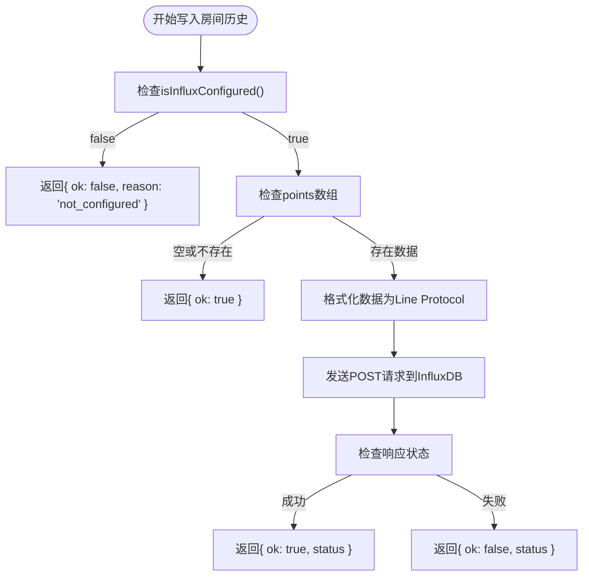
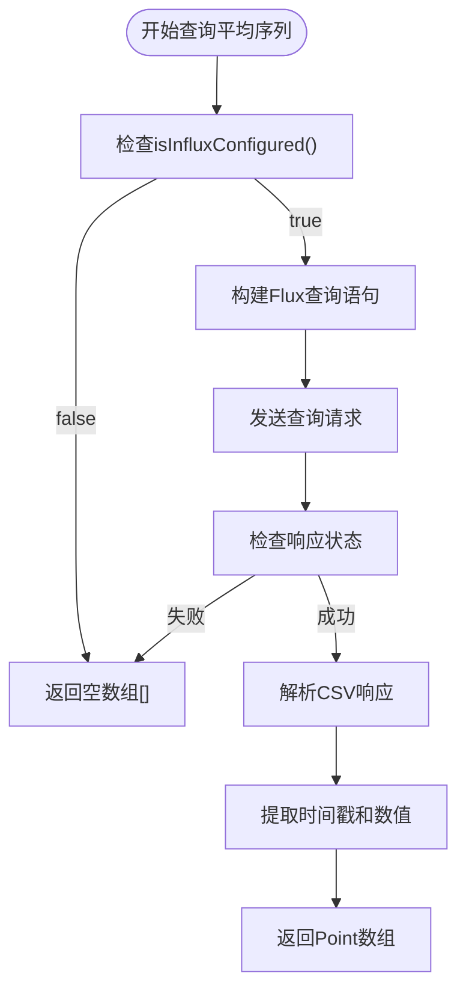
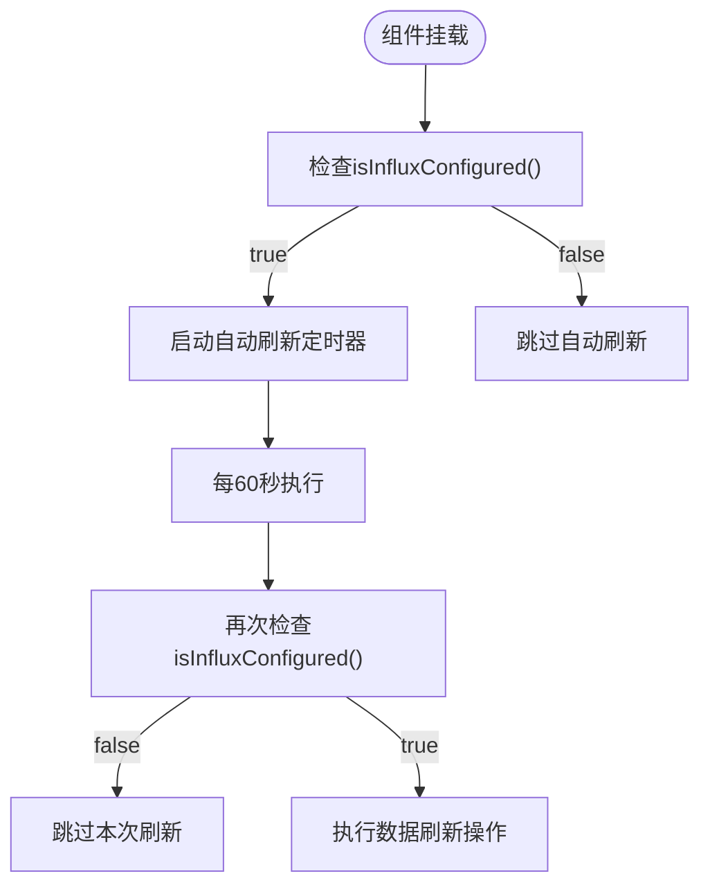
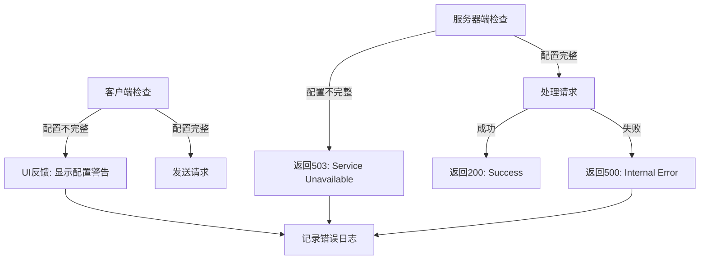

# InfluxDB配置验证机制

<cite>
**本文档引用文件**  
- [influx.ts](file://src/services/influx.ts)
- [.env](file://.env)
- [.env.local](file://.env.local)
- [server/.env](file://server/.env)
- [MainView.vue](file://src/components/MainView.vue)
- [timeseries.js](file://server/routes/timeseries.js)
</cite>

## 目录
1. [函数实现逻辑](#函数实现逻辑)
2. [前置校验作用](#前置校验作用)
3. [条件控制流程](#条件控制流程)
4. [常见配置遗漏场景](#常见配置遗漏场景)
5. [错误处理建议](#错误处理建议)

## 函数实现逻辑

`isInfluxConfigured`函数通过检查环境变量和认证凭据来判断InfluxDB服务是否已正确配置。该函数位于`src/services/influx.ts`文件中，其核心逻辑是验证四个关键环境变量`VITE_INFLUX_URL`、`VITE_INFLUX_ORG`、`VITE_INFLUX_BUCKET`以及认证凭据（Token或Basic Auth）是否存在且有效。

函数首先从`import.meta.env`中读取相关环境变量：
- `VITE_INFLUX_URL`: InfluxDB服务的访问地址
- `VITE_INFLUX_ORG`: 组织名称
- `VITE_INFLUX_BUCKET`: 数据存储桶名称
- `VITE_INFLUX_TOKEN`: 认证Token
- `VITE_INFLUX_BASIC`: 是否使用Basic认证
- `VITE_INFLUX_USER`和`VITE_INFLUX_PASSWORD`: Basic认证的用户名和密码

验证逻辑采用布尔表达式`!!(url && org && bucket && (token || (useBasic && basicUser && basicPass)))`，要求URL、组织和存储桶必须同时存在，而认证方式可以是Token或Basic认证中的一种。这种设计提供了灵活的认证选择，同时确保了基本连接信息的完整性。

项目中存在多个环境配置文件（`.env`、`.env.local`和`server/.env`），这些文件提供了不同环境下的配置值，形成了多层次的配置管理体系。

**Section sources**
- [influx.ts](file://src/services/influx.ts#L1-L9)
- [.env](file://.env#L2-L5)
- [.env.local](file://.env.local#L1-L7)
- [server/.env](file://server/.env#L12-L15)

## 前置校验作用

`isInfluxConfigured`函数在数据写入和查询操作前起到了关键的前置校验作用，有效防止了因缺失配置而导致的API调用失败。该函数作为保护性检查机制，确保只有在InfluxDB服务正确配置的情况下才执行后续的数据操作。

在`writeRoomHistory`函数中，如果`isInfluxConfigured()`返回false，函数会立即返回`{ ok: false, reason: 'not_configured' }`，避免了无效的网络请求。同样，在`queryAverageSeries`、`queryRoomSeries`和`queryLatestByRooms`等查询函数中，如果配置未完成，函数会直接返回空数组或空对象，防止向未配置的InfluxDB实例发送查询请求。

这种前置校验机制不仅提高了系统的健壮性，还优化了性能，避免了不必要的网络开销。通过在调用InfluxDB API之前进行本地检查，系统能够快速响应配置问题，而不是等待网络超时或接收服务器错误响应。

此外，该函数还在`MainView.vue`组件中被广泛使用，用于控制各种功能的启用状态。例如，在自动刷新、图表数据加载和房间时序缓存更新等操作前都会检查InfluxDB配置状态，确保只有在服务可用时才执行相关操作。

**Section sources**
- [influx.ts](file://src/services/influx.ts#L26-L27)
- [influx.ts](file://src/services/influx.ts#L39-L40)
- [influx.ts](file://src/services/influx.ts#L72-L73)
- [influx.ts](file://src/services/influx.ts#L105-L106)
- [MainView.vue](file://src/components/MainView.vue#L351-L368)

## 条件控制流程

`isInfluxConfigured`函数的布尔返回值在多个关键函数中作为条件控制流程的基础，确保了系统在InfluxDB配置不完整时能够优雅降级而非崩溃。

在`writeRoomHistory`函数中，条件控制流程如下：

**Diagram sources**
- [influx.ts](file://src/services/influx.ts#L26-L36)

在数据查询场景中，如`queryAverageSeries`函数，条件控制流程更为简洁：

**Diagram sources**
- [influx.ts](file://src/services/influx.ts#L39-L69)

在`MainView.vue`组件中，该函数被用于更复杂的条件控制，如自动刷新机制：

**Diagram sources**
- [MainView.vue](file://src/components/MainView.vue#L2486-L2559)

## 常见配置遗漏场景

在实际使用中，存在多种常见的配置遗漏场景，这些场景会导致`isInfluxConfigured`函数返回false，从而影响InfluxDB相关功能的正常使用。

最常见的配置遗漏是缺少`VITE_INFLUX_TOKEN`环境变量。尽管系统支持Basic认证作为替代方案，但在大多数部署中Token认证是首选方式。当Token缺失时，即使其他配置都正确，服务也无法通过认证。

另一个常见问题是`VITE_INFLUX_URL`配置错误或缺失。由于这是连接InfluxDB的基础，URL的任何错误（如协议错误、端口错误或主机名错误）都会导致连接失败。特别需要注意的是，在`.env.local`文件中配置了相对路径`/influx`，这需要正确的代理配置才能正常工作。

`VITE_INFLUX_ORG`和`VITE_INFLUX_BUCKET`的配置遗漏也是常见问题。这两个参数指定了数据存储的具体位置，缺失任何一个都会导致写入或查询操作无法定位到正确的数据源。

在认证配置方面，当启用Basic认证（`VITE_INFLUX_BASIC=true`）时，必须同时提供`VITE_INFLUX_USER`和`VITE_INFLUX_PASSWORD`。如果只提供其中一个，或者提供的凭据不正确，都会导致认证失败。

环境配置文件的优先级问题也可能导致配置遗漏。项目中存在多个环境文件（`.env`、`.env.local`等），如果配置分散在不同文件中或者存在冲突，可能会导致预期的配置未被正确加载。

**Section sources**
- [.env](file://.env#L2-L5)
- [.env.local](file://.env.local#L1-L7)
- [influx.ts](file://src/services/influx.ts#L1-L7)

## 错误处理建议

针对`isInfluxConfigured`函数可能返回的配置问题，系统应实施全面的错误处理策略，以提高用户体验和系统可靠性。

首先，建议在应用启动时进行配置完整性检查，并向用户提供清晰的错误信息。可以在控制台输出详细的配置状态，如`console.warn('⚠️ InfluxDB 未配置，无法加载图表数据')`，帮助开发者快速定位问题。

对于生产环境，建议实现配置验证的可视化提示。当`isInfluxConfigured()`返回false时，可以在用户界面显示友好的提示信息，而不是简单地禁用相关功能。例如，可以显示"数据服务未连接，请检查系统配置"之类的提示。

在服务器端，`timeseries.js`文件中的处理方式值得借鉴。当检测到InfluxDB未配置时，返回HTTP 503状态码（Service Unavailable）和明确的错误信息" InfluxDB not configured on server"。这种标准化的错误响应有助于客户端进行统一处理。

建议实施分层的错误处理机制：

**Diagram sources**
- [timeseries.js](file://server/routes/timeseries.js#L185-L189)

此外，建议实现配置热重载功能，允许在不重启应用的情况下更新InfluxDB配置。这样，当用户修正配置错误后，系统可以自动检测到变化并恢复服务，而不需要手动刷新页面。

最后，建议添加详细的文档说明，列出所有必需的环境变量及其作用，帮助部署人员正确配置系统。同时，可以提供配置示例文件（如`.env.example`），作为配置参考。

**Section sources**
- [timeseries.js](file://server/routes/timeseries.js#L185-L189)
- [influx.ts](file://src/services/influx.ts#L9)