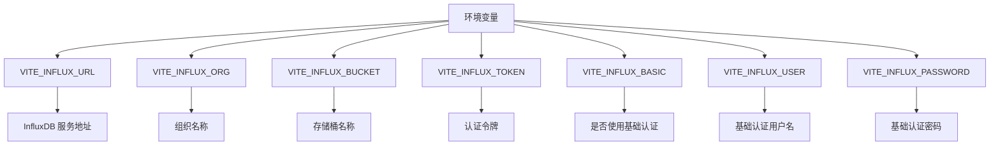
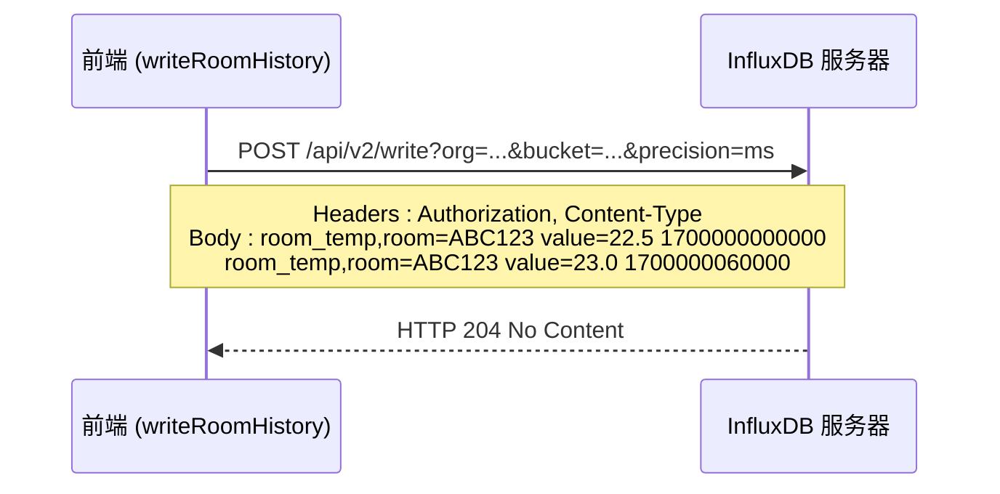

# 数据写入操作实现细节

<cite>
**本文档引用的文件**  
- [influx.ts](file://src/services/influx.ts)
- [.env](file://.env)
- [.env.local](file://.env.local)
- [timeseries.js](file://server/routes/timeseries.js)
</cite>

## 目录
1. [简介](#简介)
2. [核心数据写入流程](#核心数据写入流程)
3. [配置与环境变量](#配置与环境变量)
4. [数据格式化与安全处理](#数据格式化与安全处理)
5. [HTTP请求构造与发送](#http请求构造与发送)
6. [响应处理与返回结果](#响应处理与返回结果)
7. [服务端写入接口对比](#服务端写入接口对比)
8. [总结](#总结)

## 简介
本文档全面解析前端服务中 `writeRoomHistory` 函数的数据写入流程。该函数负责将房间温度历史数据批量写入 InfluxDB 时间序列数据库，涵盖从参数验证、数据格式化、请求构造到响应处理的完整生命周期。文档同时对比分析了服务端提供的 `/streams/:spaceCode` 接口，揭示前后端写入机制的异同。

## 核心数据写入流程

`writeRoomHistory` 函数是前端直接与 InfluxDB 交互的核心方法，其执行流程如下：

1.  **参数接收**：函数接收两个参数：`roomCode`（房间编码字符串）和 `points`（包含 `timestamp` 和 `value` 字段的 `Point[]` 数组）。
2.  **前置验证**：首先检查 InfluxDB 的配置状态，然后验证 `points` 数组的有效性。
3.  **数据转换**：将每个 `Point` 对象转换为符合 InfluxDB Line Protocol 的字符串。
4.  **批量构建**：使用换行符连接所有数据点字符串，形成批量写入的请求体。
5.  **发起请求**：构造并发送 HTTP POST 请求至 InfluxDB 的写入端点。
6.  **处理响应**：根据 HTTP 响应状态码生成并返回结果对象。

**Section sources**
- [influx.ts](file://src/services/influx.ts#L26-L37)

## 配置与环境变量
函数的执行依赖于一系列从环境变量中读取的配置项，这些配置定义了 InfluxDB 的连接信息和认证方式。

**Diagram sources**
- [.env](file://.env#L1-L6)
- [.env.local](file://.env.local#L1-L7)

**Section sources**
- [influx.ts](file://src/services/influx.ts#L1-L9)

## 数据格式化与安全处理
在发送数据前，函数会进行严格的数据格式化和安全处理。

1.  **配置验证**：通过 `isInfluxConfigured()` 函数检查所有必需的配置项（URL、org、bucket）是否已设置，并且至少存在 Token 认证或基础认证（Basic Auth）中的一种。
2.  **空数据处理**：如果 `points` 数组为空或未提供，函数会直接返回 `{ ok: true }`，避免发送无效请求。
3.  **Line Protocol 格式化**：使用 `Array.map()` 方法遍历 `points` 数组，为每个数据点生成一行 Line Protocol 字符串。其格式为：
    `measurement,tag_key=tag_value field_key=field_value timestamp`
    在本例中，具体格式为：`room_temp,room=${escTag(roomCode)} value=${p.value} ${p.timestamp}`。
4.  **标签安全转义**：在插入 `roomCode` 作为标签值之前，会调用 `escTag` 函数。该函数使用正则表达式 `/[,= ]/g` 将标签值中的逗号（`,`）、等号（`=`）和空格（` `）替换为下划线（`_`），防止这些特殊字符破坏 Line Protocol 的语法结构。
5.  **批量请求体构建**：使用 `Array.join('\n')` 方法将所有格式化后的数据点字符串用换行符连接，形成一个包含多行数据的纯文本请求体，实现高效的批量写入。

**Section sources**
- [influx.ts](file://src/services/influx.ts#L27-L31)

## HTTP请求构造与发送
函数使用 `fetch` API 构造并发送一个标准的 HTTP POST 请求。

1.  **目标URL**：请求的目标URL由 `url` 基础地址和 `/api/v2/write` 端点组成。查询参数（Query Parameters）用于指定写入的上下文：
    *   `org`：指定目标组织，值为 `encodeURIComponent(org)`，确保特殊字符被正确编码。
    *   `bucket`：指定目标存储桶，同样经过 `encodeURIComponent` 编码。
    *   `precision=ms`：指定时间戳的精度为毫秒（milliseconds）。
2.  **请求头（Headers）**：请求头通过 `headersWrite()` 函数生成，包含：
    *   `Authorization`：根据配置选择认证方式。若使用基础认证，则为 `Basic <base64编码的用户名:密码>`；否则为 `Token <令牌值>`。
    *   `Content-Type`：设置为 `text/plain; charset=utf-8`，明确告知服务器请求体是纯文本格式。
3.  **请求体（Body）**：请求体即为上一步构建的、由换行符分隔的多行 Line Protocol 字符串。
4.  **请求方法**：使用 `POST` 方法。

**Diagram sources**
- [influx.ts](file://src/services/influx.ts#L32-L35)

**Section sources**
- [influx.ts](file://src/services/influx.ts#L11-L14)
- [influx.ts](file://src/services/influx.ts#L32-L35)

## 响应处理与返回结果
函数对 `fetch` 返回的 `Response` 对象进行处理，并返回一个结构化的结果对象。

1.  **响应检查**：函数不检查响应的具体内容，而是直接读取 `Response.ok` 和 `Response.status` 属性。
2.  **结果返回**：返回一个包含两个字段的对象：
    *   `ok`：一个布尔值，直接映射自 `resp.ok`。如果 HTTP 状态码在 200-299 范围内，则为 `true`，表示请求成功（InfluxDB 接受了写入请求）。即使写入的数据本身有问题，只要请求格式正确，InfluxDB 通常也会返回 204，此时 `ok` 仍为 `true`。
    *   `status`：一个数字，表示 HTTP 响应状态码（如 204、400、401、500 等），用于提供更详细的错误信息。

此设计简化了前端逻辑，将错误处理的责任部分交给了调用者。

**Section sources**
- [influx.ts](file://src/services/influx.ts#L36-L37)

## 服务端写入接口对比
项目中还存在一个服务端路由 `server/routes/timeseries.js`，它提供了一个 `/streams/:spaceCode` 的 API 端点，用于接收外部系统的时序数据。

| 特性 | 前端 `writeRoomHistory` | 服务端 `/streams/:spaceCode` |
| :--- | :--- | :--- |
| **调用方** | 前端应用 | 外部系统、IoT设备 |
| **认证方式** | Token 或 Basic Auth (来自前端环境变量) | 基于 `spaceCode` 生成的 HMAC API Key |
| **数据格式** | Line Protocol (直接) | JSON 对象 |
| **数据处理** | 前端直接格式化 | 服务端接收 JSON 后转换为 Line Protocol |
| **安全性** | 依赖前端环境安全 | 通过 API Key 验证数据来源 |
| **主要用途** | 前端内部数据写入 | 对外提供数据接入服务 |

两者虽然最终都写入 InfluxDB，但设计目的和使用场景不同。`writeRoomHistory` 是一个内部便捷函数，而 `/streams/:spaceCode` 是一个安全的、对外的 API 接口。

**Section sources**
- [timeseries.js](file://server/routes/timeseries.js#L54-L104)

## 总结
`writeRoomHistory` 函数实现了一个高效且安全的前端到 InfluxDB 的数据写入通道。其流程清晰，从配置验证开始，通过 `escTag` 确保标签安全，利用 Line Protocol 和批量写入优化性能，最终通过标准的 HTTP 请求与数据库交互。返回的 `ok` 和 `status` 字段为调用者提供了必要的成功/失败信息。该函数是前端应用实现时序数据持久化的关键组件。