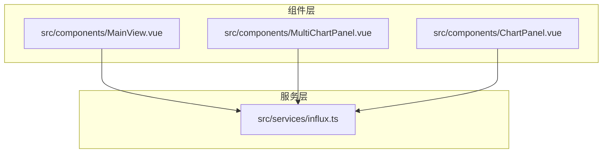
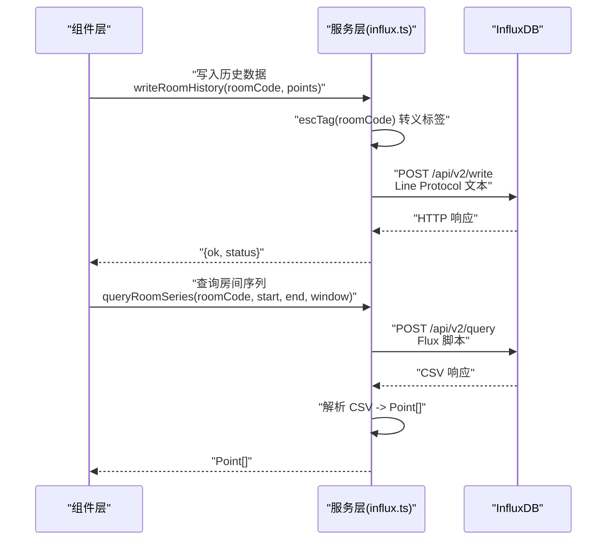
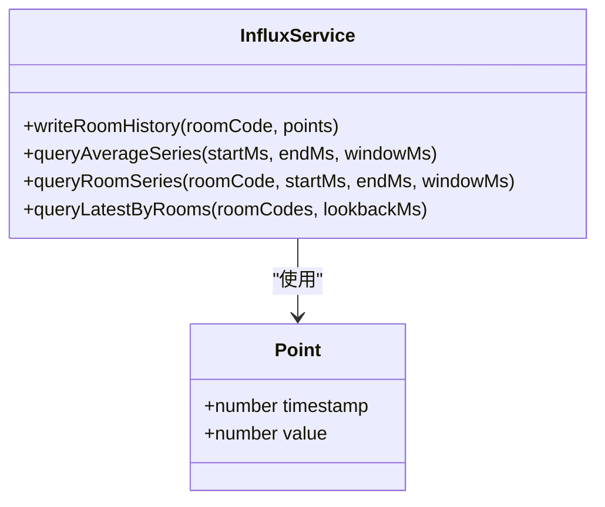
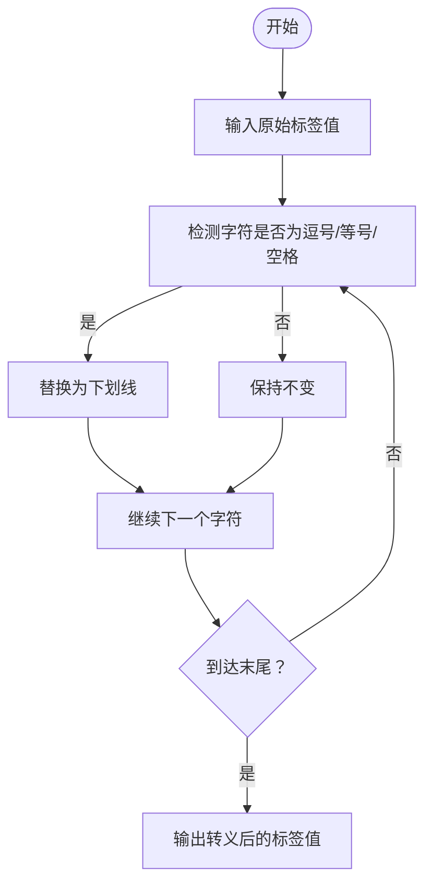
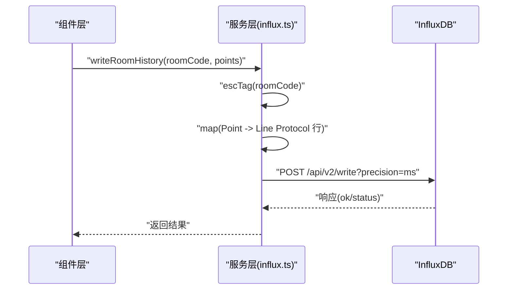
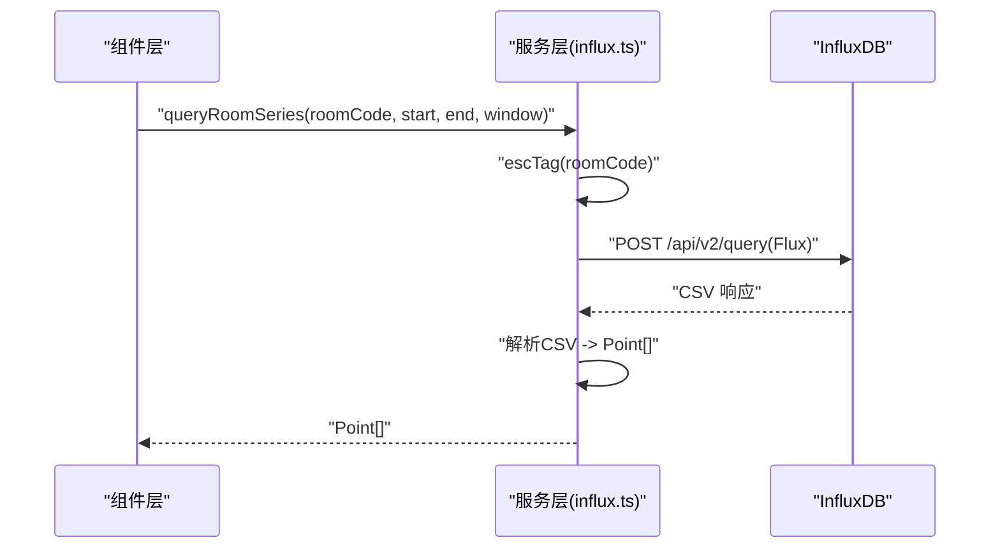
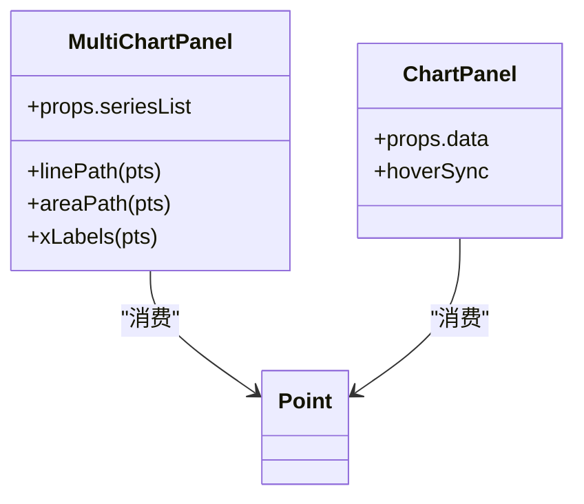
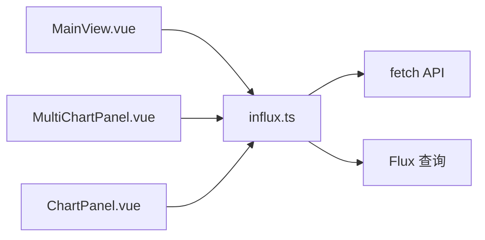

# 数据模型定义与标签转义

<cite>
**本文引用的文件**
- [influx.ts](file://src/services/influx.ts)
- [MainView.vue](file://src/components/MainView.vue)
- [MultiChartPanel.vue](file://src/components/MultiChartPanel.vue)
- [ChartPanel.vue](file://src/components/ChartPanel.vue)
</cite>

## 目录
1. [引言](#引言)
2. [项目结构](#项目结构)
3. [核心组件](#核心组件)
4. [架构总览](#架构总览)
5. [详细组件分析](#详细组件分析)
6. [依赖分析](#依赖分析)
7. [性能考虑](#性能考虑)
8. [故障排查指南](#故障排查指南)
9. [结论](#结论)

## 引言
本文聚焦于时序数据模型与标签转义在系统中的设计与应用，重点解析以下内容：
- Point 接口作为通用时序数据模型的作用与使用边界
- escTag 函数对房间编码等标签进行字符转义，以满足 InfluxDB Line Protocol 的要求
- 写入与查询流程中 Point 的传递方式与数据完整性保障
- 实际字符串转换示例与必要性说明，以及该处理在保证数据完整性方面的关键作用

## 项目结构
围绕时序数据与 InfluxDB 的交互，主要涉及以下模块：
- 服务层：提供 InfluxDB 写入与查询能力，并定义 Point 类型与标签转义工具
- 组件层：负责从服务层拉取时序数据并渲染图表，同时维护房间标签与时间范围等上下文

**图表来源**
- [influx.ts](file://src/services/influx.ts#L1-L136)
- [MainView.vue](file://src/components/MainView.vue#L355-L380)
- [MultiChartPanel.vue](file://src/components/MultiChartPanel.vue#L93-L110)
- [ChartPanel.vue](file://src/components/ChartPanel.vue#L107-L116)

**章节来源**
- [influx.ts](file://src/services/influx.ts#L1-L136)
- [MainView.vue](file://src/components/MainView.vue#L355-L380)

## 核心组件
- Point 类型：统一表示“时间戳-数值”的时序数据点，便于跨模块传递与处理
- escTag 函数：对标签值进行字符转义，确保 Line Protocol 格式合法，避免写入失败

上述两个组件在写入与查询流程中承担关键职责，贯穿数据从采集到可视化的全链路。

**章节来源**
- [influx.ts](file://src/services/influx.ts#L22-L24)

## 架构总览
时序数据在系统中的流转路径如下：
- 写入路径：前端组件准备 Point 数组，调用写入函数，经由服务层构造 Line Protocol 并写入 InfluxDB
- 查询路径：前端组件发起查询请求，服务层执行 Flux 查询并解析 CSV，返回 Point 数组供组件渲染

**图表来源**
- [influx.ts](file://src/services/influx.ts#L26-L37)
- [influx.ts](file://src/services/influx.ts#L72-L103)

**章节来源**
- [influx.ts](file://src/services/influx.ts#L26-L37)
- [influx.ts](file://src/services/influx.ts#L72-L103)

## 详细组件分析

### Point 类型：时序数据通用模型
- 定义位置与含义
  - 在服务层中定义为包含时间戳与数值的简单对象，作为时序数据的最小单元
- 使用场景
  - 写入：将一组 Point 组装为 Line Protocol 行，批量写入
  - 查询：将 CSV 解析为 Point 数组，供组件渲染
- 传递方式
  - 写入：writeRoomHistory 接收 roomCode 与 Point[]，内部将每个 Point 转换为一行文本
  - 查询：queryAverageSeries 与 queryRoomSeries 返回 Point[]；组件层据此绘制曲线
- 数据完整性
  - 通过统一的数据结构，确保前后端对时间与数值的理解一致，减少解析歧义

**图表来源**
- [influx.ts](file://src/services/influx.ts#L22-L24)
- [influx.ts](file://src/services/influx.ts#L26-L37)
- [influx.ts](file://src/services/influx.ts#L39-L103)

**章节来源**
- [influx.ts](file://src/services/influx.ts#L22-L24)
- [influx.ts](file://src/services/influx.ts#L26-L37)
- [influx.ts](file://src/services/influx.ts#L39-L103)

### escTag 函数：标签字符转义
- 设计目标
  - 将标签值中的逗号、等号、空格替换为下划线，以满足 InfluxDB Line Protocol 的字段与标签语法要求
- 实现位置与行为
  - 在服务层中定义，接收任意字符串，返回转义后的字符串
- 必要性与示例
  - 若房间编码包含逗号或空格，直接写入会导致 Line Protocol 解析错误，进而导致写入失败
  - 通过转义，可确保标签值在协议层面合法，从而保证写入成功与后续查询稳定
- 在流程中的应用
  - 写入：在构造 Line Protocol 时对 roomCode 进行转义
  - 查询：在过滤条件中对房间码进行转义，确保查询命中正确标签

**图表来源**
- [influx.ts](file://src/services/influx.ts#L22-L22)

**章节来源**
- [influx.ts](file://src/services/influx.ts#L22-L22)

### 写入流程：Point 与 Line Protocol
- 关键步骤
  - 参数校验：检查 InfluxDB 配置与数据有效性
  - 构造行：将每个 Point 转换为一行文本，包含测量名、标签（含转义后的房间编码）、字段与时间戳
  - 发送请求：以纯文本形式 POST 至 /api/v2/write
- 数据完整性保障
  - 通过 escTag 确保标签值合法
  - 通过统一的时间戳精度（毫秒）与字段命名规范，降低解析与匹配误差

**图表来源**
- [influx.ts](file://src/services/influx.ts#L26-L37)

**章节来源**
- [influx.ts](file://src/services/influx.ts#L26-L37)

### 查询流程：Point[] 的生成与传递
- 平均序列查询
  - 服务层构造 Flux 脚本，聚合窗口平均后返回 CSV，解析为 Point[]
- 房间序列查询
  - 服务层对 roomCode 进行转义后作为过滤条件，聚合窗口最小值后返回 CSV，解析为 Point[]
- 最新值查询
  - 服务层对多个房间码进行转义并拼接正则，按 code 分组取最后一条记录，返回 code->value 映射
- 组件层消费
  - 组件层接收 Point[] 或映射，用于渲染图表与标签温度

**图表来源**
- [influx.ts](file://src/services/influx.ts#L72-L103)

**章节来源**
- [influx.ts](file://src/services/influx.ts#L39-L103)

### 组件层对 Point 的使用
- 多图表面板
  - 通过计算属性将 Point[] 转换为 SVG 路径与坐标，用于绘制折线与区域
  - 读取 Point.timestamp 与 Point.value 进行坐标换算与提示框展示
- 单图表面板
  - 同样基于 Point[] 进行时间轴与数值轴的映射，展示悬停信息与时间标签

**图表来源**
- [MultiChartPanel.vue](file://src/components/MultiChartPanel.vue#L111-L135)
- [ChartPanel.vue](file://src/components/ChartPanel.vue#L196-L215)

**章节来源**
- [MultiChartPanel.vue](file://src/components/MultiChartPanel.vue#L111-L135)
- [ChartPanel.vue](file://src/components/ChartPanel.vue#L196-L215)

## 依赖分析
- 组件与服务层的耦合
  - 组件层通过服务层暴露的查询函数获取 Point[]，并将其直接用于渲染，耦合度低、内聚度高
- 服务层内部依赖
  - 写入与查询均依赖 InfluxDB 的 API 与认证头设置
  - escTag 与 Point 是服务层内部的基础设施，被写入与查询逻辑复用
- 外部依赖
  - fetch API 用于 HTTP 请求
  - Flux 语言用于查询表达式

**图表来源**
- [influx.ts](file://src/services/influx.ts#L1-L21)
- [influx.ts](file://src/services/influx.ts#L39-L103)
- [MainView.vue](file://src/components/MainView.vue#L355-L380)

**章节来源**
- [influx.ts](file://src/services/influx.ts#L1-L21)
- [influx.ts](file://src/services/influx.ts#L39-L103)
- [MainView.vue](file://src/components/MainView.vue#L355-L380)

## 性能考虑
- 写入批处理
  - 将多个 Point 组合成多行文本一次性提交，减少网络往返次数
- 查询窗口大小
  - 根据时间跨度动态计算窗口大小，平衡查询精度与性能
- 缓存策略
  - 组件层对房间序列进行缓存，避免重复查询相同时间段的数据

[本节为通用建议，无需特定文件引用]

## 故障排查指南
- 写入失败
  - 检查 InfluxDB 配置是否完整（URL、组织、桶、令牌或基础认证）
  - 确认房间编码是否包含逗号、等号或空格，必要时在上游进行转义
  - 查看响应状态码与原因，定位网络或权限问题
- 查询无数据
  - 确认测量名与字段名是否与写入一致
  - 检查时间范围与窗口大小是否合理
  - 确认过滤条件中的房间码是否与写入时一致（包括转义）

**章节来源**
- [influx.ts](file://src/services/influx.ts#L1-L21)
- [influx.ts](file://src/services/influx.ts#L26-L37)
- [influx.ts](file://src/services/influx.ts#L72-L103)

## 结论
- Point 类型提供了简洁而稳定的时序数据抽象，贯穿写入与查询两端，是系统可靠性的基础
- escTag 函数通过字符转义确保标签值符合 Line Protocol 语法，是避免写入失败与查询异常的关键措施
- 组件层与服务层职责清晰：前者专注可视化，后者专注数据访问与协议适配，二者通过 Point 紧密协作
- 在实际工程中，务必在数据进入 InfluxDB 之前进行标签转义，并在查询时保持一致性，以确保数据完整性与系统稳定性