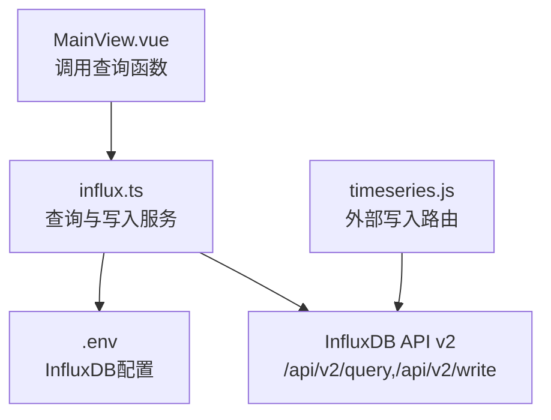
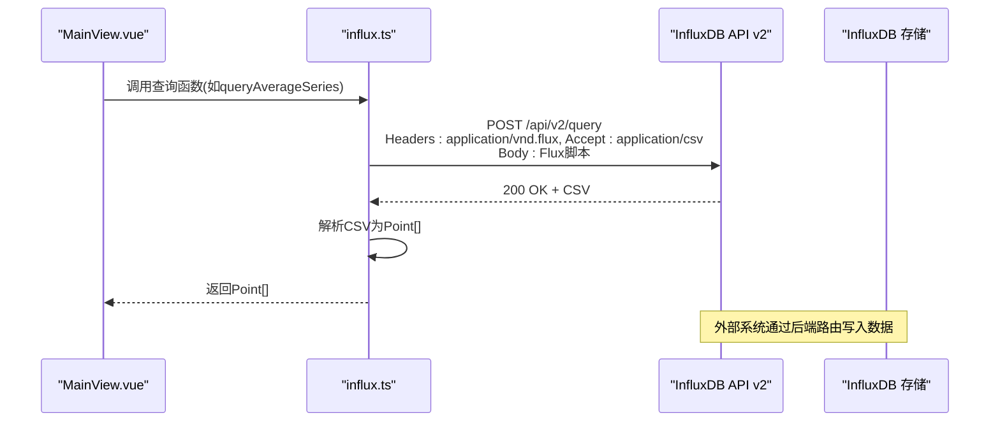
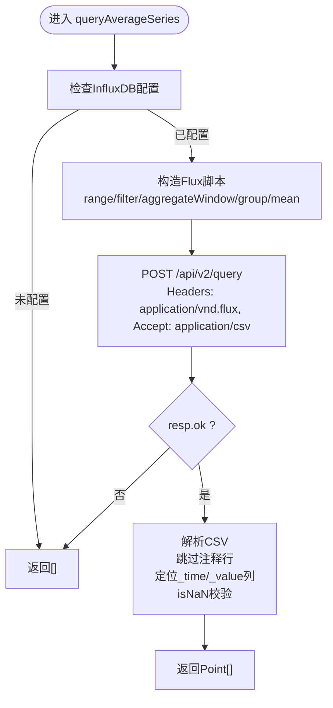
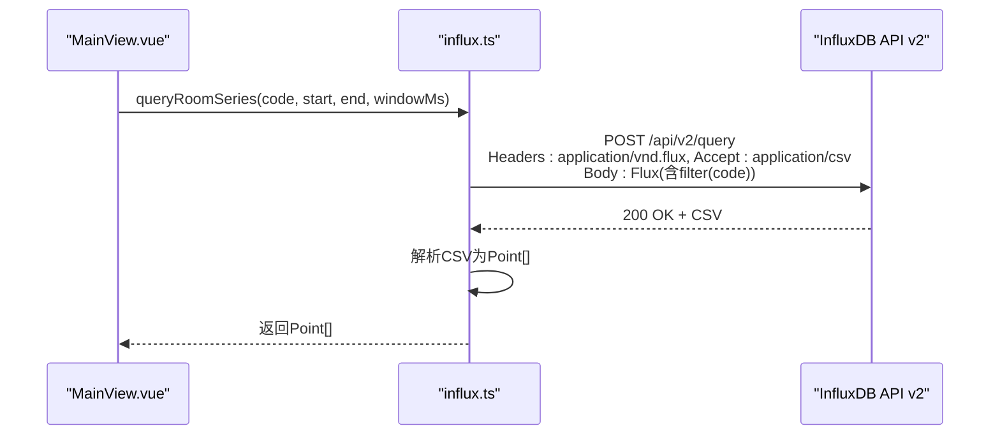
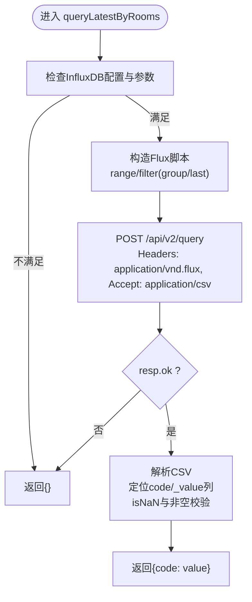
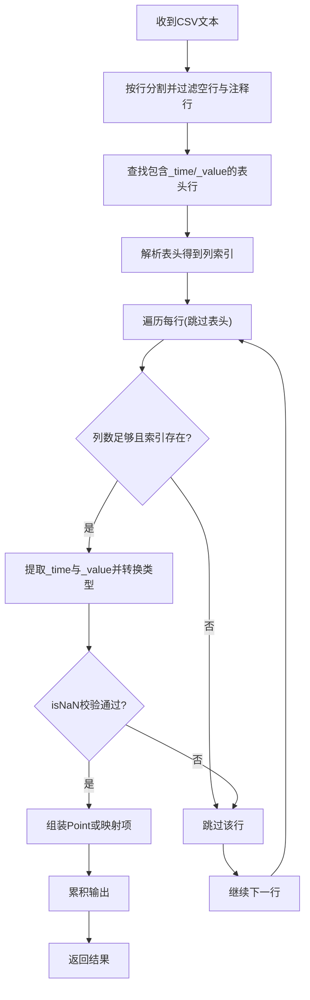
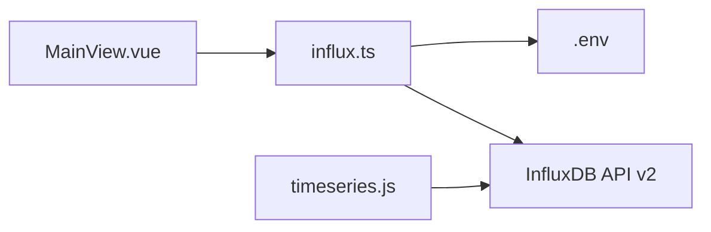

# 查询操作与Flux脚本

<cite>
**本文引用的文件**
- [src/services/influx.ts](file://src/services/influx.ts)
- [src/components/MainView.vue](file://src/components/MainView.vue)
- [server/routes/timeseries.js](file://server/routes/timeseries.js)
- [.env](file://.env)
- [TIMESERIES_INGESTION.md](file://TIMESERIES_INGESTION.md)
</cite>

## 目录
1. [简介](#简介)
2. [项目结构](#项目结构)
3. [核心组件](#核心组件)
4. [架构总览](#架构总览)
5. [详细组件分析](#详细组件分析)
6. [依赖关系分析](#依赖关系分析)
7. [性能考量](#性能考量)
8. [故障排查指南](#故障排查指南)
9. [结论](#结论)

## 简介
本文围绕前端服务模块中的三个InfluxDB查询函数展开，系统阐述其工作机制与Flux脚本构造方式，并对比三者在时间范围过滤、测量值与字段筛选、聚合窗口与分组策略上的差异；同时解释HTTP请求头使用application/vnd.flux与Accept: application/csv的原因，以及CSV响应解析流程（跳过注释行、定位列索引、转换为Point[]或记录映射）。最后强调错误处理与数据类型校验的重要性。

## 项目结构
- 前端服务层位于 src/services/influx.ts，封装了写入与查询两类操作，统一管理InfluxDB认证与组织/桶配置。
- 前端组件 src/components/MainView.vue 调用查询函数，驱动图表渲染与实时温度展示。
- 后端路由 server/routes/timeseries.js 提供外部时序数据写入接口，用于将真实数据写入InfluxDB，支撑前端查询结果。
- 环境变量 .env 提供前端直连InfluxDB所需的URL、组织、桶与令牌。
- TIMESERIES_INGESTION.md 文档说明了数据写入格式与API使用方式，有助于理解查询脚本中对measurement、field与tag的假设。

**图表来源**
- [src/services/influx.ts](file://src/services/influx.ts#L1-L136)
- [src/components/MainView.vue](file://src/components/MainView.vue#L350-L400)
- [server/routes/timeseries.js](file://server/routes/timeseries.js#L1-L263)
- [.env](file://.env#L1-L5)

**章节来源**
- [src/services/influx.ts](file://src/services/influx.ts#L1-L136)
- [src/components/MainView.vue](file://src/components/MainView.vue#L350-L400)
- [server/routes/timeseries.js](file://server/routes/timeseries.js#L1-L263)
- [.env](file://.env#L1-L5)

## 核心组件
- 查询函数族
  - queryAverageSeries(startMs, endMs, windowMs): 计算全局平均温度序列，使用聚合窗口与分组后再次聚合。
  - queryRoomSeries(roomCode, startMs, endMs, windowMs): 按房间编码过滤，计算该房间的时间窗口内最小值序列。
  - queryLatestByRooms(roomCodes, lookbackMs): 对多个房间代码进行最近值查询，返回房间到数值的映射。
- 数据模型
  - Point: { timestamp: number; value: number }
- HTTP请求头
  - Content-Type: application/vnd.flux（提交Flux脚本）
  - Accept: application/csv（接收CSV响应）

**章节来源**
- [src/services/influx.ts](file://src/services/influx.ts#L24-L24)
- [src/services/influx.ts](file://src/services/influx.ts#L16-L20)

## 架构总览
前端组件通过MainView.vue调用influx.ts中的查询函数，后者构造Flux脚本并通过HTTP POST发送至InfluxDB API v2，接收CSV响应并解析为Point[]或映射对象。外部系统通过后端路由将真实数据写入InfluxDB，形成“写入-查询-可视化”的闭环。

**图表来源**
- [src/services/influx.ts](file://src/services/influx.ts#L39-L69)
- [src/services/influx.ts](file://src/services/influx.ts#L72-L103)
- [src/services/influx.ts](file://src/services/influx.ts#L105-L134)
- [server/routes/timeseries.js](file://server/routes/timeseries.js#L125-L206)

## 详细组件分析

### queryAverageSeries：全局平均序列
- 目标：在指定时间范围内，对满足测量与字段条件的数据进行聚合窗口化，随后按时间分组并计算平均值，得到平滑后的温度序列。
- Flux脚本要点
  - 时间范围过滤：range(start, stop)
  - 测量与字段筛选：过滤测量名为room_temp或temperature，字段为value
  - 聚合窗口：aggregateWindow(every: windowMs, fn: mean, createEmpty: false)
  - 分组与二次聚合：group(columns: ["_time"]) 后 mean()
- HTTP请求头
  - Content-Type: application/vnd.flux
  - Accept: application/csv
- CSV解析
  - 跳过以#开头的注释行
  - 查找包含_time与_value的表头行，定位列索引
  - 逐行解析，提取_time与_value，分别转为时间戳与数值，使用isNaN校验后组装Point[]
- 错误处理
  - 非200响应直接返回空数组，避免异常传播

**图表来源**
- [src/services/influx.ts](file://src/services/influx.ts#L39-L69)

**章节来源**
- [src/services/influx.ts](file://src/services/influx.ts#L39-L69)

### queryRoomSeries：单房间序列
- 目标：针对特定房间编码，计算其在时间窗口内的最小值序列。
- Flux脚本要点
  - 时间范围过滤：range(start, stop)
  - 测量与字段筛选：同上
  - 房间过滤：filter(r => r.code == "${esc}")
  - 聚合窗口：aggregateWindow(every: windowMs, fn: min, createEmpty: false)
- HTTP请求头与CSV解析：与queryAverageSeries一致
- 错误处理：非200响应返回[]
- 用途：在主视图中按房间并行拉取多条曲线，缓存到内存，用于叠加显示

**图表来源**
- [src/services/influx.ts](file://src/services/influx.ts#L72-L103)
- [src/components/MainView.vue](file://src/components/MainView.vue#L367-L387)

**章节来源**
- [src/services/influx.ts](file://src/services/influx.ts#L72-L103)
- [src/components/MainView.vue](file://src/components/MainView.vue#L367-L387)

### queryLatestByRooms：多房间最新值
- 目标：在回溯时间窗内，对多个房间代码进行最近值查询，返回房间编码到数值的映射。
- Flux脚本要点
  - 时间范围过滤：range(start: now()-lookback)
  - 测量与字段筛选：同上
  - 房间过滤：使用正则匹配多个code
  - 分组与取最新：group(columns: ["code"]) 后 last()
- CSV解析
  - 查找包含_value与code的表头行，定位列索引
  - 逐行解析，提取code与_value，使用isNaN与非空校验后组装映射
- 错误处理：非200响应返回{}

**图表来源**
- [src/services/influx.ts](file://src/services/influx.ts#L105-L134)

**章节来源**
- [src/services/influx.ts](file://src/services/influx.ts#L105-L134)

### Flux脚本差异对比
- 共同点
  - 时间范围过滤：均使用range(start, stop)
  - 测量与字段筛选：均过滤测量名为room_temp或temperature，字段为value
- 差异点
  - 聚合策略
    - queryAverageSeries：aggregateWindow + group + mean，得到全局平均序列
    - queryRoomSeries：aggregateWindow，fn为min，按房间过滤
    - queryLatestByRooms：group(columns: ["code"]) + last()，得到每个房间的最新值
  - 过滤维度
    - queryAverageSeries：无房间过滤
    - queryRoomSeries：按单个房间code过滤
    - queryLatestByRooms：按多个房间code过滤（正则）

**章节来源**
- [src/services/influx.ts](file://src/services/influx.ts#L39-L69)
- [src/services/influx.ts](file://src/services/influx.ts#L72-L103)
- [src/services/influx.ts](file://src/services/influx.ts#L105-L134)

### HTTP请求头说明
- Content-Type: application/vnd.flux
  - 表明请求体为Flux脚本，InfluxDB API v2要求使用此媒体类型提交Flux查询。
- Accept: application/csv
  - 指定期望的响应格式为CSV，便于解析_time与_value等列。
- 认证头
  - 若启用Basic认证，则使用Basic {base64(user:pass)}；否则使用Token {token}。
  - Basic开关与用户密码来自环境变量配置。

**章节来源**
- [src/services/influx.ts](file://src/services/influx.ts#L16-L20)
- [.env](file://.env#L1-L5)

### CSV响应解析流程
- 跳过注释行：过滤掉以#开头的行
- 定位表头：查找包含_time与_value（或code与_value）的行作为表头
- 列索引：通过表头分割得到_time/_value或code/_value的列索引
- 行解析：逐行分割，按索引取对应列，将_time解析为时间戳，_value解析为数值
- 类型校验：使用isNaN检查时间戳与数值有效性，仅在有效时加入输出
- 输出形态
  - queryAverageSeries与queryRoomSeries：返回Point[]数组
  - queryLatestByRooms：返回{code: value}映射

**图表来源**
- [src/services/influx.ts](file://src/services/influx.ts#L55-L69)
- [src/services/influx.ts](file://src/services/influx.ts#L88-L103)
- [src/services/influx.ts](file://src/services/influx.ts#L119-L134)

**章节来源**
- [src/services/influx.ts](file://src/services/influx.ts#L55-L69)
- [src/services/influx.ts](file://src/services/influx.ts#L88-L103)
- [src/services/influx.ts](file://src/services/influx.ts#L119-L134)

### 数据写入与查询一致性
- 外部系统通过后端路由将JSON数据写入InfluxDB，采用Line Protocol格式，其中measurement与tag（room、code）与查询脚本中的过滤条件保持一致。
- 这保证了查询脚本能够正确命中数据，避免因命名不一致导致的查询为空。

**章节来源**
- [server/routes/timeseries.js](file://server/routes/timeseries.js#L54-L104)
- [TIMESERIES_INGESTION.md](file://TIMESERIES_INGESTION.md#L129-L144)

## 依赖关系分析
- 组件耦合
  - MainView.vue依赖influx.ts提供的查询函数，负责调度与缓存。
  - influx.ts依赖环境变量中的InfluxDB配置，以及InfluxDB API v2的查询端点。
- 外部依赖
  - InfluxDB API v2：/api/v2/query（Flux查询）、/api/v2/write（数据写入）
  - fetch：浏览器内置HTTP客户端
- 潜在循环依赖
  - 当前文件结构清晰，无循环依赖迹象

**图表来源**
- [src/components/MainView.vue](file://src/components/MainView.vue#L350-L400)
- [src/services/influx.ts](file://src/services/influx.ts#L1-L136)
- [server/routes/timeseries.js](file://server/routes/timeseries.js#L1-L263)

**章节来源**
- [src/components/MainView.vue](file://src/components/MainView.vue#L350-L400)
- [src/services/influx.ts](file://src/services/influx.ts#L1-L136)
- [server/routes/timeseries.js](file://server/routes/timeseries.js#L1-L263)

## 性能考量
- 聚合窗口大小
  - windowMs过大可能导致数据稀疏，过小可能引入噪声；建议根据时间跨度动态计算窗口大小。
- 并发查询
  - queryRoomSeries支持对多个房间并发拉取，使用Promise.all可显著降低总等待时间。
- 数据量控制
  - queryLatestByRooms使用lookbackMs限制回溯范围，避免一次性返回过多历史数据。
- CSV解析效率
  - 采用按行过滤与索引定位，避免重复扫描；仅在isNaN校验通过时才组装Point，减少无效对象创建。

[本节为通用性能建议，无需具体文件引用]

## 故障排查指南
- 非200响应
  - queryAverageSeries与queryRoomSeries在非200时直接返回[]；queryLatestByRooms返回{}。若前端图表为空，优先检查InfluxDB服务状态与网络连通性。
- CSV解析失败
  - 确认响应中存在_time与_value（或code与_value）列；检查表头是否被注释行干扰。
  - 确保列索引定位正确，避免列数不足导致越界。
- 类型校验失败
  - isNaN检查会过滤掉非法时间戳与数值；若全部被过滤，检查写入数据格式与时间精度。
- 认证问题
  - 若使用Basic认证，请确认useBasic、user与password配置正确；否则使用Token认证时请核对VITE_INFLUX_TOKEN。
- 写入不一致
  - 确认写入时measurement与tag命名与查询脚本一致，避免查询不到数据。

**章节来源**
- [src/services/influx.ts](file://src/services/influx.ts#L55-L69)
- [src/services/influx.ts](file://src/services/influx.ts#L88-L103)
- [src/services/influx.ts](file://src/services/influx.ts#L119-L134)
- [.env](file://.env#L1-L5)

## 结论
本文系统梳理了三个查询函数在Flux脚本构造、HTTP请求头设置与CSV解析方面的实现细节，并对比了聚合策略与过滤维度的差异。通过严格的错误处理与类型校验，系统能够在异常情况下保持稳健运行。结合后端写入路由与环境配置，前端可稳定地从InfluxDB获取时序数据，支撑可视化与实时监控场景。