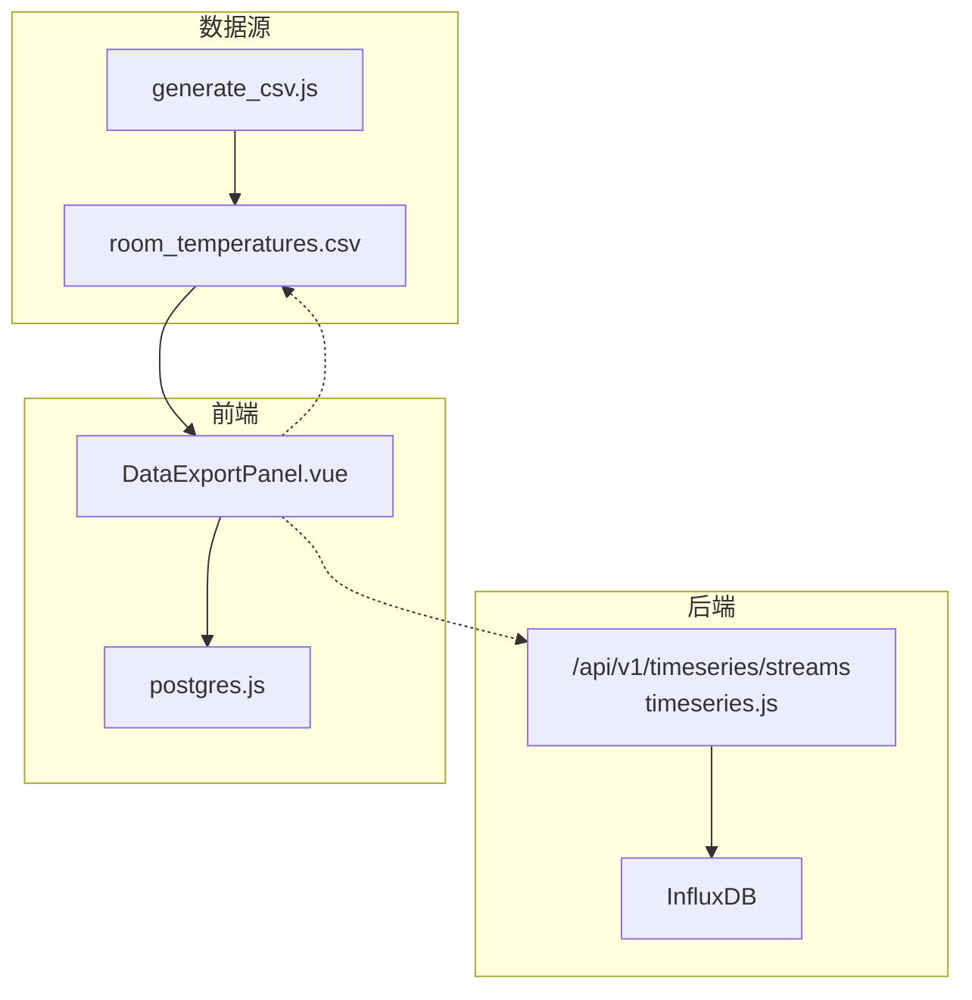
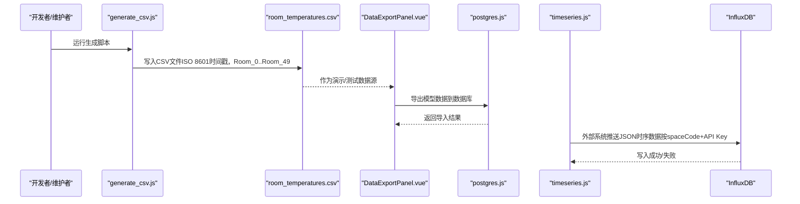
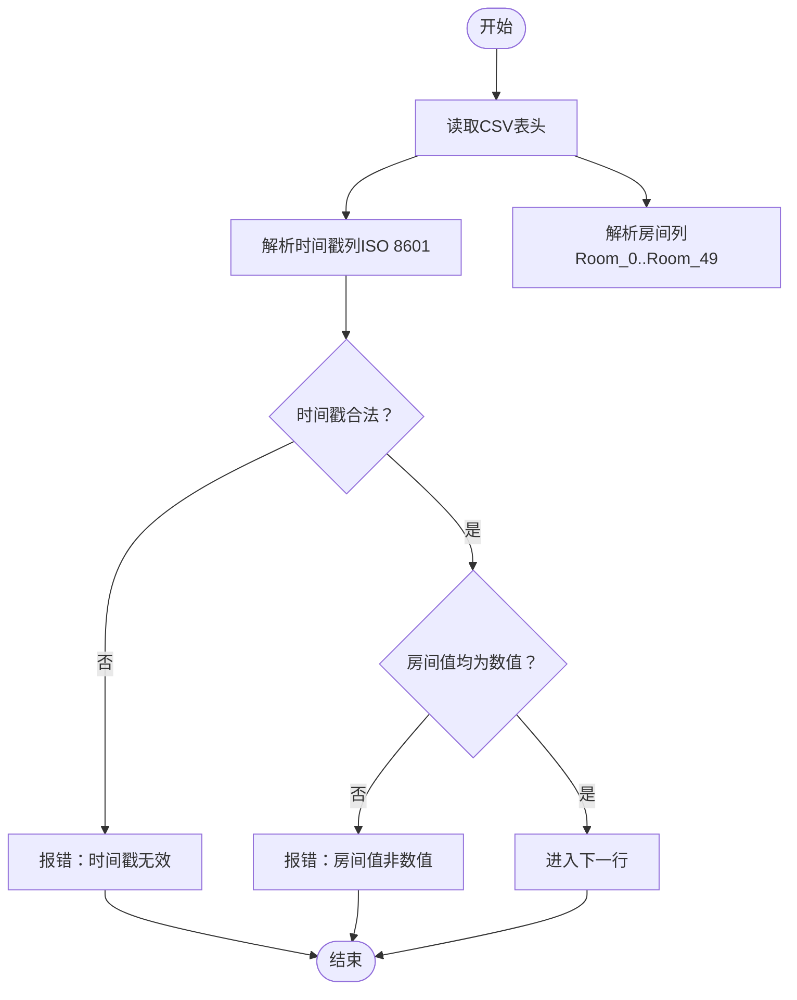
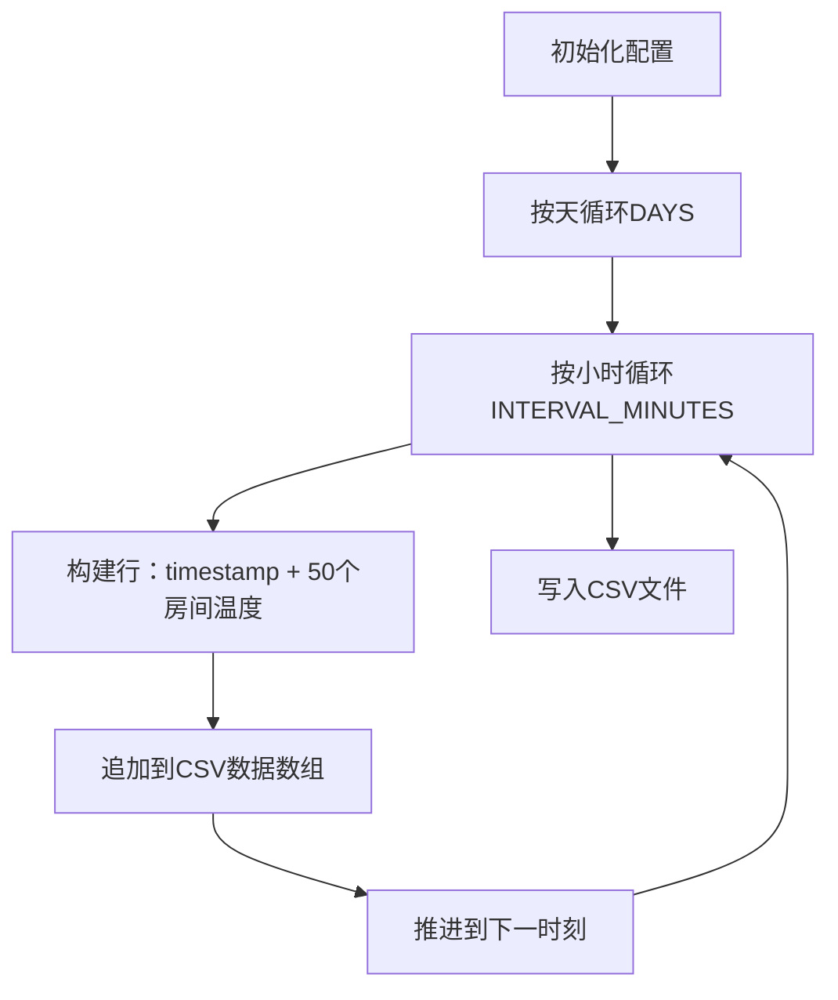
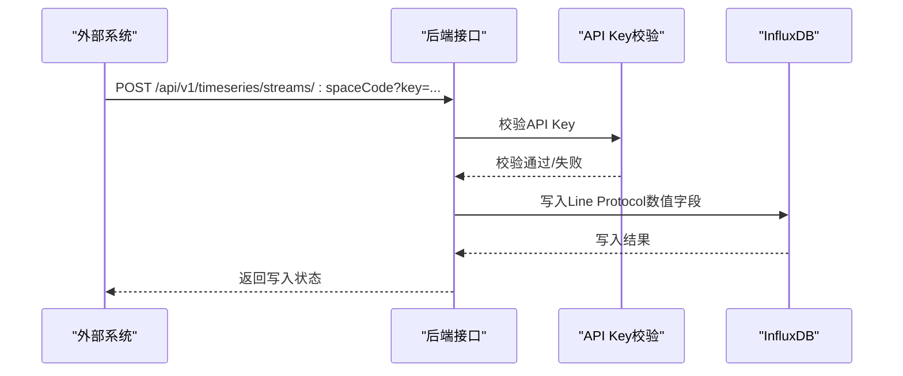
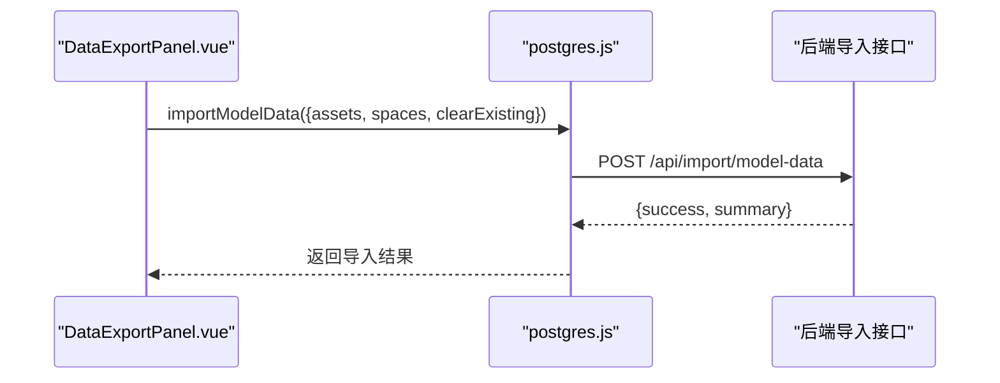
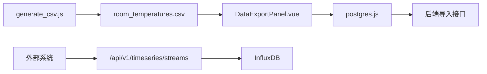

# 室温数据源

<cite>
**本文引用的文件**
- [room_temperatures.csv](file://public/data/room_temperatures.csv)
- [generate_csv.js](file://scripts/generate_csv.js)
- [timeseries.js](file://server/routes/timeseries.js)
- [TIMESERIES_INGESTION.md](file://TIMESERIES_INGESTION.md)
- [mapping-config.js](file://server/models/mapping-config.js)
- [DataExportPanel.vue](file://src/components/DataExportPanel.vue)
- [postgres.js](file://src/services/postgres.js)
</cite>

## 目录
1. [简介](#简介)
2. [项目结构](#项目结构)
3. [核心组件](#核心组件)
4. [架构总览](#架构总览)
5. [详细组件分析](#详细组件分析)
6. [依赖关系分析](#依赖关系分析)
7. [性能考量](#性能考量)
8. [故障排查指南](#故障排查指南)
9. [结论](#结论)
10. [附录](#附录)

## 简介
本文件聚焦于“room_temperatures.csv”这一时序数据源，系统性解析其文件结构、数据格式、生成机制、在数据摄取流程中的角色，以及如何在系统初始化或数据导入过程中被使用。该 CSV 文件以 ISO 8601 时间戳为第一列，后续列对应 50 个房间的温度值（Room_0 至 Room_49），每行代表一个固定时间间隔的观测时刻。该文件既可作为演示数据源，也可作为真实数据的模拟来源，支撑前端图表展示与后端时序数据接入能力。

## 项目结构
- 数据源文件位于 public/data/room_temperatures.csv
- 生成脚本位于 scripts/generate_csv.js，用于按配置生成该 CSV 文件
- 后端提供时序数据接入路由（/api/v1/timeseries/streams），支持外部系统推送 JSON 格式时序数据到 InfluxDB
- 前端提供数据导出面板（DataExportPanel.vue），用于将模型数据导入 PostgreSQL（与 CSV 无直接耦合，但体现数据导入的整体流程）

**图表来源**
- [room_temperatures.csv](file://public/data/room_temperatures.csv#L1-L50)
- [generate_csv.js](file://scripts/generate_csv.js#L1-L73)
- [timeseries.js](file://server/routes/timeseries.js#L1-L263)
- [DataExportPanel.vue](file://src/components/DataExportPanel.vue#L1-L350)
- [postgres.js](file://src/services/postgres.js#L1-L245)

**章节来源**
- [room_temperatures.csv](file://public/data/room_temperatures.csv#L1-L50)
- [generate_csv.js](file://scripts/generate_csv.js#L1-L73)

## 核心组件
- CSV 文件结构
  - 第一列为时间戳（ISO 8601），其余列分别为 Room_0 至 Room_49 的温度值（浮点数）
  - 行数随时间跨度与采样间隔而变化
- 生成脚本
  - 自动生成指定天数、采样间隔、房间数量的 CSV
  - 时间戳采用 ISO 8601 标准字符串
  - 温度值为两位小数的浮点数
- 时序数据接入
  - 外部系统可通过 HTTP POST 将 JSON 格式时序数据写入 InfluxDB
  - 支持按空间编码（spaceCode）生成带 API Key 的安全 URL
- 数据导入流程（与 CSV 间接相关）
  - 前端导出面板将模型数据导入 PostgreSQL（与 CSV 无直接耦合，但体现数据导入的整体流程）

**章节来源**
- [room_temperatures.csv](file://public/data/room_temperatures.csv#L1-L50)
- [generate_csv.js](file://scripts/generate_csv.js#L1-L73)
- [timeseries.js](file://server/routes/timeseries.js#L1-L263)
- [TIMESERIES_INGESTION.md](file://TIMESERIES_INGESTION.md#L1-L144)
- [DataExportPanel.vue](file://src/components/DataExportPanel.vue#L1-L350)
- [postgres.js](file://src/services/postgres.js#L1-L245)

## 架构总览
下图展示了 CSV 数据与系统各模块的关系，以及外部时序数据接入的路径。

**图表来源**
- [generate_csv.js](file://scripts/generate_csv.js#L1-L73)
- [room_temperatures.csv](file://public/data/room_temperatures.csv#L1-L50)
- [DataExportPanel.vue](file://src/components/DataExportPanel.vue#L1-L350)
- [postgres.js](file://src/services/postgres.js#L120-L144)
- [timeseries.js](file://server/routes/timeseries.js#L110-L206)

## 详细组件分析

### CSV 文件结构与数据格式
- 文件首行是表头，包含：
  - timestamp（ISO 8601）
  - Room_0 至 Room_49（共 50 个房间）
- 数据行格式要点：
  - 时间戳列：ISO 8601 字符串（UTC）
  - 房间列：浮点数，保留两位小数
- 示例（节选）：
  - 表头：timestamp,Room_0,Room_1,...,Room_49
  - 示例行：2025-11-02T07:19:18.962Z,28.06,29.37,...,25.71

**图表来源**
- [room_temperatures.csv](file://public/data/room_temperatures.csv#L1-L50)

**章节来源**
- [room_temperatures.csv](file://public/data/room_temperatures.csv#L1-L50)

### 生成脚本与数据源初始化
- 生成脚本配置
  - 生成天数、采样间隔、房间数量、特殊房间偏移等
  - 输出文件路径：public/data/room_temperatures.csv
- 生成逻辑
  - 以 ISO 8601 生成时间序列
  - 每行包含一个时间戳与 50 个房间温度值（两位小数）
  - 特殊房间（如索引 0、1、2）增加额外温度偏移
- 使用场景
  - 初始化演示数据
  - 本地开发与测试

**图表来源**
- [generate_csv.js](file://scripts/generate_csv.js#L1-L73)

**章节来源**
- [generate_csv.js](file://scripts/generate_csv.js#L1-L73)

### 外部时序数据接入（与 CSV 的关系）
- CSV 作为演示/测试数据源，不参与外部时序数据接入
- 外部时序数据接入通过 HTTP POST 将 JSON 数据写入 InfluxDB
- 关键点
  - 每个空间编码（spaceCode）生成专属 API Key
  - 支持查询参数或 Authorization 头传递 API Key
  - 请求体 JSON 中的数值字段会被写入 InfluxDB（Line Protocol 格式）

**图表来源**
- [timeseries.js](file://server/routes/timeseries.js#L110-L206)
- [TIMESERIES_INGESTION.md](file://TIMESERIES_INGESTION.md#L1-L144)

**章节来源**
- [timeseries.js](file://server/routes/timeseries.js#L1-L263)
- [TIMESERIES_INGESTION.md](file://TIMESERIES_INGESTION.md#L1-L144)

### 数据导入流程（与 CSV 的间接关联）
- 前端导出面板负责将模型数据导入 PostgreSQL（与 CSV 无直接耦合）
- 导入流程
  - 提取资产、空间、规格数据
  - 计算统计信息
  - 调用后端导入接口，返回导入摘要

**图表来源**
- [DataExportPanel.vue](file://src/components/DataExportPanel.vue#L194-L297)
- [postgres.js](file://src/services/postgres.js#L120-L144)

**章节来源**
- [DataExportPanel.vue](file://src/components/DataExportPanel.vue#L1-L350)
- [postgres.js](file://src/services/postgres.js#L1-L245)

## 依赖关系分析
- CSV 文件依赖
  - 生成脚本：生成 CSV 的唯一来源
  - 前端组件：作为演示/测试数据源
- 外部时序数据接入
  - 与 CSV 无直接依赖，但共享“时序数据”的概念
  - 通过后端路由与 InfluxDB 实现外部数据写入
- 数据导入
  - 与 CSV 无直接依赖，但体现系统对“结构化数据”的导入能力

**图表来源**
- [generate_csv.js](file://scripts/generate_csv.js#L1-L73)
- [room_temperatures.csv](file://public/data/room_temperatures.csv#L1-L50)
- [DataExportPanel.vue](file://src/components/DataExportPanel.vue#L1-L350)
- [postgres.js](file://src/services/postgres.js#L120-L144)
- [timeseries.js](file://server/routes/timeseries.js#L110-L206)

**章节来源**
- [generate_csv.js](file://scripts/generate_csv.js#L1-L73)
- [room_temperatures.csv](file://public/data/room_temperatures.csv#L1-L50)
- [DataExportPanel.vue](file://src/components/DataExportPanel.vue#L1-L350)
- [postgres.js](file://src/services/postgres.js#L1-L245)
- [timeseries.js](file://server/routes/timeseries.js#L1-L263)

## 性能考量
- CSV 读取
  - 建议分块读取与惰性解析，避免一次性加载全部行导致内存压力
  - 对时间戳列进行快速解析（ISO 8601），房间列按需解析为数值
- 生成脚本
  - 生成大量行时注意磁盘 IO 与内存占用，建议批量写入文件
  - 控制采样间隔与天数，避免生成超大文件
- 外部时序数据接入
  - InfluxDB 写入前进行字段过滤与数值校验，减少无效写入
  - 使用批量写入（Line Protocol 多行）提升吞吐

[本节为通用指导，不直接分析具体文件]

## 故障排查指南
- CSV 文件异常
  - 表头缺失或列数不匹配：检查生成脚本输出逻辑
  - 时间戳格式不符：确认生成脚本使用 ISO 8601
  - 房间列非数值：检查生成脚本的数值格式化
- 外部时序数据接入失败
  - API Key 未提供或无效：核对 spaceCode 与 API Key 生成规则
  - 请求体非 JSON 或无数值字段：确保 JSON 结构正确
  - InfluxDB 未配置或不可达：检查环境变量与网络连通性
- 数据导入失败
  - 后端导入接口返回错误：查看返回的错误信息与摘要
  - 前端状态提示：根据按钮禁用与状态徽章判断健康状况

**章节来源**
- [generate_csv.js](file://scripts/generate_csv.js#L1-L73)
- [TIMESERIES_INGESTION.md](file://TIMESERIES_INGESTION.md#L1-L144)
- [timeseries.js](file://server/routes/timeseries.js#L110-L206)
- [DataExportPanel.vue](file://src/components/DataExportPanel.vue#L1-L120)
- [postgres.js](file://src/services/postgres.js#L1-L245)

## 结论
room_temperatures.csv 是系统中的演示/测试时序数据源，采用 ISO 8601 时间戳与 50 个房间温度列（Room_0..Room_49），每行代表固定时间间隔的观测值。其生成脚本提供了可控的数据源初始化能力；同时，系统还具备外部时序数据接入能力（通过 HTTP POST 写入 InfluxDB），二者共同支撑了从本地 CSV 到外部实时数据的完整时序数据链路。对于数据导入流程，前端导出面板展示了将模型数据导入 PostgreSQL 的典型步骤，与 CSV 无直接耦合，但体现了系统的整体数据处理能力。

[本节为总结性内容，不直接分析具体文件]

## 附录
- 文件内容示例（表头与示例行）
  - 表头：timestamp,Room_0,Room_1,...,Room_49
  - 示例行：2025-11-02T07:19:18.962Z,28.06,29.37,...,25.71
- 生成脚本关键参数
  - DAYS、INTERVAL_MINUTES、BASE_TEMP、NUM_ROOMS、SPECIAL_INDICES、HIGH_LOAD_OFFSET
- 外部时序数据接入要点
  - spaceCode 与 API Key 的生成与校验
  - JSON 请求体中的数值字段与可选时间戳
  - InfluxDB Line Protocol 写入格式

**章节来源**
- [room_temperatures.csv](file://public/data/room_temperatures.csv#L1-L50)
- [generate_csv.js](file://scripts/generate_csv.js#L1-L73)
- [TIMESERIES_INGESTION.md](file://TIMESERIES_INGESTION.md#L1-L144)
- [timeseries.js](file://server/routes/timeseries.js#L110-L206)