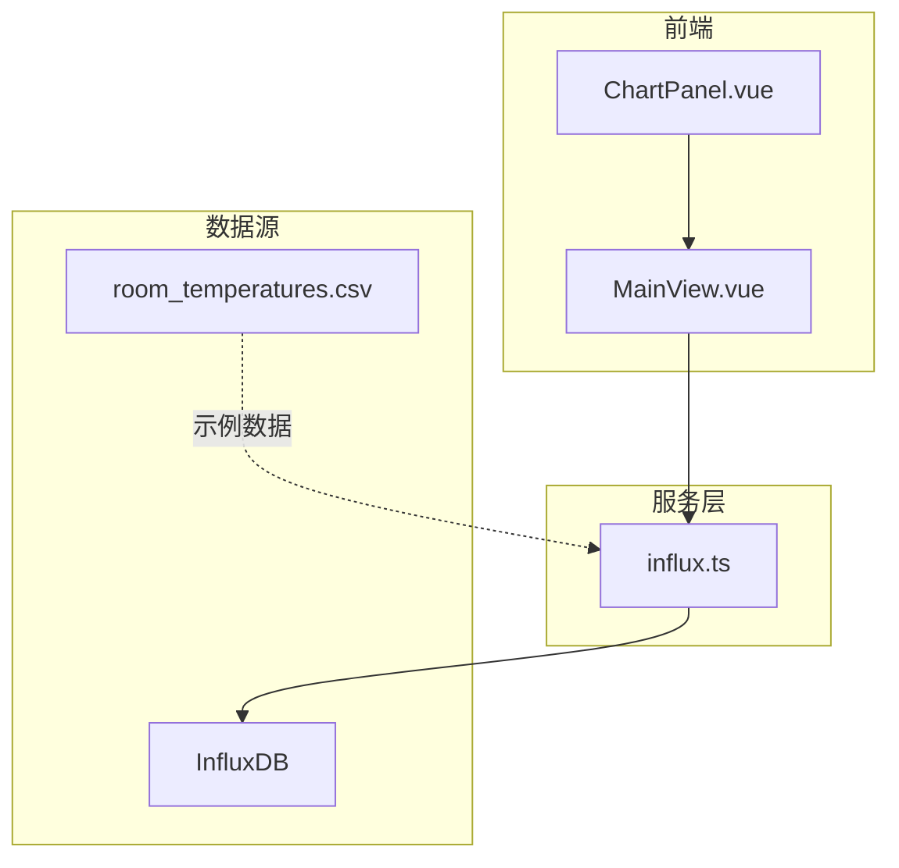
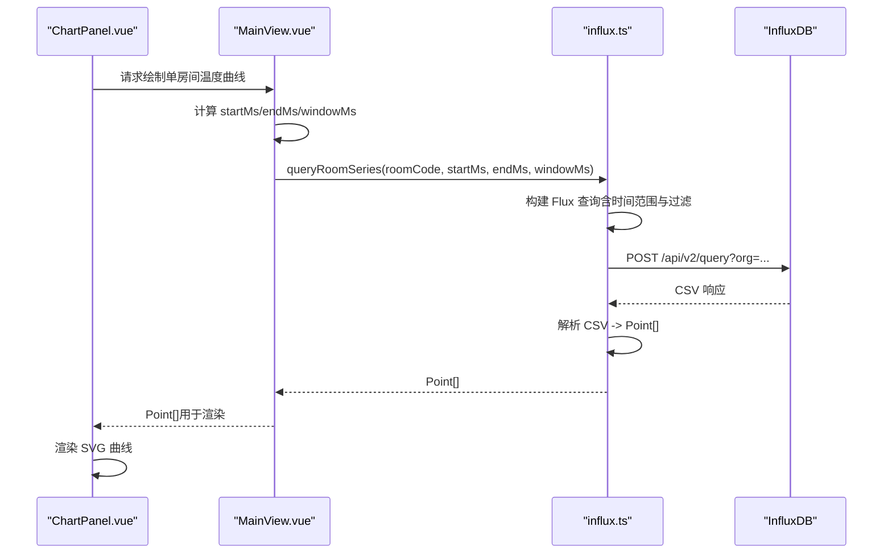
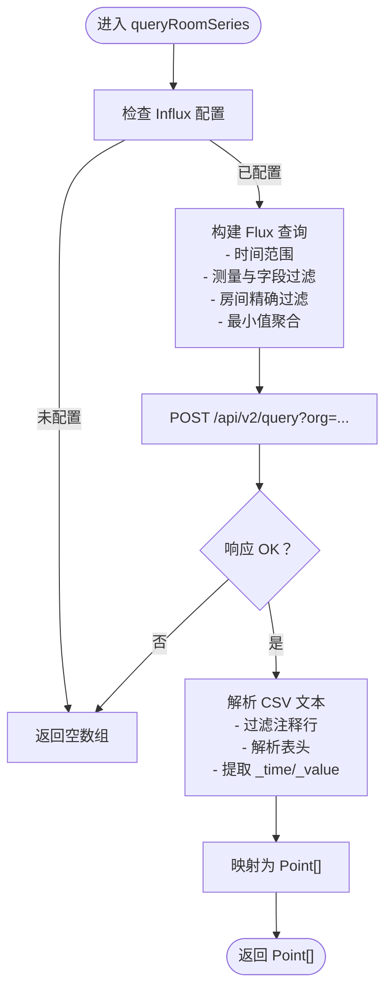
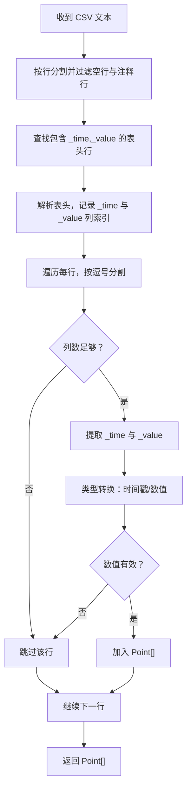
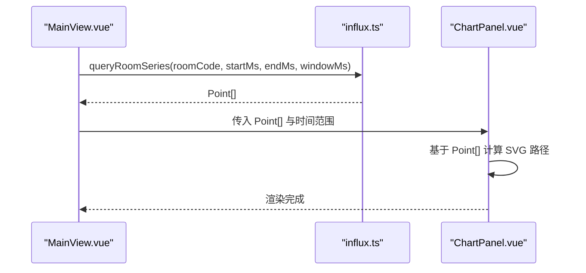
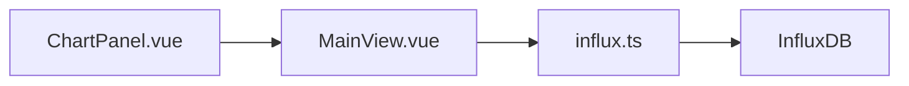

# 单房间时序查询

<cite>
**本文引用的文件**
- [influx.ts](file://src/services/influx.ts)
- [MainView.vue](file://src/components/MainView.vue)
- [ChartPanel.vue](file://src/components/ChartPanel.vue)
- [room_temperatures.csv](file://public/data/room_temperatures.csv)
</cite>

## 目录
1. [引言](#引言)
2. [项目结构](#项目结构)
3. [核心组件](#核心组件)
4. [架构总览](#架构总览)
5. [详细组件分析](#详细组件分析)
6. [依赖分析](#依赖分析)
7. [性能考虑](#性能考虑)
8. [故障排查指南](#故障排查指南)
9. [结论](#结论)
10. [附录](#附录)

## 引言
本文围绕单房间时序查询函数 queryRoomSeries 的工作流程进行深入解析，重点说明：
- 如何通过 filter 条件精确匹配特定房间（r.code == "${esc}"），实现对单个空间温度历史序列的精准抓取；
- escTag 函数在防止标签注入与保证 Flux 语法正确性方面的关键作用；
- 该查询如何结合时间范围过滤与最小值聚合（fn: min）来获取指定房间的历史数据序列；
- CSV 解析逻辑与 Point[] 输出结构的映射关系；
- 与 queryAverageSeries 在聚合函数与过滤条件上的差异；
- 实际调用场景示例（如在 ChartPanel.vue 中绘制单个空间的温度变化曲线）；
- 性能特征与适用场景。

## 项目结构
本仓库包含前端 Vue 组件、服务层（InfluxDB 查询封装）、以及示例 CSV 数据。与本次主题直接相关的关键文件如下：
- src/services/influx.ts：提供 InfluxDB 查询封装，包括 queryRoomSeries、queryAverageSeries 等；
- src/components/MainView.vue：主视图组件，负责时间范围、窗口大小计算与调用查询；
- src/components/ChartPanel.vue：图表展示组件，消费 Point[] 并渲染曲线；
- public/data/room_temperatures.csv：示例 CSV 数据，演示了时间戳与各房间温度列的组织方式。

图表来源
- [influx.ts](file://src/services/influx.ts#L1-L136)
- [MainView.vue](file://src/components/MainView.vue#L347-L387)
- [ChartPanel.vue](file://src/components/ChartPanel.vue#L1-L120)
- [room_temperatures.csv](file://public/data/room_temperatures.csv#L1-L200)

章节来源
- [influx.ts](file://src/services/influx.ts#L1-L136)
- [MainView.vue](file://src/components/MainView.vue#L347-L387)
- [ChartPanel.vue](file://src/components/ChartPanel.vue#L1-L120)
- [room_temperatures.csv](file://public/data/room_temperatures.csv#L1-L200)

## 核心组件
- queryRoomSeries：面向单房间的时序查询，返回 Point[]；
- queryAverageSeries：面向全量房间的平均时序查询，返回 Point[]；
- escTag：对房间标识进行安全转义，防止 Flux 注入；
- MainView.vue：负责计算时间范围与窗口大小，并调用查询；
- ChartPanel.vue：接收 Point[] 并渲染温度曲线。

章节来源
- [influx.ts](file://src/services/influx.ts#L39-L103)
- [influx.ts](file://src/services/influx.ts#L22-L22)
- [MainView.vue](file://src/components/MainView.vue#L347-L387)
- [ChartPanel.vue](file://src/components/ChartPanel.vue#L1-L120)

## 架构总览
下面给出一次典型调用链路的时序图，展示从 UI 到 InfluxDB 的完整流程。

图表来源
- [MainView.vue](file://src/components/MainView.vue#L347-L387)
- [influx.ts](file://src/services/influx.ts#L72-L103)
- [ChartPanel.vue](file://src/components/ChartPanel.vue#L1-L120)

## 详细组件分析

### queryRoomSeries 工作流详解
- 输入参数
  - roomCode：目标房间标识；
  - startMs/endMs：时间范围（毫秒）；
  - windowMs：聚合窗口（毫秒）。
- Flux 查询构建
  - from(bucket)：指定数据桶；
  - range(start, stop)：限定时间范围；
  - filter：过滤测量名称与字段（room_temp 或 temperature，且 _field == value）；
  - filter：按 r.code 精确匹配 roomCode（通过 escTag 转义）；
  - aggregateWindow(every: windowMs, fn: min)：按窗口聚合，使用最小值。
- 响应解析
  - 接收 CSV 文本；
  - 过滤注释行（以 # 开头）；
  - 解析表头，定位 _time 与 _value 列索引；
  - 逐行解析，转换为 Point[]（timestamp, value）。
- 输出
  - Point[]：按时间升序排列的温度序列。

图表来源
- [influx.ts](file://src/services/influx.ts#L72-L103)

章节来源
- [influx.ts](file://src/services/influx.ts#L72-L103)

### escTag 的注入防护与 Flux 语法保障
- 作用：将传入的房间标识字符串中的特殊字符（如逗号、等号、空格）替换为下划线，从而避免标签值中出现非法字符导致 Flux 语法错误或注入风险。
- 使用位置：在 queryRoomSeries 中，将 roomCode 传入 escTag，得到安全的 r.code 值，用于过滤条件。
- 影响：确保 Flux 字符串拼接的安全性，避免因房间标识包含特殊字符而破坏查询语义或引发异常。

章节来源
- [influx.ts](file://src/services/influx.ts#L22-L22)
- [influx.ts](file://src/services/influx.ts#L72-L81)

### CSV 解析与 Point[] 映射
- 表头识别：查找包含 _time 与 _value 的行；
- 列索引：定位 _time 与 _value 的列索引；
- 行解析：逐行分割，校验列数，提取时间戳与数值；
- 类型转换：时间戳使用 Date.parse，数值使用 parseFloat；
- 过滤无效行：跳过列数不足或解析失败的行；
- 结果：累积为 Point[]。

图表来源
- [influx.ts](file://src/services/influx.ts#L86-L103)

章节来源
- [influx.ts](file://src/services/influx.ts#L86-L103)

### 与 queryAverageSeries 的差异
- 聚合函数
  - queryRoomSeries：fn: min（最小值）；
  - queryAverageSeries：fn: mean（平均值）。
- 过滤条件
  - queryRoomSeries：r.code 精确匹配（通过 escTag 转义）；
  - queryAverageSeries：无房间过滤，聚合全量测量。
- 时间范围与窗口
  - 两者均使用相同的 startMs/endMs 与 windowMs，但前者只针对单房间，后者针对全量。

章节来源
- [influx.ts](file://src/services/influx.ts#L39-L69)
- [influx.ts](file://src/services/influx.ts#L72-L103)

### 实际调用场景示例：ChartPanel.vue 绘制单房间温度曲线
- 主流程
  - MainView.vue 计算时间范围与窗口大小；
  - 调用 queryRoomSeries 获取单房间 Point[]；
  - 将 Point[] 传递给 ChartPanel.vue；
  - ChartPanel.vue 基于 Point[] 渲染 SVG 曲线与阈值标记。
- 关键点
  - ChartPanel.vue 使用 Point[].value 与 Point[].timestamp 进行坐标映射；
  - 支持悬停交互与阈值高亮（例如 30°C）。

图表来源
- [MainView.vue](file://src/components/MainView.vue#L347-L387)
- [influx.ts](file://src/services/influx.ts#L72-L103)
- [ChartPanel.vue](file://src/components/ChartPanel.vue#L1-L120)

章节来源
- [MainView.vue](file://src/components/MainView.vue#L347-L387)
- [ChartPanel.vue](file://src/components/ChartPanel.vue#L1-L120)

## 依赖分析
- 组件耦合
  - ChartPanel.vue 依赖 MainView.vue 提供的时间范围与 Point[]；
  - MainView.vue 依赖 influx.ts 的查询接口；
  - influx.ts 依赖 InfluxDB API（写入与查询）。
- 外部依赖
  - InfluxDB：提供时序数据存储与查询能力；
  - CSV：用于解析查询结果，映射为 Point[]。

图表来源
- [MainView.vue](file://src/components/MainView.vue#L347-L387)
- [influx.ts](file://src/services/influx.ts#L1-L136)
- [ChartPanel.vue](file://src/components/ChartPanel.vue#L1-L120)

章节来源
- [MainView.vue](file://src/components/MainView.vue#L347-L387)
- [influx.ts](file://src/services/influx.ts#L1-L136)
- [ChartPanel.vue](file://src/components/ChartPanel.vue#L1-L120)

## 性能考虑
- 窗口大小与采样密度
  - windowMs 决定聚合粒度，较大的窗口可减少点数，提升渲染性能；
  - 过小的窗口可能导致点数过多，增加前端渲染与内存压力。
- 时间范围
  - startMs/endMs 越大，查询与解析的数据量越大，建议按需缩小范围；
  - 若需要长时间跨度，可在前端做分段查询与增量加载。
- 聚合策略
  - 使用最小值（min）可降低噪声，适合展示“最冷”趋势；
  - 平均值（mean）更平滑，适合趋势分析，但可能掩盖极端值。
- CSV 解析
  - 解析过程为 O(n)；对于超大数据量，建议在后端进行二次聚合或分页；
  - 避免在主线程中进行大量 DOM 操作，必要时采用虚拟化或分帧渲染。
- 安全与稳定性
  - 使用 escTag 防注入，避免因房间标识异常导致查询失败；
  - 对响应状态进行严格校验，失败时返回空数组，避免前端崩溃。

## 故障排查指南
- InfluxDB 未配置
  - 现象：queryRoomSeries 直接返回空数组；
  - 处理：检查环境变量（VITE_INFLUX_URL/VITE_INFLUX_ORG/VITE_INFLUX_BUCKET/VITE_INFLUX_TOKEN）。
- Flux 语法错误
  - 现象：查询失败或返回异常；
  - 处理：确认房间标识经 escTag 转义；检查过滤条件与聚合函数拼接。
- CSV 解析异常
  - 现象：Point[] 为空或部分缺失；
  - 处理：检查表头是否包含 _time 与 _value；确认列索引与行分割逻辑；验证时间戳与数值格式。
- 渲染问题
  - 现象：曲线不显示或断点；
  - 处理：确认 Point[] 非空且按时间升序；检查 ChartPanel.vue 的坐标映射与阈值逻辑。

章节来源
- [influx.ts](file://src/services/influx.ts#L1-L21)
- [influx.ts](file://src/services/influx.ts#L86-L103)
- [ChartPanel.vue](file://src/components/ChartPanel.vue#L1-L120)

## 结论
- queryRoomSeries 通过精确的 r.code 过滤与最小值聚合，能够稳定地获取单房间的历史温度序列；
- escTag 在防止标签注入与保证 Flux 语法正确性方面发挥关键作用；
- CSV 解析逻辑清晰，映射为 Point[]，便于前端渲染；
- 与 queryAverageSeries 相比，queryRoomSeries 更聚焦于单房间的细节与异常值捕捉；
- 在实际场景中，结合 MainView.vue 的时间范围与窗口计算，以及 ChartPanel.vue 的渲染，可高效绘制单空间温度曲线。

## 附录
- 示例 CSV 结构
  - 第一行为列头（timestamp, Room_0, Room_1, ...）；
  - 后续行为时间戳与各房间温度值；
  - 该 CSV 用于演示数据组织方式，实际查询使用 InfluxDB 的时序数据。

章节来源
- [room_temperatures.csv](file://public/data/room_temperatures.csv#L1-L200)