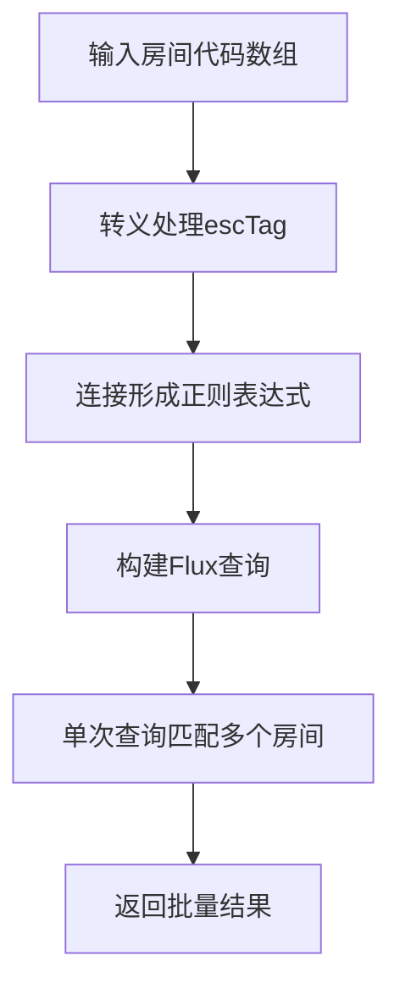
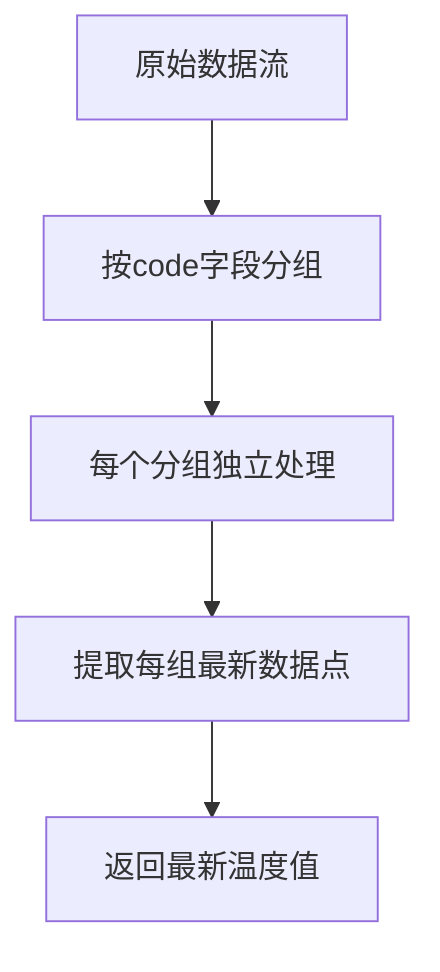

# 多房间最新数据查询

<cite>
**本文档引用的文件**   
- [influx.ts](file://src/services/influx.ts#L105-L136)
- [MainView.vue](file://src/components/MainView.vue#L2507-L2572)
</cite>

## 目录
1. [函数概述](#函数概述)
2. [高效批量查询机制](#高效批量查询机制)
3. [查询时间范围生成](#查询时间范围生成)
4. [数据分组与最新值提取](#数据分组与最新值提取)
5. [CSV响应解析与结果构建](#csv响应解析与结果构建)
6. [性能优势与应用场景](#性能优势与应用场景)
7. [正则表达式复杂度影响](#正则表达式复杂度影响)

## 函数概述

`queryLatestByRooms`函数是系统中用于批量获取多个房间最新温度读数的核心接口。该函数通过InfluxDB的Flux查询语言实现高效的数据检索，能够在单次查询中同时处理多个房间的数据请求，显著提升了数据获取的效率。函数接收房间代码数组和回溯时间参数，返回一个以房间代码为键、最新温度值为值的键值对对象。

**Section sources**
- [influx.ts](file://src/services/influx.ts#L105-L136)

## 高效批量查询机制

`queryLatestByRooms`函数的核心优势在于其高效的批量查询能力。函数通过正则表达式（`r["code"] =~ /${regex}/`）在单次Flux查询中匹配多个房间代码，避免了为每个房间发起独立查询的开销。具体实现中，函数将输入的房间代码数组通过`escTag`函数进行转义处理后，使用管道符（`|`）连接形成正则表达式模式。这种批量查询机制不仅减少了网络往返次数，还降低了InfluxDB服务器的查询处理负担，实现了查询效率的显著提升。

**Diagram sources **
- [influx.ts](file://src/services/influx.ts#L108-L111)

**Section sources**
- [influx.ts](file://src/services/influx.ts#L105-L136)

## 查询时间范围生成

函数通过`lookbackMs`参数与`Date.now()`结合生成合理的查询起始时间。在实现中，函数使用`Math.max(lookbackMs, 5 * 60 * 1000)`确保查询至少包含5分钟的回溯窗口，即使传入的`lookbackMs`值较小。这种设计保证了在各种情况下都能获取到足够的时间范围数据，避免了因时间窗口过短而导致无法获取有效数据的问题。生成的起始时间被转换为ISO格式，作为Flux查询中`range`函数的`start`参数。

**Section sources**
- [influx.ts](file://src/services/influx.ts#L107-L108)

## 数据分组与最新值提取

查询结果通过`group(columns: ["code"])`和`last()`操作符实现每个匹配房间最新温度读数的提取。`group`操作符根据`code`字段对数据进行分组，确保每个房间的数据被独立处理。随后，`last()`操作符从每个分组中提取时间戳最新的数据点，从而获得每个房间的最新温度值。这种数据处理流程简洁高效，充分利用了Flux查询语言的流式处理能力，确保了结果的准确性和实时性。

**Diagram sources **
- [influx.ts](file://src/services/influx.ts#L112-L113)

**Section sources**
- [influx.ts](file://src/services/influx.ts#L112-L113)

## CSV响应解析与结果构建

函数详细处理了CSV响应的解析过程，从`code`和`_value`列构建`Record<string, number>`类型的键值对结果。解析流程首先将CSV文本按行分割并过滤掉注释行，然后查找包含`_value`和`code`的标题行。通过分析标题行的列结构，函数确定`code`和`_value`列的索引位置。在遍历数据行时，函数提取对应列的值，将`_value`列的字符串转换为浮点数，并验证其有效性。最终，函数构建一个以房间代码为键、温度值为值的记录对象，实现了从原始CSV数据到结构化结果的转换。

**Section sources**
- [influx.ts](file://src/services/influx.ts#L119-L132)

## 性能优势与应用场景

`queryLatestByRooms`函数在资产面板或空间列表中实时显示最新温度方面具有显著的性能优势。通过单次批量查询替代多次独立查询，函数大幅减少了网络延迟和服务器负载，实现了近乎实时的数据更新。在`MainView.vue`组件中，该函数被用于初始化和定期刷新房间温度标签，确保用户界面显示的数据始终保持最新。这种高效的查询机制使得系统能够支持大规模房间数据的实时监控，为用户提供流畅的交互体验。

**Section sources**
- [MainView.vue](file://src/components/MainView.vue#L2565-L2572)

## 正则表达式复杂度影响

尽管正则表达式提供了强大的模式匹配能力，但其复杂度可能对查询效率产生潜在影响。当房间代码数量较多时，生成的正则表达式模式可能变得复杂，增加InfluxDB查询引擎的匹配开销。此外，正则表达式的使用可能影响查询计划的优化，导致索引利用效率降低。在极端情况下，过于复杂的正则表达式可能导致查询性能下降。因此，在实际应用中需要权衡查询的灵活性和性能，避免生成过于复杂的正则表达式模式。

**Section sources**
- [influx.ts](file://src/services/influx.ts#L108-L111)