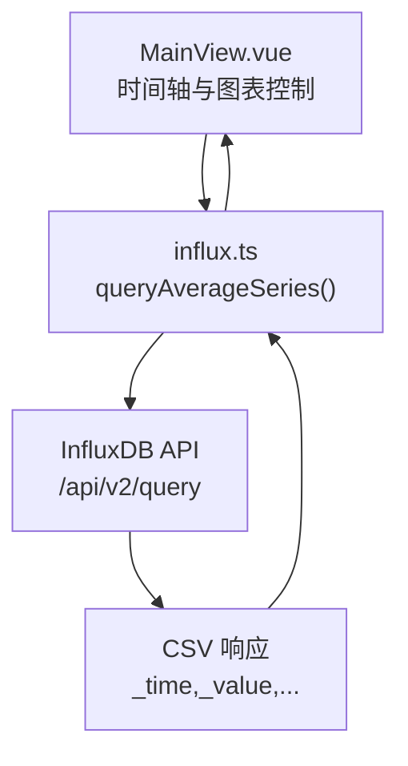
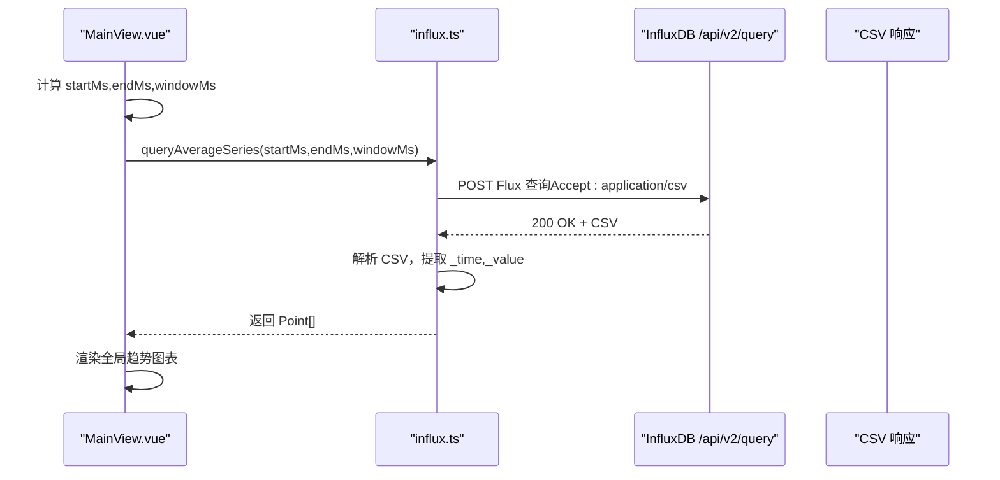
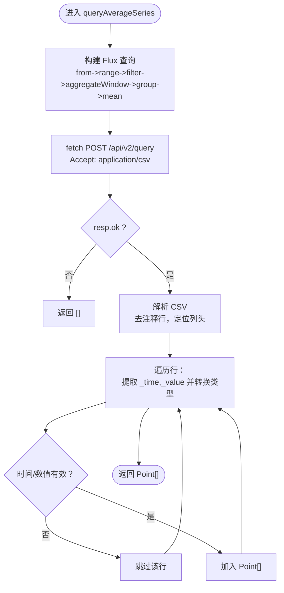
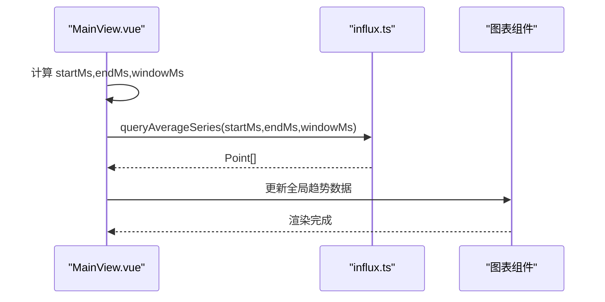
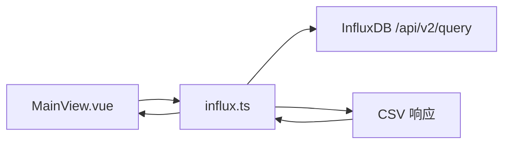

# 平均值聚合查询

<cite>
**本文引用的文件**
- [influx.ts](file://src/services/influx.ts)
- [MainView.vue](file://src/components/MainView.vue)
</cite>

## 目录
1. [简介](#简介)
2. [项目结构](#项目结构)
3. [核心组件](#核心组件)
4. [架构总览](#架构总览)
5. [详细组件分析](#详细组件分析)
6. [依赖关系分析](#依赖关系分析)
7. [性能考量](#性能考量)
8. [故障排查指南](#故障排查指南)
9. [结论](#结论)
10. [附录](#附录)

## 简介
本文件围绕前端服务函数 queryAverageSeries 的实现机制进行深入分析，重点解释其如何通过 InfluxDB 的 Flux 语言对全楼范围内的温度数据进行时间窗口聚合。文档将详细说明 startMs、endMs 和 windowMs 三个时间参数的含义及在 range 和 aggregateWindow 中的应用方式；阐述函数如何将 InfluxDB 返回的 CSV 响应解析为 Point[] 数组，并处理时间戳与数值的类型转换；给出前端调用示例以及在全局趋势图表中的应用场景；同时总结该查询不区分房间、聚合所有 room_temp 与 temperature 测量值的技术特点，并讨论性能优化策略（如空值处理 createEmpty: false 与分组操作）。

## 项目结构
- 前端服务层：src/services/influx.ts 提供与 InfluxDB 交互的函数集合，其中 queryAverageSeries 负责全楼平均温度趋势查询。
- 前端视图层：src/components/MainView.vue 负责时间轴控制、窗口大小计算、调用 queryAverageSeries 并驱动全局趋势图表渲染。

**图表来源**
- [influx.ts](file://src/services/influx.ts#L39-L70)
- [MainView.vue](file://src/components/MainView.vue#L347-L365)

**章节来源**
- [influx.ts](file://src/services/influx.ts#L1-L136)
- [MainView.vue](file://src/components/MainView.vue#L347-L365)

## 核心组件
- queryAverageSeries(startMs, endMs, windowMs): 前端服务函数，负责构建 Flux 查询语句，调用 InfluxDB API，解析 CSV 响应并返回 Point[]。
- MainView.vue 中的时间轴与窗口计算：根据当前时间范围动态计算 windowMs，并在时间范围变化时触发查询。

关键要点：
- 时间参数语义：startMs 与 endMs 决定查询的时间范围；windowMs 决定时间窗口大小，用于 aggregateWindow 的分桶聚合。
- Flux 查询链路：from -> range -> filter -> aggregateWindow -> group -> mean，最终输出每个窗口的平均值。
- CSV 解析：按列头定位 _time 与 _value，逐行解析并转换为 Point[]。

**章节来源**
- [influx.ts](file://src/services/influx.ts#L39-L70)
- [MainView.vue](file://src/components/MainView.vue#L347-L365)

## 架构总览
queryAverageSeries 的调用流程如下：

**图表来源**
- [influx.ts](file://src/services/influx.ts#L39-L70)
- [MainView.vue](file://src/components/MainView.vue#L347-L365)

## 详细组件分析

### queryAverageSeries 实现机制
- Flux 查询构建
  - 使用 from(bucket) 选择数据源。
  - 使用 range(start, stop) 限定时间范围，start 与 stop 由 startMs/endMs 转换为 ISO 字符串传入。
  - 使用 filter 过滤测量名称 room_temp 与 temperature，以及字段 value。
  - 使用 aggregateWindow(every: windowMs, fn: mean, createEmpty: false) 对每个窗口求均值，且不填充空窗口。
  - 使用 group(columns: ["_time"]) 与 mean() 进一步聚合，确保输出每时间点一个值。
- 请求与响应
  - 以 application/vnd.flux 作为 Content-Type 发送 Flux。
  - 以 application/csv 作为 Accept 接收响应。
  - 通过 fetch 发起 POST 请求到 /api/v2/query。
- CSV 解析与类型转换
  - 去除注释行（以 # 开头）。
  - 定位 _time 与 _value 列索引。
  - 逐行解析：时间戳转换为毫秒级时间戳，数值转换为浮点数。
  - 过滤 NaN 与无效行，组装 Point[] 返回。

**图表来源**
- [influx.ts](file://src/services/influx.ts#L39-L70)

**章节来源**
- [influx.ts](file://src/services/influx.ts#L39-L70)

### 时间参数与窗口聚合
- startMs、endMs
  - 含义：查询的起止时间（毫秒时间戳）。
  - 作用：在 range(start, stop) 中限定数据范围。
- windowMs
  - 含义：时间窗口大小（毫秒），用于 aggregateWindow 的 every 子句。
  - 作用：将连续时间序列切分为固定宽度的桶，每个桶内取平均值，从而降低采样密度、平滑波动。
- 窗口对齐与边界
  - Flux 的 range 与 aggregateWindow 会根据 start 与 windowMs 对齐窗口边界。
  - createEmpty: false 表示不填充空窗口，避免产生零值或缺失值导致的噪声。

**章节来源**
- [influx.ts](file://src/services/influx.ts#L39-L70)

### CSV 解析与类型转换
- 列定位：通过查找包含 _time 与 _value 的行确定列头，进而获取两列索引。
- 类型转换：
  - 时间戳：使用 Date.parse 将字符串解析为毫秒时间戳。
  - 数值：使用 parseFloat 转换为浮点数。
- 过滤策略：跳过无效行与 NaN 值，保证 Point[] 的质量。

**章节来源**
- [influx.ts](file://src/services/influx.ts#L55-L69)

### 前端调用示例与全局趋势图表场景
- 调用入口
  - MainView.vue 在时间范围变化时调用 queryAverageSeries，并将返回的 Point[] 赋给 chartData，驱动全局趋势图表渲染。
- 窗口大小计算
  - 根据当前时间跨度 (end - start) 与固定点数上限（例如 300）计算 windowMs，确保图表点数适中且平滑。
- 典型场景
  - 全局趋势：展示整栋建筑的平均温度随时间的变化，便于观察整体热环境趋势。
  - 与其他房间系列叠加：可结合 queryRoomSeries 为特定房间绘制叠加曲线，对比分析。

**图表来源**
- [MainView.vue](file://src/components/MainView.vue#L347-L365)
- [influx.ts](file://src/services/influx.ts#L39-L70)

**章节来源**
- [MainView.vue](file://src/components/MainView.vue#L347-L365)

### 不区分房间的聚合特性
- 测量过滤：同时包含 room_temp 与 temperature 两类测量名称，聚合所有符合条件的温度记录。
- 无房间维度：查询未按 code 或房间标签分组，因此输出的是全楼统一的平均趋势。
- 适用性：适合观察总体热环境变化，不适合做房间级对比。

**章节来源**
- [influx.ts](file://src/services/influx.ts#L43-L48)

## 依赖关系分析
- 组件耦合
  - MainView.vue 依赖 influx.ts 的 queryAverageSeries。
  - influx.ts 依赖浏览器 fetch 与 InfluxDB API。
- 外部依赖
  - InfluxDB API：/api/v2/query，要求 Authorization 与 Accept/Content-Type 正确设置。
- 潜在风险
  - CSV 解析依赖列顺序与列名一致性；若列名或顺序变化需同步更新解析逻辑。
  - 空值处理：createEmpty: false 避免空窗口，但跨窗口的空洞在图表上可能表现为断点。

**图表来源**
- [influx.ts](file://src/services/influx.ts#L39-L70)
- [MainView.vue](file://src/components/MainView.vue#L347-L365)

**章节来源**
- [influx.ts](file://src/services/influx.ts#L1-L136)
- [MainView.vue](file://src/components/MainView.vue#L347-L365)

## 性能考量
- 窗口大小与点数平衡
  - windowMs 与时间跨度成比例，过大导致点数过少、细节丢失；过小导致点数过多、渲染压力增大。
  - 建议根据可视区域宽度与时间跨度动态计算，维持约 200–400 个点的合理范围。
- createEmpty: false 的影响
  - 不填充空窗口，减少无效数据点，提升图表连贯性；但跨窗口空洞处可能出现断点。
- 分组与聚合
  - group(columns: ["_time"]) 与 mean() 有助于稳定输出，避免重复或冗余数据。
- 网络与解析
  - CSV 解析在前端进行，建议在数据量较大时考虑后端聚合或压缩传输（若可行）。
  - 合理设置超时与重试策略，避免长时间阻塞 UI。

[本节为通用指导，无需具体文件引用]

## 故障排查指南
- InfluxDB 未配置
  - 若 isInfluxConfigured() 返回 false，queryAverageSeries 直接返回空数组。请检查环境变量与认证配置。
- 请求失败
  - resp.ok 为 false 时返回空数组。检查网络、URL、组织与桶配置、Token/Bearer 设置。
- CSV 解析异常
  - 无 _time 或 _value 列头时，解析会失败。确认 Flux 查询列名与顺序。
  - 行格式不规范或包含注释行会被跳过。确保 CSV 无多余头部或尾部。
- 类型转换错误
  - 时间戳或数值解析为 NaN 时会被过滤。检查时间格式与数值格式是否符合预期。

**章节来源**
- [influx.ts](file://src/services/influx.ts#L9-L14)
- [influx.ts](file://src/services/influx.ts#L39-L70)

## 结论
queryAverageSeries 通过 Flux 的 range 与 aggregateWindow 实现全楼温度的高效时间窗口聚合，结合 CSV 解析与类型转换，为全局趋势图表提供稳定的时序数据。其不区分房间、聚合所有温度测量值的设计使其更适合观察整体热环境趋势。通过合理的 windowMs 与 createEmpty: false 策略，可在保证平滑度的同时避免空洞噪声。前端调用侧建议在时间范围变化时动态计算窗口大小，并在 UI 上提供可视化反馈。

[本节为总结，无需具体文件引用]

## 附录
- 前端调用参考路径
  - [MainView.vue](file://src/components/MainView.vue#L347-L365)
- 服务函数实现参考路径
  - [influx.ts](file://src/services/influx.ts#L39-L70)