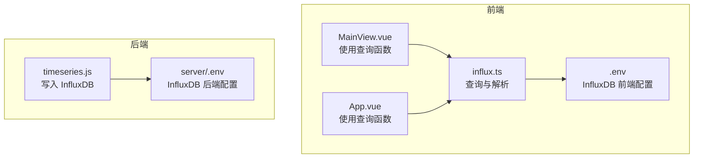
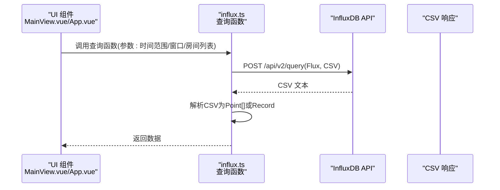
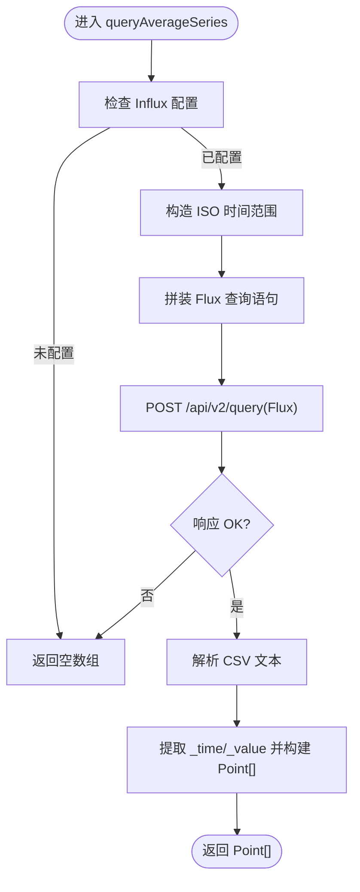
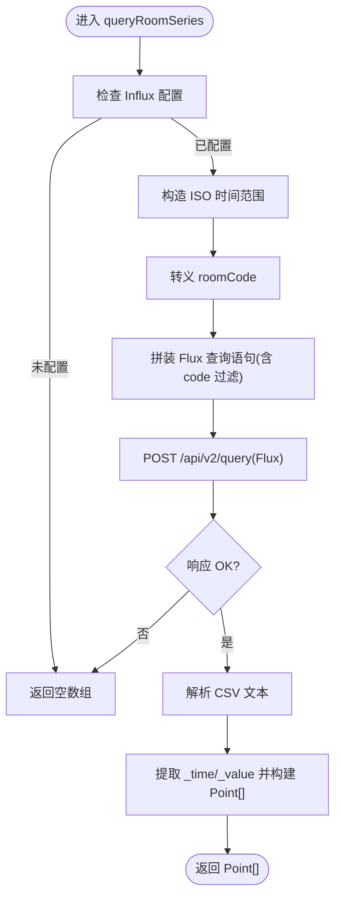
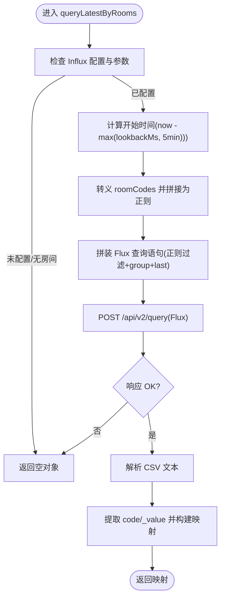
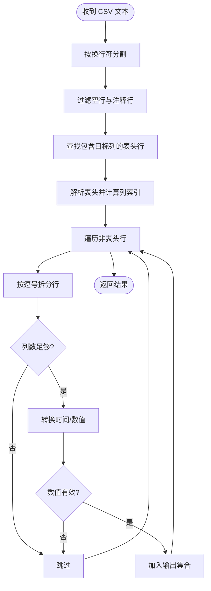
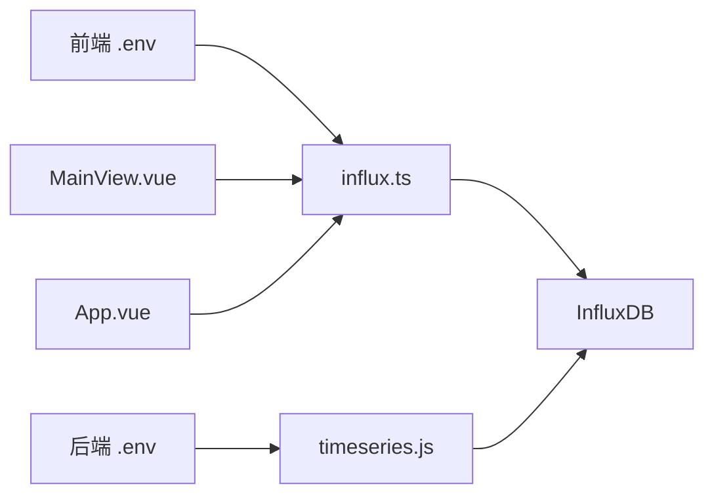

# 时序数据查询

<cite>
**本文引用的文件**
- [src/services/influx.ts](file://src/services/influx.ts)
- [src/components/MainView.vue](file://src/components/MainView.vue)
- [src/App.vue](file://src/App.vue)
- [.env](file://.env)
- [server/.env](file://server/.env)
- [server/routes/timeseries.js](file://server/routes/timeseries.js)
</cite>

## 目录
1. [简介](#简介)
2. [项目结构](#项目结构)
3. [核心组件](#核心组件)
4. [架构总览](#架构总览)
5. [详细组件分析](#详细组件分析)
6. [依赖关系分析](#依赖关系分析)
7. [性能考量](#性能考量)
8. [故障排查指南](#故障排查指南)
9. [结论](#结论)
10. [附录](#附录)

## 简介
本文件聚焦于前端服务模块中与 InfluxDB 交互的时序查询能力，深入解析以下三个查询函数：
- queryAverageSeries：按时间窗口聚合平均值，返回时间序列点数组
- queryRoomSeries：按房间过滤并按时间窗口聚合最小值，返回单房间时间序列点数组
- queryLatestByRooms：基于正则表达式一次性查询多个房间的最新值，返回房间代码到数值的映射

文档将解释各函数参数（如时间范围 startMs/endMs、聚合窗口 windowMs、多房间查询的 lookbackMs）、Flux 查询语句的构建与关键操作符（from、range、filter、aggregateWindow、group、last），以及从 CSV 响应到前端 Point[] 或 Record 的解析流程；特别强调 queryLatestByRooms 如何通过正则表达式实现高效多房间最新值查询。

## 项目结构
前端时序查询位于 src/services/influx.ts，主要被 src/components/MainView.vue 与 src/App.vue 使用；InfluxDB 的写入入口位于 server/routes/timeseries.js，前端通过 .env 中的环境变量进行连接。

**图表来源**
- [src/services/influx.ts](file://src/services/influx.ts#L1-L136)
- [src/components/MainView.vue](file://src/components/MainView.vue#L350-L380)
- [src/App.vue](file://src/App.vue#L520-L532)
- [.env](file://.env#L1-L6)
- [server/.env](file://server/.env#L11-L15)
- [server/routes/timeseries.js](file://server/routes/timeseries.js#L1-L104)

**章节来源**
- [src/services/influx.ts](file://src/services/influx.ts#L1-L136)
- [src/components/MainView.vue](file://src/components/MainView.vue#L350-L380)
- [src/App.vue](file://src/App.vue#L520-L532)
- [.env](file://.env#L1-L6)
- [server/.env](file://server/.env#L11-L15)
- [server/routes/timeseries.js](file://server/routes/timeseries.js#L1-L104)

## 核心组件
- 环境变量与认证
  - 前端通过 VITE_INFLUX_URL、VITE_INFLUX_ORG、VITE_INFLUX_BUCKET、VITE_INFLUX_TOKEN 进行连接；支持 Basic 认证开关与凭据
  - 后端通过 INFLUX_URL、INFLUX_ORG、INFLUX_BUCKET、INFLUX_TOKEN 进行写入
- 数据类型 Point
  - 表示时间序列点：timestamp（毫秒）、value（数值）
- 查询函数
  - queryAverageSeries：跨测量与字段的平均值聚合
  - queryRoomSeries：按房间过滤并最小值聚合
  - queryLatestByRooms：多房间最新值查询（正则匹配）

**章节来源**
- [src/services/influx.ts](file://src/services/influx.ts#L1-L25)
- [.env](file://.env#L1-L6)
- [server/.env](file://server/.env#L11-L15)

## 架构总览
前端通过 fetch 向 InfluxDB 的 Flux 查询接口提交查询，接收 CSV 响应，解析为 Point[] 或 Record<string, number>，供图表与标签展示使用。

**图表来源**
- [src/services/influx.ts](file://src/services/influx.ts#L39-L134)
- [src/components/MainView.vue](file://src/components/MainView.vue#L350-L380)
- [src/App.vue](file://src/App.vue#L520-L532)

## 详细组件分析

### 函数一：queryAverageSeries(startMs, endMs, windowMs)
- 参数
  - startMs、endMs：查询起止时间（毫秒）
  - windowMs：聚合窗口大小（毫秒）
- 功能
  - 聚合跨测量与字段的平均值，按时间窗口分组并求均值
- Flux 关键步骤
  - from：指定桶
  - range：限定时间范围
  - filter：筛选测量名称与字段
  - aggregateWindow：按 windowMs 聚合（均值）
  - group：按时间列分组
  - mean：最终聚合
- 结果解析
  - 从 CSV 中提取 _time 与 _value 列，转换为 Point[]

**图表来源**
- [src/services/influx.ts](file://src/services/influx.ts#L39-L69)

**章节来源**
- [src/services/influx.ts](file://src/services/influx.ts#L39-L69)

### 函数二：queryRoomSeries(roomCode, startMs, endMs, windowMs)
- 参数
  - roomCode：房间标识（会被转义）
  - startMs、endMs：查询起止时间（毫秒）
  - windowMs：聚合窗口大小（毫秒）
- 功能
  - 按房间过滤并按时间窗口聚合最小值
- Flux 关键步骤
  - from/range/filter：与平均值类似
  - filter：增加按 code/tag 过滤
  - aggregateWindow：按 windowMs 聚合（最小值）
- 结果解析
  - 与平均值一致，解析为 Point[]

**图表来源**
- [src/services/influx.ts](file://src/services/influx.ts#L72-L103)

**章节来源**
- [src/services/influx.ts](file://src/services/influx.ts#L72-L103)

### 函数三：queryLatestByRooms(roomCodes, lookbackMs)
- 参数
  - roomCodes：房间代码数组
  - lookbackMs：回溯时间（毫秒），最小值限制为 5 分钟
- 功能
  - 一次性查询多个房间的最新值，返回 code→value 映射
- Flux 关键步骤
  - from：指定桶
  - range：从 now()-max(lookbackMs, 5min) 开始
  - filter：测量与字段过滤，并使用正则表达式匹配 code
  - group：按 code 分组
  - last：取每组最后一条记录
- 正则表达式优化
  - 将多个 roomCode 通过 escTag 转义并以“|”连接成单一正则，减少多次请求与网络往返
- 结果解析
  - 从 CSV 中提取 code 与 _value 列，构建 Record<string, number>

**图表来源**
- [src/services/influx.ts](file://src/services/influx.ts#L105-L134)

**章节来源**
- [src/services/influx.ts](file://src/services/influx.ts#L105-L134)

### CSV 解析通用流程
三个函数均采用相同的 CSV 解析策略：
- 过滤掉空行与注释行（以“#”开头）
- 查找包含目标列名的表头行
- 通过列索引定位目标列（如 _time/_value 或 code）
- 对每一行进行拆分与类型转换（时间字符串→毫秒时间戳，数值字符串→浮点数）
- 过滤非法值并构建输出数组或映射

**图表来源**
- [src/services/influx.ts](file://src/services/influx.ts#L55-L69)
- [src/services/influx.ts](file://src/services/influx.ts#L87-L102)
- [src/services/influx.ts](file://src/services/influx.ts#L118-L133)

## 依赖关系分析
- 前端查询依赖
  - 环境变量：VITE_INFLUX_URL、VITE_INFLUX_ORG、VITE_INFLUX_BUCKET、VITE_INFLUX_TOKEN
  - 认证头：Token 或 Basic
  - 接口：/api/v2/query（Accept: application/csv）
- 后端写入依赖
  - 环境变量：INFLUX_URL、INFLUX_ORG、INFLUX_BUCKET、INFLUX_TOKEN
  - 接口：/api/v2/write（Line Protocol）
- 前端使用
  - MainView.vue：周期性刷新图表与房间系列缓存，调用 queryAverageSeries、queryRoomSeries、queryLatestByRooms
  - App.vue：按房间选择刷新覆盖层数据，调用 queryRoomSeries

**图表来源**
- [.env](file://.env#L1-L6)
- [server/.env](file://server/.env#L11-L15)
- [server/routes/timeseries.js](file://server/routes/timeseries.js#L1-L104)
- [src/services/influx.ts](file://src/services/influx.ts#L1-L25)
- [src/components/MainView.vue](file://src/components/MainView.vue#L350-L380)
- [src/App.vue](file://src/App.vue#L520-L532)

**章节来源**
- [.env](file://.env#L1-L6)
- [server/.env](file://server/.env#L11-L15)
- [server/routes/timeseries.js](file://server/routes/timeseries.js#L1-L104)
- [src/services/influx.ts](file://src/services/influx.ts#L1-L25)
- [src/components/MainView.vue](file://src/components/MainView.vue#L350-L380)
- [src/App.vue](file://src/App.vue#L520-L532)

## 性能考量
- 聚合窗口与采样
  - windowMs 通常设置为 (end-start)/300 左右，避免过度采样导致 CSV 过大
- 正则匹配优化
  - queryLatestByRooms 将多个房间代码拼接为单一正则，减少请求次数与网络开销
- 数据解析效率
  - 仅解析必要列，避免多余字段处理
- 错误与降级
  - 配置缺失或响应非 OK 时快速返回空结果，避免阻塞 UI
- 写入一致性
  - 后端写入使用 Line Protocol，字段名与标签名与查询一致，保证查询命中率

[本节为通用建议，无需特定文件引用]

## 故障排查指南
- 无法连接 InfluxDB
  - 检查前端 .env 中 VITE_INFLUX_URL、VITE_INFLUX_ORG、VITE_INFLUX_BUCKET、VITE_INFLUX_TOKEN 是否正确
  - 若使用 Basic 认证，确认 useBasic 与用户名密码配置
- 查询无数据
  - 确认写入端已启用并成功写入（参考后端 timeseries.js）
  - 检查测量名与字段名是否与查询一致（room_temp/temperature 与 value）
  - 核对时间范围与窗口大小是否合理
- CSV 解析异常
  - 确保响应头 Accept 为 application/csv
  - 检查 CSV 中是否存在 _time/_value 或 code/_value 列
- 多房间查询失败
  - 确认 roomCodes 数组非空
  - 检查转义后的 code 是否与写入时一致（escTag 替换特殊字符）

**章节来源**
- [src/services/influx.ts](file://src/services/influx.ts#L1-L25)
- [server/routes/timeseries.js](file://server/routes/timeseries.js#L1-L104)
- [.env](file://.env#L1-L6)
- [server/.env](file://server/.env#L11-L15)

## 结论
本文系统梳理了前端时序查询服务模块，明确了三个核心函数的参数含义、Flux 查询构建与解析流程，并重点解析了 queryLatestByRooms 的正则表达式优化策略。通过统一的 CSV 解析与合理的窗口设置，系统能够在前端高效地获取与展示房间温度等时序数据，支撑可视化与实时标签显示。

[本节为总结，无需特定文件引用]

## 附录

### Flux 关键操作符说明
- from：指定数据源桶
- range：限定时间范围
- filter：条件过滤（测量名、字段名、标签正则）
- aggregateWindow：按时间窗口聚合（均值/最小值）
- group：按列分组
- last：取每组最后一条记录
- mean：对分组结果求均值

[本节为概念说明，无需特定文件引用]