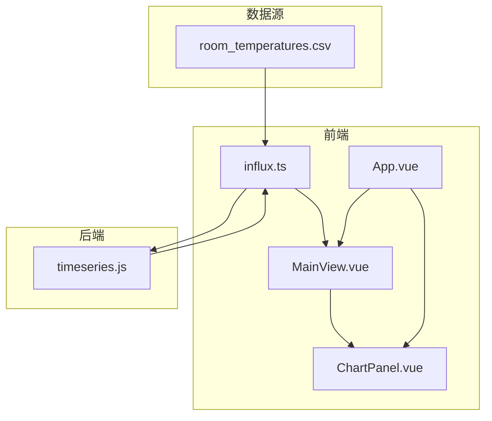
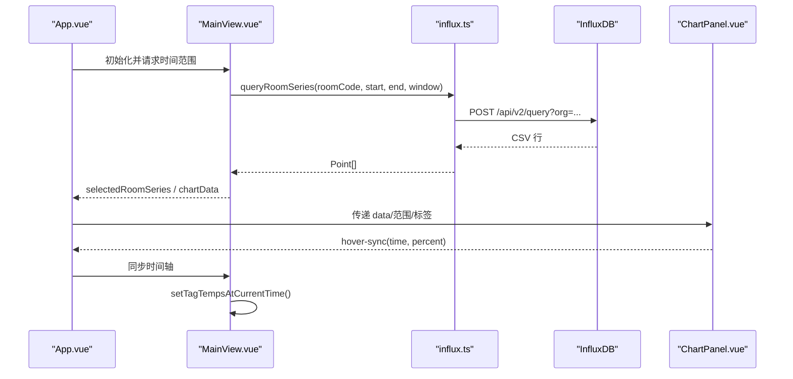
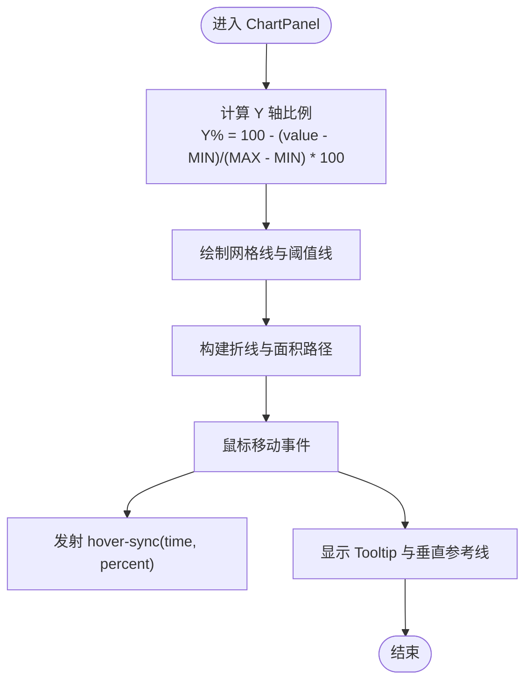
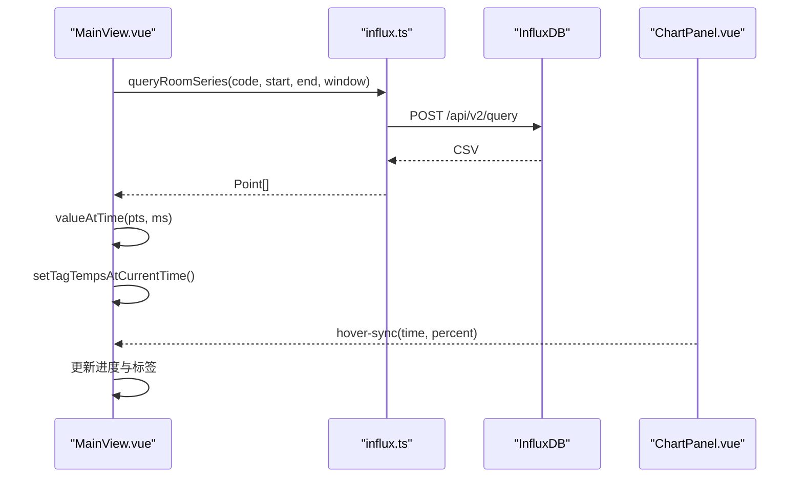
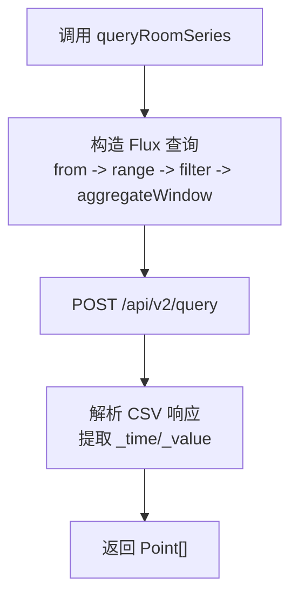
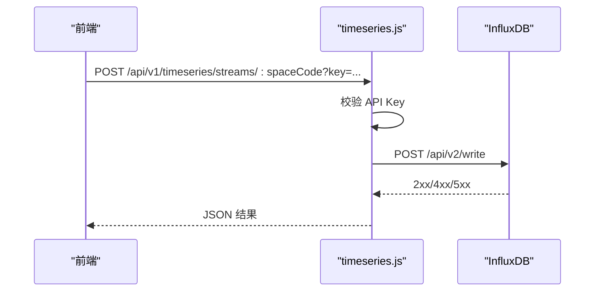
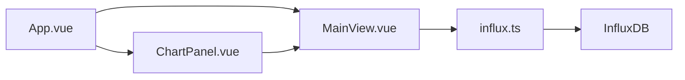

# 时序数据集成

<cite>
**本文引用的文件**
- [ChartPanel.vue](file://src/components/ChartPanel.vue)
- [influx.ts](file://src/services/influx.ts)
- [timeseries.js](file://server/routes/timeseries.js)
- [room_temperatures.csv](file://public/data/room_temperatures.csv)
- [MainView.vue](file://src/components/MainView.vue)
- [App.vue](file://src/App.vue)
</cite>

## 目录
1. [引言](#引言)
2. [项目结构](#项目结构)
3. [核心组件](#核心组件)
4. [架构总览](#架构总览)
5. [详细组件分析](#详细组件分析)
6. [依赖关系分析](#依赖关系分析)
7. [性能考量](#性能考量)
8. [故障排查指南](#故障排查指南)
9. [结论](#结论)
10. [附录](#附录)

## 引言
本文件围绕时序数据集成展开，重点解析如何将 CSV 中的温度数据通过 InfluxDB 时序数据库进行存储与查询，并在前端图表中以 SVG 动态折线图的形式进行可视化展示。文档还深入说明 ChartPanel 组件如何利用 queryAverageSeries 与 queryRoomSeries 服务方法从 InfluxDB 获取数据，以及如何通过鼠标悬停提示、阈值线（30°C 高温预警）与异常点标记实现交互式可视化。此外，文档分析 valueAtTime 与 setTagTempsAtCurrentTime 等辅助函数如何将图表时间轴与 3D 模型中的温度标签进行同步，并解释 Y 轴范围（-20°C 至 40°C）与颜色映射（从蓝色到红色）的设计原理。

## 项目结构
本项目的时序数据链路涉及前端 Vue 组件、InfluxDB 服务封装、CSV 数据源以及后端时序数据接收路由。整体结构如下：
- 前端
  - ChartPanel.vue：单房间折线图组件，负责渲染 SVG 折线、阈值线、异常点与 Tooltip。
  - MainView.vue：主视图，负责从 InfluxDB 加载图表数据、维护房间系列缓存、将时间轴与 3D 模型标签同步。
  - App.vue：应用入口，承载 ChartPanel 与 MainView 的组合布局。
  - influx.ts：封装 InfluxDB 写入与查询接口（平均值、房间序列、最新值）。
- 后端
  - timeseries.js：接收外部时序数据写入 InfluxDB 的 API 路由，提供签名流 URL 生成与校验。
- 数据源
  - room_temperatures.csv：示例 CSV 温度数据，包含时间戳与各房间温度列。

图表来源
- [App.vue](file://src/App.vue#L60-L82)
- [MainView.vue](file://src/components/MainView.vue#L355-L382)
- [ChartPanel.vue](file://src/components/ChartPanel.vue#L1-L40)
- [influx.ts](file://src/services/influx.ts#L39-L114)
- [timeseries.js](file://server/routes/timeseries.js#L125-L206)
- [room_temperatures.csv](file://public/data/room_temperatures.csv#L1-L20)

章节来源
- [App.vue](file://src/App.vue#L60-L82)
- [MainView.vue](file://src/components/MainView.vue#L355-L382)
- [ChartPanel.vue](file://src/components/ChartPanel.vue#L1-L40)
- [influx.ts](file://src/services/influx.ts#L39-L114)
- [timeseries.js](file://server/routes/timeseries.js#L125-L206)
- [room_temperatures.csv](file://public/data/room_temperatures.csv#L1-L20)

## 核心组件
- ChartPanel.vue
  - 负责渲染 SVG 折线图、阈值线（30°C）、异常点标记、Tooltip 与 X/Y 轴标签。
  - 通过 hover 事件向父组件发送时间同步信号，驱动 3D 模型标签更新。
- MainView.vue
  - 从 InfluxDB 加载图表数据与房间系列缓存，维护时间窗口与窗口大小。
  - 提供 valueAtTime 与 setTagTempsAtCurrentTime 辅助函数，将时间轴与模型标签同步。
- influx.ts
  - 提供 queryAverageSeries、queryRoomSeries、queryLatestByRooms 等查询方法，返回标准化 Point 数组。
- timeseries.js
  - 提供写入 InfluxDB 的 API，支持基于空间编码与 HMAC 的 API Key 校验。
- room_temperatures.csv
  - 示例 CSV 数据，包含时间戳与各房间温度列，可作为 InfluxDB 写入的输入源。

章节来源
- [ChartPanel.vue](file://src/components/ChartPanel.vue#L1-L40)
- [MainView.vue](file://src/components/MainView.vue#L390-L459)
- [influx.ts](file://src/services/influx.ts#L39-L114)
- [timeseries.js](file://server/routes/timeseries.js#L125-L206)
- [room_temperatures.csv](file://public/data/room_temperatures.csv#L1-L20)

## 架构总览
前端通过 App.vue 组合 MainView 与 ChartPanel，MainView 负责从 InfluxDB 加载数据并维护时间窗口；ChartPanel 负责渲染与交互。后端提供写入 API，前端也可直接将 CSV 数据转换为 InfluxDB Line Protocol 写入。

图表来源
- [App.vue](file://src/App.vue#L60-L82)
- [MainView.vue](file://src/components/MainView.vue#L355-L382)
- [influx.ts](file://src/services/influx.ts#L72-L103)
- [ChartPanel.vue](file://src/components/ChartPanel.vue#L190-L218)

章节来源
- [App.vue](file://src/App.vue#L60-L82)
- [MainView.vue](file://src/components/MainView.vue#L355-L382)
- [influx.ts](file://src/services/influx.ts#L72-L103)
- [ChartPanel.vue](file://src/components/ChartPanel.vue#L190-L218)

## 详细组件分析

### ChartPanel.vue：SVG 折线图与交互
- Y 轴范围与网格线
  - Y 轴范围固定为 [-20, 40]°C，对应 SVG 百分比从 100%（-20°C）到 0%（40°C）。
  - 静态网格线位于 16.7%、33.3%、50%、66.7%、83.3%，分别对应 30°C、20°C、10°C、0°C、-10°C。
- 阈值线与异常点
  - 阈值线位于 30°C 对应的百分比处，标注“30°C 高温预警”。
  - 异常点标记用于标识温度跨越阈值的区间起点，采用圆点标记。
- 折线与面积填充
  - 折线路径由 Point 数组计算生成，面积填充为渐变色，增强视觉层次。
- Tooltip 与悬停
  - 鼠标移动时计算当前点的值与时间，显示 Tooltip 并绘制垂直参考线与高亮圆点。
  - 当值 ≥ 30°C 时，Tooltip 文字与圆点采用警示色。
- 时间轴与 X 轴标签
  - X 轴标签按固定数量均匀采样，显示小时:分钟。
- 与父组件的交互
  - 发射 hover-sync 事件，携带时间戳与百分比，用于同步 3D 模型标签。

图表来源
- [ChartPanel.vue](file://src/components/ChartPanel.vue#L118-L178)
- [ChartPanel.vue](file://src/components/ChartPanel.vue#L132-L165)
- [ChartPanel.vue](file://src/components/ChartPanel.vue#L190-L218)

章节来源
- [ChartPanel.vue](file://src/components/ChartPanel.vue#L1-L40)
- [ChartPanel.vue](file://src/components/ChartPanel.vue#L118-L178)
- [ChartPanel.vue](file://src/components/ChartPanel.vue#L190-L218)

### MainView.vue：数据加载与时间轴同步
- 数据加载
  - 通过 queryRoomSeries 从 InfluxDB 加载指定房间的时间序列，维护房间系列缓存。
  - 当时间范围变化或用户选择房间时，刷新 selectedRoomSeries。
- 时间轴与标签同步
  - valueAtTime：二分查找最近时间点，返回对应温度值。
  - setTagTempsAtCurrentTime：根据当前进度百分比，计算每个房间在缓存中的温度并更新标签。
- 与 ChartPanel 的联动
  - 监听 chart-data-update，更新当前时间范围并刷新房间系列。
  - 通过 hover-sync 事件，将鼠标悬停时间同步到 MainView 的进度条。

图表来源
- [MainView.vue](file://src/components/MainView.vue#L355-L382)
- [MainView.vue](file://src/components/MainView.vue#L390-L459)
- [influx.ts](file://src/services/influx.ts#L72-L103)

章节来源
- [MainView.vue](file://src/components/MainView.vue#L355-L382)
- [MainView.vue](file://src/components/MainView.vue#L390-L459)
- [influx.ts](file://src/services/influx.ts#L72-L103)

### influx.ts：InfluxDB 查询与写入
- 写入接口
  - writeRoomHistory：将房间温度写入 InfluxDB，使用 Line Protocol，支持毫秒精度时间戳。
- 查询接口
  - queryAverageSeries：按时间窗口聚合平均值，返回 Point[]。
  - queryRoomSeries：按房间过滤并按时间窗口聚合最小值，返回 Point[]。
  - queryLatestByRooms：按房间代码集合查询最近值，返回 code->value 映射。
- Flux 查询要点
  - 过滤测量名称为 room_temp 或 temperature，字段为 value。
  - 使用 aggregateWindow 与 group 聚合，最后取 mean 或 last。

图表来源
- [influx.ts](file://src/services/influx.ts#L39-L114)

章节来源
- [influx.ts](file://src/services/influx.ts#L39-L114)

### timeseries.js：后端写入 API
- API Key 生成与校验
  - 基于空间编码与密钥生成 HMAC-SHA256，输出 URL 安全 Base64（截断至 22 字符）。
  - 支持查询参数 ?key=xxx 或 Authorization: Bearer xxx。
- 写入流程
  - 校验 API Key 后，解析请求体 JSON，移除 timestamp 字段，构造 Line Protocol 并写入 InfluxDB。
  - 返回成功/失败信息与错误详情。

图表来源
- [timeseries.js](file://server/routes/timeseries.js#L125-L206)

章节来源
- [timeseries.js](file://server/routes/timeseries.js#L125-L206)

### CSV 数据源与写入
- room_temperatures.csv
  - 包含时间戳与各房间温度列，可用于批量写入 InfluxDB。
- 写入建议
  - 将 CSV 行转换为 Line Protocol，每行一条记录，字段名为温度值，标签包含房间编码。
  - 使用毫秒精度时间戳，确保与前端时间轴一致。

章节来源
- [room_temperatures.csv](file://public/data/room_temperatures.csv#L1-L20)

## 依赖关系分析
- 组件耦合
  - App.vue 组合 MainView 与 ChartPanel，MainView 依赖 influx.ts 进行数据查询。
  - ChartPanel 仅消费 MainView 传递的数据与事件，保持低耦合。
- 外部依赖
  - InfluxDB：通过 influx.ts 与后端 timeseries.js 交互。
  - Autodesk Viewer（MainView 中使用）：用于 3D 模型渲染与标签同步。

图表来源
- [App.vue](file://src/App.vue#L60-L82)
- [MainView.vue](file://src/components/MainView.vue#L355-L382)
- [ChartPanel.vue](file://src/components/ChartPanel.vue#L1-L40)
- [influx.ts](file://src/services/influx.ts#L39-L114)

章节来源
- [App.vue](file://src/App.vue#L60-L82)
- [MainView.vue](file://src/components/MainView.vue#L355-L382)
- [ChartPanel.vue](file://src/components/ChartPanel.vue#L1-L40)
- [influx.ts](file://src/services/influx.ts#L39-L114)

## 性能考量
- 查询窗口大小
  - MainView 在刷新房间系列时，根据时间跨度动态计算窗口大小，避免点数过多导致渲染卡顿。
- 渲染优化
  - ChartPanel 使用 SVG 路径绘制折线与面积，避免 DOM 元素过多。
  - Tooltip 与阈值线采用轻量级元素，减少重绘。
- 数据缓存
  - MainView 维护房间系列缓存，避免重复查询；仅在时间范围或房间选择变化时刷新。
- I/O 优化
  - influx.ts 的查询返回标准化 Point[]，前端无需额外解析，降低 CPU 开销。

章节来源
- [MainView.vue](file://src/components/MainView.vue#L355-L382)
- [ChartPanel.vue](file://src/components/ChartPanel.vue#L1-L40)
- [influx.ts](file://src/services/influx.ts#L39-L114)

## 故障排查指南
- InfluxDB 未配置
  - 现象：前端图表数据为空，控制台出现未配置提示。
  - 处理：检查环境变量（VITE_INFLUX_URL/VITE_INFLUX_ORG/VITE_INFLUX_BUCKET/VITE_INFLUX_TOKEN），或后端 INFLUX_*。
- API Key 校验失败
  - 现象：后端返回 401/403。
  - 处理：确认空间编码与 API Key 一致，或使用 Authorization: Bearer 方式。
- 写入失败
  - 现象：后端返回错误信息或 500。
  - 处理：检查 InfluxDB Token、URL、Bucket 与网络连通性。
- 温度标签不同步
  - 现象：3D 模型标签不随时间轴移动。
  - 处理：确认 hover-sync 事件是否触发，valueAtTime 与 setTagTempsAtCurrentTime 是否执行。

章节来源
- [timeseries.js](file://server/routes/timeseries.js#L125-L206)
- [MainView.vue](file://src/components/MainView.vue#L390-L459)
- [ChartPanel.vue](file://src/components/ChartPanel.vue#L190-L218)

## 结论
本方案通过 CSV/外部 API 将温度数据写入 InfluxDB，前端使用 influx.ts 查询并渲染为 SVG 折线图，结合 MainView 的时间轴与标签同步机制，实现了从时序数据库到 3D 模型的可视化闭环。ChartPanel 的阈值线与异常点标记增强了告警能力，配合 Tooltip 实现了直观的交互体验。通过合理的窗口大小与缓存策略，保证了性能与可扩展性。

## 附录

### 设计原理说明
- Y 轴范围与颜色映射
  - Y 轴范围 [-20, 40]°C，对应 SVG 百分比 100%~0%。
  - 颜色映射从蓝色到红色，用于直观表达温度高低，与主视图迷你图的色带设计保持一致。
- 阈值线与异常点
  - 30°C 阈值线用于高温预警，异常点标记用于突出温度跨越阈值的区间起点，提升可读性。
- 时间轴同步
  - valueAtTime 与 setTagTempsAtCurrentTime 将时间轴与模型标签对齐，确保可视化一致性。

章节来源
- [ChartPanel.vue](file://src/components/ChartPanel.vue#L118-L178)
- [MainView.vue](file://src/components/MainView.vue#L496-L518)
- [MainView.vue](file://src/components/MainView.vue#L390-L459)