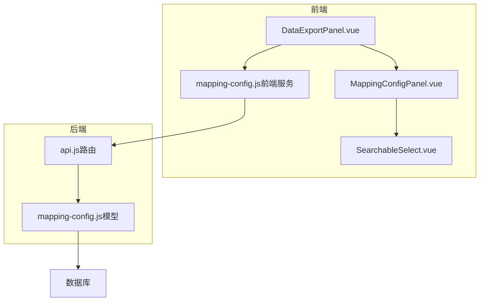
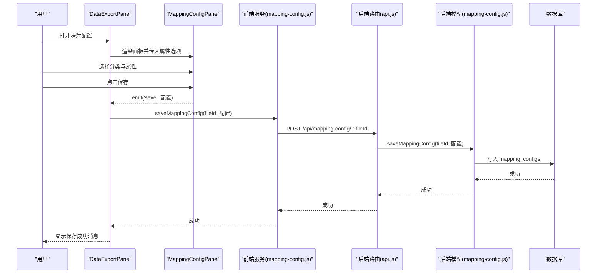
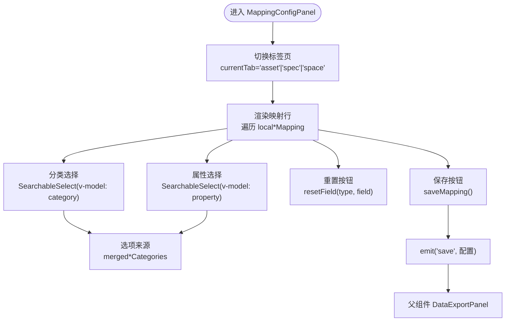
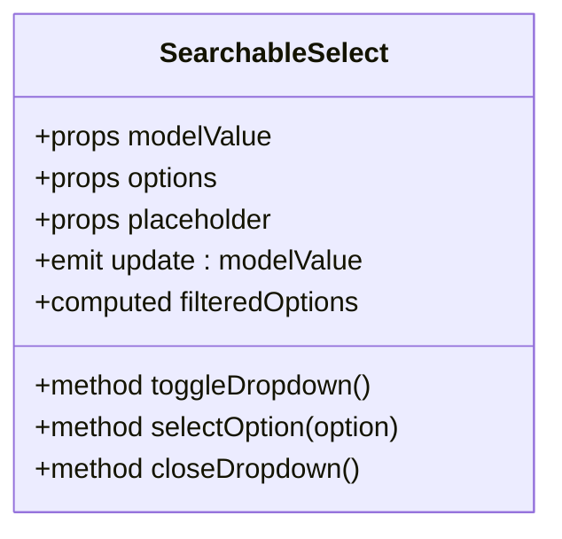
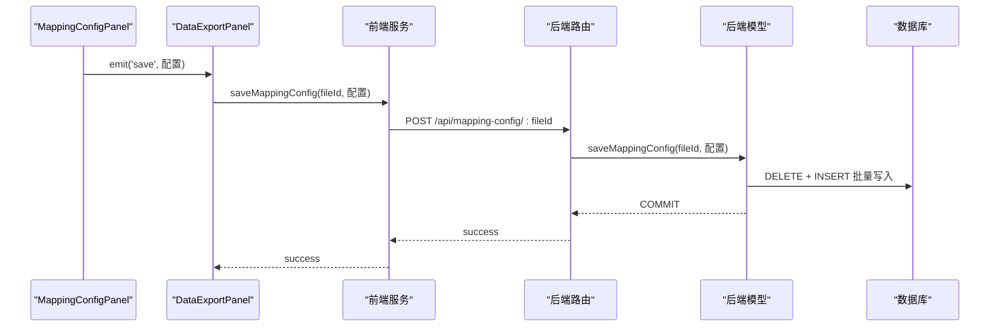
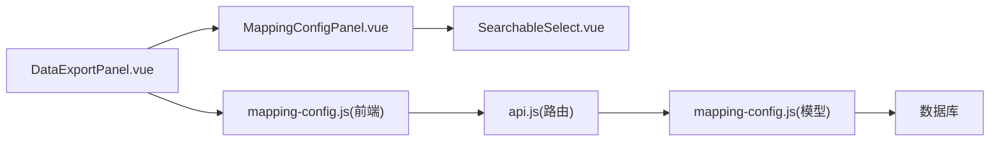

# 映射配置

<cite>
**本文引用的文件**
- [MappingConfigPanel.vue](file://src/components/MappingConfigPanel.vue)
- [SearchableSelect.vue](file://src/components/SearchableSelect.vue)
- [DataExportPanel.vue](file://src/components/DataExportPanel.vue)
- [mapping-config.js（前端服务）](file://src/services/mapping-config.js)
- [mapping-config.js（后端模型）](file://server/models/mapping-config.js)
- [api.js（后端路由）](file://server/routes/api.js)
- [MAPPING_CONFIG_COMPLETE.md](file://MAPPING_CONFIG_COMPLETE.md)
</cite>

## 目录
1. [简介](#简介)
2. [项目结构](#项目结构)
3. [核心组件](#核心组件)
4. [架构总览](#架构总览)
5. [详细组件分析](#详细组件分析)
6. [依赖分析](#依赖分析)
7. [性能考虑](#性能考虑)
8. [故障排查指南](#故障排查指南)
9. [结论](#结论)
10. [附录](#附录)

## 简介
本文件围绕“映射配置”功能进行全面解析，重点说明如何将资产、资产规格与空间的属性映射到外部分类标准（如 OmniClass），并通过 UI 组件与后端数据库协同工作。文档涵盖：
- MappingConfigPanel.vue 的 UI 设计与标签页切换逻辑
- SearchableSelect 在分类与属性选择中的应用
- 本地响应式对象 localAssetMapping 等如何维护用户配置副本
- saveMapping 如何通过 emit 事件提交配置并持久化到数据库
- resetField 的实现与 mergedAssetCategories/mergedSpaceCategories 的动态选项生成
- 该配置如何支撑数据导出流程

## 项目结构
映射配置涉及前端组件、前端服务、后端路由与模型、以及数据库迁移脚本。核心文件如下：
- 前端组件：MappingConfigPanel.vue、SearchableSelect.vue、DataExportPanel.vue
- 前端服务：src/services/mapping-config.js
- 后端路由：server/routes/api.js
- 后端模型：server/models/mapping-config.js
- 文档：MAPPING_CONFIG_COMPLETE.md

图表来源
- [DataExportPanel.vue](file://src/components/DataExportPanel.vue#L1-L120)
- [MappingConfigPanel.vue](file://src/components/MappingConfigPanel.vue#L1-L120)
- [SearchableSelect.vue](file://src/components/SearchableSelect.vue#L1-L80)
- [mapping-config.js（前端服务）](file://src/services/mapping-config.js#L1-L40)
- [api.js（后端路由）](file://server/routes/api.js#L466-L517)
- [mapping-config.js（后端模型）](file://server/models/mapping-config.js#L1-L40)

章节来源
- [DataExportPanel.vue](file://src/components/DataExportPanel.vue#L1-L120)
- [MappingConfigPanel.vue](file://src/components/MappingConfigPanel.vue#L1-L120)
- [mapping-config.js（前端服务）](file://src/services/mapping-config.js#L1-L40)
- [api.js（后端路由）](file://server/routes/api.js#L466-L517)
- [mapping-config.js（后端模型）](file://server/models/mapping-config.js#L1-L40)

## 核心组件
- MappingConfigPanel.vue：提供资产、资产规格、空间三类映射配置的 UI，支持标签页切换、分类与属性选择、重置与保存。
- SearchableSelect.vue：可搜索下拉选择器，用于分类与属性的选择。
- DataExportPanel.vue：承载映射配置面板，负责从数据库加载默认配置、保存配置、驱动数据导出。
- mapping-config.js（前端服务）：封装获取/保存映射配置的 API 调用。
- mapping-config.js（后端模型）：数据库读写映射配置。
- api.js（后端路由）：提供 /api/mapping-config/:fileId 的 GET/POST 接口。

章节来源
- [MappingConfigPanel.vue](file://src/components/MappingConfigPanel.vue#L1-L120)
- [SearchableSelect.vue](file://src/components/SearchableSelect.vue#L1-L80)
- [DataExportPanel.vue](file://src/components/DataExportPanel.vue#L1-L120)
- [mapping-config.js（前端服务）](file://src/services/mapping-config.js#L1-L40)
- [mapping-config.js（后端模型）](file://server/models/mapping-config.js#L1-L40)
- [api.js（后端路由）](file://server/routes/api.js#L466-L517)

## 架构总览
映射配置的端到端流程如下：
- 用户在 DataExportPanel 中打开映射配置面板
- MappingConfigPanel 展示三类映射（资产、资产规格、空间）
- 用户通过 SearchableSelect 选择分类与属性
- 用户点击保存，MappingConfigPanel 通过 emit 将本地配置传递给 DataExportPanel
- DataExportPanel 调用前端服务保存到后端，后端路由转发到模型层，模型层写入数据库
- 下次打开同一文件时，DataExportPanel 从数据库加载该文件的映射配置

图表来源
- [DataExportPanel.vue](file://src/components/DataExportPanel.vue#L160-L191)
- [MappingConfigPanel.vue](file://src/components/MappingConfigPanel.vue#L222-L229)
- [mapping-config.js（前端服务）](file://src/services/mapping-config.js#L43-L64)
- [api.js（后端路由）](file://server/routes/api.js#L490-L514)
- [mapping-config.js（后端模型）](file://server/models/mapping-config.js#L56-L114)

## 详细组件分析

### MappingConfigPanel.vue：映射配置面板
- 标签页（Tabs）：通过 currentTab 切换“资产”、“资产规格”、“空间”，对应不同的映射区域。
- 本地副本：使用 localAssetMapping、localAssetSpecMapping、localSpaceMapping 维护用户当前编辑的配置副本，避免直接修改父组件传入的 props。
- 分类与属性选择：使用 SearchableSelect 组件，v-model 绑定 mapping.category 与 mapping.property，分类选项来源于 mergedAssetCategories/mergedSpaceCategories 的动态计算。
- 重置功能：resetField(type, field) 将指定类型的某字段的 category 与 property 清空。
- 保存：saveMapping() 将三个本地映射对象通过 emit('save') 传递给父组件 DataExportPanel。

图表来源
- [MappingConfigPanel.vue](file://src/components/MappingConfigPanel.vue#L140-L229)
- [MappingConfigPanel.vue](file://src/components/MappingConfigPanel.vue#L174-L206)

章节来源
- [MappingConfigPanel.vue](file://src/components/MappingConfigPanel.vue#L140-L229)
- [MappingConfigPanel.vue](file://src/components/MappingConfigPanel.vue#L174-L206)

### SearchableSelect.vue：可搜索下拉选择器
- 功能要点：
  - v-model 双向绑定 modelValue
  - options 作为候选列表，filteredOptions 基于 searchText 过滤
  - Teleport 将下拉列表渲染到 body，避免被父容器裁剪
  - 点击外部自动关闭，支持键盘搜索与回车选择
- 在 MappingConfigPanel 中用于：
  - 分类选择：v-model="mapping.category"
  - 属性选择：v-model="mapping.property"

图表来源
- [SearchableSelect.vue](file://src/components/SearchableSelect.vue#L46-L146)

章节来源
- [SearchableSelect.vue](file://src/components/SearchableSelect.vue#L46-L146)

### 本地响应式对象与动态分类选项
- 本地副本：
  - localAssetMapping、localAssetSpecMapping、localSpaceMapping 通过 watch 监听 props 的变化，深拷贝到本地，确保异步数据也能正确初始化与更新。
- 动态分类选项：
  - mergedAssetCategories：合并 props.assetPropertyOptions 的键与本地映射中的 category，去重并排序
  - mergedSpaceCategories：合并 props.spacePropertyOptions 的键与本地映射中的 category，去重并排序
- 属性选项：
  - 资产属性选项：assetPropertyOptions[mapping.category] 或 []
  - 空间属性选项：spacePropertyOptions[mapping.category] 或 []

章节来源
- [MappingConfigPanel.vue](file://src/components/MappingConfigPanel.vue#L153-L171)
- [MappingConfigPanel.vue](file://src/components/MappingConfigPanel.vue#L174-L206)

### 保存与持久化流程
- MappingConfigPanel.saveMapping：
  - 将本地三个映射对象 JSON 深拷贝后通过 emit('save') 传递给父组件
- DataExportPanel.handleSaveMapping：
  - 接收新映射，更新本地状态
  - 若存在 fileId，调用前端服务 saveMappingConfig(fileId, 配置)
- 前端服务 mapping-config.js.saveMappingConfig：
  - 发送 POST /api/mapping-config/:fileId，请求体包含 assetMapping、assetSpecMapping、spaceMapping
- 后端路由 api.js：
  - 解析 fileId 并调用模型层 saveMappingConfig
- 后端模型 mapping-config.js.saveMappingConfig：
  - 删除旧配置，批量插入新配置，事务控制（BEGIN/COMMIT/ROLLBACK）

图表来源
- [MappingConfigPanel.vue](file://src/components/MappingConfigPanel.vue#L222-L229)
- [DataExportPanel.vue](file://src/components/DataExportPanel.vue#L162-L191)
- [mapping-config.js（前端服务）](file://src/services/mapping-config.js#L43-L64)
- [api.js（后端路由）](file://server/routes/api.js#L490-L514)
- [mapping-config.js（后端模型）](file://server/models/mapping-config.js#L56-L114)

章节来源
- [MappingConfigPanel.vue](file://src/components/MappingConfigPanel.vue#L222-L229)
- [DataExportPanel.vue](file://src/components/DataExportPanel.vue#L162-L191)
- [mapping-config.js（前端服务）](file://src/services/mapping-config.js#L43-L64)
- [api.js（后端路由）](file://server/routes/api.js#L490-L514)
- [mapping-config.js（后端模型）](file://server/models/mapping-config.js#L56-L114)

### 重置功能 resetField
- 功能：将指定类型（asset/spec/space）与字段的 category 与 property 清空
- 触发：映射行右侧的重置按钮
- 作用：快速撤销对该字段的映射更改，回到未选择状态

章节来源
- [MappingConfigPanel.vue](file://src/components/MappingConfigPanel.vue#L208-L221)

### 数据导出与映射配置的关系
- DataExportPanel 在导出时，会将当前映射配置传入数据提取函数，从而将资产与空间数据按照用户定义的映射关系抽取并导入数据库
- 该流程确保导出的数据与外部分类标准（如 OmniClass）保持一致

章节来源
- [DataExportPanel.vue](file://src/components/DataExportPanel.vue#L194-L297)

## 依赖分析
- 组件耦合：
  - MappingConfigPanel 依赖 SearchableSelect
  - DataExportPanel 依赖 MappingConfigPanel，并通过 emit/save 与之交互
- 服务与路由：
  - 前端服务 mapping-config.js 依赖后端路由 /api/mapping-config/:fileId
  - 后端路由依赖后端模型 mapping-config.js
  - 后端模型依赖数据库
- 数据一致性：
  - 后端模型使用事务，先删除旧配置再批量插入，保证一致性
  - 数据库表 mapping_configs 以 file_id、config_type、field_name 唯一，确保文件隔离

图表来源
- [MappingConfigPanel.vue](file://src/components/MappingConfigPanel.vue#L1-L120)
- [SearchableSelect.vue](file://src/components/SearchableSelect.vue#L1-L80)
- [DataExportPanel.vue](file://src/components/DataExportPanel.vue#L1-L120)
- [mapping-config.js（前端服务）](file://src/services/mapping-config.js#L1-L40)
- [api.js（后端路由）](file://server/routes/api.js#L466-L517)
- [mapping-config.js（后端模型）](file://server/models/mapping-config.js#L1-L40)

章节来源
- [MappingConfigPanel.vue](file://src/components/MappingConfigPanel.vue#L1-L120)
- [SearchableSelect.vue](file://src/components/SearchableSelect.vue#L1-L80)
- [DataExportPanel.vue](file://src/components/DataExportPanel.vue#L1-L120)
- [mapping-config.js（前端服务）](file://src/services/mapping-config.js#L1-L40)
- [api.js（后端路由）](file://server/routes/api.js#L466-L517)
- [mapping-config.js（后端模型）](file://server/models/mapping-config.js#L1-L40)

## 性能考虑
- 本地深拷贝与 watch：
  - 使用深拷贝避免直接修改 props，watch 设置 { deep: true, immediate: true } 确保初始化与异步数据均正确更新
- 下拉列表渲染：
  - SearchableSelect 使用 Teleport 渲染到 body，避免父容器溢出与滚动影响
- 数据库写入：
  - 后端模型使用事务与批量插入，减少多次往返，提升写入效率
- 建议优化：
  - 前端可增加缓存，避免重复拉取相同文件的映射配置
  - 对分类与属性选项进行分页或懒加载，提升大数据量下的交互性能

[本节为通用建议，无需特定文件来源]

## 故障排查指南
- 保存失败：
  - 检查后端路由 /api/mapping-config/:fileId 是否可达
  - 查看前端服务返回的错误信息与后端模型的异常日志
- 加载默认配置：
  - 若数据库查询异常，前端会降级使用默认映射配置
- 文件隔离问题：
  - 确认 fileId 是否正确传递，数据库唯一索引以 file_id 为准
- 下拉框无法打开或搜索无效：
  - 检查 SearchableSelect 的 options 与 filteredOptions 是否正确传入
  - 确认 Teleport 渲染目标与样式冲突

章节来源
- [DataExportPanel.vue](file://src/components/DataExportPanel.vue#L300-L344)
- [mapping-config.js（前端服务）](file://src/services/mapping-config.js#L13-L32)
- [mapping-config.js（后端模型）](file://server/models/mapping-config.js#L56-L114)
- [SearchableSelect.vue](file://src/components/SearchableSelect.vue#L119-L146)

## 结论
映射配置功能通过 MappingConfigPanel 与 SearchableSelect 提供直观的分类与属性选择体验，配合 DataExportPanel 的加载与保存流程，实现了文件级的映射配置持久化。后端采用事务与批量写入保障一致性，前端提供默认配置降级与错误提示，整体流程清晰、健壮，能够有效支撑数据导出与外部分类标准（如 OmniClass）的对接。

[本节为总结，无需特定文件来源]

## 附录
- 默认映射配置：
  - 前端服务提供 getDefaultMapping，包含资产、资产规格、空间三类默认映射
- 数据库表结构：
  - mapping_configs 表包含 file_id、config_type、field_name、category、property 等字段，并以 file_id+config_type+field_name 唯一

章节来源
- [mapping-config.js（前端服务）](file://src/services/mapping-config.js#L66-L102)
- [MAPPING_CONFIG_COMPLETE.md](file://MAPPING_CONFIG_COMPLETE.md#L88-L108)