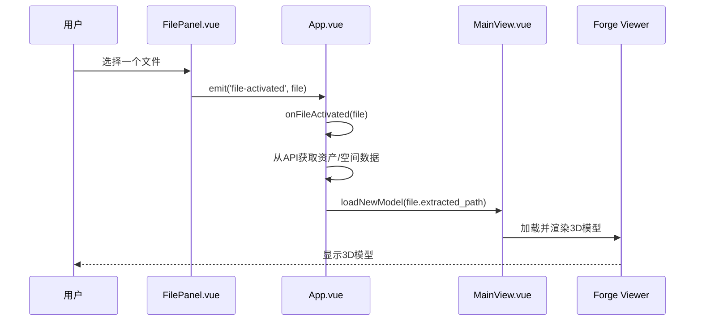
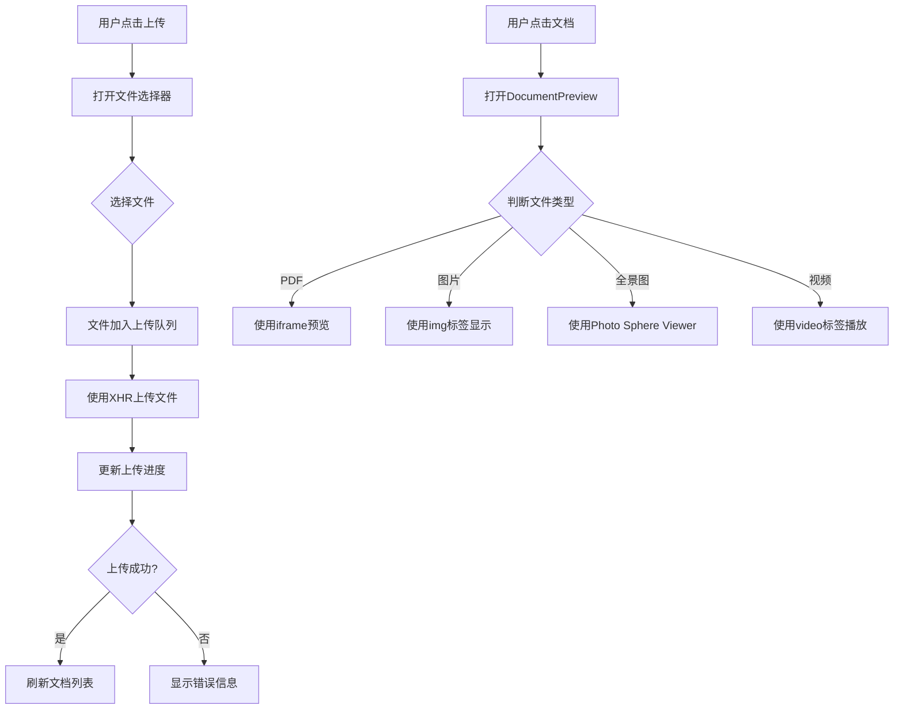
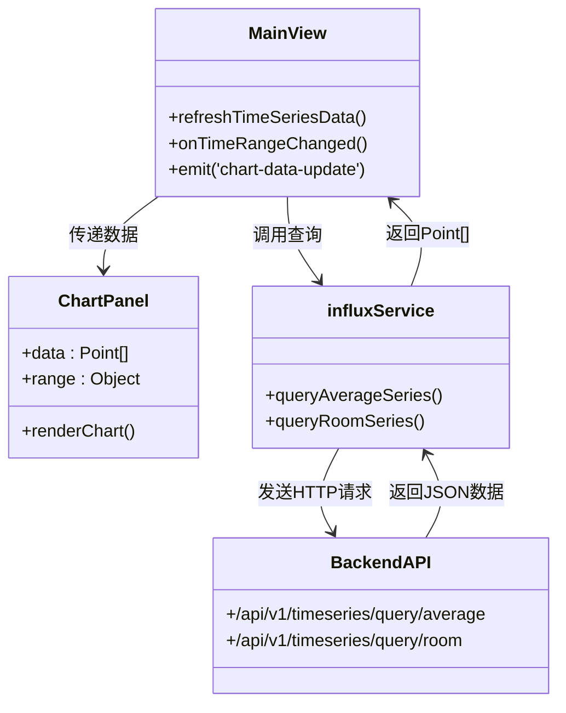

# 核心功能详解

<cite>
**本文档引用的文件**
- [App.vue](file://src/App.vue)
- [MainView.vue](file://src/components/MainView.vue)
- [DocumentList.vue](file://src/components/DocumentList.vue)
- [DocumentPreview.vue](file://src/components/DocumentPreview.vue)
- [ChartPanel.vue](file://src/components/ChartPanel.vue)
- [influx.ts](file://src/services/influx.ts)
- [MappingConfigPanel.vue](file://src/components/MappingConfigPanel.vue)
</cite>

## 目录
1. [模型可视化](#模型可视化)
2. [文档管理](#文档管理)
3. [时序数据集成](#时序数据集成)
4. [映射配置](#映射配置)

## 模型可视化

本功能基于 `MainView.vue` 组件和 `@photo-sphere-viewer/core` 库实现，为用户提供了一个强大的3D/2D模型浏览环境。该功能支持多种模型的加载与切换，并提供了丰富的交互式操作。

### 实现细节

模型可视化功能的核心是 `MainView.vue` 组件。该组件通过集成 Autodesk Forge Viewer 来渲染3D模型，并利用 `@photo-sphere-viewer/core` 库来处理全景图（360°）的预览。`MainView.vue` 组件通过 `loadNewModel` 方法加载指定路径的模型，此方法会触发模型的下载、解析和渲染流程。模型的路径通常存储在 `extracted_path` 字段中，该字段由后端服务提供。

为了实现模型的切换，`App.vue` 组件中的 `onFileActivated` 方法会在用户选择一个新文件时被调用。该方法首先从后端API获取与该文件关联的资产和空间数据，然后调用 `MainView.vue` 的 `loadNewModel` 方法来加载新的3D模型。如果当前Viewer尚未初始化，该方法会将文件信息暂存于 `pendingActiveFile` 中，待Viewer就绪后再进行加载。



**Diagram sources**
- [App.vue](file://src/App.vue#L684-L797)
- [MainView.vue](file://src/components/MainView.vue#L207-L214)

### 用户交互流程

1.  **启动与加载**：用户打开应用后，系统会自动加载默认的3D模型（路径为 `/models/my-building`）。同时，应用会检查是否有“激活”的文件，如果有，则优先加载该文件对应的模型。
2.  **模型切换**：用户可以在左侧的“文件”面板中看到所有已上传的模型列表。通过点击列表中的某个文件，用户可以触发模型切换。系统会先更新资产和空间数据，然后无缝切换到新模型。
3.  **交互操作**：用户可以通过鼠标或触摸屏与3D模型进行交互，例如旋转、缩放和平移。此外，用户还可以通过点击模型中的特定元素（如房间或资产）来查看其属性信息。

**Section sources**
- [App.vue](file://src/App.vue#L407-L615)
- [MainView.vue](file://src/components/MainView.vue#L672-L709)

## 文档管理

文档管理功能由 `DocumentList.vue` 和 `DocumentPreview.vue` 两个组件共同实现，允许用户对与资产、空间或资产规格相关的文档进行上传、分类和预览。

### 实现细节

`DocumentList.vue` 组件负责文档的列表展示和管理。它通过 `props` 接收 `assetCode`, `spaceCode`, 或 `specCode` 等参数，以确定当前需要加载哪个分类下的文档。组件通过调用 `/api/documents` API 端点来获取文档列表。

文档上传功能通过一个隐藏的 `<input type="file">` 元素实现。当用户点击“上传”按钮时，会触发 `triggerFileInput` 方法，进而打开文件选择对话框。用户选择文件后，`handleFileSelect` 方法会将文件添加到上传队列中，并使用 `XMLHttpRequest` 对象进行分块上传。上传过程中，用户界面会实时显示上传进度。

文档预览功能由 `DocumentPreview.vue` 组件提供。该组件根据文档的 `file_type` 属性来决定如何展示文档：
*   **PDF文件**：使用 `<iframe>` 嵌入浏览器自带的PDF阅读器进行预览。
*   **图片文件**：直接在 `` 标签中显示，并支持缩放和拖拽查看。
*   **全景图**：使用 `@photo-sphere-viewer/core` 库进行渲染，提供沉浸式的360°浏览体验。
*   **视频文件**：使用 `<video>` 标签进行播放。



**Diagram sources**
- [DocumentList.vue](file://src/components/DocumentList.vue#L1-L566)
- [DocumentPreview.vue](file://src/components/DocumentPreview.vue#L1-L408)

### 用户交互流程

1.  **上传文档**：用户在资产、空间或资产规格的属性面板中，点击“上传”按钮。选择一个或多个支持的文件（PDF, JPG, PNG, SVG, MP4）后，文件会出现在上传队列中，用户可以实时查看上传进度。
2.  **浏览文档**：上传成功后，文档会出现在列表中。用户可以双击文档标题来编辑其名称，或点击文档标题来预览内容。
3.  **预览文档**：在预览窗口中，用户可以查看文档的详细信息。对于图片，支持缩放和拖拽；对于全景图，支持拖动查看和滚转调整；对于视频，支持播放和暂停。
4.  **下载与删除**：用户可以点击下载按钮将文档保存到本地，或点击删除按钮将其从系统中移除。

**Section sources**
- [DocumentList.vue](file://src/components/DocumentList.vue#L1-L566)
- [DocumentPreview.vue](file://src/components/DocumentPreview.vue#L1-L408)
- [RightPanel.vue](file://src/components/RightPanel.vue#L66-L70)

## 时序数据集成

该功能利用 `ChartPanel.vue` 组件和 `influx.ts` 服务，将 `room_temperatures.csv` 文件中的温度等实时数据在前端进行可视化展示。

### 实现细节

时序数据的集成依赖于后端的 InfluxDB 时序数据库。`influx.ts` 服务文件封装了与后端API的通信逻辑。核心方法包括：
*   `queryAverageSeries`：查询所有房间的平均温度数据，用于显示在底部图表的平均值面板中。
*   `queryRoomSeries`：根据房间编码（`roomCode`）查询单个或多个房间的详细温度数据，用于在图表中绘制曲线。

`ChartPanel.vue` 组件负责数据的可视化。它接收来自 `MainView.vue` 的 `data` 属性（即温度数据点数组），并使用SVG绘制出温度变化曲线。图表的Y轴范围固定为-20°C到40°C，并设置了两条阈值线：28°C（高温报警）和10°C（低温报警）。当温度超过这些阈值时，图表上的数据点会变为红色或青色，并在图例中统计报警次数。

数据的更新流程如下：`MainView.vue` 组件监听时间范围（`currentRange`）的变化，一旦范围改变，就会调用 `refreshTimeSeriesData` 方法。该方法会通过 `influx.ts` 服务获取最新的数据，并通过 `emit('chart-data-update', newData)` 将数据发送给父组件，最终由 `ChartPanel.vue` 进行渲染。



**Diagram sources**
- [MainView.vue](file://src/components/MainView.vue#L616-L669)
- [ChartPanel.vue](file://src/components/ChartPanel.vue#L1-L244)
- [influx.ts](file://src/services/influx.ts#L43-L102)

### 用户交互流程

1.  **数据加载**：当用户激活一个已配置时序数据的模型文件时，系统会自动加载该文件关联的温度数据。
2.  **图表查看**：在3D视图的底部，用户可以看到一个图表面板。该面板默认显示所有房间的平均温度曲线。
3.  **房间选择**：当用户在左侧的“连接”面板中选择一个或多个房间时，底部图表会切换为显示所选房间的详细温度曲线。
4.  **交互分析**：用户可以将鼠标悬停在曲线上，查看特定时间点的精确温度值和时间戳。系统会根据预设的阈值自动标记高温和低温报警事件。

**Section sources**
- [MainView.vue](file://src/components/MainView.vue#L616-L669)
- [ChartPanel.vue](file://src/components/ChartPanel.vue#L1-L244)
- [influx.ts](file://src/services/influx.ts#L43-L102)

## 映射配置

映射配置功能通过 `MappingConfigPanel.vue` 组件实现，为用户提供了对空间、资产与属性进行灵活映射配置的能力。

### 实现细节

`MappingConfigPanel.vue` 组件提供了一个直观的界面，允许用户将系统中的通用字段（如“资产编码”、“名称”、“面积”等）映射到不同数据源中的具体属性。该组件支持三种映射：资产表（asset）、资产规格表（spec）和空间表（space）。

组件通过 `props` 接收 `assetMapping`, `assetSpecMapping`, `spaceMapping` 等对象，这些对象定义了当前的映射关系。用户可以在界面上选择一个字段，然后从下拉菜单中选择其对应的“分类”和“属性名”。下拉菜单的选项由 `assetPropertyOptions` 和 `spacePropertyOptions` 提供，这些选项是通过 `getAssetPropertyList` 和 `getSpacePropertyList` 方法从 `MainView.vue` 获取的。

当用户点击“保存”按钮时，`saveMapping` 方法会被调用。该方法会收集所有字段的映射配置，并通过 `emit('save', mappingData)` 将配置数据发送给父组件。父组件（如 `DataExportPanel`）可以利用这些配置来生成符合用户需求的导出数据。

```mermaid
erDiagram
MAPPING_CONFIG ||--o{ FIELDS : contains
MAPPING_CONFIG ||--o{ CATEGORIES : contains
MAPPING_CONFIG ||--o{ PROPERTIES : contains
class MAPPING_CONFIG {
assetMapping: Object
assetSpecMapping: Object
spaceMapping: Object
}
class FIELDS {
assetCode: String
name: String
area: String
...
}
class CATEGORIES {
Electrical
HVAC
Plumbing
...
}
class PROPERTIES {
asset_code: String
db_id: Number
space_code: String
...
}
```

**Diagram sources**
- [MappingConfigPanel.vue](file://src/components/MappingConfigPanel.vue#L1-L230)
- [MainView.vue](file://src/components/MainView.vue#L375-L405)

### 用户交互流程

1.  **打开配置面板**：用户在数据导出面板中点击“映射配置”按钮，即可打开映射配置面板。
2.  **选择映射类型**：用户可以通过顶部的标签页在“资产表”、“资产规格表”和“空间表”之间切换。
3.  **配置映射关系**：对于每个需要映射的字段，用户首先选择其所属的“分类”（如“电气”、“暖通”），然后在第二个下拉菜单中选择具体的“属性名”。
4.  **保存配置**：配置完成后，用户点击“保存”按钮。配置信息将被保存，并应用于后续的数据导出操作。

**Section sources**
- [MappingConfigPanel.vue](file://src/components/MappingConfigPanel.vue#L1-L230)
- [MainView.vue](file://src/components/MainView.vue#L375-L405)
- [DataExportPanel.vue](file://src/components/DataExportPanel.vue)