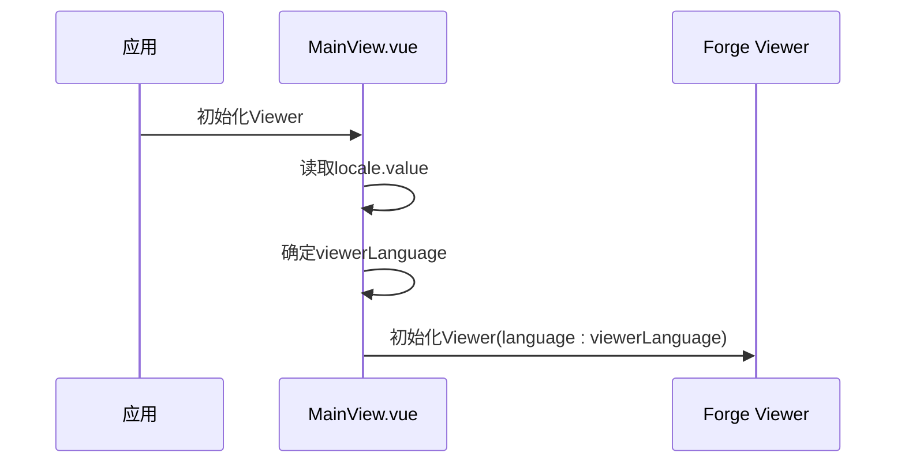
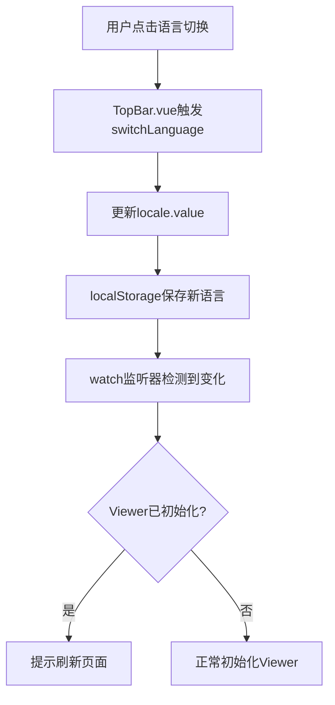
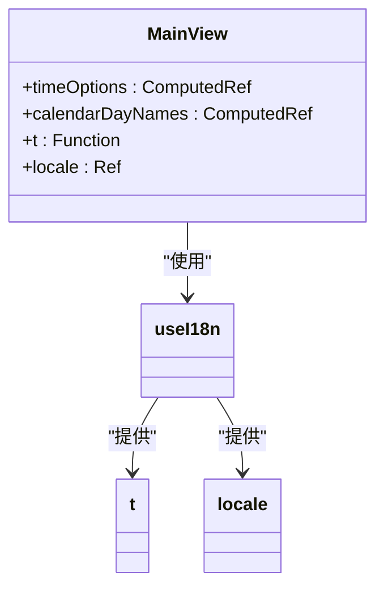
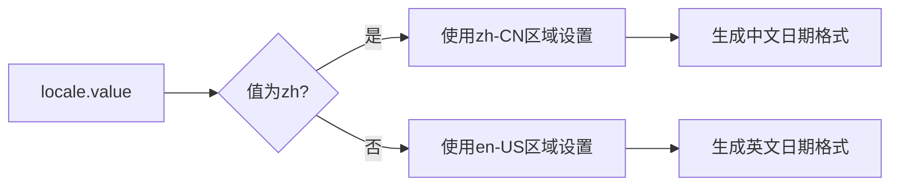

# 多语言同步

<cite>
**本文档引用的文件**
- [index.js](file://src/i18n/index.js)
- [MainView.vue](file://src/components/MainView.vue)
- [TopBar.vue](file://src/components/TopBar.vue)
- [App.vue](file://src/App.vue)
- [VIEWER_LANGUAGE_SYNC.md](file://VIEWER_LANGUAGE_SYNC.md)
</cite>

## 目录
1. [简介](#简介)
2. [核心机制](#核心机制)
3. [语言状态管理](#语言状态管理)
4. [Viewer初始化与语言同步](#viewer初始化与语言同步)
5. [运行时语言切换](#运行时语言切换)
6. [本地化文本生成](#本地化文本生成)
7. [日期格式本地化](#日期格式本地化)

## 简介
本系统实现了Vue应用与3D Viewer之间的多语言同步机制。系统支持中文和英文两种语言，通过`vue-i18n`库管理应用界面的翻译，并将语言设置同步到Autodesk Forge Viewer。当用户切换语言时，Vue应用的界面会立即更新，而3D Viewer需要重新初始化才能应用新的语言设置。

**Section sources**
- [index.js](file://src/i18n/index.js#L1-L577)
- [VIEWER_LANGUAGE_SYNC.md](file://VIEWER_LANGUAGE_SYNC.md#L1-L105)

## 核心机制
多语言同步机制的核心是`useI18n`钩子和`locale`状态。系统通过`useI18n`提供`t`函数用于文本翻译和`locale`响应式状态用于跟踪当前语言。`locale`值存储在`localStorage`中，确保页面刷新后能保持用户选择的语言。

**Section sources**
- [index.js](file://src/i18n/index.js#L566-L577)
- [TopBar.vue](file://src/components/TopBar.vue#L118-L120)

## Viewer初始化与语言同步
在Viewer初始化时，系统根据`locale.value`确定Viewer的语言设置。当`locale.value`为`zh`时，Viewer使用`zh-cn`语言；当为`en`时，使用`en`语言。这个设置通过初始化选项中的`language`参数传递给Viewer。

**Diagram sources**
- [MainView.vue](file://src/components/MainView.vue#L546-L548)

**Section sources**
- [MainView.vue](file://src/components/MainView.vue#L544-L596)

## 运行时语言切换
系统通过`watch`监听器检测语言切换。当用户在顶部栏切换语言时，`locale`值会更新，触发监听器。由于Forge Viewer不支持运行时动态切换语言，系统会提示用户刷新页面以应用新的语言设置。

**Diagram sources**
- [TopBar.vue](file://src/components/TopBar.vue#L118-L122)
- [MainView.vue](file://src/components/MainView.vue#L2467-L2477)

**Section sources**
- [TopBar.vue](file://src/components/TopBar.vue#L114-L122)
- [MainView.vue](file://src/components/MainView.vue#L2467-L2477)

## 本地化文本生成
系统使用`computed`属性根据当前语言动态生成标签文本。`timeOptions`、`calendarDayNames`等计算属性会调用`t`函数获取对应语言的翻译文本，确保界面元素显示正确的本地化内容。

**Diagram sources**
- [MainView.vue](file://src/components/MainView.vue#L298-L326)

**Section sources**
- [MainView.vue](file://src/components/MainView.vue#L297-L326)

## 日期格式本地化
`calendarTitle`和`currentDateStr`等计算属性使用`toLocaleDateString`方法实现本地化日期格式。这些属性根据`locale.value`的值选择适当的区域设置（`zh-CN`或`en-US`），并配置相应的格式选项，确保日期以符合用户语言习惯的方式显示。

**Diagram sources**
- [MainView.vue](file://src/components/MainView.vue#L529-L533)
- [MainView.vue](file://src/components/MainView.vue#L486-L489)

**Section sources**
- [MainView.vue](file://src/components/MainView.vue#L486-L494)
- [MainView.vue](file://src/components/MainView.vue#L529-L533)