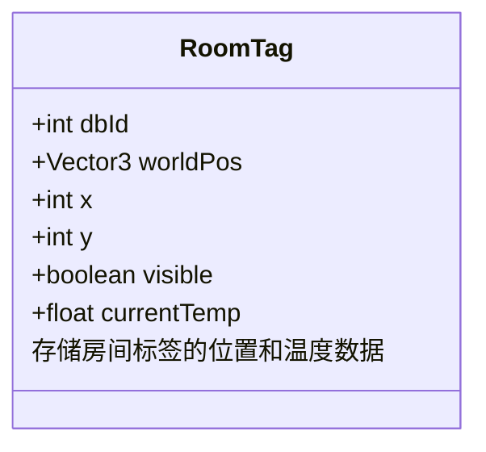
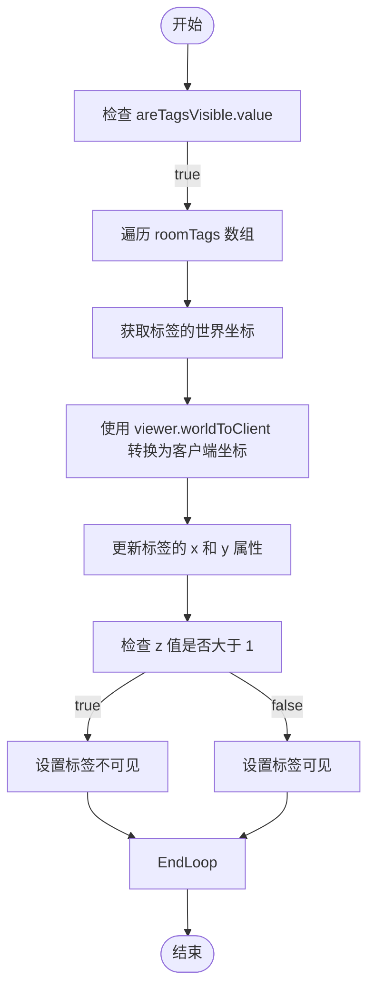
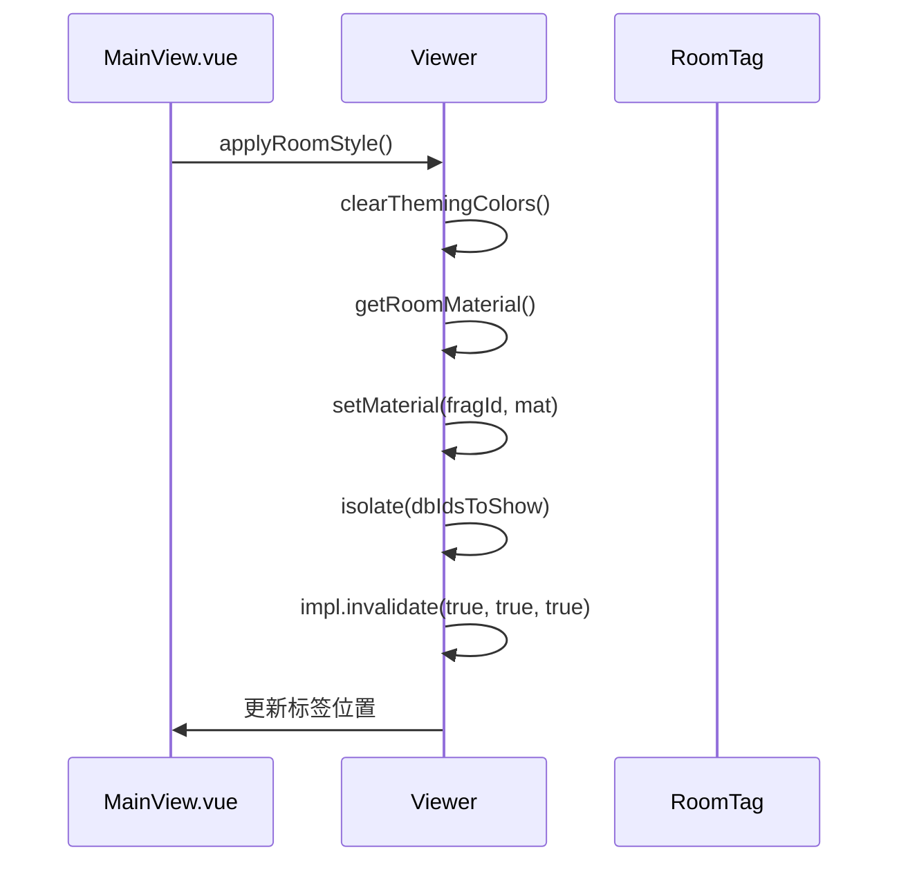
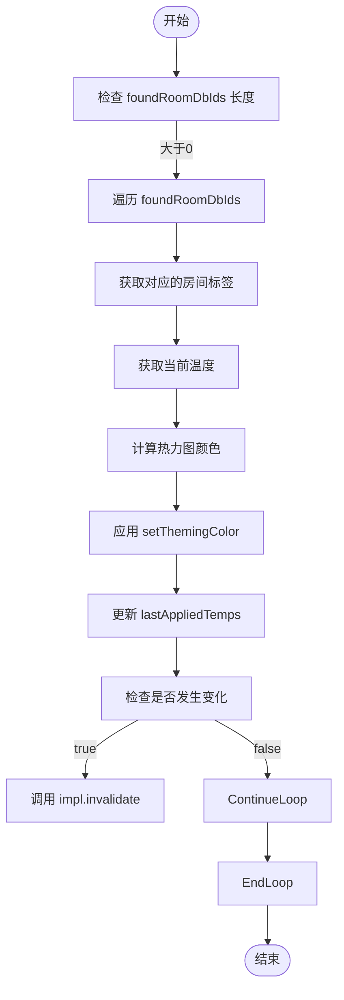
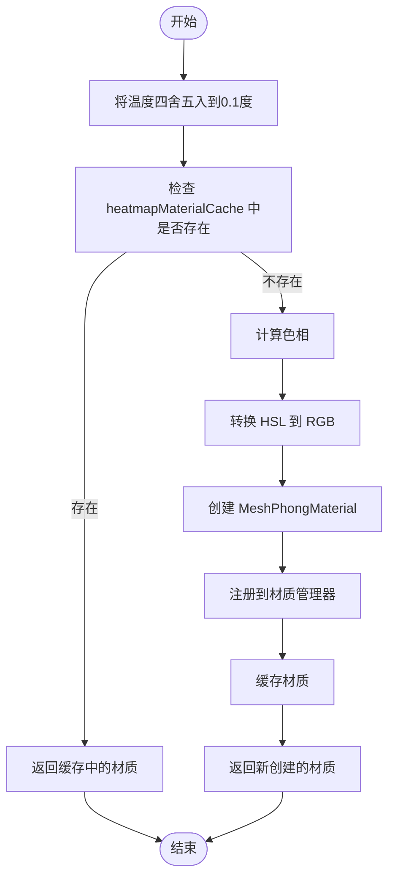

# 数据叠加渲染

<cite>
**本文档引用的文件**   
- [MainView.vue](file://src/components/MainView.vue)
- [App.vue](file://src/App.vue)
</cite>

## 目录
1. [引言](#引言)
2. [核心数据结构](#核心数据结构)
3. [温度标签与热力图叠加机制](#温度标签与热力图叠加机制)
4. [响应式数组 roomTags 的实现](#响应式数组-roomtags-的实现)
5. [动态计算屏幕坐标](#动态计算屏幕坐标)
6. [应用空间数据高亮房间](#应用空间数据高亮房间)
7. [实时温度数据应用热力图材质](#实时温度数据应用热力图材质)
8. [生成热力图颜色](#生成热力图颜色)
9. [代码示例](#代码示例)
10. [总结](#总结)

## 引言
本文档深入解析了在三维可视化应用中实现数据叠加渲染的技术细节，重点阐述了温度标签和热力图的叠加机制。通过分析 `roomTags` 响应式数组如何存储所有房间标签的位置和温度数据，并结合 `updateAllTagPositions` 方法根据相机视角动态计算其屏幕坐标，展示了动态渲染的核心流程。同时，文档详细描述了 `applyRoomStyle` 方法如何根据空间数据高亮特定房间，以及 `applyHeatmapStyle` 方法如何根据实时温度数据为房间应用热力图材质。此外，还解释了 `getHeatmapMaterial` 函数如何根据温度值生成对应的热力图颜色（从蓝色到红色），并利用缓存优化性能。

## 核心数据结构
在数据叠加渲染技术中，核心数据结构包括 `roomTags` 响应式数组和 `heatmapMaterialCache` 热力图材质缓存。`roomTags` 数组存储了所有房间标签的位置和温度数据，而 `heatmapMaterialCache` 则用于缓存不同温度值对应的材质，以提高渲染效率。

**Section sources**
- [MainView.vue](file://src/components/MainView.vue#L222-L229)

## 温度标签与热力图叠加机制
温度标签和热力图的叠加机制是通过在三维场景中叠加二维UI元素和材质来实现的。温度标签以HTML元素的形式覆盖在3D视图上，而热力图则通过修改房间的材质颜色来表现温度变化。

**Section sources**
- [MainView.vue](file://src/components/MainView.vue#L141-L188)

## 响应式数组 roomTags 的实现
`roomTags` 是一个响应式数组，用于存储所有房间标签的位置和温度数据。每个标签对象包含 `dbId`、`worldPos`、`x`、`y`、`visible` 和 `currentTemp` 等属性，确保数据的实时更新和同步。



**Diagram sources **
- [MainView.vue](file://src/components/MainView.vue#L222-L223)

## 动态计算屏幕坐标
`updateAllTagPositions` 方法根据相机视角动态计算每个房间标签的屏幕坐标。该方法遍历 `roomTags` 数组，使用 `viewer.worldToClient` 函数将世界坐标转换为客户端坐标，并更新标签的 `x` 和 `y` 属性。



**Diagram sources **
- [MainView.vue](file://src/components/MainView.vue#L1148-L1164)

## 应用空间数据高亮房间
`applyRoomStyle` 方法根据空间数据高亮特定房间。该方法首先清除所有主题颜色，然后获取浅紫色材质，并将其应用到所有房间的片段上，最后孤立并定位到指定房间。



**Diagram sources **
- [MainView.vue](file://src/components/MainView.vue#L1059-L1094)

## 实时温度数据应用热力图材质
`applyHeatmapStyle` 方法根据实时温度数据为房间应用热力图材质。该方法遍历所有房间，获取当前温度，计算对应的热力图颜色，并使用 `setThemingColor` 方法应用到房间上。



**Diagram sources **
- [MainView.vue](file://src/components/MainView.vue#L1383-L1449)

## 生成热力图颜色
`getHeatmapMaterial` 函数根据温度值生成对应的热力图颜色，并利用缓存优化性能。该函数首先检查缓存中是否存在对应温度的材质，如果存在则直接返回；否则，计算颜色并创建新的材质对象，注册到材质管理器后缓存并返回。



**Diagram sources **
- [MainView.vue](file://src/components/MainView.vue#L722-L783)

## 代码示例
以下代码示例展示了如何更新标签数据、应用样式和实现动态渲染：

```javascript
// 更新标签数据
function updateTagData() {
  roomTags.value.forEach(tag => {
    const pts = roomSeriesCache[tag.code];
    if (pts && pts.length) {
      const idx = Math.round(percent * (pts.length - 1));
      const v = pts[idx]?.value;
      if (v !== undefined) {
        tag.currentTemp = Number(v).toFixed(1);
      }
    }
  });
}

// 应用样式
function applyStyles() {
  if (isHeatmapEnabled.value) {
    applyHeatmapStyle();
  } else {
    applyRoomStyle();
  }
}

// 实现动态渲染
function renderDynamically() {
  updateAllTagPositions();
  applyStyles();
}
```

**Section sources**
- [MainView.vue](file://src/components/MainView.vue#L412-L454)
- [MainView.vue](file://src/components/MainView.vue#L1335-L1366)

## 总结
本文档详细解析了数据叠加渲染技术的实现，重点阐述了温度标签和热力图的叠加机制。通过分析 `roomTags` 响应式数组、`updateAllTagPositions` 方法、`applyRoomStyle` 方法、`applyHeatmapStyle` 方法和 `getHeatmapMaterial` 函数，展示了如何在三维场景中实现动态渲染。这些技术不仅提高了数据可视化的直观性和交互性，还通过缓存等优化手段提升了渲染性能。