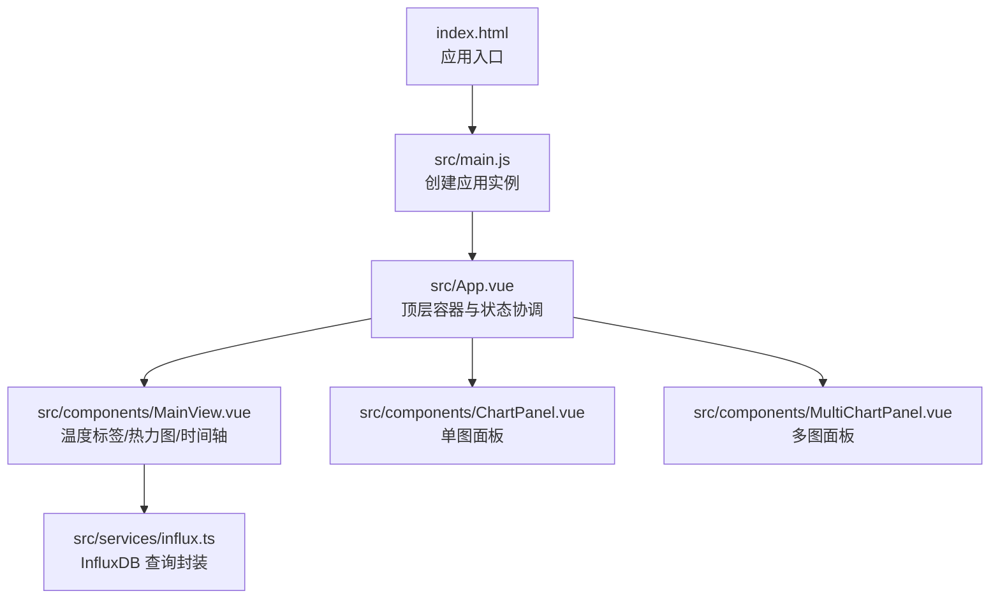
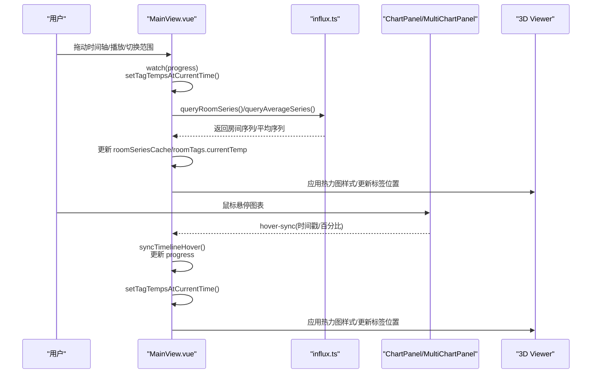
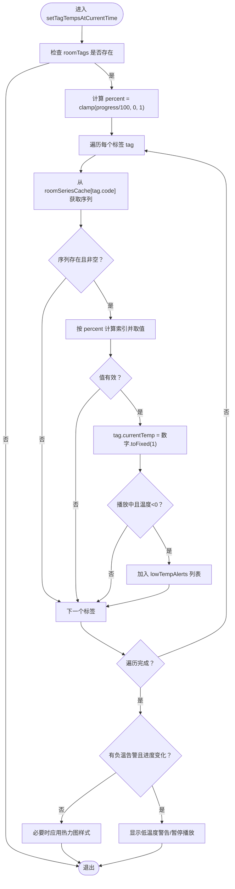
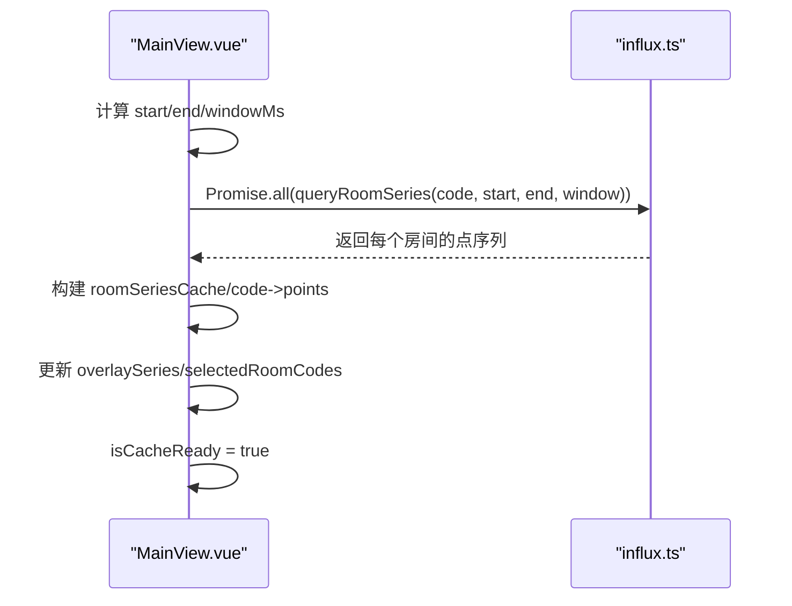
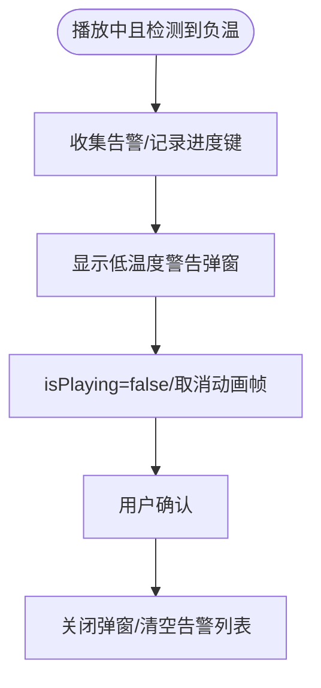
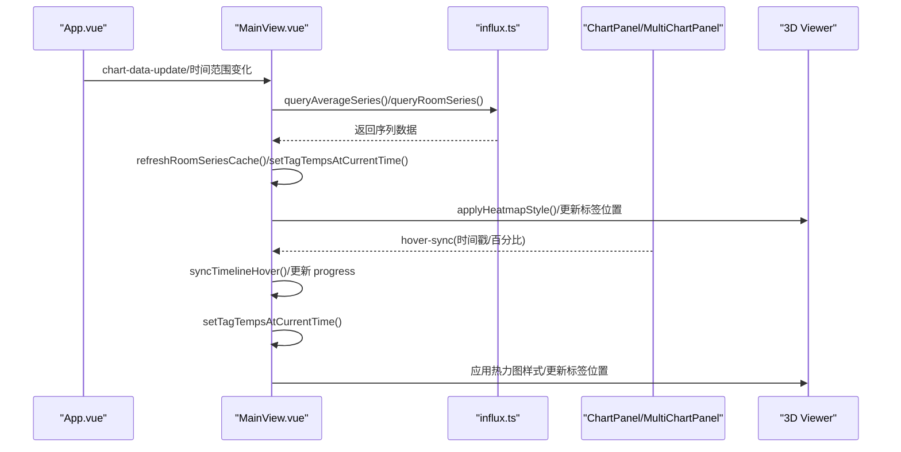
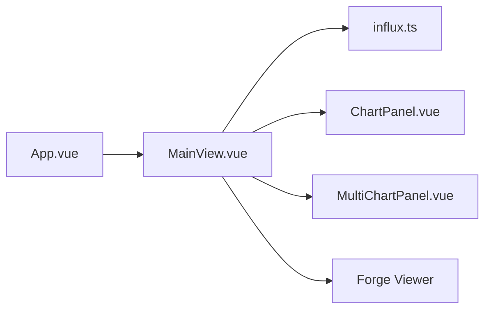

# 数据同步与状态管理

<cite>
**本文引用的文件**
- [index.html](file://index.html)
- [src/main.js](file://src/main.js)
- [src/App.vue](file://src/App.vue)
- [src/components/MainView.vue](file://src/components/MainView.vue)
- [src/components/ChartPanel.vue](file://src/components/ChartPanel.vue)
- [src/components/MultiChartPanel.vue](file://src/components/MultiChartPanel.vue)
- [src/services/influx.ts](file://src/services/influx.ts)
</cite>

## 目录
1. [引言](#引言)
2. [项目结构](#项目结构)
3. [核心组件](#核心组件)
4. [架构总览](#架构总览)
5. [详细组件分析](#详细组件分析)
6. [依赖关系分析](#依赖关系分析)
7. [性能考量](#性能考量)
8. [故障排查指南](#故障排查指南)
9. [结论](#结论)
10. [附录](#附录)

## 引言
本文件聚焦于温度标签与热力图数据的同步机制，围绕以下关键目标进行深入解析：
- setTagTempsAtCurrentTime 方法如何依据时间轴 progress 值，从 roomSeriesCache 缓存中查找对应时间点的温度数据，并更新 roomTags 中每个标签的 currentTemp 属性。
- watch 监听器如何在 progress 或 currentTemp 变化时自动触发标签与热力图的更新。
- refreshRoomSeriesCache 方法如何从 InfluxDB 时序数据库批量查询所有房间的温度数据，并构建高效的内存缓存以支持实时渲染。
- lowTempAlerts 低温警告系统如何在检测到负温时暂停播放并弹出警告对话框，实现数据驱动的交互反馈。
- 数据流从后端 API 到前端 UI 的完整链路示例。

## 项目结构
本项目采用 Vue 3 单页应用架构，入口文件负责挂载应用，App.vue 作为顶层容器协调各功能面板，MainView.vue 是温度标签与热力图的核心组件，ChartPanel/MultiChartPanel 负责图表渲染，influx.ts 提供与 InfluxDB 的查询接口。

图表来源
- [index.html](file://index.html#L1-L17)
- [src/main.js](file://src/main.js#L1-L7)
- [src/App.vue](file://src/App.vue#L1-L120)
- [src/components/MainView.vue](file://src/components/MainView.vue#L1-L120)
- [src/components/ChartPanel.vue](file://src/components/ChartPanel.vue#L1-L60)
- [src/components/MultiChartPanel.vue](file://src/components/MultiChartPanel.vue#L1-L60)
- [src/services/influx.ts](file://src/services/influx.ts#L1-L40)

章节来源
- [index.html](file://index.html#L1-L17)
- [src/main.js](file://src/main.js#L1-L7)
- [src/App.vue](file://src/App.vue#L1-L120)

## 核心组件
- MainView.vue：承载时间轴、温度标签、热力图、模型交互、InfluxDB 数据缓存与自动刷新。
- ChartPanel/MultiChartPanel：渲染图表曲线、阈值线与悬浮交互，支持 hover 同步。
- influx.ts：封装 InfluxDB 写入、查询与认证配置，提供平均序列与房间序列查询。

章节来源
- [src/components/MainView.vue](file://src/components/MainView.vue#L1-L120)
- [src/components/ChartPanel.vue](file://src/components/ChartPanel.vue#L1-L120)
- [src/components/MultiChartPanel.vue](file://src/components/MultiChartPanel.vue#L1-L120)
- [src/services/influx.ts](file://src/services/influx.ts#L1-L40)

## 架构总览
数据流从 InfluxDB 到前端 UI 的关键路径如下：
- InfluxDB 查询：通过 influx.ts 的 queryRoomSeries 与 queryAverageSeries 获取房间序列与平均序列。
- 缓存与状态：MainView.vue 维护 roomSeriesCache 与 roomTags，配合 progress/currentTemp 实时更新。
- 视图联动：ChartPanel/MultiChartPanel 响应 hover 同步，MainView.vue 应用热力图样式与标签位置。
- 用户交互：时间轴拖动、播放/暂停、范围切换触发缓存刷新与标签更新。

图表来源
- [src/components/MainView.vue](file://src/components/MainView.vue#L2430-L2470)
- [src/components/MainView.vue](file://src/components/MainView.vue#L2432-L2466)
- [src/components/MainView.vue](file://src/components/MainView.vue#L2467-L2478)
- [src/components/MainView.vue](file://src/components/MainView.vue#L2479-L2541)
- [src/components/MainView.vue](file://src/components/MainView.vue#L2551-L2583)
- [src/components/MainView.vue](file://src/components/MainView.vue#L2773-L2790)
- [src/services/influx.ts](file://src/services/influx.ts#L39-L103)
- [src/components/ChartPanel.vue](file://src/components/ChartPanel.vue#L190-L218)
- [src/components/MultiChartPanel.vue](file://src/components/MultiChartPanel.vue#L148-L169)

## 详细组件分析

### setTagTempsAtCurrentTime：基于时间轴的标签温度同步
- 核心逻辑
  - 依据 progress 计算当前时间点百分比 percent，映射到 roomSeriesCache 中各房间序列的索引。
  - 从缓存读取对应时间点的温度值，写入 roomTags.currentTemp。
  - 若检测到负温且处于播放状态，收集告警列表，暂停播放并弹出低温度警告。
  - 若启用热力图，延迟应用样式以降低频繁重绘。
- 关键实现位置
  - 进度监听与标签更新：[src/components/MainView.vue](file://src/components/MainView.vue#L456-L459)
  - setTagTempsAtCurrentTime 方法：[src/components/MainView.vue](file://src/components/MainView.vue#L412-L454)
  - 低温度警告弹窗与暂停播放：[src/components/MainView.vue](file://src/components/MainView.vue#L110-L134), [src/components/MainView.vue](file://src/components/MainView.vue#L2445-L2449)

图表来源
- [src/components/MainView.vue](file://src/components/MainView.vue#L412-L454)
- [src/components/MainView.vue](file://src/components/MainView.vue#L110-L134)
- [src/components/MainView.vue](file://src/components/MainView.vue#L2445-L2449)

章节来源
- [src/components/MainView.vue](file://src/components/MainView.vue#L412-L459)
- [src/components/MainView.vue](file://src/components/MainView.vue#L110-L134)

### watch 监听器：progress/currentTemp 与标签/热力图联动
- 监听 currentTemp 与 progress，任一变化均触发 setTagTempsAtCurrentTime，确保标签与热力图实时更新。
- 监听语言切换，提示刷新以应用 Viewer 语言设置。
- 监听时间范围变化，触发 emit('time-range-changed') 与缓存刷新。

章节来源
- [src/components/MainView.vue](file://src/components/MainView.vue#L456-L459)
- [src/components/MainView.vue](file://src/components/MainView.vue#L2467-L2478)
- [src/components/MainView.vue](file://src/components/MainView.vue#L2432-L2436)

### refreshRoomSeriesCache：批量查询与缓存构建
- 功能概述
  - 依据当前时间范围与窗口大小，批量查询所有房间的温度序列。
  - 构建 roomSeriesCache（按房间 code -> 点序列），并更新 overlaySeries（用于底部图表覆盖层）。
  - 标记 isCacheReady，供后续渲染流程使用。
- 关键实现位置
  - refreshRoomSeriesCache 方法：[src/components/MainView.vue](file://src/components/MainView.vue#L367-L387)
  - queryRoomSeries 调用与 Promise.all 并行：[src/components/MainView.vue](file://src/components/MainView.vue#L367-L379)
  - InfluxDB 查询封装：[src/services/influx.ts](file://src/services/influx.ts#L72-L103)

图表来源
- [src/components/MainView.vue](file://src/components/MainView.vue#L367-L387)
- [src/services/influx.ts](file://src/services/influx.ts#L72-L103)

章节来源
- [src/components/MainView.vue](file://src/components/MainView.vue#L367-L387)
- [src/services/influx.ts](file://src/services/influx.ts#L72-L103)

### 低温度警告系统：数据驱动的交互反馈
- 触发条件
  - setTagTempsAtCurrentTime 在播放中检测到负温，收集房间与温度，记录当前进度精度键，避免重复弹窗。
- 行为
  - 显示低温度警告弹窗，暂停播放并取消动画帧。
  - 用户确认后关闭弹窗并清空告警列表。
- 关键实现位置
  - 负温检测与弹窗：[src/components/MainView.vue](file://src/components/MainView.vue#L412-L454), [src/components/MainView.vue](file://src/components/MainView.vue#L110-L134)
  - 关闭弹窗与恢复播放：[src/components/MainView.vue](file://src/components/MainView.vue#L2445-L2449)

图表来源
- [src/components/MainView.vue](file://src/components/MainView.vue#L412-L454)
- [src/components/MainView.vue](file://src/components/MainView.vue#L110-L134)
- [src/components/MainView.vue](file://src/components/MainView.vue#L2445-L2449)

章节来源
- [src/components/MainView.vue](file://src/components/MainView.vue#L412-L454)
- [src/components/MainView.vue](file://src/components/MainView.vue#L110-L134)
- [src/components/MainView.vue](file://src/components/MainView.vue#L2445-L2449)

### 数据流链路：后端 API 到前端 UI
- InfluxDB 查询
  - 平均序列：queryAverageSeries（用于顶部图表）
  - 房间序列：queryRoomSeries（用于底部图表与标签）
- 缓存与渲染
  - refreshRoomSeriesCache 构建 roomSeriesCache，setTagTempsAtCurrentTime 更新 roomTags.currentTemp。
  - applyHeatmapStyle 根据温度应用热力图颜色。
- 图表交互
  - ChartPanel/MultiChartPanel 通过 hover-sync 将时间戳同步至 MainView，进而更新 progress 与标签。

图表来源
- [src/App.vue](file://src/App.vue#L509-L534)
- [src/components/MainView.vue](file://src/components/MainView.vue#L347-L366)
- [src/components/MainView.vue](file://src/components/MainView.vue#L367-L387)
- [src/components/MainView.vue](file://src/components/MainView.vue#L412-L454)
- [src/components/MainView.vue](file://src/components/MainView.vue#L1383-L1449)
- [src/components/ChartPanel.vue](file://src/components/ChartPanel.vue#L190-L218)
- [src/components/MultiChartPanel.vue](file://src/components/MultiChartPanel.vue#L148-L169)

章节来源
- [src/App.vue](file://src/App.vue#L509-L534)
- [src/components/MainView.vue](file://src/components/MainView.vue#L347-L387)
- [src/components/MainView.vue](file://src/components/MainView.vue#L412-L454)
- [src/components/MainView.vue](file://src/components/MainView.vue#L1383-L1449)
- [src/components/ChartPanel.vue](file://src/components/ChartPanel.vue#L190-L218)
- [src/components/MultiChartPanel.vue](file://src/components/MultiChartPanel.vue#L148-L169)

## 依赖关系分析
- 组件耦合
  - MainView.vue 与 influx.ts：查询依赖，缓存与渲染强耦合。
  - MainView.vue 与 ChartPanel/MultiChartPanel：通过 hover-sync 事件解耦交互。
  - App.vue 与 MainView.vue：通过 chart-data-update 事件传递图表数据。
- 外部依赖
  - InfluxDB：Flux 查询与 CSV 解析。
  - Forge Viewer：模型加载、材质与主题色应用。

图表来源
- [src/App.vue](file://src/App.vue#L509-L534)
- [src/components/MainView.vue](file://src/components/MainView.vue#L1-L120)
- [src/components/ChartPanel.vue](file://src/components/ChartPanel.vue#L1-L60)
- [src/components/MultiChartPanel.vue](file://src/components/MultiChartPanel.vue#L1-L60)
- [src/services/influx.ts](file://src/services/influx.ts#L1-L40)

章节来源
- [src/App.vue](file://src/App.vue#L509-L534)
- [src/components/MainView.vue](file://src/components/MainView.vue#L1-L120)
- [src/components/ChartPanel.vue](file://src/components/ChartPanel.vue#L1-L60)
- [src/components/MultiChartPanel.vue](file://src/components/MultiChartPanel.vue#L1-L60)
- [src/services/influx.ts](file://src/services/influx.ts#L1-L40)

## 性能考量
- 并行查询：Promise.all 并发请求房间序列，显著降低总等待时间。
- 缓存命中：roomSeriesCache 避免重复查询，setTagTempsAtCurrentTime 仅做索引与取值。
- 热力图节流：HEATMAP_EPS 与 heatmapTimer 减少频繁材质更新。
- 自动刷新：每分钟刷新一次，避免过度轮询，同时保证数据新鲜度。
- 渲染优化：热力图使用 setThemingColor，避免重建材质；标签位置更新在相机/尺寸变化时触发。

章节来源
- [src/components/MainView.vue](file://src/components/MainView.vue#L367-L387)
- [src/components/MainView.vue](file://src/components/MainView.vue#L412-L454)
- [src/components/MainView.vue](file://src/components/MainView.vue#L1383-L1449)
- [src/components/MainView.vue](file://src/components/MainView.vue#L2479-L2541)

## 故障排查指南
- InfluxDB 未配置
  - 现象：查询返回空，图表与标签不更新。
  - 处理：检查环境变量与认证配置，确保 isInfluxConfigured 返回真值。
  - 参考：[src/services/influx.ts](file://src/services/influx.ts#L1-L20)
- 房间序列为空
  - 现象：标签不显示温度或热力图无色。
  - 处理：确认房间 code 与标签 code 一致，检查 refreshRoomSeriesCache 是否成功构建缓存。
  - 参考：[src/components/MainView.vue](file://src/components/MainView.vue#L367-L387)
- 负温告警频繁弹窗
  - 现象：同一进度多次弹窗。
  - 处理：确认 lowTempAlertShownForProgress 的精度键逻辑，避免重复触发。
  - 参考：[src/components/MainView.vue](file://src/components/MainView.vue#L412-L454)
- 热力图颜色异常
  - 现象：颜色不随温度变化或闪烁。
  - 处理：检查 HEATMAP_EPS 与 applyHeatmapStyle 的材质缓存与 lastAppliedTemps。
  - 参考：[src/components/MainView.vue](file://src/components/MainView.vue#L1383-L1449)

章节来源
- [src/services/influx.ts](file://src/services/influx.ts#L1-L20)
- [src/components/MainView.vue](file://src/components/MainView.vue#L367-L387)
- [src/components/MainView.vue](file://src/components/MainView.vue#L412-L454)
- [src/components/MainView.vue](file://src/components/MainView.vue#L1383-L1449)

## 结论
本系统通过“时间轴进度驱动的缓存查询 + 标签与热力图联动”的设计，实现了高效、实时的温度可视化。setTagTempsAtCurrentTime 与 watch 监听器确保 UI 与数据保持一致；refreshRoomSeriesCache 以并发查询与缓存机制支撑大规模房间的实时渲染；低温度警告系统在播放状态下提供即时反馈，保障数据驱动的交互体验。整体架构清晰、模块职责明确，具备良好的扩展性与可维护性。

## 附录
- 关键方法与路径
  - setTagTempsAtCurrentTime：[src/components/MainView.vue](file://src/components/MainView.vue#L412-L454)
  - refreshRoomSeriesCache：[src/components/MainView.vue](file://src/components/MainView.vue#L367-L387)
  - queryRoomSeries/queryAverageSeries：[src/services/influx.ts](file://src/services/influx.ts#L39-L103)
  - chart-data-update 事件：[src/App.vue](file://src/App.vue#L509-L534)
  - hover-sync 事件：[src/components/ChartPanel.vue](file://src/components/ChartPanel.vue#L190-L218), [src/components/MultiChartPanel.vue](file://src/components/MultiChartPanel.vue#L148-L169)