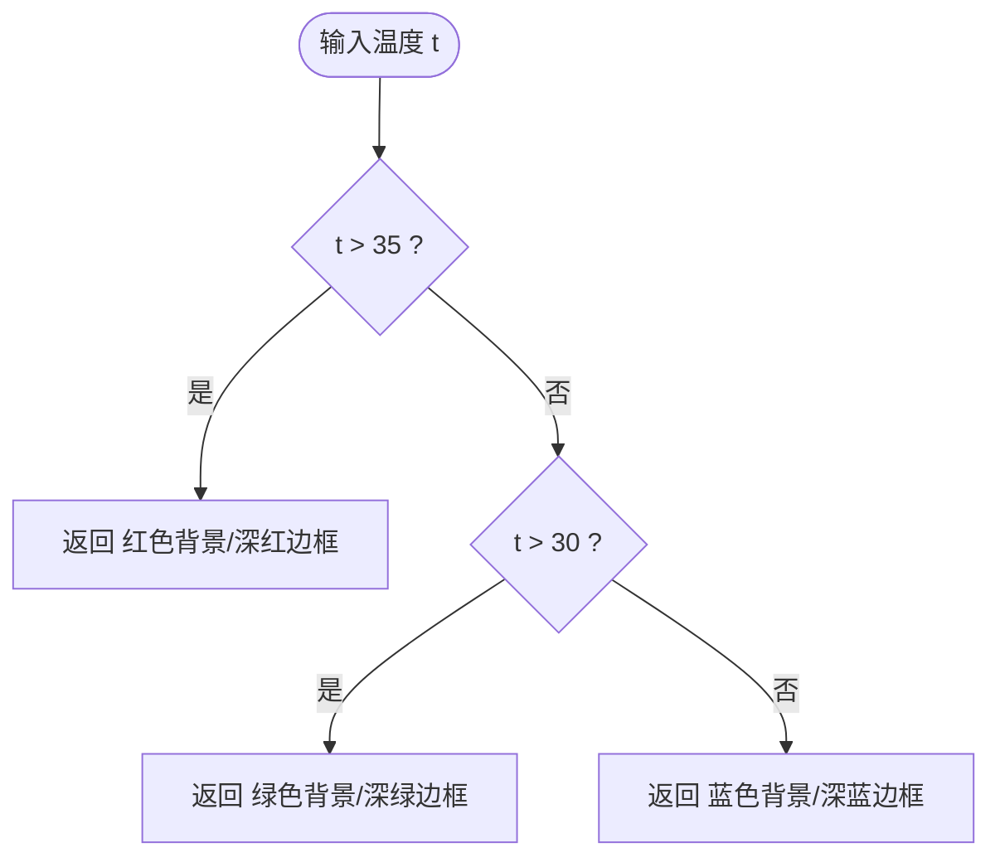

# 温度标签渲染

<cite>
**本文引用的文件**
- [MainView.vue](file://src/components/MainView.vue)
- [backup.vue](file://src/components/backup.vue)
</cite>

## 目录
1. [简介](#简介)
2. [项目结构](#项目结构)
3. [核心组件](#核心组件)
4. [架构总览](#架构总览)
5. [详细组件分析](#详细组件分析)
6. [依赖关系分析](#依赖关系分析)
7. [性能考量](#性能考量)
8. [故障排查指南](#故障排查指南)
9. [结论](#结论)
10. [附录](#附录)

## 简介
本文件聚焦于温度标签的渲染机制，系统性阐述以下要点：
- roomTags 响应式数组如何存储房间标签的位置、温度与可见性状态
- updateAllTagPositions 如何监听相机视角变化与窗口大小调整事件，并利用 Viewer 的 worldToClient API 将 3D 空间坐标转换为 2D 屏幕坐标
- toggleTemperatureLabels 如何控制标签的全局显示/隐藏状态，并通过 CSS 类 tag-wrapper 实现平滑显示/隐藏过渡动画
- getTagStyle 如何根据温度值动态生成标签的背景色与边框色（高温红色、中温绿色、低温蓝色），并与 v-show 实现条件渲染
- 提供代码示例路径，展示如何初始化标签数据、更新标签位置与动态修改标签样式

## 项目结构
温度标签渲染位于主视图组件中，采用 Vue 3 Composition API 与 Autodesk Forge Viewer 集成：
- 主视图组件负责 Viewer 初始化、房间检索、材质缓存与应用、标签数据构建与更新、事件监听与样式计算
- 标签覆盖层 overlay-tags 通过 v-for 遍历 roomTags，使用 v-show 控制显示/隐藏，通过 :style 将 x/y 坐标绑定到 DOM

**图表来源**
- [MainView.vue](file://src/components/MainView.vue#L140-L168)
- [MainView.vue](file://src/components/MainView.vue#L221-L224)
- [MainView.vue](file://src/components/MainView.vue#L542-L556)
- [MainView.vue](file://src/components/MainView.vue#L1147-L1164)
- [MainView.vue](file://src/components/MainView.vue#L1368-L1378)
- [MainView.vue](file://src/components/MainView.vue#L535-L541)
- [MainView.vue](file://src/components/MainView.vue#L2892-L2898)

**章节来源**
- [MainView.vue](file://src/components/MainView.vue#L140-L168)
- [MainView.vue](file://src/components/MainView.vue#L221-L224)
- [MainView.vue](file://src/components/MainView.vue#L542-L556)
- [MainView.vue](file://src/components/MainView.vue#L1147-L1164)
- [MainView.vue](file://src/components/MainView.vue#L1368-L1378)
- [MainView.vue](file://src/components/MainView.vue#L535-L541)
- [MainView.vue](file://src/components/MainView.vue#L2892-L2898)

## 核心组件
- roomTags 响应式数组：存储每个房间标签对象，包含 dbId、worldPos（3D世界坐标）、x/y（2D屏幕坐标）、visible（可见性）、offset（随机偏移）、currentTemp（当前温度）
- updateAllTagPositions：监听 CAMERA_CHANGE_EVENT 与 viewerResizeEvent，调用 Viewer 的 worldToClient 将 3D 坐标转换为 2D 屏幕坐标，并维护可见性
- toggleTemperatureLabels：切换 areTagsVisible 全局显示状态，并在启用时通过 nextTick 调用 updateAllTagPositions
- getTagStyle：根据温度阈值返回背景色与边框色，配合 v-show 实现条件渲染

**章节来源**
- [MainView.vue](file://src/components/MainView.vue#L221-L224)
- [MainView.vue](file://src/components/MainView.vue#L542-L556)
- [MainView.vue](file://src/components/MainView.vue#L1147-L1164)
- [MainView.vue](file://src/components/MainView.vue#L1368-L1378)
- [MainView.vue](file://src/components/MainView.vue#L535-L541)

## 架构总览
温度标签渲染的关键流程如下：
- 初始化：Viewer 初始化后，搜索房间节点，计算每个房间的包围盒中心作为 worldPos，并生成初始标签对象写入 roomTags
- 事件监听：注册 CAMERA_CHANGE_EVENT 与 viewerResizeEvent，触发 updateAllTagPositions
- 坐标转换：调用 worldToClient 将 worldPos 转换为屏幕坐标 p，并根据 p.z 判断可见性
- 样式与显示：getTagStyle 根据温度返回样式；v-show 结合 areTagsVisible 与 tag.visible 控制显示；CSS 类 tag-wrapper 实现定位与过渡

**图表来源**
- [MainView.vue](file://src/components/MainView.vue#L542-L556)
- [MainView.vue](file://src/components/MainView.vue#L867-L987)
- [MainView.vue](file://src/components/MainView.vue#L1147-L1164)
- [MainView.vue](file://src/components/MainView.vue#L140-L168)
- [MainView.vue](file://src/components/MainView.vue#L535-L541)

## 详细组件分析

### roomTags 数据结构与初始化
- 数据结构要点
  - dbId：房间构件 ID
  - worldPos：Three.js Vector3，房间包围盒中心的世界坐标
  - x/y：2D 屏幕坐标，由 updateAllTagPositions 通过 worldToClient 计算并更新
  - visible：可见性标记，受相机朝向与 z 值影响
  - offset：随机偏移，用于模拟不同房间温度微小差异
  - currentTemp：当前温度值，随时间轴播放或自动刷新更新
- 初始化流程
  - 搜索房间节点，遍历每个房间
  - 计算包围盒中心作为 worldPos
  - 生成标签对象并写入 roomTags
  - 预取房间时序数据，设置初始温度并应用房间样式

**图表来源**
- [MainView.vue](file://src/components/MainView.vue#L867-L987)
- [MainView.vue](file://src/components/MainView.vue#L956-L987)

**章节来源**
- [MainView.vue](file://src/components/MainView.vue#L867-L987)
- [MainView.vue](file://src/components/MainView.vue#L956-L987)

### updateAllTagPositions：坐标转换与可见性控制
- 监听事件
  - CAMERA_CHANGE_EVENT：相机视角变化
  - viewerResizeEvent：窗口大小调整
- 坐标转换
  - 调用 Viewer 的 worldToClient 将 worldPos 转换为屏幕坐标 p
  - 若 p.z > 1，则认为标签不可见；否则更新 tag.x、tag.y，并确保 tag.visible 为真
- 作用
  - 保证标签始终跟随 3D 世界坐标在屏幕上的投影位置
  - 通过可见性过滤背对相机的标签，减少不必要的绘制

**图表来源**
- [MainView.vue](file://src/components/MainView.vue#L542-L556)
- [MainView.vue](file://src/components/MainView.vue#L1147-L1164)

**章节来源**
- [MainView.vue](file://src/components/MainView.vue#L542-L556)
- [MainView.vue](file://src/components/MainView.vue#L1147-L1164)

### toggleTemperatureLabels：全局显示/隐藏与过渡动画
- 功能
  - 切换 areTagsVisible 状态
  - 当启用时，使用 nextTick 确保 DOM 更新后再调用 updateAllTagPositions，使标签立即可见
- 过渡动画
  - 标签容器使用 CSS 类 tag-wrapper，其 transform 与 pointer-events 由样式定义
  - v-show 控制元素存在性，结合 CSS transition 实现平滑显示/隐藏

**图表来源**
- [MainView.vue](file://src/components/MainView.vue#L1368-L1378)
- [MainView.vue](file://src/components/MainView.vue#L140-L168)
- [MainView.vue](file://src/components/MainView.vue#L2892-L2898)

**章节来源**
- [MainView.vue](file://src/components/MainView.vue#L1368-L1378)
- [MainView.vue](file://src/components/MainView.vue#L140-L168)
- [MainView.vue](file://src/components/MainView.vue#L2892-L2898)

### getTagStyle：温度驱动的样式生成
- 策略
  - 高温（>35°C）：红色背景与深红边框
  - 中温（>30°C）：绿色背景与深绿边框
  - 低温（≤30°C）：蓝色背景与深蓝边框
- 与 v-show 的配合
  - v-show 与 areTagsVisible、tag.visible 共同决定标签是否渲染
  - getTagStyle 仅在标签可见时生效，避免无意义的样式计算

**图表来源**
- [MainView.vue](file://src/components/MainView.vue#L535-L541)
- [MainView.vue](file://src/components/MainView.vue#L140-L168)

**章节来源**
- [MainView.vue](file://src/components/MainView.vue#L535-L541)
- [MainView.vue](file://src/components/MainView.vue#L140-L168)

### 标签初始化、位置更新与样式动态修改（示例路径）
- 初始化标签数据
  - 房间搜索与标签生成：[processRooms](file://src/components/MainView.vue#L867-L987)
  - 房间属性与编号提取：[getRoomProperties](file://src/components/MainView.vue#L1452-L1501)
- 更新标签位置
  - 事件监听与坐标转换：[initViewer](file://src/components/MainView.vue#L542-L556)、[updateAllTagPositions](file://src/components/MainView.vue#L1147-L1164)
  - 手动触发 resize：[resizeViewer](file://src/components/MainView.vue#L1503-L1509)
- 动态修改标签样式
  - 样式计算函数：[getTagStyle](file://src/components/MainView.vue#L535-L541)
  - 条件渲染与定位绑定：[模板渲染](file://src/components/MainView.vue#L140-L168)

**章节来源**
- [MainView.vue](file://src/components/MainView.vue#L867-L987)
- [MainView.vue](file://src/components/MainView.vue#L542-L556)
- [MainView.vue](file://src/components/MainView.vue#L1147-L1164)
- [MainView.vue](file://src/components/MainView.vue#L1503-L1509)
- [MainView.vue](file://src/components/MainView.vue#L535-L541)
- [MainView.vue](file://src/components/MainView.vue#L140-L168)

## 依赖关系分析
- 组件耦合
  - MainView.vue 与 Autodesk Viewer 强耦合，依赖 Viewer 的事件与 API
  - roomTags 与 DOM 覆盖层强耦合，通过 x/y 与 v-show/v-if 控制渲染
- 外部依赖
  - Autodesk Forge Viewer：提供模型加载、事件监听、坐标转换、材质应用等能力
  - Vue 响应式系统：ref/computed/watch 驱动 UI 更新
- 潜在循环依赖
  - 事件监听与标签更新之间为单向依赖，无循环
- 接口契约
  - worldToClient 返回屏幕坐标 p，其中 p.z 用于判断可见性
  - roomTags 的结构需保持稳定，以便模板绑定与样式计算

**图表来源**
- [MainView.vue](file://src/components/MainView.vue#L542-L556)
- [MainView.vue](file://src/components/MainView.vue#L140-L168)
- [MainView.vue](file://src/components/MainView.vue#L2892-L2898)

**章节来源**
- [MainView.vue](file://src/components/MainView.vue#L542-L556)
- [MainView.vue](file://src/components/MainView.vue#L140-L168)
- [MainView.vue](file://src/components/MainView.vue#L2892-L2898)

## 性能考量
- 事件频率
  - CAMERA_CHANGE_EVENT 与 viewerResizeEvent 可能高频触发，建议在 updateAllTagPositions 中进行快速可见性判断与最小化 DOM 更新
- 坐标转换成本
  - worldToClient 在每次事件触发时调用，建议避免在短时间内重复调用，可考虑节流或合并更新
- 渲染优化
  - 使用 v-show 控制标签存在性，避免频繁创建/销毁 DOM
  - 标签容器使用 pointer-events: none，减少对交互的影响
- 材质与主题
  - 房间材质缓存与恢复，避免重复创建材质对象，降低 GPU 负担

[本节为通用指导，无需特定文件引用]

## 故障排查指南
- 标签不显示
  - 检查 areTagsVisible 是否为真，以及 v-show 条件是否满足
  - 确认 updateAllTagPositions 是否被触发（事件监听是否注册）
  - 检查 tag.visible 是否被设置为 false（相机朝向导致 z 值过大）
- 标签位置不正确
  - 确认 worldPos 是否正确（房间包围盒中心）
  - 确认 Viewer 已完成初始化且模型加载完成
  - 检查 resize 事件是否触发，必要时手动调用 resizeViewer
- 样式异常
  - 检查 getTagStyle 的温度阈值是否符合预期
  - 确认 CSS 类 tag-wrapper/pin-val 是否正确应用

**章节来源**
- [MainView.vue](file://src/components/MainView.vue#L1368-L1378)
- [MainView.vue](file://src/components/MainView.vue#L1147-L1164)
- [MainView.vue](file://src/components/MainView.vue#L1503-L1509)
- [MainView.vue](file://src/components/MainView.vue#L535-L541)

## 结论
温度标签渲染机制通过 roomTags 统一管理标签的 3D 位置、2D 投影与可见性，借助 Viewer 的事件系统与 worldToClient API 实现高精度坐标转换，并通过 getTagStyle 与 v-show 实现直观的温度可视化与流畅的显示/隐藏过渡。该方案具备良好的扩展性，便于后续集成更多房间属性与交互行为。

[本节为总结性内容，无需特定文件引用]

## 附录
- 相关实现路径
  - 标签初始化与属性提取：[processRooms](file://src/components/MainView.vue#L867-L987)、[getRoomProperties](file://src/components/MainView.vue#L1452-L1501)
  - 事件监听与坐标转换：[initViewer](file://src/components/MainView.vue#L542-L556)、[updateAllTagPositions](file://src/components/MainView.vue#L1147-L1164)
  - 全局显示/隐藏与过渡：[toggleTemperatureLabels](file://src/components/MainView.vue#L1368-L1378)、[模板渲染](file://src/components/MainView.vue#L140-L168)
  - 样式计算：[getTagStyle](file://src/components/MainView.vue#L535-L541)

[本节为补充说明，无需特定文件引用]