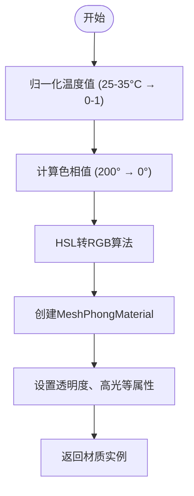

# 热力图材质渲染

<cite>
**本文档引用文件**  
- [MainView.vue](file://src/components/MainView.vue#L228)
- [MainView.vue](file://src/components/MainView.vue#L722)
- [MainView.vue](file://src/components/MainView.vue#L1383)
- [MainView.vue](file://src/components/MainView.vue#L448)
</cite>

## 目录
1. [热力图开关控制](#热力图开关控制)  
2. [热力图样式应用流程](#热力图样式应用流程)  
3. [动态材质生成机制](#动态材质生成机制)  
4. [材质缓存优化策略](#材质缓存优化策略)  
5. [延迟渲染性能优化](#延迟渲染性能优化)

## 热力图开关控制

热力图功能的整体开关由 `isHeatmapEnabled` 响应式状态变量控制。该变量在 `MainView.vue` 组件中通过 `ref(false)` 初始化，表示热力图默认处于关闭状态。用户通过点击界面上的“热力图”按钮触发 `toggleHeatmap` 方法，该方法会翻转 `isHeatmapEnabled` 的布尔值。

当 `isHeatmapEnabled` 为 `true` 时，系统进入热力图模式，所有房间的显示颜色将根据其实时温度数据动态着色；当其为 `false` 时，系统恢复为默认的浅紫色半透明材质，并清除所有主题颜色。该状态不仅控制 `applyHeatmapStyle` 方法的调用，还在 `isolateAndFocusRooms` 和 `showAllRooms` 等核心显示逻辑中作为条件分支，确保热力图的开启与关闭能全局生效。

**Section sources**
- [MainView.vue](file://src/components/MainView.vue#L228)
- [MainView.vue](file://src/components/MainView.vue#L1335)

## 热力图样式应用流程

`applyHeatmapStyle` 方法是热力图渲染的核心驱动。该方法遍历所有已识别的房间（`foundRoomDbIds`），为每个房间查找其对应的温度标签（`roomTags`），并获取当前温度值。为了防止在时间轴快速拖动时频繁重绘，该方法通过一个 `lastAppliedTemps` 对象来记录上一次为每个房间应用的温度值。

在应用材质前，系统会进行精度比较：如果当前温度与上次应用的温度之差小于预设的阈值 `HEATMAP_EPS`（0.3°C），则跳过该房间的材质更新，从而避免因微小数值波动导致的不必要渲染。只有当温度变化显著时，系统才会调用 `getHeatmapMaterial` 函数获取新的材质，并通过 `viewer.setThemingColor(dbId, color)` 方法将计算出的颜色应用到对应的房间几何体上。最后，通过 `viewer.impl.invalidate()` 触发渲染器的刷新，完成视觉更新。

**Section sources**
- [MainView.vue](file://src/components/MainView.vue#L1383)
- [MainView.vue](file://src/components/MainView.vue#L1392)

## 动态材质生成机制

`getHeatmapMaterial` 函数负责根据温度值生成具有高光和透明度的3D材质。其核心逻辑是将温度值（25-35°C）映射到HSL（色相、饱和度、明度）色彩空间的色相环上。具体映射关系为：25°C（冷）对应蓝色（H=200°），35°C（热）对应红色（H=0°），形成从蓝到红的渐变。

函数内部首先将温度值归一化到0-1的范围，然后计算对应的色相值。接着，通过一个内嵌的 `hslToRgb` 函数，将HSL值转换为RGB值。该转换算法遵循标准的HSL到RGB的数学公式，考虑了饱和度和明度的影响。转换得到的RGB值被组合成一个整数颜色值，并用于创建一个 `THREE.MeshPhongMaterial` 材质实例。该材质具备0.8的透明度、双面渲染、深度写入和30的高光强度，从而在3D场景中呈现出光滑、半透明且具有光照反射效果的热力图层。

**Diagram sources**
- [MainView.vue](file://src/components/MainView.vue#L722)

**Section sources**
- [MainView.vue](file://src/components/MainView.vue#L722)

## 材质缓存优化策略

为了优化渲染性能，系统实现了 `heatmapMaterialCache` 材质缓存机制。由于在短时间内，多个房间的温度值可能非常接近，直接为每个温度值都创建一个新的材质对象会造成巨大的内存和性能开销。

该机制通过将温度值乘以10后四舍五入再除以10，实现对温度值的0.1°C精度取整（例如，28.13°C和28.17°C都会被取整为28.1°C）。这个取整后的值作为缓存的键（`tempKey`）。在 `getHeatmapMaterial` 函数的开头，系统首先检查缓存中是否已存在该键对应的材质。如果存在，则直接返回缓存的材质实例，避免了重复的HSL转换和材质创建过程。只有当缓存中不存在时，才执行完整的材质生成流程，并在最后将新创建的材质存入缓存。这一策略极大地减少了材质对象的创建次数，显著提升了渲染效率。

**Section sources**
- [MainView.vue](file://src/components/MainView.vue#L724)

## 延迟渲染性能优化

为了防止在用户快速拖动时间轴时，因每一帧都触发热力图更新而导致的界面卡顿，系统采用了 `setTimeout` 延迟应用材质的策略。

在时间轴的 `progress` 变化监听器中，当检测到 `isHeatmapEnabled` 为 `true` 时，系统会检查一个名为 `heatmapTimer` 的定时器句柄。如果该定时器不存在（即上一次的延迟任务已执行或未启动），则创建一个新的定时器，延迟400毫秒后执行 `applyHeatmapStyle`。如果在400毫秒内 `progress` 再次发生变化，新的定时器会被创建，而旧的定时器句柄会被覆盖，导致旧的定时器任务被丢弃。这样，只有当用户停止拖动或拖动速度变慢，使得 `progress` 在400毫秒内不再变化时，`applyHeatmapStyle` 才会被实际执行。这种“防抖”（Debounce）技术有效过滤了高频的中间状态，确保了在交互过程中的流畅性，同时保证了最终结果的正确性。

**Section sources**
- [MainView.vue](file://src/components/MainView.vue#L448)
- [MainView.vue](file://src/components/MainView.vue#L450)