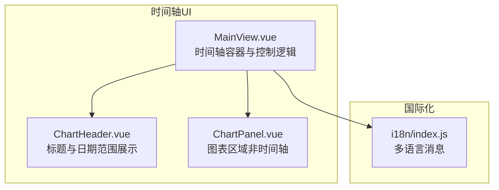
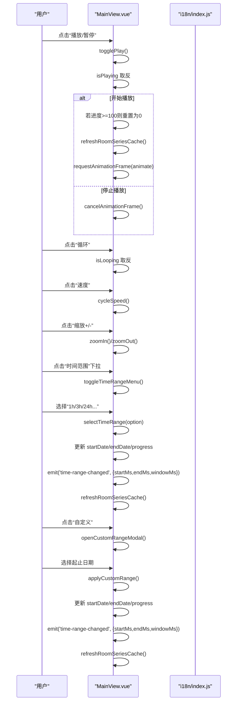
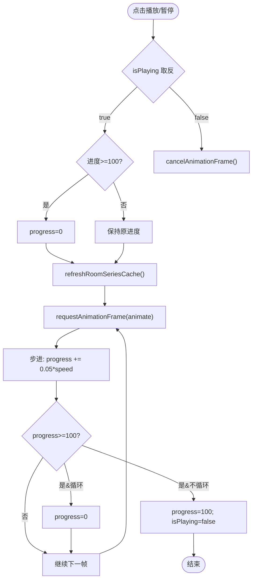
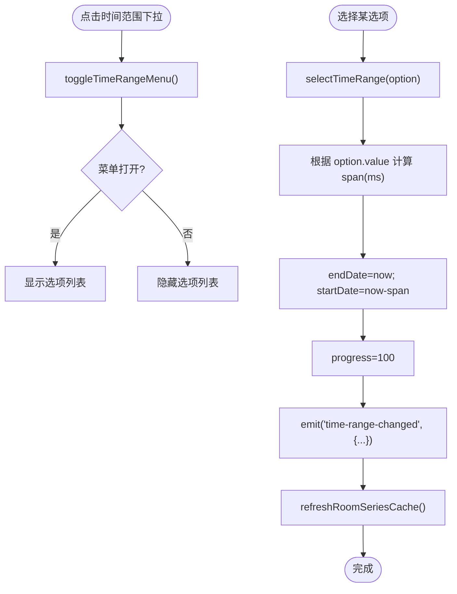
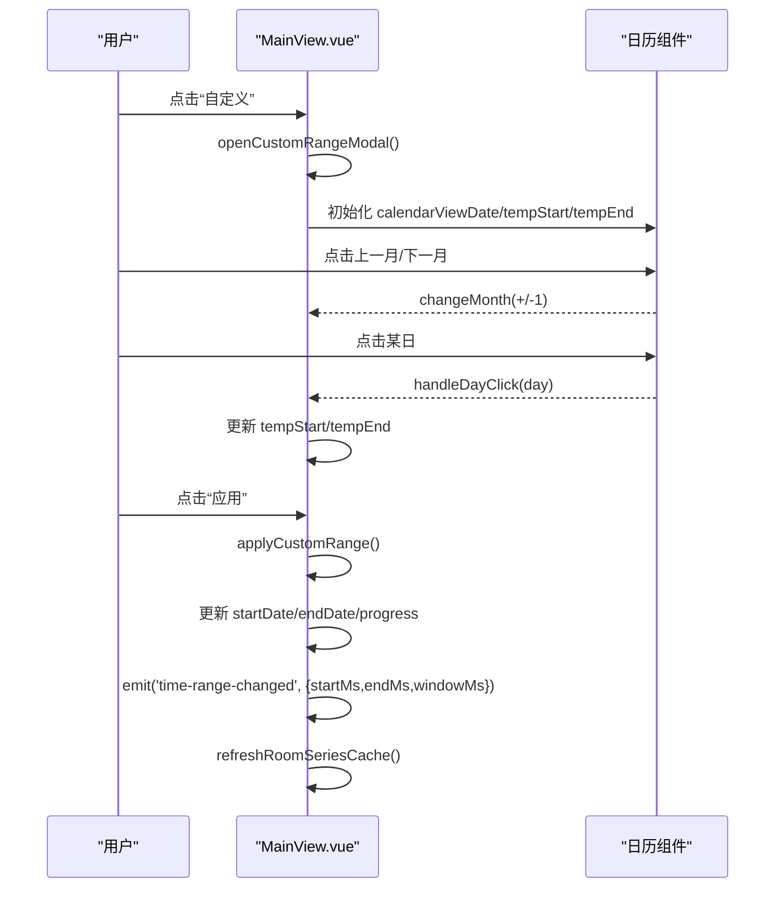
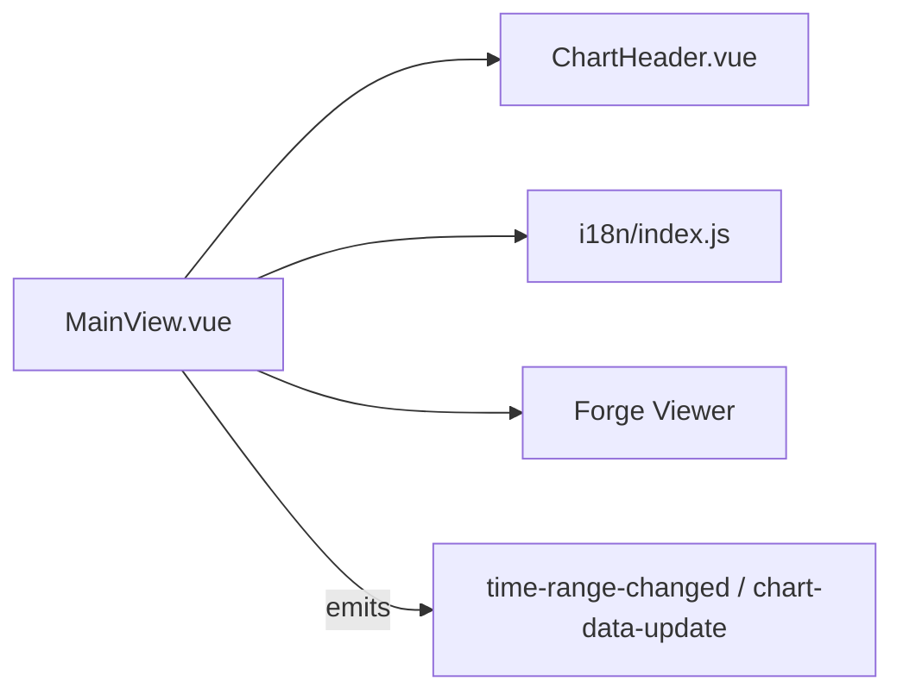

# 时间轴UI控件

<cite>
**本文引用的文件**
- [MainView.vue](file://src/components/MainView.vue)
- [ChartHeader.vue](file://src/components/ChartHeader.vue)
- [ChartPanel.vue](file://src/components/ChartPanel.vue)
- [index.js](file://src/i18n/index.js)
</cite>

## 目录
1. [简介](#简介)
2. [项目结构](#项目结构)
3. [核心组件](#核心组件)
4. [架构总览](#架构总览)
5. [详细组件分析](#详细组件分析)
6. [依赖关系分析](#依赖关系分析)
7. [性能考量](#性能考量)
8. [故障排查指南](#故障排查指南)
9. [结论](#结论)

## 简介
本文件面向“时间轴用户界面控件”的实现进行系统性解析，重点覆盖以下方面：
- 播放/暂停、循环、速度切换、缩放和导航按钮的交互与状态联动
- togglePlay、zoomIn、zoomOut、cycleSpeed 方法如何响应用户交互并更新播放状态
- 时间范围选择器（1h、3h、24h 等）的多语言支持与 selectTimeRange 的处理逻辑
- 自定义时间范围选择模态框的交互流程与日期选择逻辑
- UI 控件与底层状态变量之间的绑定关系与数据流

## 项目结构
时间轴UI控件主要位于主视图组件中，配合图表头部组件与图表面板组件共同构成完整的可视化时间轴体验。国际化资源提供多语言文本支撑。

**图表来源**
- [MainView.vue](file://src/components/MainView.vue#L1-L120)
- [ChartHeader.vue](file://src/components/ChartHeader.vue#L1-L46)
- [ChartPanel.vue](file://src/components/ChartPanel.vue#L1-L120)
- [index.js](file://src/i18n/index.js#L94-L115)

**章节来源**
- [MainView.vue](file://src/components/MainView.vue#L1-L120)
- [ChartHeader.vue](file://src/components/ChartHeader.vue#L1-L46)
- [ChartPanel.vue](file://src/components/ChartPanel.vue#L1-L120)
- [index.js](file://src/i18n/index.js#L94-L115)

## 核心组件
- 主视图容器（MainView.vue）
  - 提供时间轴工具栏、播放控制、缩放、导航、时间范围选择、自定义日期模态框等
  - 维护播放状态（isPlaying、isLooping、playbackSpeed）、进度（progress）、时间范围（startDate、endDate）
  - 与图表数据加载、房间系列缓存、3D Viewer 状态联动
- 图表头部（ChartHeader.vue）
  - 展示标题与日期范围文本，支持多语言
- 图表面板（ChartPanel.vue）
  - 展示单条或多条曲线，提供悬停交互与阈值标记（与时间轴UI同属图表体系）

**章节来源**
- [MainView.vue](file://src/components/MainView.vue#L1-L120)
- [ChartHeader.vue](file://src/components/ChartHeader.vue#L1-L46)
- [ChartPanel.vue](file://src/components/ChartPanel.vue#L1-L120)

## 架构总览
时间轴UI采用“响应式状态 + 事件驱动”的架构：
- 响应式状态：播放状态、循环状态、速度、进度、时间范围、模态框开关等
- 事件驱动：用户交互触发方法，方法更新状态并发出“时间范围变更”事件，驱动数据刷新
- 多语言：通过 useI18n 提供的 t 函数动态渲染菜单项与模态框文案

**图表来源**
- [MainView.vue](file://src/components/MainView.vue#L2430-L2466)
- [index.js](file://src/i18n/index.js#L374-L395)

**章节来源**
- [MainView.vue](file://src/components/MainView.vue#L2430-L2466)
- [index.js](file://src/i18n/index.js#L374-L395)

## 详细组件分析

### 时间轴工具栏与播放控制
- 播放/暂停（togglePlay）
  - 切换 isPlaying；若开始播放且进度到达末尾则重置为开头
  - 启动/停止帧动画（requestAnimationFrame/取消）
  - 首次播放前刷新房间系列缓存，保证播放时数据就绪
- 循环（isLooping）
  - 控制播放到达末尾时是否回到开头
- 速度切换（cycleSpeed）
  - 在速度序列中循环切换（例如 1x、2x、4x、8x）
- 导航（panTimeline）
  - 按比例平移时间轴（左/右箭头按钮）
- 缩放（zoomIn、zoomOut）
  - 以当前时间轴中心为基准进行缩放（1.5倍扩大/缩小）
- 进度拖拽（startDrag/onDrag/stopDrag/updateP）
  - 鼠标拖拽更新 progress，进而影响当前显示时间与标签温度

**图表来源**
- [MainView.vue](file://src/components/MainView.vue#L2452-L2456)

**章节来源**
- [MainView.vue](file://src/components/MainView.vue#L2452-L2456)

### 时间范围选择器与多语言支持
- 下拉菜单（toggleTimeRangeMenu）
  - 切换菜单显隐
- 选项列表（timeOptions）
  - 使用 t 函数动态生成“1h/3h/6h/24h/3d/7d/30d”等多语言标签
- 选中项（selectedTimeRange）
  - 记录当前选中值与标签
- 选择处理（selectTimeRange）
  - 根据选项值计算时间跨度，更新 endDate 为当前时刻，startDate 为 endDate - span
  - progress 设为 100（LIVE），触发时间范围变更事件
  - 刷新房间系列缓存，保证图表与标签温度数据更新

**图表来源**
- [MainView.vue](file://src/components/MainView.vue#L297-L306)
- [MainView.vue](file://src/components/MainView.vue#L2435-L2436)

**章节来源**
- [MainView.vue](file://src/components/MainView.vue#L297-L306)
- [MainView.vue](file://src/components/MainView.vue#L2435-L2436)
- [index.js](file://src/i18n/index.js#L94-L115)

### 自定义时间范围模态框
- 打开（openCustomRangeModal）
  - 关闭下拉菜单，标记选中为“自定义”，初始化 tempStart/tempEnd 为当前范围
  - 打开模态框
- 日历交互（changeMonth、handleDayClick）
  - 切换月份，点击日期切换 tempStart/tempEnd（支持区间选择）
- 预览（range preview）
  - 实时显示起止日期占位符或实际日期
- 应用（applyCustomRange）
  - 校验起止日期，结束时间设为当天 23:59:59
  - 更新 startDate/endDate/progress，触发时间范围变更事件，刷新缓存

**图表来源**
- [MainView.vue](file://src/components/MainView.vue#L2437-L2449)

**章节来源**
- [MainView.vue](file://src/components/MainView.vue#L2437-L2449)

### UI 控件与底层状态变量的绑定关系
- 播放控制
  - isPlaying ↔ 播放/暂停按钮图标
  - isLooping ↔ 循环按钮高亮
  - playbackSpeed ↔ 速度显示文本
- 缩放与导航
  - zoomIn/zoomOut ↔ 时间轴范围变化
  - panTimeline(-1/1) ↔ 左/右箭头按钮
- 进度与拖拽
  - progress ↔ 滑块位置与 Scrubber
  - startDrag/onDrag/stopDrag/updateP ↔ 鼠标拖拽更新进度
- 时间范围
  - startDate/endDate ↔ 顶部日期范围显示与图表数据加载
  - selectedTimeRange/selectedTimeRangeLabel ↔ 下拉菜单选中项
  - isCustomModalOpen ↔ 自定义模态框显隐

这些绑定关系均在 MainView.vue 中集中维护，通过响应式 ref/computed/watch 实现双向联动。

**章节来源**
- [MainView.vue](file://src/components/MainView.vue#L210-L296)
- [MainView.vue](file://src/components/MainView.vue#L2430-L2466)

## 依赖关系分析
- 组件内聚与耦合
  - MainView.vue 内聚了时间轴控制、播放动画、数据加载、模态框交互等职责，属于高内聚组件
  - 与 ChartHeader.vue 的耦合体现在日期范围文本的展示与多语言支持
- 外部依赖
  - vue-i18n：提供多语言文本与本地化日期格式
  - Forge Viewer：用于 3D 场景与标签渲染，时间轴状态会影响标签温度与热力图
- 事件契约
  - emit('time-range-changed', payload)：通知上层或图表组件更新数据
  - emit('chart-data-update', data)：通知图表面板更新曲线

**图表来源**
- [MainView.vue](file://src/components/MainView.vue#L2432-L2433)
- [ChartHeader.vue](file://src/components/ChartHeader.vue#L1-L46)
- [index.js](file://src/i18n/index.js#L94-L115)

**章节来源**
- [MainView.vue](file://src/components/MainView.vue#L2432-L2433)
- [ChartHeader.vue](file://src/components/ChartHeader.vue#L1-L46)
- [index.js](file://src/i18n/index.js#L94-L115)

## 性能考量
- 播放动画
  - 使用 requestAnimationFrame 控制帧率，步进与速度成正比，避免阻塞主线程
- 数据加载
  - 通过 windowMs 与时间跨度计算窗口大小，避免过密采样导致渲染压力
- 缓存与节流
  - 房间系列缓存（roomSeriesCache）减少重复查询
  - 自动刷新定时器（每分钟）在 InfluxDB 配置存在时启用，避免频繁请求
- 渲染优化
  - SVG 路径绘制与阈值标记在计算属性中生成，避免重复计算
  - 模态框与菜单使用过渡动画，降低视觉闪烁

[本节为通用指导，无需特定文件引用]

## 故障排查指南
- 播放不生效
  - 检查 isPlaying 是否被置为 true，确认 animate 是否被启动
  - 确认 refreshRoomSeriesCache 已完成，否则播放时无数据
- 进度拖拽异常
  - 检查 startDrag/onDrag/stopDrag 是否正确绑定与解绑
  - 确认 updateP 中的坐标计算与 trackRef 的尺寸一致
- 时间范围不更新
  - 检查 selectTimeRange/applyCustomRange 是否正确设置 startDate/endDate/progress
  - 确认 emit('time-range-changed', ...) 是否被监听并触发数据刷新
- 多语言显示异常
  - 检查 i18n 消息键是否存在，确认 locale 切换后菜单标签已更新

**章节来源**
- [MainView.vue](file://src/components/MainView.vue#L2435-L2449)
- [MainView.vue](file://src/components/MainView.vue#L2452-L2456)
- [index.js](file://src/i18n/index.js#L374-L395)

## 结论
时间轴UI控件通过清晰的状态机与事件驱动机制，实现了播放/暂停、循环、速度切换、缩放与导航的完整交互闭环。多语言支持通过 i18n 消息统一管理，时间范围选择器与自定义模态框提供了灵活的时间段设定能力。UI 与状态变量的紧密绑定确保了播放进度、数据加载与3D场景的一致性。建议在复杂场景下进一步拆分模块（如独立播放器、时间范围选择器组件）以提升可维护性与可测试性。