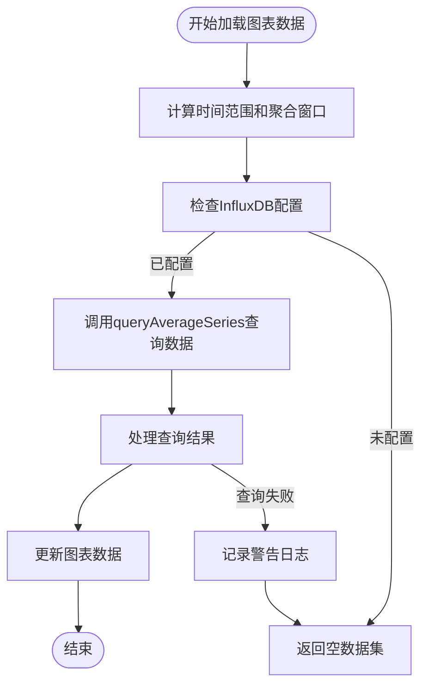
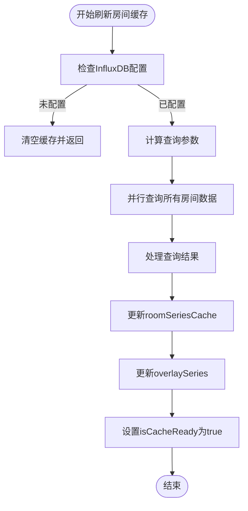
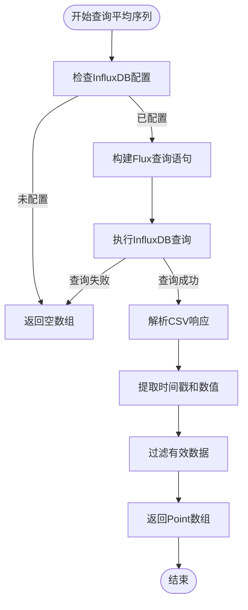
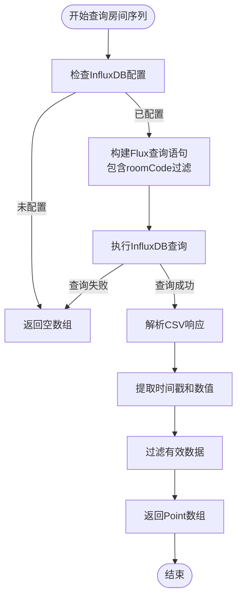
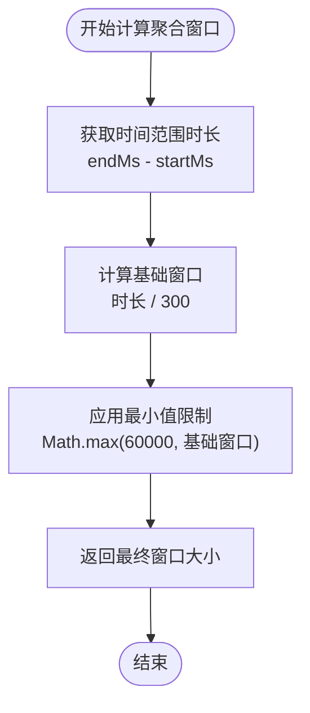
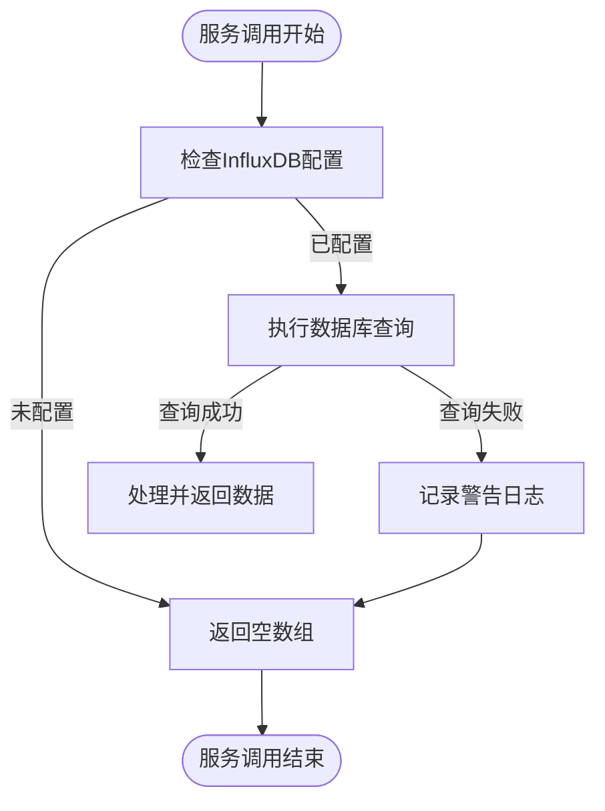
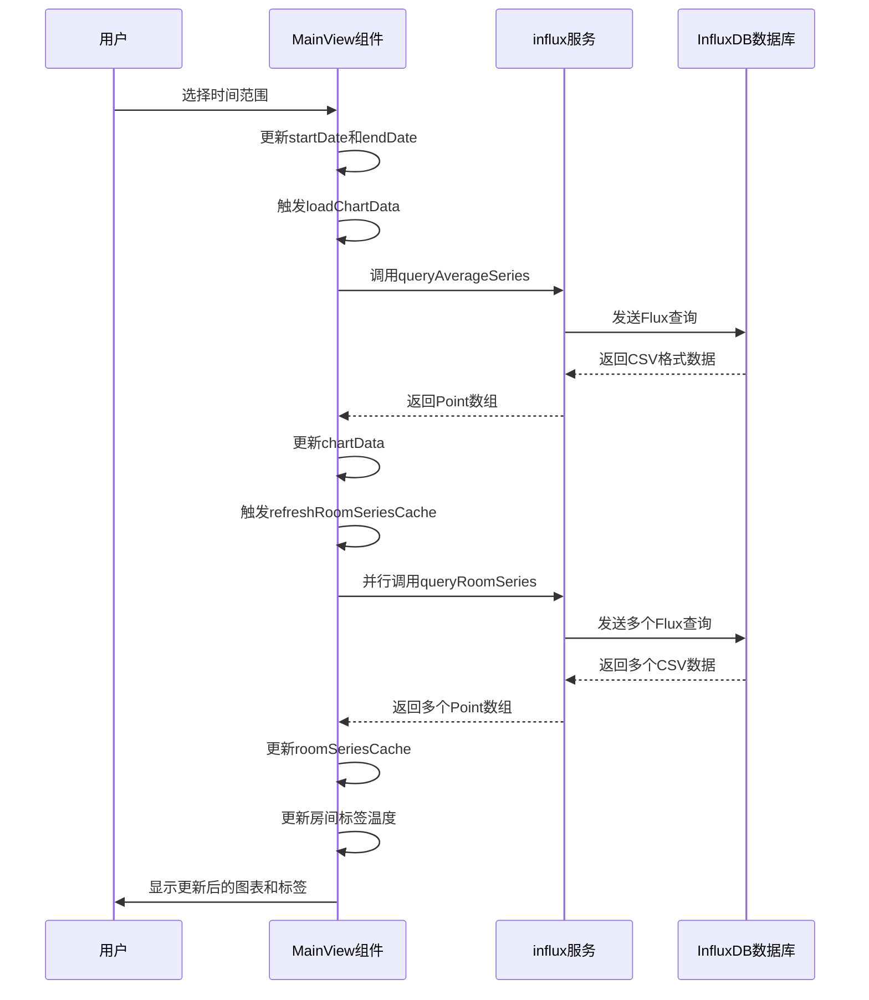

# 时间轴数据集成

<cite>
**本文档引用的文件**   
- [influx.ts](file://src/services/influx.ts)
- [MainView.vue](file://src/components/MainView.vue)
- [timeseries.js](file://server/routes/timeseries.js)
</cite>

## 目录
1. [时间轴与InfluxDB集成概述](#时间轴与influxdb集成概述)
2. [核心数据加载方法](#核心数据加载方法)
3. [服务调用实现细节](#服务调用实现细节)
4. [错误处理与降级策略](#错误处理与降级策略)
5. [数据加载完整流程](#数据加载完整流程)

## 时间轴与InfluxDB集成概述

本系统通过InfluxDB时序数据库实现了时间轴功能，用于存储和查询建筑空间的温度数据。系统前端通过`influx.ts`服务与InfluxDB进行通信，后端通过`timeseries.js`路由接收外部传入的时序数据并写入数据库。时间轴功能允许用户查看历史温度数据，支持时间范围选择、数据刷新和播放功能。

**Section sources**
- [influx.ts](file://src/services/influx.ts#L1-L136)
- [timeseries.js](file://server/routes/timeseries.js#L1-L263)

## 核心数据加载方法

### loadChartData方法

`loadChartData`方法负责从InfluxDB加载平均温度数据以填充主时间轴图表。该方法首先计算时间范围和数据聚合窗口，然后调用`queryAverageSeries`服务从数据库查询数据。如果InfluxDB未配置，方法会返回空数据集。

**Diagram sources**
- [MainView.vue](file://src/components/MainView.vue#L346-L365)

### refreshRoomSeriesCache方法

`refreshRoomSeriesCache`方法负责刷新房间时序数据缓存，为时间轴上的房间温度标签提供数据支持。该方法会查询所有房间的温度数据并缓存，同时更新图表覆盖层显示。方法实现了错误处理，即使单个房间查询失败也不会影响整体功能。

**Diagram sources**
- [MainView.vue](file://src/components/MainView.vue#L366-L387)

## 服务调用实现细节

### queryAverageSeries服务

`queryAverageSeries`服务用于查询指定时间范围内所有房间的平均温度数据。该服务使用InfluxDB的Flux查询语言，通过`aggregateWindow`函数对数据进行聚合。

**Diagram sources**
- [influx.ts](file://src/services/influx.ts#L39-L69)

### queryRoomSeries服务

`queryRoomSeries`服务用于查询特定房间在指定时间范围内的温度数据序列。该服务与`queryAverageSeries`类似，但增加了房间编码的过滤条件。

**Diagram sources**
- [influx.ts](file://src/services/influx.ts#L72-L103)

### 时间范围参数与数据聚合窗口计算

系统根据用户选择的时间范围动态计算数据聚合窗口，以确保图表显示性能和数据精度的平衡。聚合窗口的计算逻辑如下：

**Diagram sources**
- [MainView.vue](file://src/components/MainView.vue#L350-L351)
- [MainView.vue](file://src/components/MainView.vue#L372-L373)

## 错误处理与降级策略

系统实现了完善的错误处理机制，确保在InfluxDB服务不可用或查询失败时仍能提供基本功能。

### 错误处理机制

当数据查询失败时，系统会记录警告日志但不会中断用户操作。对于`queryAverageSeries`和`queryRoomSeries`服务，如果InfluxDB未配置或查询失败，服务会返回空数组作为降级结果。

**Diagram sources**
- [influx.ts](file://src/services/influx.ts#L40-L41)
- [influx.ts](file://src/services/influx.ts#L73-L74)

### 降级策略

系统采用多层降级策略：
1. **配置降级**：当InfluxDB未配置时，系统不会尝试连接数据库，避免不必要的错误。
2. **数据降级**：查询失败时返回空数据集，而不是抛出异常。
3. **功能降级**：即使数据加载失败，时间轴界面仍保持可用，用户可以进行时间范围选择等操作。

**Section sources**
- [influx.ts](file://src/services/influx.ts#L9-L10)
- [influx.ts](file://src/services/influx.ts#L53-L54)
- [influx.ts](file://src/services/influx.ts#L86-L87)

## 数据加载完整流程

以下是时间轴数据加载的完整流程，从用户交互到数据展示的全过程：

**Diagram sources**
- [MainView.vue](file://src/components/MainView.vue#L2464-L2465)
- [influx.ts](file://src/services/influx.ts#L39-L103)
- [MainView.vue](file://src/components/MainView.vue#L366-L387)