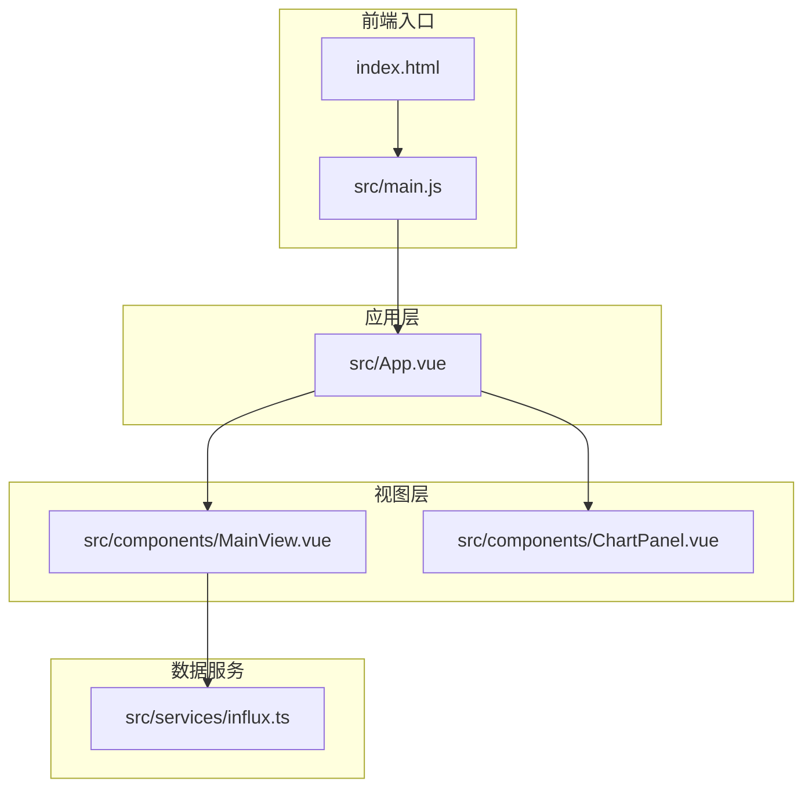
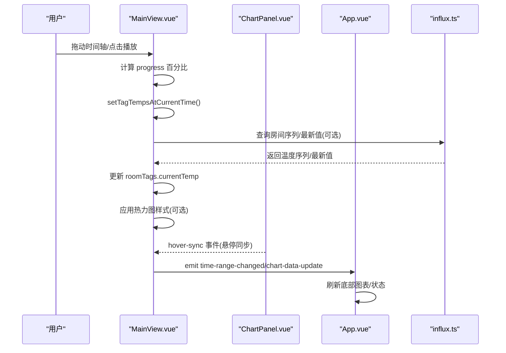
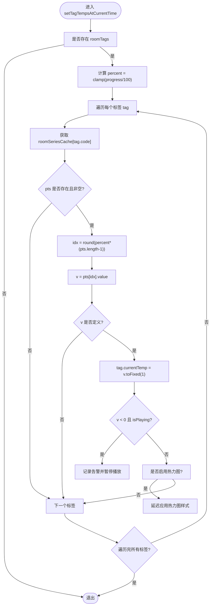
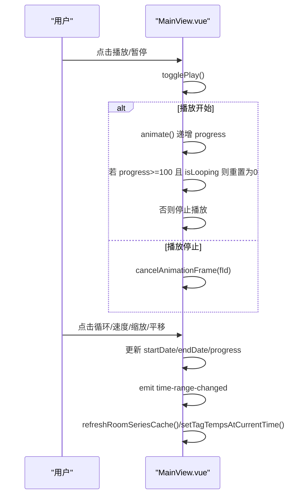
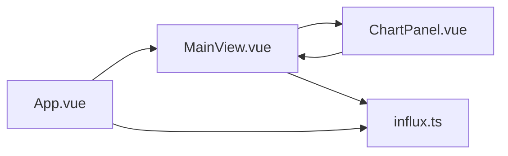

# 时间轴联动

<cite>
**本文引用的文件**
- [index.html](file://index.html)
- [src/main.js](file://src/main.js)
- [src/App.vue](file://src/App.vue)
- [src/components/MainView.vue](file://src/components/MainView.vue)
- [src/components/ChartPanel.vue](file://src/components/ChartPanel.vue)
- [src/services/influx.ts](file://src/services/influx.ts)
</cite>

## 目录
1. [简介](#简介)
2. [项目结构](#项目结构)
3. [核心组件](#核心组件)
4. [架构总览](#架构总览)
5. [详细组件分析](#详细组件分析)
6. [依赖关系分析](#依赖关系分析)
7. [性能考量](#性能考量)
8. [故障排查指南](#故障排查指南)
9. [结论](#结论)

## 简介
本文件聚焦“时间轴与模型的联动逻辑”，围绕以下目标进行深入解析：
- 如何根据时间进度（progress）更新模型状态与数据标签
- setTagTempsAtCurrentTime 方法如何依据当前时间进度从 roomSeriesCache 查询对应时间点的温度数据，并更新 roomTags 中的 currentTemp 值
- watch 监听器如何在 progress 或 currentTemp 变化时触发标签更新
- 时间轴控件（播放、暂停、循环、速度控制）的实现机制
- panTimeline 方法如何实现时间轴的左右平移
- 提供代码示例路径，展示时间轴与模型数据的同步更新过程

## 项目结构
本项目采用 Vue 3 单页应用结构，时间轴联动主要集中在 MainView 组件中，配合 App.vue 的顶层状态与 ChartPanel 的图表交互，以及服务层对 InfluxDB 的数据访问。

图表来源
- [index.html](file://index.html#L1-L17)
- [src/main.js](file://src/main.js#L1-L7)
- [src/App.vue](file://src/App.vue#L1-L120)
- [src/components/MainView.vue](file://src/components/MainView.vue#L1-L120)
- [src/components/ChartPanel.vue](file://src/components/ChartPanel.vue#L1-L120)
- [src/services/influx.ts](file://src/services/influx.ts#L1-L40)

章节来源
- [index.html](file://index.html#L1-L17)
- [src/main.js](file://src/main.js#L1-L7)
- [src/App.vue](file://src/App.vue#L1-L120)

## 核心组件
- MainView：时间轴 UI、播放控制、进度计算、标签温度更新、热力图、模型交互、与 InfluxDB 的数据交互
- ChartPanel：图表渲染与悬停同步，向 MainView 发送 hover-sync 事件
- App.vue：顶层状态管理，接收 MainView 的时间范围变更与图表数据更新事件
- influx.ts：封装 InfluxDB 查询接口（平均序列、房间序列、最新值）

章节来源
- [src/components/MainView.vue](file://src/components/MainView.vue#L1-L200)
- [src/components/ChartPanel.vue](file://src/components/ChartPanel.vue#L1-L120)
- [src/App.vue](file://src/App.vue#L460-L540)
- [src/services/influx.ts](file://src/services/influx.ts#L1-L40)

## 架构总览
时间轴联动的关键流程如下：
- 用户在时间轴上拖动或播放时，progress 百分比变化
- MainView 内部根据 progress 计算当前时间点，从 roomSeriesCache 中插值获取温度值
- setTagTempsAtCurrentTime 将当前温度写入 roomTags.currentTemp，并触发热力图更新
- App.vue 监听 MainView 的时间范围变化与图表数据更新，必要时刷新底部图表
- ChartPanel 通过 hover-sync 事件将悬停时间同步回 MainView，实现双向联动

图表来源
- [src/components/MainView.vue](file://src/components/MainView.vue#L2430-L2470)
- [src/components/ChartPanel.vue](file://src/components/ChartPanel.vue#L190-L218)
- [src/App.vue](file://src/App.vue#L460-L540)
- [src/services/influx.ts](file://src/services/influx.ts#L72-L103)

## 详细组件分析

### 时间轴与进度计算
- progress 由时间轴拖动或播放动画驱动，范围 0–100
- currentDisplayDate 与 currentDateStr/currentTimeStr 基于 progress 计算当前显示日期与时间
- isLive 基于 progress > 99.5 判断是否处于“实时”状态

章节来源
- [src/components/MainView.vue](file://src/components/MainView.vue#L482-L495)
- [src/components/MainView.vue](file://src/components/MainView.vue#L2430-L2436)

### setTagTempsAtCurrentTime：按进度更新标签温度
- 作用：根据当前 progress，从 roomSeriesCache 中插值获取对应时间点的温度，更新 roomTags.currentTemp
- 实现要点：
  - 计算百分比 percent = clamp(progress/100)
  - 从 roomSeriesCache[tag.code] 中按索引取值，若存在则写入 tag.currentTemp
  - 若启用热力图，延迟应用热力图样式
  - 若检测到负温度且正在播放，弹出低温警告并暂停播放

图表来源
- [src/components/MainView.vue](file://src/components/MainView.vue#L412-L454)

章节来源
- [src/components/MainView.vue](file://src/components/MainView.vue#L412-L454)

### 监听器：watch(progress) 与 watch(currentTemp)
- 监听 progress 变化，触发 setTagTempsAtCurrentTime
- 监听 currentTemp 变化，同样触发 setTagTempsAtCurrentTime
- 二者共同保证：无论通过时间轴还是图表悬停导致的时间推进，标签温度都会同步更新

章节来源
- [src/components/MainView.vue](file://src/components/MainView.vue#L456-L459)

### 时间轴控件与播放逻辑
- 播放/暂停：togglePlay 控制 isPlaying，animate 使用 requestAnimationFrame 以 playbackSpeed 递增 progress，到达 100 时若开启循环则回到 0，否则停止
- 循环：isLooping 控制播放结束后是否回到起点
- 速度控制：cycleSpeed 在 1x/2x/4x/8x 之间循环切换
- 实时：goLive 将 progress 设为 100 并停止播放
- 缩放：zoomIn/zoomOut 以当前窗口为中心进行缩放
- 平移：panTimeline 将起止时间整体偏移，实现左右平移

图表来源
- [src/components/MainView.vue](file://src/components/MainView.vue#L2452-L2461)
- [src/components/MainView.vue](file://src/components/MainView.vue#L2432-L2436)

章节来源
- [src/components/MainView.vue](file://src/components/MainView.vue#L2432-L2461)
- [src/components/MainView.vue](file://src/components/MainView.vue#L2452-L2456)

### panTimeline：时间轴左右平移
- panTimeline(d)：根据 d 的正负，将时间窗口整体向左或右平移
- 计算偏移量 off = d * (窗口时长/3)，更新 startDate 与 endDate
- emit time-range-changed 通知 App.vue 与图表更新

章节来源
- [src/components/MainView.vue](file://src/components/MainView.vue#L2432-L2433)

### 房间序列缓存与标签初始化
- roomSeriesCache：按房间 code 缓存时间序列，避免频繁请求
- refreshRoomSeriesCache：按当前时间窗口批量查询房间序列，填充缓存
- processRooms：从模型中提取房间节点，生成 roomTags，包含 dbId/worldPos/code/currentTemp 等
- 首次加载时预取所有房间序列并调用 setTagTempsAtCurrentTime，确保播放即刻可用

章节来源
- [src/components/MainView.vue](file://src/components/MainView.vue#L367-L387)
- [src/components/MainView.vue](file://src/components/MainView.vue#L867-L987)
- [src/components/MainView.vue](file://src/components/MainView.vue#L955-L969)

### 图表悬停同步到时间轴
- ChartPanel：在悬停时计算当前值与时间，通过 hover-sync 事件向父组件发送 { time, percent }
- MainView：syncTimelineHover 接收事件，将 progress 同步到悬停位置，从而联动标签温度更新

章节来源
- [src/components/ChartPanel.vue](file://src/components/ChartPanel.vue#L190-L218)
- [src/components/MainView.vue](file://src/components/MainView.vue#L2433-L2434)

### 与 App.vue 的联动
- App.vue 监听 MainView 的 chart-data-update 与 time-range-changed，必要时刷新底部图表与选中房间系列
- App.vue 的 onChartDataUpdate 会根据当前时间范围与选中房间，从 InfluxDB 拉取房间序列并更新 selectedRoomSeries

章节来源
- [src/App.vue](file://src/App.vue#L509-L534)
- [src/App.vue](file://src/App.vue#L536-L540)

### 数据来源：InfluxDB 查询
- queryRoomSeries：按房间 code、时间范围与聚合窗口获取房间温度序列
- queryAverageSeries：获取全楼平均温度序列
- queryLatestByRooms：按房间 code 列表查询最近值，用于自动刷新与初始温度填充

章节来源
- [src/services/influx.ts](file://src/services/influx.ts#L72-L103)
- [src/services/influx.ts](file://src/services/influx.ts#L39-L69)
- [src/services/influx.ts](file://src/services/influx.ts#L105-L134)

## 依赖关系分析
- MainView 依赖：
  - ChartPanel：悬停同步事件
  - App.vue：时间范围变更与图表数据更新事件
  - influx.ts：房间序列与平均序列查询
- App.vue 依赖：
  - influx.ts：房间序列查询
  - MainView：时间范围与图表数据更新事件
- ChartPanel 依赖：
  - MainView：hover-sync 事件

图表来源
- [src/components/MainView.vue](file://src/components/MainView.vue#L1-L120)
- [src/components/ChartPanel.vue](file://src/components/ChartPanel.vue#L1-L120)
- [src/App.vue](file://src/App.vue#L460-L540)
- [src/services/influx.ts](file://src/services/influx.ts#L1-L40)

## 性能考量
- 房间序列缓存：roomSeriesCache 避免重复查询，提高播放与拖动流畅度
- 热力图节流：applyHeatmapStyle 仅在温度变化超过阈值时更新材质，减少渲染压力
- 自动刷新：每分钟刷新一次，避免频繁请求造成性能抖动
- 播放动画：使用 requestAnimationFrame，步进受 speed 控制，避免阻塞主线程

章节来源
- [src/components/MainView.vue](file://src/components/MainView.vue#L367-L387)
- [src/components/MainView.vue](file://src/components/MainView.vue#L1383-L1449)
- [src/components/MainView.vue](file://src/components/MainView.vue#L2480-L2541)
- [src/components/MainView.vue](file://src/components/MainView.vue#L2452-L2456)

## 故障排查指南
- 无温度数据：若 InfluxDB 未配置或查询失败，roomSeriesCache 为空，标签温度不会更新
  - 检查环境变量与鉴权配置
  - 确认 queryRoomSeries 返回有效数据
- 播放卡顿：检查是否启用了热力图，适当降低刷新频率或关闭热力图
- 标签不显示：确认 areTagsVisible 已开启，且模型坐标转换正常
- 悬停不同步：检查 ChartPanel 的 hover-sync 事件是否正确传递到 MainView.syncTimelineHover

章节来源
- [src/services/influx.ts](file://src/services/influx.ts#L1-L20)
- [src/components/MainView.vue](file://src/components/MainView.vue#L412-L454)
- [src/components/ChartPanel.vue](file://src/components/ChartPanel.vue#L190-L218)

## 结论
本项目通过 MainView 的时间轴控件与标签更新机制，实现了时间进度与模型标签温度的紧密联动。setTagTempsAtCurrentTime 作为关键方法，结合 watch 监听器与 roomSeriesCache 缓存，确保了播放、拖动、悬停等场景下的实时同步。配合 App.vue 的图表联动与 ChartPanel 的悬停同步，最终形成了从 UI 到数据再到模型的闭环联动体系。