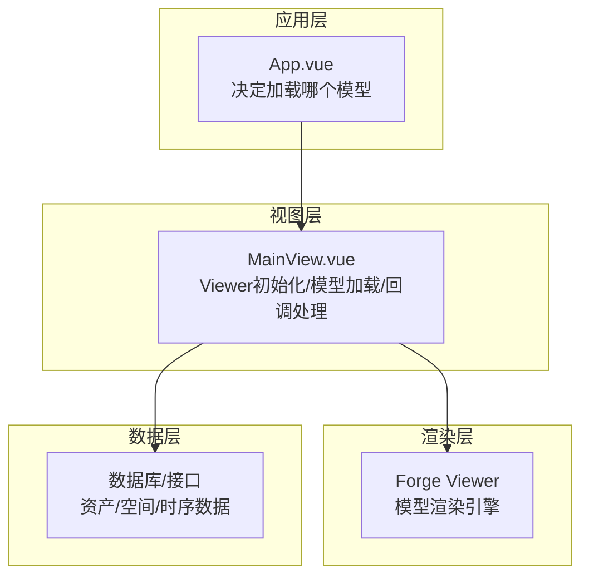
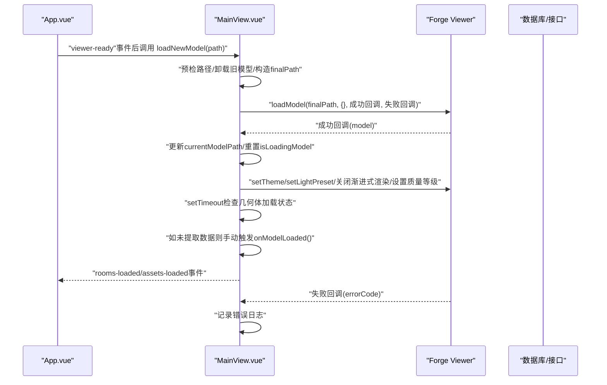
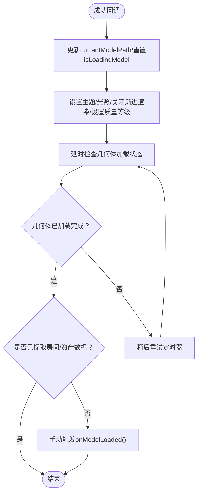
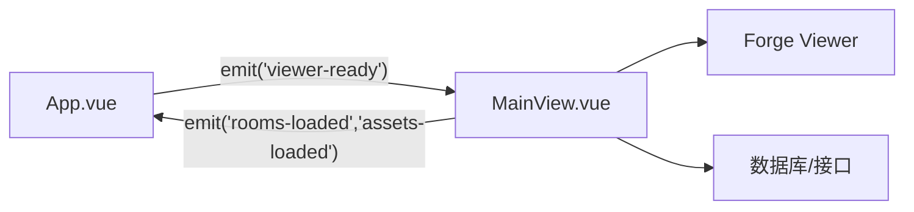

# 加载回调处理

<cite>
**本文引用的文件**
- [MainView.vue](file://src/components/MainView.vue)
- [App.vue](file://src/App.vue)
</cite>

## 目录
1. [简介](#简介)
2. [项目结构](#项目结构)
3. [核心组件](#核心组件)
4. [架构总览](#架构总览)
5. [详细组件分析](#详细组件分析)
6. [依赖关系分析](#依赖关系分析)
7. [性能考量](#性能考量)
8. [故障排查指南](#故障排查指南)
9. [结论](#结论)

## 简介
本文件围绕“模型加载成功与失败回调”的处理逻辑进行系统性解析，重点说明：
- 成功回调中执行的初始化操作，包括更新当前模型路径与加载状态、设置Viewer主题与光照预设、关闭渐进式渲染与质量等级等视觉优化配置；
- 为什么在成功回调后需要设置定时器检查模型几何体加载状态，并在必要时手动触发数据提取流程；
- 失败回调中错误日志记录的实现；
- 整个回调机制如何保证模型加载过程的状态同步与错误处理。

## 项目结构
本项目采用前端单页应用架构，模型加载与渲染主要集中在组件层，通过事件与状态驱动数据提取与界面更新。关键文件如下：
- 主视图组件负责Viewer初始化、模型加载、回调处理与数据提取；
- 应用入口负责在Viewer就绪后决定加载哪个模型，并协调数据库数据与模型数据的优先级。

**章节来源**
- file://src/components/MainView.vue#L580-L624
- file://src/App.vue#L355-L471

## 核心组件
- MainView.vue：封装Viewer初始化、loadNewModel加载流程、成功/失败回调处理、数据提取与UI状态管理。
- App.vue：在Viewer就绪后，从后端拉取激活文件并决定加载路径，同时优先加载数据库中的资产/空间数据，再加载模型。

**章节来源**
- file://src/components/MainView.vue#L599-L703
- file://src/App.vue#L355-L471

## 架构总览
模型加载回调处理的关键流程如下：
- App.vue在Viewer就绪后，决定加载路径并调用MainView.loadNewModel；
- MainView.loadNewModel内部通过Viewer.loadModel发起异步加载；
- 成功回调中完成初始化设置与状态更新，并延时检查几何体加载状态，必要时手动触发数据提取；
- 失败回调中记录错误日志；
- 数据提取完成后，通过事件向上层广播，驱动UI更新。

**图表来源**
- [MainView.vue](file://src/components/MainView.vue#L599-L703)
- [App.vue](file://src/App.vue#L355-L471)

**章节来源**
- file://src/components/MainView.vue#L599-L703
- file://src/App.vue#L355-L471

## 详细组件分析

### 成功回调中的初始化操作
在成功回调中，MainView执行以下关键步骤：
- 更新当前模型路径与加载状态：将currentModelPath更新为请求的模型路径，将isLoadingModel重置为false；
- 视觉优化配置：设置Viewer主题为深色主题、设置光照预设、关闭渐进式渲染、设置质量等级；
- 几何体状态检查与手动触发：延迟一段时间后检查模型几何体是否已加载完成，若已完成且尚未提取数据，则手动触发onModelLoaded以启动数据提取流程。

上述行为均在loadNewModel的loadModel成功回调中完成，确保在模型完全可用后再进行后续初始化与数据提取。

**章节来源**
- file://src/components/MainView.vue#L668-L703
- file://src/components/MainView.vue#L675-L696

### currentModelPath 与 isLoadingModel 的更新
- currentModelPath：在成功回调中被设置为本次加载的目标路径，用于后续去重判断与状态同步；
- isLoadingModel：在进入loadNewModel时置为true，在成功回调中重置为false，用于防止重复加载与竞态控制。

这些状态变量位于MainView组件顶层作用域，配合App.vue中的currentLoadedModelPath（响应式值）共同维护跨组件的状态一致性。

**章节来源**
- file://src/components/MainView.vue#L244-L251
- file://src/components/MainView.vue#L675-L678
- file://src/App.vue#L355-L471

### 视觉优化配置（主题、光照、渐进渲染、质量等级）
- 主题：设置为深色主题；
- 光照预设：设置为特定预设（数值常量）；
- 渐进式渲染：关闭；
- 质量等级：关闭（双参数false）。

以上配置在成功回调中统一设置，确保加载后的初始渲染体验一致且可控。

**章节来源**
- file://src/components/MainView.vue#L679-L684

### 为什么需要定时器检查几何体加载状态并手动触发onModelLoaded
- Viewer的几何体加载与事件触发可能存在时序差异，即使成功回调已返回，几何体可能尚未完全就绪；
- 若此前未提取房间/资产数据，onModelLoaded不会被自动触发，因此通过定时器检查并手动触发，确保数据提取流程启动；
- 这一策略保证了“数据提取”与“模型加载完成”之间的可靠衔接，避免因事件未触发导致的数据缺失。

**图表来源**
- [MainView.vue](file://src/components/MainView.vue#L675-L696)

**章节来源**
- file://src/components/MainView.vue#L675-L696

### 失败回调中的错误日志记录
- 失败回调接收错误码与最终加载路径，记录错误日志；
- 该日志有助于定位路径预检失败、网络异常或模型格式问题等场景。

**章节来源**
- file://src/components/MainView.vue#L699-L702

### 回调机制如何保证状态同步与错误处理
- App.vue在Viewer就绪后决定加载路径，并在必要时优先加载数据库中的资产/空间数据，再加载模型，避免UI与数据不一致；
- MainView通过currentModelPath与isLoadingModel实现防重复加载与竞态控制；
- 成功回调中统一初始化与延时检查，失败回调中记录错误，确保状态同步与错误可追踪；
- 数据提取完成后通过事件向上层广播，驱动UI更新与联动。

**章节来源**
- file://src/App.vue#L355-L471
- file://src/components/MainView.vue#L599-L703

## 依赖关系分析
- 组件耦合
  - App.vue与MainView.vue通过事件通信（viewer-ready、rooms-loaded、assets-loaded）实现解耦；
  - MainView.vue内部通过Viewer API完成模型加载与初始化，对外暴露事件接口；
- 外部依赖
  - Forge Viewer：提供模型加载、几何查询、材质与光照控制；
  - 数据库/接口：提供资产/空间/时序数据，作为优先数据源。

**图表来源**
- [App.vue](file://src/App.vue#L355-L471)
- [MainView.vue](file://src/components/MainView.vue#L580-L624)

**章节来源**
- file://src/App.vue#L355-L471
- file://src/components/MainView.vue#L580-L624

## 性能考量
- 预检模型路径：通过HEAD请求与Content-Type校验，避免SPA返回HTML被误判为SVF，减少无效加载；
- 卸载旧模型：在加载新模型前卸载可见模型，降低内存占用与渲染压力；
- 关闭渐进式渲染与质量等级：在加载阶段关闭以提升首帧速度与稳定性；
- 延时检查与手动触发：避免过早触发导致的几何体未就绪，减少重试与无效计算。

**章节来源**
- file://src/components/MainView.vue#L625-L666
- file://src/components/MainView.vue#L679-L684
- file://src/components/MainView.vue#L686-L696

## 故障排查指南
- 模型路径错误
  - 现象：加载失败或空白模型；
  - 排查：确认路径预检是否通过、Content-Type是否为二进制而非text/html；
  - 参考：路径预检与finalPath选择逻辑。
- 几何体未就绪导致数据提取缺失
  - 现象：onModelLoaded未触发，房间/资产列表为空；
  - 排查：检查成功回调中的延时检查与手动触发逻辑；
  - 参考：几何体加载状态检查与手动触发。
- 光照/主题/渲染异常
  - 现象：渲染效果不符合预期；
  - 排查：确认主题、光照预设、渐进式渲染与质量等级设置是否生效；
  - 参考：成功回调中的初始化设置。
- 错误日志缺失
  - 现象：加载失败无日志；
  - 排查：确认失败回调是否被调用，检查错误码与路径；
  - 参考：失败回调的日志记录。

**章节来源**
- file://src/components/MainView.vue#L625-L666
- file://src/components/MainView.vue#L679-L696
- file://src/components/MainView.vue#L699-L702

## 结论
本项目的模型加载回调处理通过“成功回调初始化+延时检查+手动触发”的组合策略，有效解决了几何体加载时序不确定性带来的数据提取缺失问题；同时通过状态变量与事件机制实现了跨组件的状态同步与错误处理。建议在后续迭代中：
- 对路径预检与错误日志进行更细粒度的分类与上报；
- 在手动触发onModelLoaded前增加最大重试次数，避免无限等待；
- 对初始化设置进行可配置化，以便按场景灵活调整渲染策略。