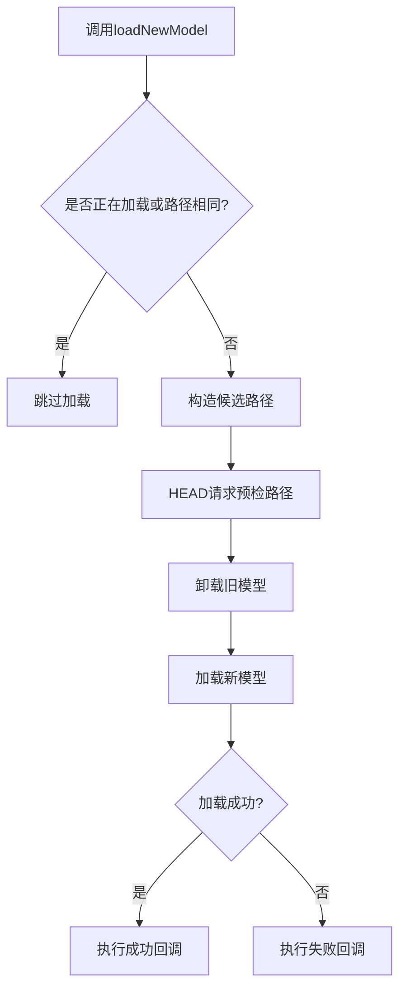
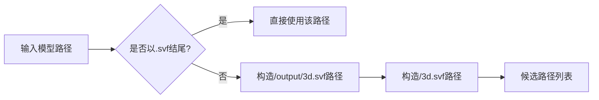
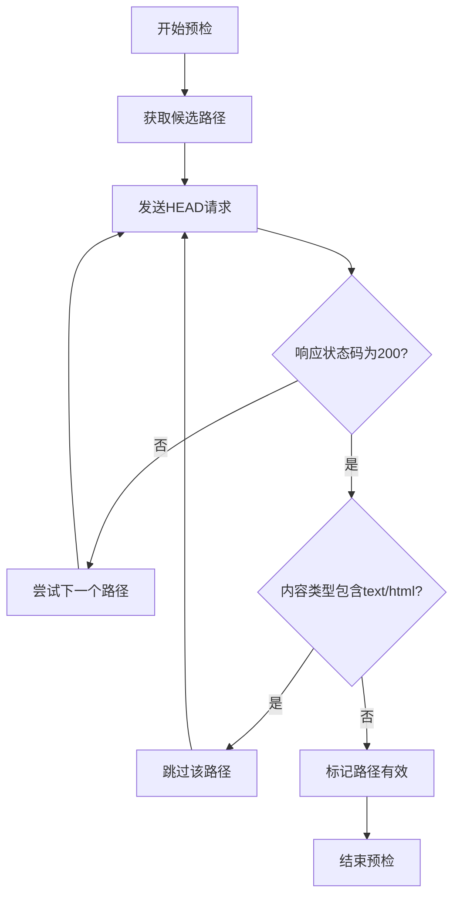
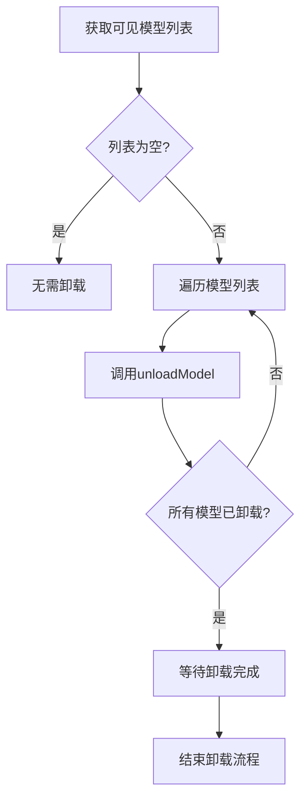

# 模型加载机制

<cite>
**本文档引用的文件**   
- [App.vue](file://src/App.vue)
- [MainView.vue](file://src/components/MainView.vue)
</cite>

## 目录
1. [模型加载机制概述](#模型加载机制概述)
2. [loadNewModel方法详解](#loadnewmodel方法详解)
3. [模型路径候选列表生成逻辑](#模型路径候选列表生成逻辑)
4. [HEAD请求预检路径有效性](#head请求预检路径有效性)
5. [模型卸载流程](#模型卸载流程)
6. [加载成功与失败的回调处理](#加载成功与失败的回调处理)
7. [Viewer渲染质量与光照预设设置](#viewer渲染质量与光照预设设置)
8. [代码示例](#代码示例)

## 模型加载机制概述

本系统实现了动态加载和切换不同建筑模型的功能。通过`loadNewModel`方法，系统能够根据指定的模型路径动态加载新的3D模型，并在加载完成后进行相应的初始化设置。整个加载过程包括模型路径的候选列表生成、路径有效性预检、旧模型卸载、新模型加载以及加载成功或失败的回调处理。

**Section sources**
- [MainView.vue](file://src/components/MainView.vue#L599-L703)

## loadNewModel方法详解

`loadNewModel`方法是模型加载的核心，负责处理新模型的加载和旧模型的卸载。该方法首先检查是否正在加载模型或当前模型路径是否与目标路径相同，以防止重复加载。然后构造候选路径列表，通过HEAD请求预检路径的有效性，确保不会加载HTML错误页面。在卸载所有当前加载的模型后，使用Forge Viewer的`loadModel`方法加载新模型，并在加载成功或失败时执行相应的回调函数。



**Diagram sources**
- [MainView.vue](file://src/components/MainView.vue#L599-L703)

**Section sources**
- [MainView.vue](file://src/components/MainView.vue#L599-L703)

## 模型路径候选列表生成逻辑

模型路径的候选列表生成逻辑考虑了两种常见的模型存储结构：标准结构和扁平结构。当提供的模型路径不以`.svf`结尾时，系统会优先尝试`/output/3d.svf`路径（标准结构），然后尝试`/3d.svf`路径（扁平结构）。这种设计确保了系统能够适应不同的模型存储方式，提高了模型加载的灵活性和成功率。



**Diagram sources**
- [MainView.vue](file://src/components/MainView.vue#L612-L621)

**Section sources**
- [MainView.vue](file://src/components/MainView.vue#L612-L621)

## HEAD请求预检路径有效性

为了防止加载HTML错误页面，系统在加载模型前会通过HEAD请求预检路径的有效性。该过程会依次检查候选路径列表中的每个路径，发送HEAD请求并检查响应状态和内容类型。如果响应状态码为200且内容类型不包含`text/html`，则认为该路径有效，可以用于加载模型。这种预检机制有效避免了因路径错误而导致的模型加载失败。



**Diagram sources**
- [MainView.vue](file://src/components/MainView.vue#L625-L647)

**Section sources**
- [MainView.vue](file://src/components/MainView.vue#L625-L647)

## 模型卸载流程

模型卸载流程确保在加载新模型前，所有当前可见的模型都被正确卸载。系统首先获取当前可见的模型列表，然后逐个调用`unloadModel`方法进行卸载。卸载完成后，系统会等待一段时间以确保卸载过程完全结束，然后再开始加载新模型。这种异步处理方式保证了模型切换的平滑性和稳定性。



**Diagram sources**
- [MainView.vue](file://src/components/MainView.vue#L651-L663)

**Section sources**
- [MainView.vue](file://src/components/MainView.vue#L651-L663)

## 加载成功与失败的回调处理

加载成功与失败的回调处理是模型加载机制的重要组成部分。当模型加载成功时，系统会执行成功回调函数，进行模型路径标记、加载状态重置以及Viewer的初始化设置。如果加载失败，系统会执行失败回调函数，记录错误信息。此外，系统还会检查几何体是否已加载完成，如果未触发`GEOMETRY_LOADED_EVENT`事件，则手动调用`onModelLoaded`方法，确保状态同步。

**Section sources**
- [MainView.vue](file://src/components/MainView.vue#L667-L702)

## Viewer渲染质量与光照预设设置

在模型加载成功后，系统会对Viewer进行一系列初始化设置，包括渲染质量和光照预设。具体设置包括：设置暗色主题、使用17号光照预设（Field环境）、禁用渐进式渲染以及设置质量级别。这些设置确保了模型在Viewer中的最佳显示效果，提供了良好的用户体验。

**Section sources**
- [MainView.vue](file://src/components/MainView.vue#L679-L683)

## 代码示例

以下代码示例展示了如何调用`loadNewModel`方法，并处理模型加载事件以确保状态同步：

```javascript
// 在App.vue中调用loadNewModel方法
if (pendingActiveFile.value && mainViewRef.value && mainViewRef.value.loadNewModel) {
  const file = pendingActiveFile.value;
  if (file.extracted_path) {
    currentLoadedModelPath.value = file.extracted_path;
    mainViewRef.value.loadNewModel(file.extracted_path);
  }
  pendingActiveFile.value = null;
}

// 监听GEOMETRY_LOADED_EVENT事件以确保状态同步
viewer.addEventListener(window.Autodesk.Viewing.GEOMETRY_LOADED_EVENT, onModelLoaded);
```

**Section sources**
- [App.vue](file://src/App.vue#L360-L367)
- [MainView.vue](file://src/components/MainView.vue#L551-L552)