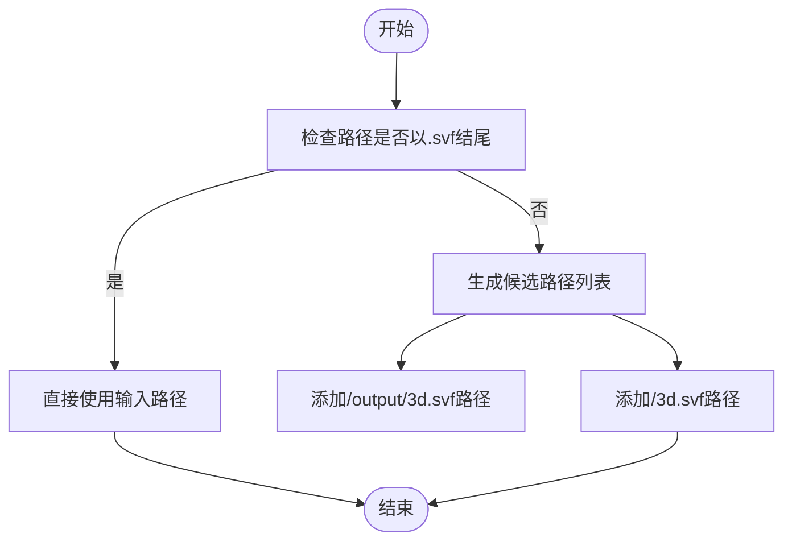
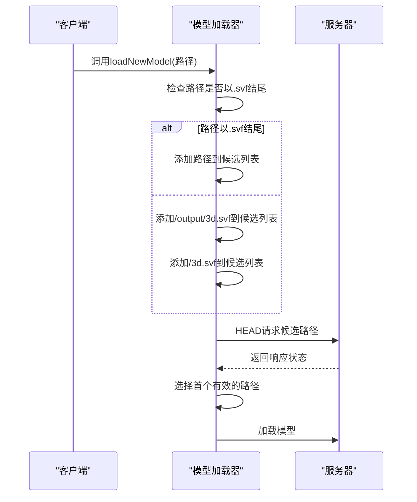

# 模型路径解析

<cite>
**本文档引用的文件**   
- [MainView.vue](file://src/components/MainView.vue)
- [App.vue](file://src/App.vue)
</cite>

## 目录
1. [模型路径解析逻辑](#模型路径解析逻辑)
2. [候选路径生成机制](#候选路径生成机制)
3. [路径优先级设计](#路径优先级设计)
4. [代码实现示例](#代码实现示例)
5. [容错性与灵活性](#容错性与灵活性)

## 模型路径解析逻辑

系统在加载模型时，通过`loadNewModel`方法实现智能路径解析。该方法接收模型路径作为输入参数，根据路径特征动态构建候选路径列表，以兼容不同目录结构的模型文件部署方式。路径解析的核心目标是确保系统能够正确加载SVF格式的3D模型文件，无论其在文件系统中的具体位置如何。

**Section sources**
- [MainView.vue](file://src/components/MainView.vue#L600-L703)

## 候选路径生成机制

当传入模型路径时，系统首先判断路径是否以`.svf`结尾。如果输入路径已以`.svf`结尾，则直接使用该路径作为唯一候选路径。否则，系统会生成两个候选路径：优先尝试`/output/3d.svf`路径，其次尝试`/3d.svf`路径。

这种条件判断逻辑确保了系统能够适应两种常见的模型文件部署结构：一种是将SVF文件放置在`output`子目录中的标准结构，另一种是将SVF文件直接放置在模型根目录中的扁平结构。

**Diagram sources **
- [MainView.vue](file://src/components/MainView.vue#L613-L621)

## 路径优先级设计

系统优先尝试`/output/3d.svf`路径的设计基于对实际项目部署模式的观察。在大多数情况下，经过处理的SVF模型文件会被放置在`output`目录中，该目录通常包含其他衍生文件如`manifest-derivative.json`和`index.html`等。这种目录结构反映了标准的模型处理流程。

其次尝试`/3d.svf`路径的设计则提供了向后兼容性，支持那些将模型文件直接放置在根目录的部署方式。这种双重路径尝试机制显著提高了系统的兼容性和鲁棒性。

**Section sources**
- [MainView.vue](file://src/components/MainView.vue#L617-L620)

## 代码实现示例

`loadNewModel`方法中路径候选列表的生成过程如下：首先检查输入路径是否以`.svf`结尾，如果是则直接使用；否则构建包含两个候选路径的列表。系统会通过HEAD请求预检这些路径，验证文件是否存在且内容类型正确，从而避免加载HTML错误页面。

**Diagram sources **
- [MainView.vue](file://src/components/MainView.vue#L613-L649)

## 容错性与灵活性

这种路径解析设计极大地提高了模型加载的容错性和灵活性。通过预检机制，系统能够避免加载不存在的文件或错误的HTML页面。同时，支持多种路径结构的设计使得系统能够无缝集成不同来源和格式的模型数据。

当系统检测到多个有效路径时，会优先选择第一个通过验证的路径，这确保了加载过程的确定性和可预测性。整个机制的设计充分考虑了实际使用场景中的各种边界情况，提供了可靠的模型加载体验。

**Section sources**
- [MainView.vue](file://src/components/MainView.vue#L625-L649)