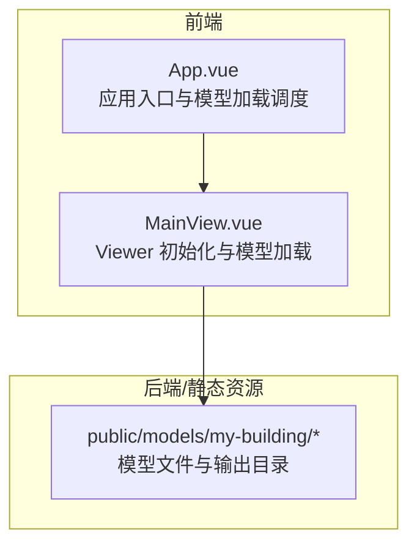
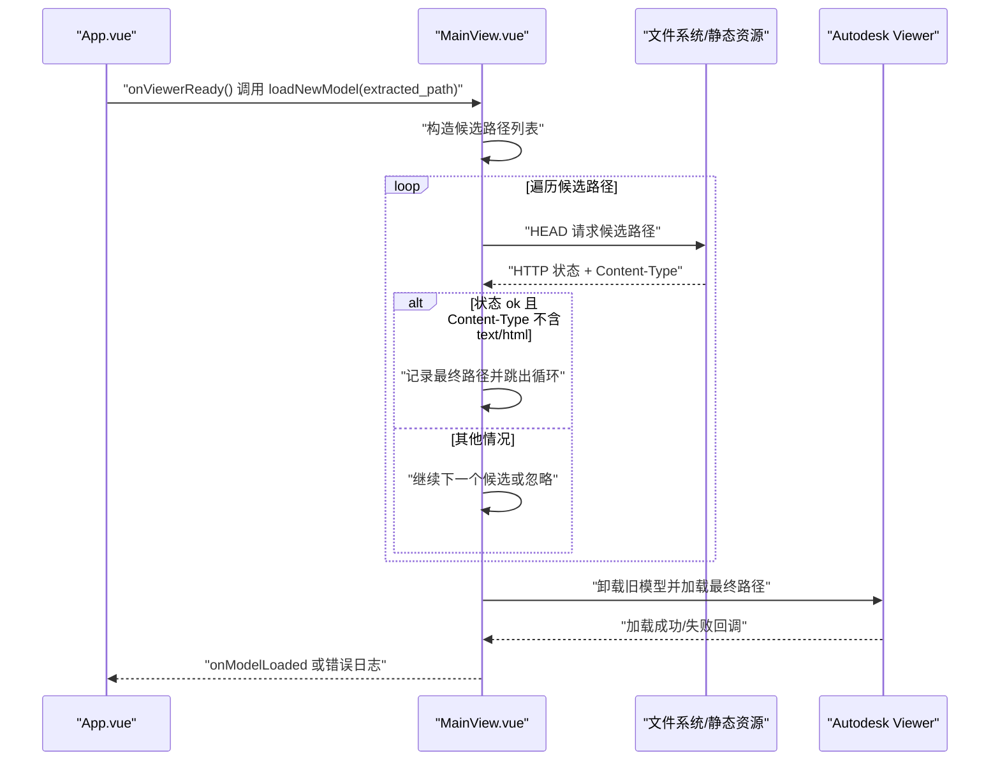
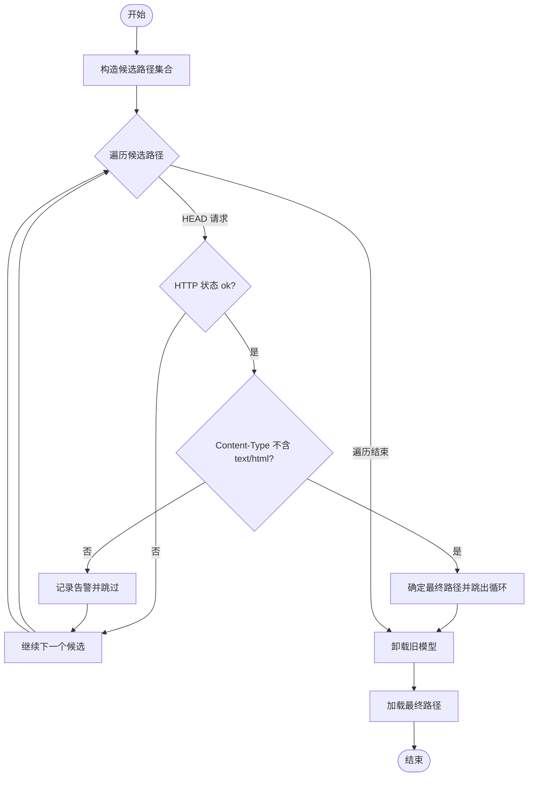
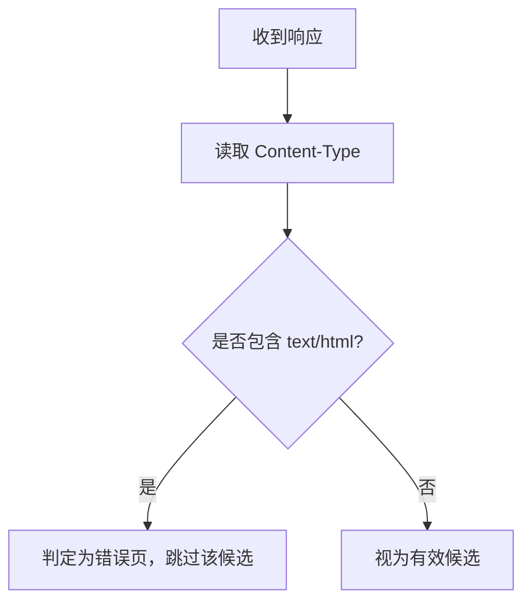
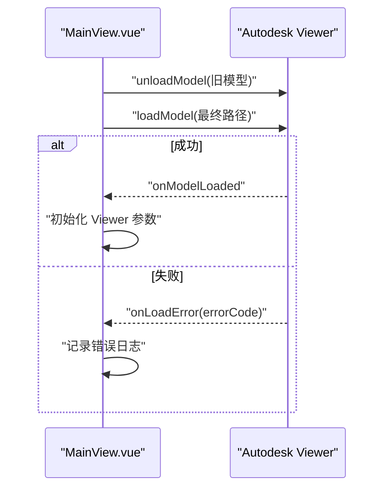
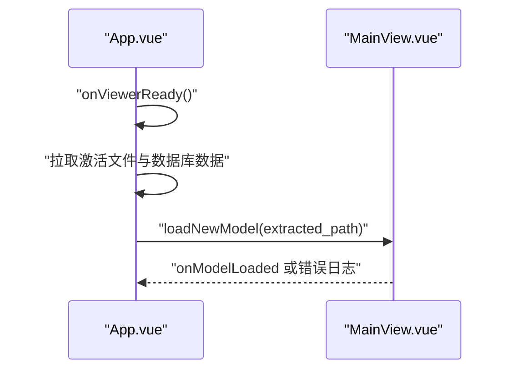
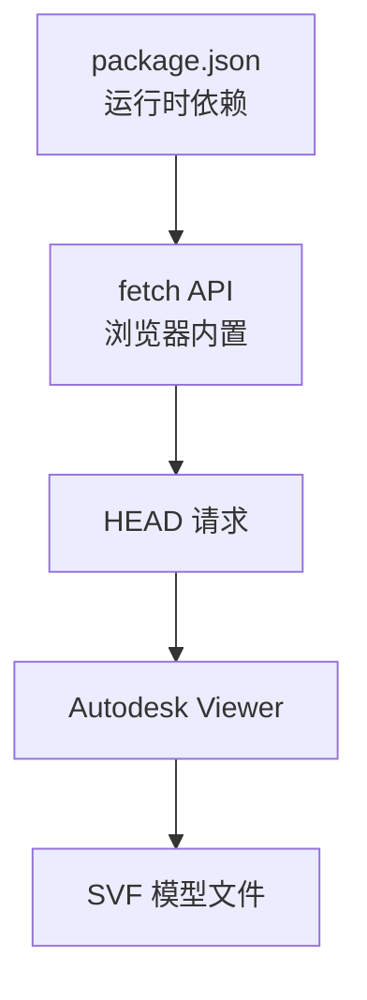

# 模型路径预检

<cite>
**本文引用的文件**
- [MainView.vue](file://src/components/MainView.vue)
- [App.vue](file://src/App.vue)
- [index.html](file://public/models/my-building/MFMIWRLCVUBF118E4A/output/index.html)
- [package.json](file://package.json)
</cite>

## 目录
1. [简介](#简介)
2. [项目结构](#项目结构)
3. [核心组件](#核心组件)
4. [架构总览](#架构总览)
5. [详细组件分析](#详细组件分析)
6. [依赖分析](#依赖分析)
7. [性能考虑](#性能考虑)
8. [故障排查指南](#故障排查指南)
9. [结论](#结论)

## 简介
本文件聚焦于“模型路径预检”机制，解释前端如何通过发起 HEAD 请求对候选模型路径进行有效性验证，以避免 Viewer 在加载阶段因返回 HTML（如 404 页面）而弹出错误提示。文档详细说明预检循环的执行流程、Content-Type 校验策略、异常处理与回退逻辑，并给出与之配套的代码片段路径，帮助读者快速定位实现细节。

## 项目结构
本项目采用前后端分离架构，前端使用 Vue 组件负责 Viewer 初始化与模型加载；后端提供静态资源服务，模型文件位于 public 下的 models 目录。模型路径预检逻辑集中在前端组件中，通过构造候选路径并逐一 HEAD 校验，最终确定可加载的真实路径。

**章节来源**
- [App.vue](file://src/App.vue#L355-L457)
- [MainView.vue](file://src/components/MainView.vue#L599-L703)

## 核心组件
- App.vue：应用启动后拉取激活文件，准备数据库数据，随后调用 MainView.vue 的 loadNewModel 方法加载模型。
- MainView.vue：负责 Viewer 初始化、模型路径预检、卸载旧模型、加载新模型并处理加载完成事件。

关键职责：
- 构造候选路径集合（标准 output/3d.svf 与扁平 3d.svf）
- 对每个候选路径发起 HEAD 请求，校验 HTTP 状态与 Content-Type
- 若 Content-Type 为 text/html，判定为 SPA 返回的错误页，跳过该候选
- 一旦找到有效候选，立即终止预检并使用该路径加载模型
- 预检失败或无有效候选时，保留第一个候选路径交由 Viewer 报错，便于后续诊断

**章节来源**
- [App.vue](file://src/App.vue#L355-L457)
- [MainView.vue](file://src/components/MainView.vue#L599-L703)

## 架构总览
下面的序列图展示了从应用启动到模型加载的关键交互，重点体现预检流程与异常处理。

**图表来源**
- [App.vue](file://src/App.vue#L355-L457)
- [MainView.vue](file://src/components/MainView.vue#L599-L703)

**章节来源**
- [App.vue](file://src/App.vue#L355-L457)
- [MainView.vue](file://src/components/MainView.vue#L599-L703)

## 详细组件分析

### 预检循环与路径选择
- 候选路径构造规则：
  - 若传入路径直接以 .svf 结尾，则只使用该路径作为候选
  - 否则优先尝试标准结构的 output/3d.svf，再尝试扁平结构的 3d.svf
- 预检策略：
  - 对每个候选路径发起 HEAD 请求
  - 仅当响应状态为成功且 Content-Type 不包含 text/html 时，才视为有效
  - 一旦找到有效候选，立即停止遍历
  - 若全部无效，保留第一个候选路径交由 Viewer 报错，便于定位问题
- 异常处理：
  - 预检过程中捕获网络异常并忽略，保证流程稳定
  - 预检整体异常时记录告警并回退到默认行为

**图表来源**
- [MainView.vue](file://src/components/MainView.vue#L612-L649)

**章节来源**
- [MainView.vue](file://src/components/MainView.vue#L612-L649)

### 内容类型校验与错误页规避
- 校验目标：避免将 SPA 返回的 index.html（text/html）误判为合法的 SVF 文件
- 实施方式：读取响应头中的 Content-Type，若包含 text/html 则判定为错误页，跳过该候选
- 作用：显著降低 Viewer 在加载阶段弹出错误提示的概率，提升用户体验

**图表来源**
- [MainView.vue](file://src/components/MainView.vue#L626-L641)

**章节来源**
- [MainView.vue](file://src/components/MainView.vue#L626-L641)

### 加载与卸载流程
- 卸载旧模型：在加载新模型前，收集当前可见模型并逐个卸载，等待短暂时间以确保清理完成
- 加载新模型：使用最终确定的路径调用 Viewer 的加载接口，并在成功/失败回调中记录日志
- 成功后初始化 Viewer 的主题、光照与渲染质量等参数

**图表来源**
- [MainView.vue](file://src/components/MainView.vue#L651-L703)

**章节来源**
- [MainView.vue](file://src/components/MainView.vue#L651-L703)

### 与应用入口的协作
- App.vue 在 Viewer 初始化完成后，根据激活文件或默认路径调用 MainView.vue 的 loadNewModel
- 若数据库数据尚未就绪，先拉取资产与空间信息，再进行模型加载，确保后续房间/资产处理逻辑可用

**图表来源**
- [App.vue](file://src/App.vue#L355-L457)

**章节来源**
- [App.vue](file://src/App.vue#L355-L457)

## 依赖分析
- 前端依赖：项目使用现代浏览器的 fetch API 发起 HEAD 请求，无需额外依赖
- 静态资源：模型文件位于 public 下，路径遵循标准 output/3d.svf 或扁平 3d.svf 两种布局
- 示例 HTML：public/models/my-building/*/output/index.html 中的 Viewer 初始化逻辑表明，前端期望加载的是 SVF 文件而非 HTML 页面

**图表来源**
- [package.json](file://package.json)
- [index.html](file://public/models/my-building/MFMIWRLCVUBF118E4A/output/index.html)

**章节来源**
- [package.json](file://package.json)
- [index.html](file://public/models/my-building/MFMIWRLCVUBF118E4A/output/index.html)

## 性能考虑
- 预检采用 HEAD 请求，仅传输响应头，开销极低，适合在加载前快速筛选有效候选
- 一旦命中有效候选即停止遍历，避免不必要的网络往返
- 卸载旧模型时的短暂等待有助于确保资源释放，减少后续加载冲突

## 故障排查指南
- 若预检全部失败：
  - 检查 extracted_path 是否正确指向模型根目录或 .svf 文件
  - 确认服务器可访问对应路径，且未被 SPA 路由拦截返回 index.html
- 若 Content-Type 校验导致误判：
  - 确认服务器正确设置 Content-Type，避免 text/html 混淆
- 若 Viewer 仍报错：
  - 查看最终加载路径是否为有效 SVF 文件
  - 检查浏览器控制台与网络面板，确认响应状态与 Content-Type

**章节来源**
- [MainView.vue](file://src/components/MainView.vue#L612-L703)

## 结论
模型路径预检通过轻量的 HEAD 请求与 Content-Type 校验，有效规避了 SPA 错误页对 Viewer 加载的影响，提升了加载成功率与用户体验。配合严格的候选路径构造与异常回退策略，该机制在复杂部署环境下具备良好的鲁棒性与可维护性。