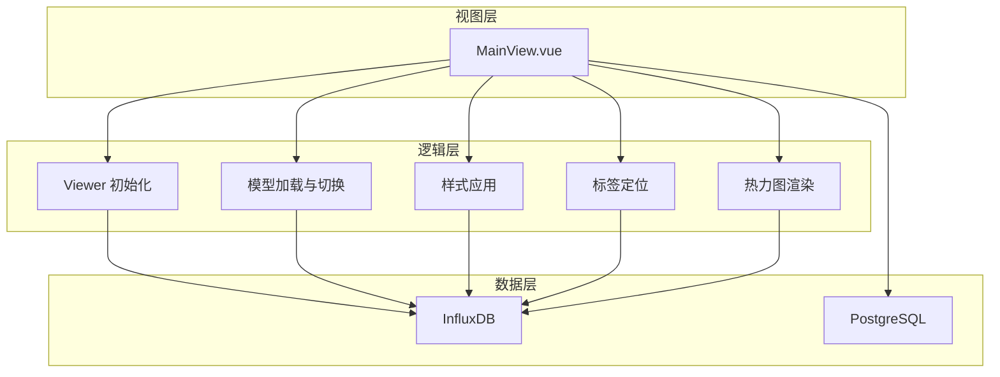
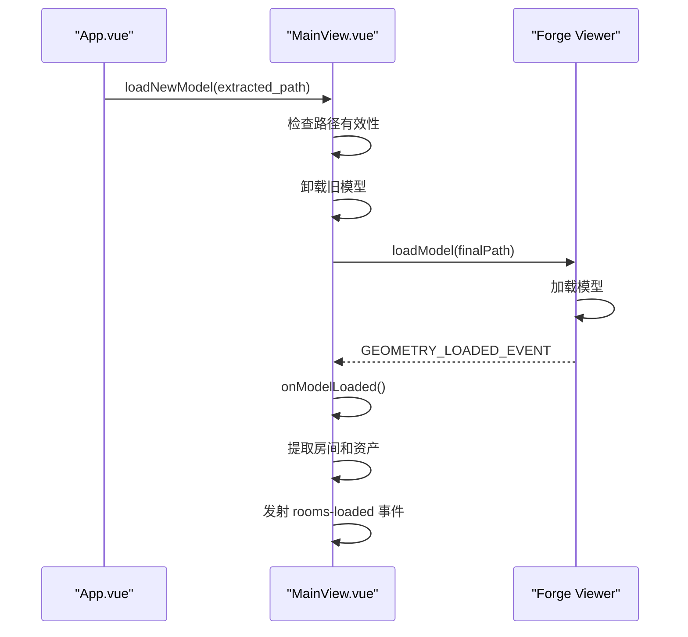
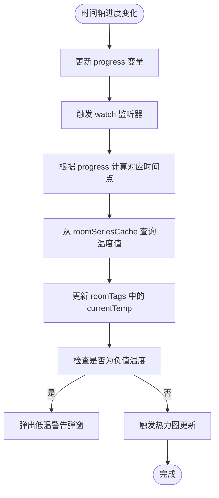
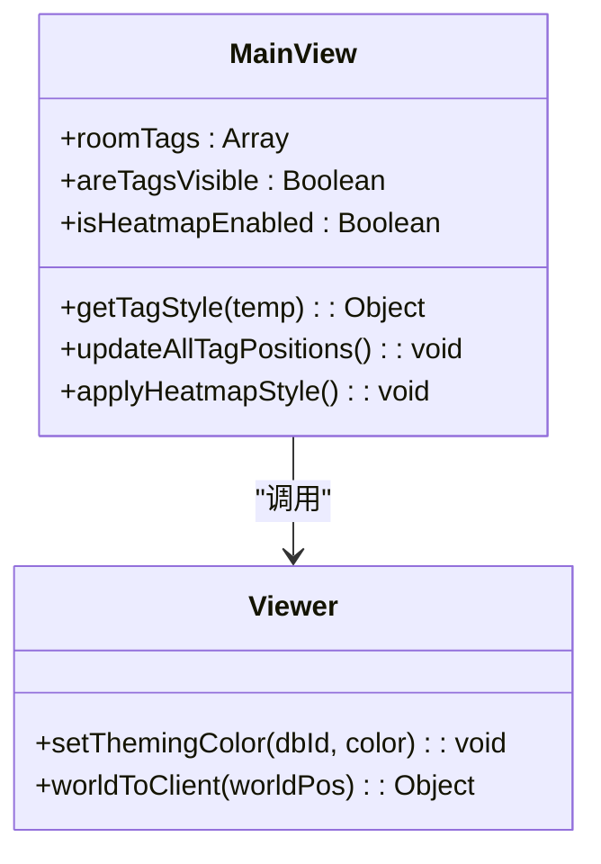
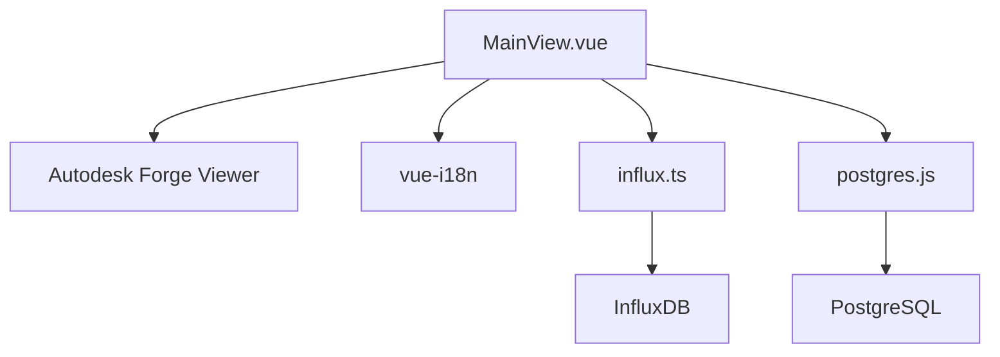

# 模型可视化

<cite>
**本文档引用文件**  
- [MainView.vue](file://src/components/MainView.vue)
- [i18n/index.js](file://src/i18n/index.js)
- [main.js](file://src/main.js)
</cite>

## 目录
1. [简介](#简介)
2. [项目结构](#项目结构)
3. [核心组件](#核心组件)
4. [架构概览](#架构概览)
5. [详细组件分析](#详细组件分析)
6. [依赖分析](#依赖分析)
7. [性能考虑](#性能考虑)
8. [故障排除指南](#故障排除指南)
9. [结论](#结论)
10. [附录](#附录)（如有必要）

## 简介
本文档全面解析了基于 `MainView.vue` 和 Autodesk Forge Viewer 的模型可视化功能实现。重点阐述了3D/2D模型浏览机制、用户交互逻辑、动态模型切换、时间轴联动、温度标签与热力图叠加渲染等核心技术。文档详细说明了如何通过 `loadNewModel` 方法动态加载不同建筑模型，如何根据时间轴进度更新模型状态和数据标签，以及如何通过 `applyRoomStyle` 和 `applyHeatmapStyle` 方法实现空间的高亮与着色。同时，文档还解释了多语言支持如何与Viewer同步，确保用户体验的一致性。

## 项目结构
项目采用典型的Vue.js单页应用结构，核心可视化功能集中在 `src/components/MainView.vue` 组件中。模型文件存储在 `public/models/` 目录下，遵循特定的命名和路径规则。多语言配置由 `src/i18n/index.js` 统一管理，确保界面文本的国际化支持。

**Section sources**
- [MainView.vue](file://src/components/MainView.vue#L1-L3059)

## 核心组件
`MainView.vue` 是整个可视化功能的核心组件，负责初始化Viewer、管理模型加载、处理用户交互、渲染数据标签和热力图，并与时间轴组件联动。该组件通过事件发射器（emit）与父组件（如 `App.vue`）通信，实现模型加载就绪、房间数据加载、图表数据更新等关键状态的同步。

**Section sources**
- [MainView.vue](file://src/components/MainView.vue#L1-L3059)

## 架构概览
系统架构分为三个主要层次：视图层（View）、逻辑层（Logic）和数据层（Data）。视图层由 `MainView.vue` 构成，负责UI渲染和用户交互。逻辑层包含Viewer初始化、模型加载、样式应用、数据标签定位等核心业务逻辑。数据层则通过 `influx.ts` 服务从InfluxDB时序数据库获取温度等IoT数据，并通过 `postgres.js` 与PostgreSQL数据库交互。

**Diagram sources **
- [MainView.vue](file://src/components/MainView.vue#L1-L3059)

## 详细组件分析

### 模型加载与初始化
`MainView.vue` 组件通过 `initViewer()` 方法初始化Autodesk Forge Viewer。该方法在组件挂载后被调用，创建Viewer实例并设置其环境、文档和语言。Viewer的语言设置与系统的多语言配置 (`i18n`) 同步，确保了用户界面的一致性。

#### 模型加载流程
模型加载由 `loadNewModel(modelPath)` 方法驱动。该方法首先检查模型路径的有效性，优先尝试 `/output/3d.svf` 路径，其次尝试 `/3d.svf` 路径。在加载新模型前，会先卸载所有已加载的模型，以避免冲突。加载成功后，会触发 `GEOMETRY_LOADED_EVENT` 事件，进而调用 `onModelLoaded()` 回调函数。

**Diagram sources **
- [MainView.vue](file://src/components/MainView.vue#L599-L703)
- [MainView.vue](file://src/components/MainView.vue#L785-L865)

### 用户交互与模型浏览
用户可以通过鼠标或触摸屏与3D模型进行交互，实现旋转、缩放和平移。Viewer的导航（navigation）系统处理这些交互。代码中通过 `viewer.navigation.setReverseZoomDirection(true)` 反转了鼠标滚轮的缩放方向，使滚轮向上为放大，符合常见操作习惯。`updateAllTagPositions()` 方法监听 `CAMERA_CHANGE_EVENT` 和 `viewerResizeEvent` 事件，实时更新所有温度标签在屏幕上的位置，确保标签始终正确地附着在对应的房间上。

**Section sources**
- [MainView.vue](file://src/components/MainView.vue#L544-L596)
- [MainView.vue](file://src/components/MainView.vue#L1147-L1164)

### 动态模型切换
`loadNewModel` 方法是实现动态切换不同建筑模型的核心。父组件（`App.vue`）在用户选择不同文件时，会调用此方法并传入新的模型路径。该方法确保了模型的平滑切换，包括路径预检、旧模型卸载和新模型加载。通过 `currentModelPath` 和 `isLoadingModel` 状态变量，防止了重复加载。

**Section sources**
- [MainView.vue](file://src/components/MainView.vue#L599-L703)

### 时间轴与模型联动
时间轴（Timeline）与模型的联动是通过 `progress` 状态变量实现的。`progress` 的值（0-100）代表了时间范围内的进度。当 `progress` 变化时，会触发 `setTagTempsAtCurrentTime()` 函数。该函数根据当前进度，从预加载的时序数据缓存（`roomSeriesCache`）中查找对应时间点的温度值，并更新所有房间标签的显示。如果检测到负值温度，会弹出低温警告弹窗。

**Diagram sources **
- [MainView.vue](file://src/components/MainView.vue#L401-L458)
- [MainView.vue](file://src/components/MainView.vue#L1382-L1449)

### 温度标签与热力图渲染
温度标签（Temperature Labels）和热力图（Heatmap）是叠加在3D模型上的关键可视化元素。

#### 温度标签
温度标签是通过一个绝对定位的 `div.overlay-tags` 容器实现的。每个标签的位置由 `updateAllTagPositions()` 方法通过 `viewer.worldToClient()` 将房间的3D世界坐标转换为2D屏幕坐标来确定。标签的样式（如背景色）根据温度值动态变化，通过 `getTagStyle()` 函数计算。

#### 热力图
热力图的实现更为复杂，它通过修改模型的材质来实现。当热力图开启时，`applyHeatmapStyle()` 方法会遍历所有房间的 `dbId`，根据其当前温度计算出对应的颜色（使用HSL到RGB的转换），然后调用 `viewer.setThemingColor(dbId, color)` 将颜色应用到该房间。这种方法比直接修改材质更高效，因为它不改变底层的几何数据。

**Diagram sources **
- [MainView.vue](file://src/components/MainView.vue#L149-L187)
- [MainView.vue](file://src/components/MainView.vue#L1382-L1449)

### 多语言支持
系统的多语言支持由 `vue-i18n` 库实现。`src/i18n/index.js` 文件定义了中英文的翻译映射。`MainView.vue` 通过 `useI18n()` 钩子获取翻译函数 `t`，用于渲染界面文本。关键的是，Viewer自身的语言也与系统同步。在 `initViewer()` 方法中，根据 `locale.value` 的值，将Viewer的语言设置为 `'zh-cn'` 或 `'en'`，从而实现了从UI到Viewer控件的全链路多语言支持。

**Section sources**
- [i18n/index.js](file://src/i18n/index.js#L1-L577)
- [MainView.vue](file://src/components/MainView.vue#L547-L548)

## 依赖分析
`MainView.vue` 组件依赖于多个外部库和内部模块。主要依赖包括：
- **Autodesk Forge Viewer**: 核心3D渲染引擎。
- **vue-i18n**: 国际化支持。
- **influx.ts**: 用于从InfluxDB查询时序数据的服务。
- **postgres.js**: 用于与PostgreSQL数据库交互的服务。

**Diagram sources **
- [MainView.vue](file://src/components/MainView.vue#L195-L196)
- [main.js](file://src/main.js#L4)

## 性能考虑
为了优化性能，代码中采用了多种策略：
1.  **数据缓存**: 通过 `roomSeriesCache` 缓存从InfluxDB查询到的时序数据，避免在时间轴拖动时频繁请求后端。
2.  **防抖更新**: 在 `setTagTempsAtCurrentTime()` 中，对热力图的更新使用了 `setTimeout` 防抖，避免在快速拖动时间轴时频繁触发昂贵的渲染操作。
3.  **批量操作**: 使用 `viewer.model.getBulkProperties()` 批量获取构件属性，比逐个获取更高效。
4.  **材质缓存**: 对浅紫色房间材质和热力图材质进行缓存，避免重复创建。

## 故障排除指南
- **模型无法加载**: 检查 `modelPath` 是否正确，确保 `svf` 文件存在于指定路径。查看浏览器控制台是否有网络错误。
- **温度标签不显示**: 确认 `areTagsVisible` 状态为 `true`，并检查 `roomTags` 数组是否已正确填充。确保 `updateAllTagPositions()` 被正确调用。
- **热力图无反应**: 检查 `isHeatmapEnabled` 状态，确认 `applyHeatmapStyle()` 方法被执行。查看 `roomSeriesCache` 是否有数据。
- **多语言未生效**: 确保 `i18n` 已正确注入到Vue应用中，并且 `localStorage` 中的 `language` 值正确。

**Section sources**
- [MainView.vue](file://src/components/MainView.vue#L699-L702)
- [MainView.vue](file://src/components/MainView.vue#L357-L364)

## 结论
`MainView.vue` 组件成功地集成并扩展了Autodesk Forge Viewer的功能，实现了一个功能丰富、交互性强的3D模型可视化系统。通过精心设计的状态管理、事件处理和数据渲染逻辑，系统能够流畅地展示建筑模型，并与IoT数据进行深度联动。其模块化的代码结构和清晰的依赖关系，为未来的功能扩展和维护提供了良好的基础。