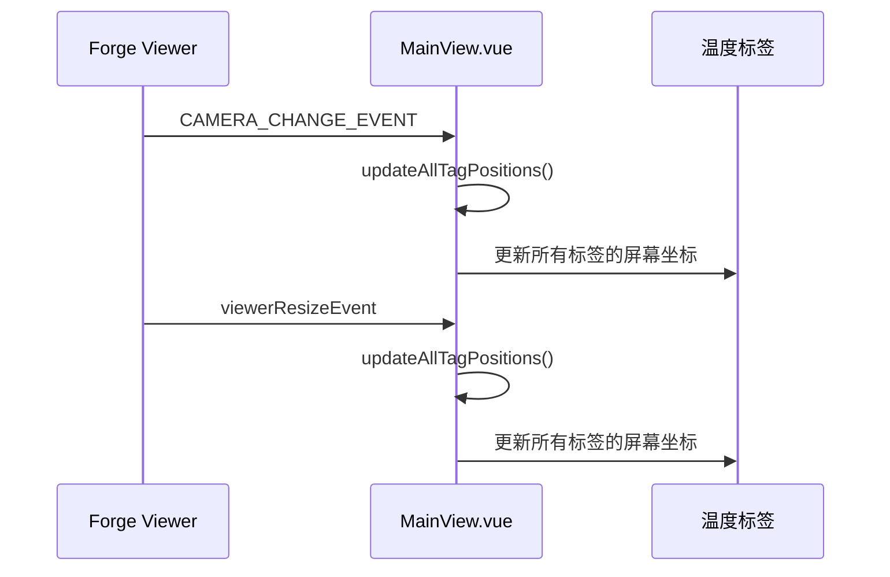
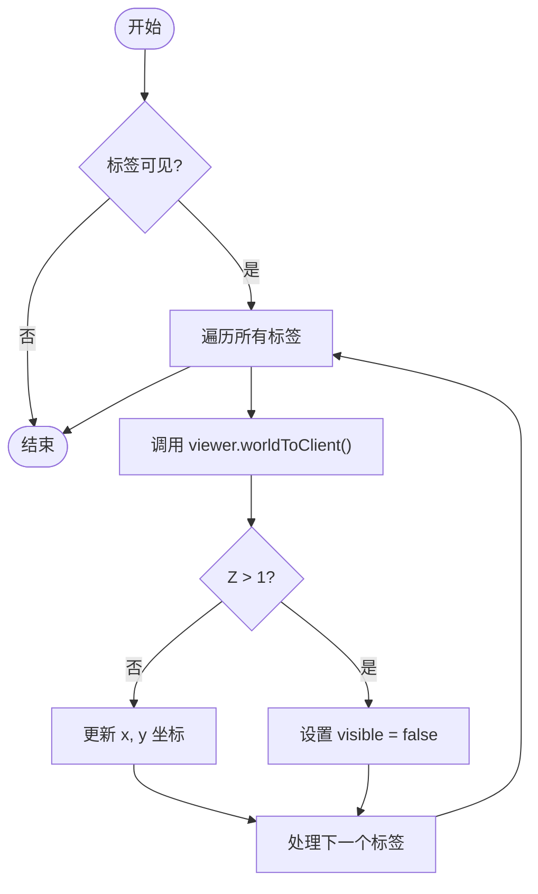
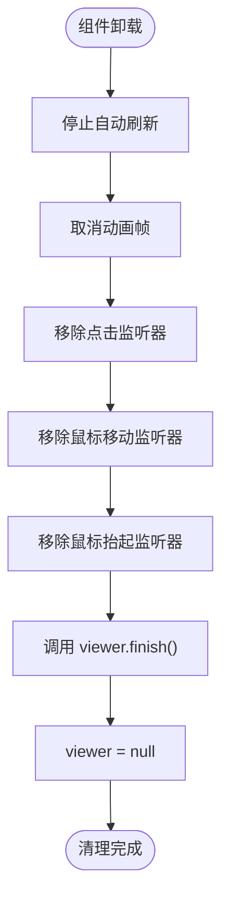
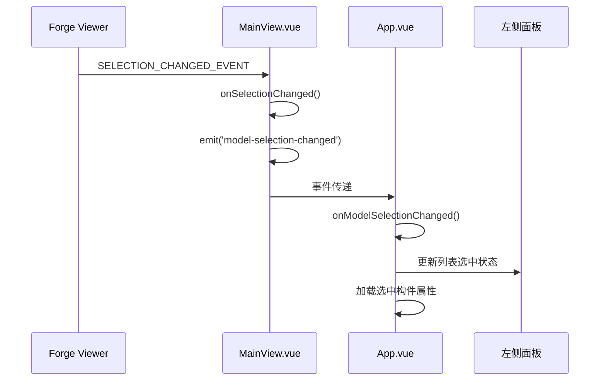
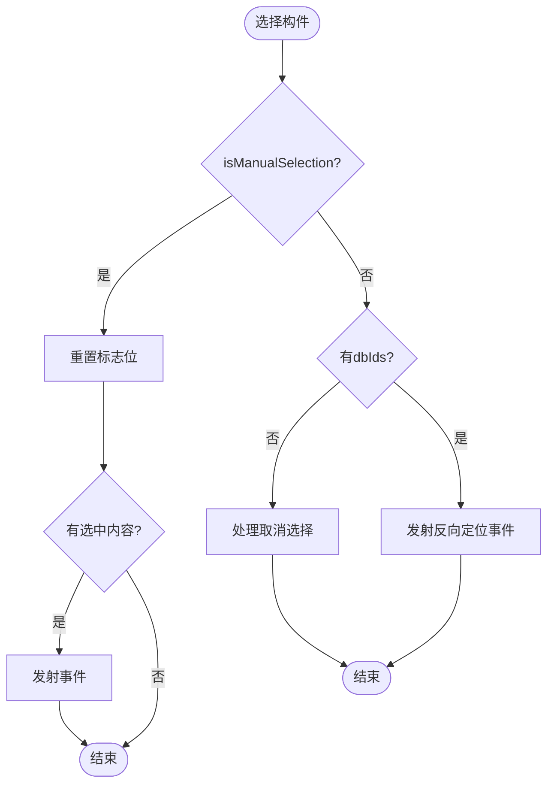

# 事件监听与处理

<cite>
**本文档引用的文件**   
- [MainView.vue](file://src/components/MainView.vue)
- [App.vue](file://src/App.vue)
</cite>

## 目录
1. [事件系统集成概述](#事件系统集成概述)
2. [CAMERA_CHANGE_EVENT与viewerResizeEvent事件监听](#camera_change_event与viewerresizeevent事件监听)
3. [updateAllTagPositions函数分析](#updatealltagpositions函数分析)
4. [事件监听生命周期管理](#事件监听生命周期管理)
5. [模型选择事件处理](#模型选择事件处理)
6. [事件冒泡与防重复触发策略](#事件冒泡与防重复触发策略)

## 事件系统集成概述

本文档深入解析Viewer事件系统的集成与应用，重点分析`CAMERA_CHANGE_EVENT`和`viewerResizeEvent`事件监听器的注册与回调逻辑。系统通过Forge Viewer提供的事件机制，实现了3D视图与UI组件之间的实时同步，确保了温度标签、热力图等可视化元素能够准确响应视图变化。

**Section sources**
- [MainView.vue](file://src/components/MainView.vue#L552-L555)

## CAMERA_CHANGE_EVENT与viewerResizeEvent事件监听

系统在Viewer初始化时注册了多个关键事件监听器，其中`CAMERA_CHANGE_EVENT`和`viewerResizeEvent`用于实时响应视图变化。这两个事件监听器的回调函数均为`updateAllTagPositions`，确保在相机视角改变或视图容器大小调整时，温度标签的位置能够立即更新。

**Diagram sources**
- [MainView.vue](file://src/components/MainView.vue#L553-L554)

**Section sources**
- [MainView.vue](file://src/components/MainView.vue#L553-L554)

## updateAllTagPositions函数分析

`updateAllTagPositions`函数负责将3D空间中的房间中心点坐标转换为屏幕坐标，并更新所有温度标签的显示位置。该函数通过`viewer.worldToClient`方法实现坐标转换，并根据Z值判断标签是否在摄像机前方，从而控制其可见性。

**Diagram sources**
- [MainView.vue](file://src/components/MainView.vue#L1148-L1164)

**Section sources**
- [MainView.vue](file://src/components/MainView.vue#L1148-L1164)

## 事件监听生命周期管理

系统在组件卸载时正确移除了所有事件监听器和定时器，避免了内存泄漏。`onUnmounted`钩子函数中清理了自动刷新定时器、动画帧、文档事件监听器，并调用了Viewer的`finish`方法释放资源。

**Diagram sources**
- [MainView.vue](file://src/components/MainView.vue#L2576-L2582)

**Section sources**
- [MainView.vue](file://src/components/MainView.vue#L2576-L2582)

## 模型选择事件处理

系统通过`SELECTION_CHANGED_EVENT`事件实现了3D模型与UI组件之间的双向同步。当用户在3D视图中选择构件时，会触发`onSelectionChanged`回调，该回调通过`emit`发射`model-selection-changed`事件，通知父组件更新左侧列表的选中状态。

**Diagram sources**
- [MainView.vue](file://src/components/MainView.vue#L552)
- [App.vue](file://src/App.vue#L54)

**Section sources**
- [MainView.vue](file://src/components/MainView.vue#L1116-L1145)
- [App.vue](file://src/App.vue#L1281-L1316)

## 事件冒泡与防重复触发策略

系统通过`isManualSelection`标志位防止了事件处理的递归调用。当程序化选择构件时，会设置该标志位，`onSelectionChanged`回调会检测到该标志并跳过处理，避免了事件循环。此外，系统使用`setTimeout`和`nextTick`确保UI更新的异步执行，防止了重复触发。

**Diagram sources**
- [MainView.vue](file://src/components/MainView.vue#L1119-L1128)

**Section sources**
- [MainView.vue](file://src/components/MainView.vue#L230-L238)
- [MainView.vue](file://src/components/MainView.vue#L1119-L1128)