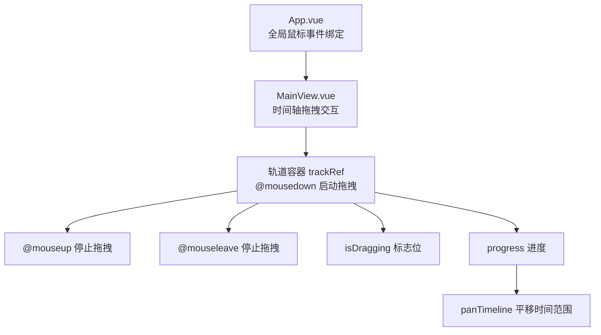
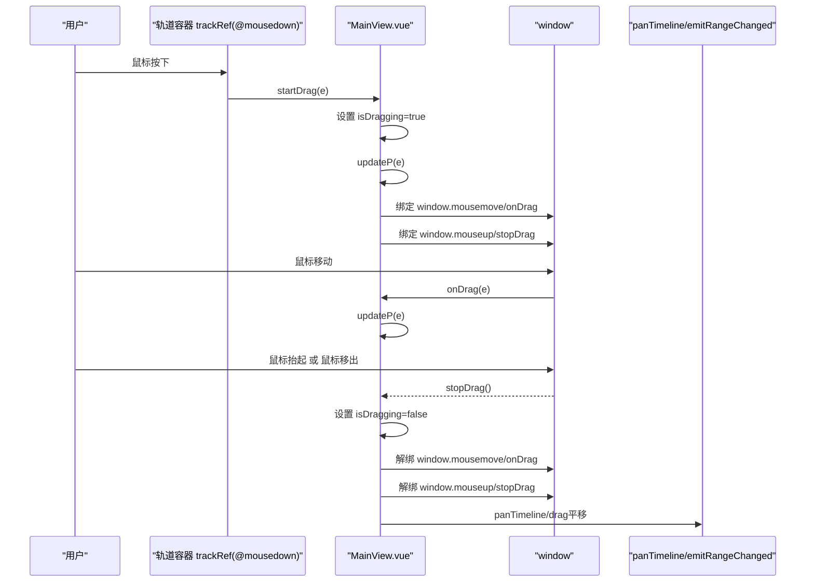
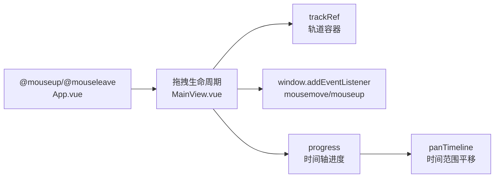

# 拖拽交互操作

<cite>
**本文引用的文件**
- [MainView.vue](file://src/components/MainView.vue)
- [App.vue](file://src/App.vue)
</cite>

## 目录
1. [简介](#简介)
2. [项目结构](#项目结构)
3. [核心组件](#核心组件)
4. [架构总览](#架构总览)
5. [详细组件分析](#详细组件分析)
6. [依赖关系分析](#依赖关系分析)
7. [性能考量](#性能考量)
8. [故障排查指南](#故障排查指南)
9. [结论](#结论)

## 简介
本文件聚焦于3D画布区域的时间轴拖拽交互实现，围绕以下关键点进行深入解析：
- 如何通过模板层绑定@mouseup与@mouseleave事件，与stopDrag方法联动，确保拖拽状态正确结束；
- startDrag方法如何捕获鼠标按下事件并设置isDragging标志位，避免与其他交互冲突；
- 拖拽过程中如何计算鼠标移动距离并将其映射为时间轴进度（progress），从而驱动panTimeline实现时间范围平移；
- 提供事件坐标计算、阻止默认行为、跨浏览器兼容性处理的实践建议；
- 通过CSS pointer-events配置确保事件正确传递到目标元素。

## 项目结构
本次分析涉及的关键文件位于src/components目录下的MainView.vue，以及顶层App.vue中对全局鼠标事件的处理。MainView.vue负责时间轴轨道(track container)上的拖拽交互，App.vue负责全局的鼠标事件绑定，确保拖拽过程中的全局状态一致性。

图表来源
- [App.vue](file://src/App.vue#L1-L10)
- [MainView.vue](file://src/components/MainView.vue#L1-L120)
- [MainView.vue](file://src/components/MainView.vue#L2430-L2466)

章节来源
- [MainView.vue](file://src/components/MainView.vue#L1-L120)
- [MainView.vue](file://src/components/MainView.vue#L2430-L2466)
- [App.vue](file://src/App.vue#L1-L10)

## 核心组件
- MainView.vue
  - 负责时间轴轨道的拖拽交互，包括startDrag、onDrag、stopDrag、updateP等方法，以及panTimeline、progress、trackRef等状态与DOM引用。
  - 通过模板层将@mouseup与@mouseleave事件绑定到viewport容器，确保在鼠标离开轨道或释放按键时都能正确结束拖拽。
- App.vue
  - 在顶层容器上绑定@mouseup与@mouseleave事件，作为全局兜底，避免拖拽过程中鼠标移出轨道导致的状态悬挂。

章节来源
- [MainView.vue](file://src/components/MainView.vue#L1-L120)
- [MainView.vue](file://src/components/MainView.vue#L2430-L2466)
- [App.vue](file://src/App.vue#L1-L10)

## 架构总览
拖拽交互的控制流如下：

图表来源
- [MainView.vue](file://src/components/MainView.vue#L2430-L2466)

## 详细组件分析

### 1. 模板层事件绑定与容器结构
- 顶层viewport容器同时绑定@mouseup与@mouseleave，确保在拖拽过程中即使鼠标移出轨道也能正确结束拖拽。
- 时间轴轨道容器trackRef绑定@mousedown，作为拖拽起点；轨道内包含迷你图表、刻度层、抓手等UI元素。

章节来源
- [MainView.vue](file://src/components/MainView.vue#L1-L120)

### 2. startDrag：捕获按下事件并设置isDragging
- startDrag接收原生MouseEvent，设置isDragging为true，同时调用updateP计算初始进度。
- 为避免播放状态干扰，startDrag中会暂停播放（isPlaying=false）。
- 在window上注册mousemove与mouseup监听，形成拖拽生命周期。

章节来源
- [MainView.vue](file://src/components/MainView.vue#L2457-L2460)

### 3. onDrag：处理鼠标移动事件
- onDrag仅在isDragging为true时执行，持续调用updateP更新进度。
- 该方法避免在非拖拽状态下处理鼠标移动，减少不必要的计算。

章节来源
- [MainView.vue](file://src/components/MainView.vue#L2458-L2460)

### 4. stopDrag：结束拖拽并清理监听
- stopDrag将isDragging设为false，并移除window上的mousemove与mouseup监听。
- 该方法在@mouseup与@mouseleave事件中均会被调用，保证拖拽状态的一致性与可恢复性。

章节来源
- [MainView.vue](file://src/components/MainView.vue#L2459-L2460)

### 5. updateP：计算鼠标移动距离并映射到进度
- updateP通过trackRef.getBoundingClientRect获取轨道容器的布局信息，结合e.clientX与容器左边界计算相对位置百分比。
- 将百分比安全限定在0~100区间后赋值给progress，从而驱动时间轴范围平移与UI更新。
- 由于progress是响应式状态，后续会触发panTimeline与emitRangeChanged，实现时间范围的平移与事件广播。

章节来源
- [MainView.vue](file://src/components/MainView.vue#L2460-L2460)

### 6. panTimeline：时间范围平移
- panTimeline根据拖拽方向（d）对时间范围进行平移，平移幅度与当前时间窗口大小成比例，避免拖拽速度与窗口大小不一致。
- 平移后调用emitRangeChanged，向父组件广播时间范围变化，以便底部图表与数据查询同步。

章节来源
- [MainView.vue](file://src/components/MainView.vue#L2432-L2432)

### 7. 全局事件兜底：App.vue
- App.vue在顶层容器上绑定@mouseup与@mouseleave，作为全局兜底，确保即使拖拽过程中鼠标移出轨道或在其他区域释放，也能正确结束拖拽。
- 这种设计提升了拖拽交互的鲁棒性，避免状态悬挂。

章节来源
- [App.vue](file://src/App.vue#L1-L10)

### 8. 事件坐标计算与跨浏览器兼容性建议
- 坐标计算要点
  - 使用e.clientX与trackRef.getBoundingClientRect().left计算相对偏移量，避免使用pageX等可能受滚动影响的坐标。
  - 百分比计算需考虑容器宽度可能为0的情况，建议在updateP中增加容错判断（例如容器宽度为0时直接返回）。
- 阻止默认行为
  - 若在拖拽过程中出现文本选中或滚动等默认行为，可在startDrag中调用preventDefault与stopPropagation，确保拖拽体验稳定。
- 跨浏览器兼容
  - 使用getBoundingClientRect获取布局信息，兼容性良好。
  - 事件监听统一使用addEventListener，避免IE8及更早版本的attachEvent差异。
  - 若需支持触摸设备，可扩展为touch事件（本仓库未实现触摸拖拽）。

章节来源
- [MainView.vue](file://src/components/MainView.vue#L2457-L2460)

### 9. CSS pointer-events配置与事件传递
- 轨道容器trackRef设置了cursor: pointer，便于用户识别可拖拽区域。
- 迷你图表层与刻度层使用pointer-events: none，确保鼠标事件能穿透到轨道容器，避免遮挡导致的事件丢失。
- 抓手scrubber同样使用pointer-events: none，避免拖拽时抓手遮挡轨道事件。
- overlay-tags与forgeViewer等元素使用pointer-events: none，确保3D画布上的鼠标交互（旋转、平移、缩放）不受时间轴拖拽影响。

章节来源
- [MainView.vue](file://src/components/MainView.vue#L2837-L2851)
- [MainView.vue](file://src/components/MainView.vue#L2892-L2896)

## 依赖关系分析
- 组件耦合
  - MainView.vue内部通过trackRef与progress实现对时间轴拖拽的控制，与panTimeline、emitRangeChanged存在直接依赖。
  - App.vue通过全局@mouseup与@mouseleave事件，间接保障MainView.vue的拖拽状态一致性。
- 外部依赖
  - 本功能完全基于浏览器DOM事件与Vue响应式系统，未引入第三方库，依赖关系简单清晰。

图表来源
- [App.vue](file://src/App.vue#L1-L10)
- [MainView.vue](file://src/components/MainView.vue#L2430-L2466)

章节来源
- [App.vue](file://src/App.vue#L1-L10)
- [MainView.vue](file://src/components/MainView.vue#L2430-L2466)

## 性能考量
- 事件监听粒度
  - 仅在拖拽期间为window注册mousemove与mouseup监听，拖拽结束后及时解绑，避免常驻监听带来的性能损耗。
- 计算复杂度
  - updateP仅进行一次DOM查询与少量数学运算，复杂度低，适合高频调用。
- 响应式更新
  - progress为响应式状态，触发依赖它的计算属性与副作用，建议在拖拽过程中适当节流（例如每帧最多一次updateP），以降低渲染压力。
- 3D画布交互
  - 3D画布区域的pointer-events: none确保Forge Viewer的鼠标交互不受影响，避免双重事件处理导致的卡顿。

## 故障排查指南
- 症状：拖拽结束后仍处于播放状态
  - 检查startDrag是否正确设置isPlaying=false。
  - 章节来源
    - [MainView.vue](file://src/components/MainView.vue#L2457-L2460)
- 症状：拖拽过程中鼠标移出轨道后无法结束
  - 确认@mouseleave已绑定到viewport容器，且stopDrag正确移除window监听。
  - 章节来源
    - [MainView.vue](file://src/components/MainView.vue#L1-L120)
    - [MainView.vue](file://src/components/MainView.vue#L2459-L2460)
- 症状：拖拽范围异常或进度越界
  - 检查updateP中百分比计算与边界限定逻辑，确保百分比在0~100之间。
  - 章节来源
    - [MainView.vue](file://src/components/MainView.vue#L2460-L2460)
- 症状：3D画布无法旋转/缩放
  - 检查overlay-tags与forgeViewer的pointer-events配置，确认未拦截鼠标事件。
  - 章节来源
    - [MainView.vue](file://src/components/MainView.vue#L2892-L2896)

## 结论
本实现通过模板层的@mouseup与@mouseleave事件、startDrag与stopDrag的标志位管理、以及updateP对鼠标坐标到进度的映射，构建了稳定、流畅的时间轴拖拽交互。配合全局App.vue的事件兜底与CSS pointer-events配置，确保拖拽状态在各种场景下都能正确结束，且不影响3D画布的鼠标交互。若需进一步优化，可在拖拽过程中加入节流策略，并在移动端场景下扩展触摸事件支持。