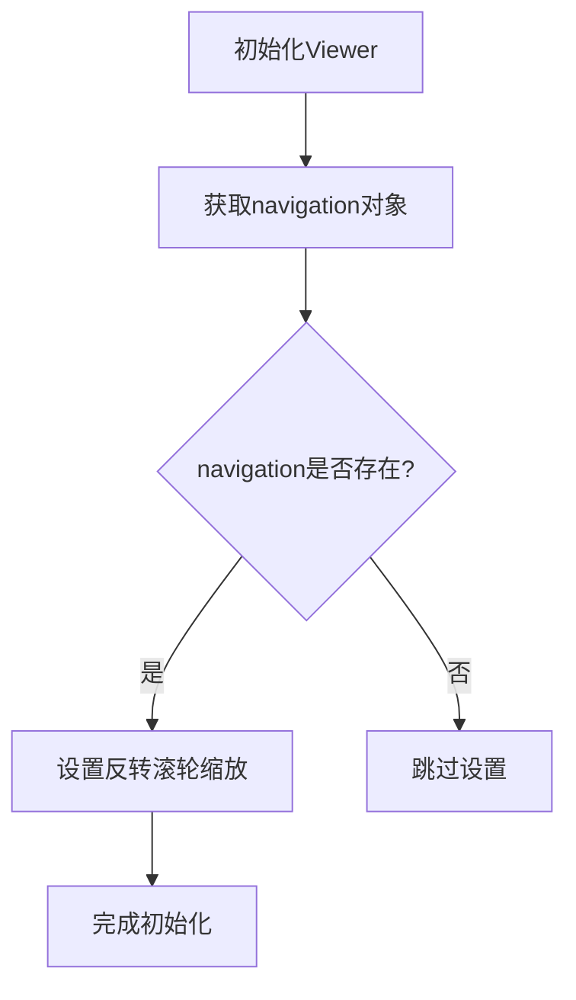
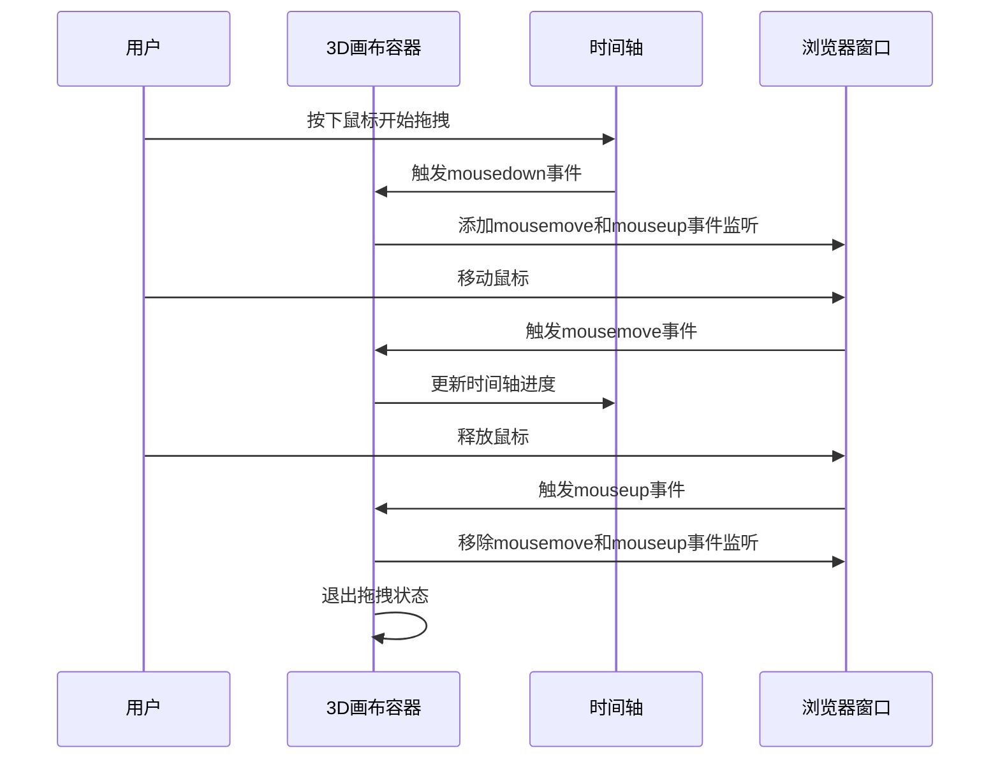

# 用户交互

<cite>
**本文档引用的文件**   
- [MainView.vue](file://src/components/MainView.vue)
- [backup.vue](file://src/components/backup.vue)
</cite>

## 目录
1. [引言](#引言)
2. [用户交互功能概述](#用户交互功能概述)
3. [基于Viewer的旋转、缩放和平移操作](#基于viewer的旋转缩放和平移操作)
4. [Viewer事件监听与温度标签同步](#viewer事件监听与温度标签同步)
5. [3D画布区域的鼠标事件处理](#3d画布区域的鼠标事件处理)
6. [代码示例：初始化Viewer交互设置](#代码示例初始化viewer交互设置)

## 引言
本项目中的用户交互功能主要围绕一个3D模型查看器（Viewer）构建，允许用户通过鼠标和键盘与建筑模型进行直观的交互。核心功能包括模型的旋转、缩放和平移，以及通过温度标签和热力图展示物联网（IoT）数据。本文档将深入解析这些交互功能的实现机制。

## 用户交互功能概述
用户交互功能主要在 `MainView.vue` 组件中实现。该组件负责初始化3D查看器（Autodesk Forge Viewer），并管理与用户操作相关的所有逻辑。主要交互功能包括：
*   **模型导航**：用户可以通过鼠标对3D模型进行旋转、缩放和平移。
*   **数据可视化**：在模型上叠加显示房间的温度标签，并可切换为热力图模式。
*   **时间轴控制**：通过拖拽和点击时间轴来控制模拟数据的播放进度。
*   **视图切换**：根据不同的应用视图（如“连接”或“资产”）动态调整模型的显示内容。

## 基于Viewer的旋转、缩放和平移操作
3D模型的导航行为由Viewer的 `navigation` 对象控制。该对象提供了丰富的API来定制相机的移动方式。

### 初始化导航设置
在Viewer初始化完成后，会立即配置其导航行为。关键的设置是反转鼠标滚轮的缩放方向，以符合用户的直觉操作习惯。



**Diagram sources**
- [MainView.vue](file://src/components/MainView.vue#L565-L568)

### 反转鼠标滚轮缩放方向
默认情况下，鼠标滚轮向上滚动会拉远相机（缩小视图）。为了提供更自然的“放大”体验，代码中调用了 `setReverseZoomDirection(true)` 方法，将滚轮方向反转。

**Section sources**
- [MainView.vue](file://src/components/MainView.vue#L565-L568)

## Viewer事件监听与温度标签同步
当用户与3D模型交互时，相机的位置和方向会发生变化。为了确保叠加在模型上的温度标签能正确地显示在对应房间的上方，系统需要实时更新这些标签的屏幕坐标。

### 事件监听机制
系统通过 `addEventListener` 方法监听两个关键事件：
1.  **`CAMERA_CHANGE_EVENT`**：当用户旋转、缩放或平移模型时触发。
2.  **`viewerResizeEvent`**：当浏览器窗口大小改变，导致Viewer容器尺寸变化时触发。

这两个事件都绑定了同一个处理函数 `updateAllTagPositions`。

**Section sources**
- [MainView.vue](file://src/components/MainView.vue#L553-L554)

### 同步更新温度标签位置
`updateAllTagPositions` 函数是实现标签同步的核心。它遍历所有房间的标签，利用 `viewer.worldToClient()` 方法将每个房间在3D世界中的坐标（`worldPos`）转换为2D屏幕上的像素坐标（`x`, `y`），然后更新标签的CSS样式，使其在DOM中移动到正确的位置。

```mermaid
flowchart TD
Start([开始更新标签位置]) --> CheckVisible{"标签可见?"}
CheckVisible --> |否| End([结束])
CheckVisible --> |是| LoopStart[遍历每个标签]
LoopStart --> GetWorldPos[获取3D世界坐标]
GetWorldPos --> WorldToClient[调用worldToClient()]
WorldToClient --> GetScreenPos[获取屏幕坐标(x, y)]
GetScreenPos --> UpdateStyle[更新标签的CSS位置]
UpdateStyle --> LoopEnd{是否所有标签处理完毕?}
LoopEnd --> |否| LoopStart
LoopEnd --> |是| End
```

**Diagram sources**
- [MainView.vue](file://src/components/MainView.vue#L1148-L1163)

## 3D画布区域的鼠标事件处理
除了Viewer内部的导航，项目还在3D画布的容器上监听了 `@mouseup` 和 `@mouseleave` 事件，主要用于处理时间轴的拖拽操作。

### 拖拽操作联动
当用户在时间轴上按下鼠标（`@mousedown`）时，会进入拖拽状态，并开始监听全局的 `mousemove` 和 `mouseup` 事件。`@mouseup` 和 `@mouseleave` 事件作为拖拽结束的信号，用于清理事件监听器并退出拖拽状态。



**Diagram sources**
- [MainView.vue](file://src/components/MainView.vue#L2456-L2458)

## 代码示例：初始化Viewer交互设置
以下代码片段展示了如何在Viewer初始化时设置交互行为，包括反转滚轮缩放方向。

```javascript
// 初始化Viewer
const initViewer = () => {
  // ... Viewer初始化代码 ...

  // 设置Viewer的导航行为
  if (viewer.navigation) {
    // 反转鼠标滚轮缩放方向（滚轮向上放大）
    viewer.navigation.setReverseZoomDirection(true);
  }

  // ... 其他初始化代码 ...
};
```

**Section sources**
- [MainView.vue](file://src/components/MainView.vue#L565-L568)