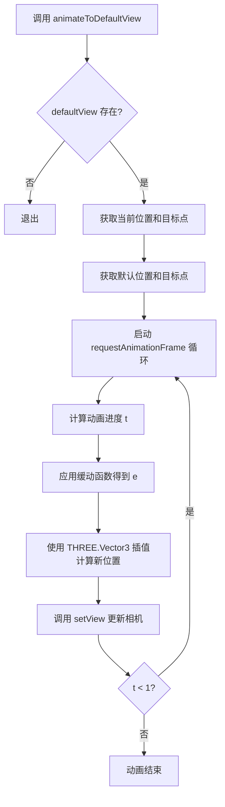

# 相机控制

<cite>
**本文档引用的文件**   
- [MainView.vue](file://src/components/MainView.vue)
</cite>

## 目录
1. [引言](#引言)
2. [相机控制机制](#相机控制机制)
3. [viewer.navigation 对象的使用](#viewernavigation-对象的使用)
4. [相机位置与目标点的获取与设置](#相机位置与目标点的获取与设置)
5. [相机动画过渡](#相机动画过渡)
6. [最佳实践与设备适配](#最佳实践与设备适配)

## 引言
本文档详细阐述了在 `tandem-demo` 项目中，3D 查看器（Viewer）的相机控制实现机制。重点解析了 `viewer.navigation` 对象的使用方法，包括如何通过 `setReverseZoomDirection(true)` 反转鼠标滚轮缩放方向，实现符合用户习惯的交互。同时，文档描述了相机位置与目标点的获取与设置方法，以及如何通过 `requestAnimationFrame` 实现平滑的相机动画过渡。

## 相机控制机制
在 `tandem-demo` 项目中，3D 查看器基于 Autodesk Forge Viewer 构建。相机控制的核心逻辑位于 `MainView.vue` 组件中。当组件挂载时，会初始化 Viewer 实例，并通过其 `navigation` 对象来配置和管理相机行为。

相机的初始状态在模型加载完成后被记录。通过 `onModelLoaded` 函数，在几何体加载事件触发后，程序会获取当前的相机位置（position）、目标点（target）和上方向向量（up），并将其存储在 `defaultView` 变量中，作为后续恢复默认视图的基准。

**Section sources**
- [MainView.vue](file://src/components/MainView.vue#L786-L803)

## viewer.navigation 对象的使用
`viewer.navigation` 是 Autodesk Forge Viewer 提供的用于控制相机导航的核心对象。在 `tandem-demo` 项目中，它被用于配置交互习惯和执行相机操作。

### 反转鼠标滚轮缩放方向
为了实现“滚轮向上放大、向下缩小”的交互习惯，项目在 Viewer 初始化完成后调用了 `setReverseZoomDirection(true)` 方法。

```javascript
// 在 initViewer 函数中
if (viewer.navigation) {
  viewer.navigation.setReverseZoomDirection(true);
}
```

此方法将鼠标滚轮的缩放方向反转，使得用户操作更符合直觉。当用户向上滚动滚轮时，相机向前移动，实现放大效果；向下滚动时则向后移动，实现缩小效果。

**Section sources**
- [MainView.vue](file://src/components/MainView.vue#L565-L568)

## 相机位置与目标点的获取与设置
`viewer.navigation` 对象提供了直接获取和设置相机位置与目标点的方法。

### 获取相机位置与目标点
- `getPosition()`: 获取当前相机在世界坐标系中的位置，返回一个 `THREE.Vector3` 对象。
- `getTarget()`: 获取当前相机的观察目标点，同样返回一个 `THREE.Vector3` 对象。

这些方法在 `animateToDefaultView` 函数中被用来获取动画的起始位置和目标位置。

### 设置相机视图
- `setView(position, target)`: 该方法用于直接设置相机的位置和目标点。它接受两个 `THREE.Vector3` 参数，分别代表新的相机位置和观察目标。

在 `animateToDefaultView` 函数中，`setView` 被频繁调用以在动画过程中更新相机状态，从而实现平滑的过渡效果。

**Section sources**
- [MainView.vue](file://src/components/MainView.vue#L255-L258)
- [MainView.vue](file://src/components/MainView.vue#L274-L275)

## 相机动画过渡
`animateToDefaultView` 函数是实现平滑相机动画过渡的核心。它利用 `requestAnimationFrame` API 创建一个流畅的动画循环，并结合 `THREE.Vector3` 进行线性插值计算。

### 实现原理
1.  **初始化**: 函数首先检查 `defaultView` 是否存在。如果存在，则获取当前相机的位置和目标点作为动画的起点（`sp`, `st`），并将 `defaultView` 中存储的位置和目标点作为动画的终点（`ep`, `et`）。
2.  **动画循环**: 使用 `requestAnimationFrame` 启动一个递归的动画循环 `step`。该循环接收一个时间戳 `now` 作为参数。
3.  **进度计算**: 在每次循环中，计算动画的当前进度 `t`（0 到 1 之间），并应用一个缓动函数 `ease`（此处为 ease-in-out 效果）来使动画更加自然。
4.  **插值计算**: 使用 `THREE.Vector3` 的构造函数，根据当前进度 `e`，对起点和终点的 X、Y、Z 坐标进行线性插值，计算出当前位置 `ip` 和目标点 `it`。
5.  **更新视图**: 调用 `nav.setView(ip, it)` 将计算出的插值位置和目标点应用到相机。
6.  **循环控制**: 如果动画进度 `t` 小于 1，则继续请求下一帧动画；否则，动画结束。

此方法确保了从任意视角到默认视角的过渡是平滑且视觉上愉悦的。



**Diagram sources**
- [MainView.vue](file://src/components/MainView.vue#L252-L278)

**Section sources**
- [MainView.vue](file://src/components/MainView.vue#L252-L279)

## 最佳实践与设备适配
### 初始化相机参数
在初始化 Viewer 时，除了反转缩放方向外，还应设置合适的主题和光照预设，以提供良好的视觉体验。

```javascript
// 在 initViewer 函数中
viewer.setTheme('dark-theme');
viewer.setLightPreset(17); // Field environment
if (viewer.setProgressiveRendering) viewer.setProgressiveRendering(false);
if (viewer.setQualityLevel) viewer.setQualityLevel(false, false);
```

### 自定义导航行为
`tandem-demo` 项目展示了如何通过封装 `isolateAndFocusAssets` 等函数来创建自定义的导航行为。这些函数结合了模型的孤立（isolate）、选择（select）和相机定位（fitToView 或自定义动画），为用户提供了一套完整的交互体验。

### 设备适配
虽然当前代码主要针对桌面端的鼠标交互，但 Autodesk Forge Viewer 本身支持触摸设备。`setReverseZoomDirection` 方法同样适用于触摸板的缩放手势。对于移动设备，开发者应确保 Viewer 容器的尺寸和触摸事件处理是优化的，以提供一致的用户体验。

**Section sources**
- [MainView.vue](file://src/components/MainView.vue#L560-L564)
- [MainView.vue](file://src/components/MainView.vue#L1512-L1589)